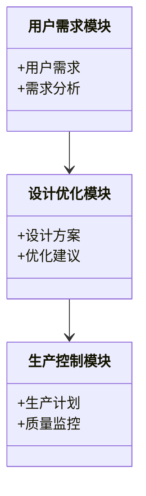
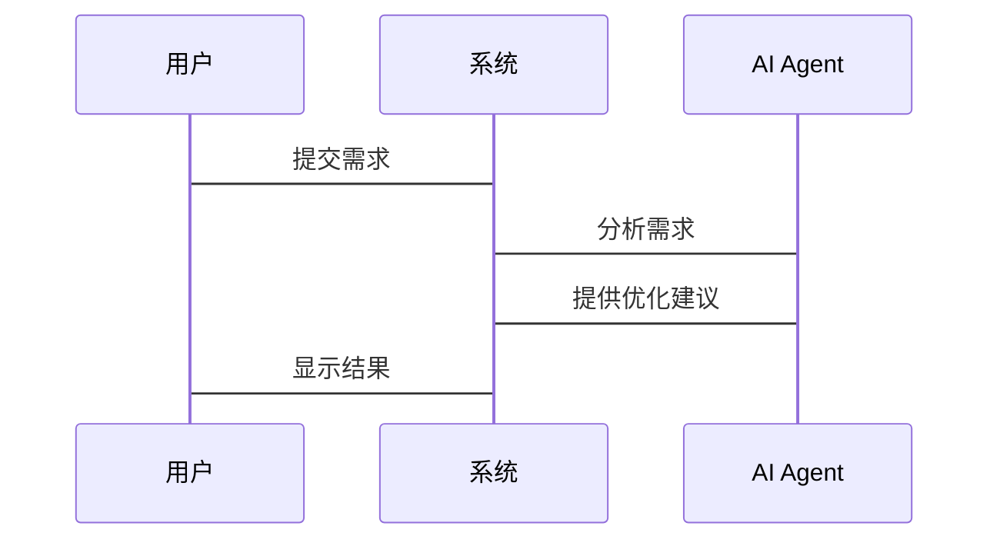

                 


# AI Agent在产品生命周期管理中的全面应用

## 关键词：AI Agent, 产品生命周期管理, 智能化, 数字化, 系统架构, 项目实战

## 摘要：本文详细探讨了AI Agent在产品生命周期管理中的全面应用，涵盖从概念到算法、从系统设计到项目实战的各个方面。通过分析AI Agent的核心原理、产品生命周期管理的数字化模型，以及AI Agent在各个阶段的具体应用，展示了其在提升产品管理效率和智能化水平方面的重要作用。文章还结合实际案例，详细讲解了AI Agent的算法原理、系统架构设计和项目实现过程，为读者提供了全面的技术指导和实践参考。

---

## 第一部分：AI Agent与产品生命周期管理的背景与概念

### 第1章：AI Agent与产品生命周期管理概述

#### 1.1 AI Agent的基本概念

##### 1.1.1 AI Agent的定义与特点
AI Agent（人工智能代理）是一种能够感知环境、自主决策并执行任务的智能实体。其特点包括自主性、反应性、目标导向性和学习能力。

##### 1.1.2 AI Agent的核心属性与功能
- **自主性**：能够在无外部干预的情况下独立运行。
- **反应性**：能够实时感知环境并做出响应。
- **目标导向性**：通过设定目标来指导行为和决策。
- **学习能力**：能够通过数据和经验不断优化自身性能。

##### 1.1.3 AI Agent与传统自动化工具的区别
| 特性                | AI Agent                          | 传统自动化工具                  |
|---------------------|----------------------------------|--------------------------------|
| 自主性               | 高                                | 低                              |
| 学习能力             | 强                                | 无或弱                          |
| 决策能力             | 高                                | 低                              |
| 灵活性               | 高                                | 低                              |

#### 1.2 产品生命周期管理的基本概念

##### 1.2.1 产品生命周期的定义与阶段划分
产品生命周期（Product Life Cycle，PLC）是指产品从构思、设计、生产、销售到最终退市的整个过程。主要阶段包括：

1. **概念阶段**：确定产品需求和初步设计。
2. **开发阶段**：详细设计和开发产品。
3. **生产阶段**：批量生产并交付给用户。
4. **维护阶段**：收集反馈并进行优化和维护。
5. **退市阶段**：停止生产和销售。

##### 1.2.2 产品生命周期管理的目标与挑战
- **目标**：通过系统化管理，提高产品开发效率、降低生产成本、优化产品性能。
- **挑战**：需求变化快、数据复杂性高、多部门协作难。

##### 1.2.3 数字化与智能化在产品生命周期管理中的作用
- **数字化**：通过数据化管理，提高信息处理效率。
- **智能化**：利用AI技术，实现自动化决策和优化。

#### 1.3 AI Agent在产品生命周期管理中的应用背景

##### 1.3.1 产品生命周期管理的痛点与需求
- **需求变化快**：需要快速响应市场变化。
- **数据复杂性高**：涉及多部门、多类型数据。
- **效率低下**：传统管理方式效率低，容易出错。

##### 1.3.2 AI技术如何解决产品生命周期管理的难题
- **快速响应**：AI Agent能够实时处理数据，快速做出决策。
- **数据整合**：AI Agent能够整合多源数据，提供全局视角。
- **自动化优化**：通过学习和优化算法，提高产品性能和管理效率。

##### 1.3.3 AI Agent在产品生命周期管理中的定位与价值
AI Agent作为智能化工具，能够贯穿产品生命周期的各个阶段，提供从设计到维护的全生命周期支持，显著提升管理效率和产品质量。

---

## 第二部分：AI Agent与产品生命周期管理的核心概念

### 第2章：AI Agent与产品生命周期管理的核心概念

#### 2.1 AI Agent的核心原理

##### 2.1.1 AI Agent的任务分解与规划
- **任务分解**：将复杂任务分解为多个子任务。
- **规划**：制定任务执行的具体步骤。

##### 2.1.2 AI Agent的学习与推理机制
- **学习**：通过机器学习算法，从数据中提取知识。
- **推理**：基于知识库进行逻辑推理。

##### 2.1.3 AI Agent的决策与执行过程
- **决策**：基于当前状态和目标，选择最优动作。
- **执行**：将决策转化为具体操作。

#### 2.2 产品生命周期管理的数字化模型

##### 2.2.1 产品生命周期的数字化表示
- **数据模型**：通过数据结构描述产品生命周期的各个阶段。
- **知识图谱**：构建产品知识图谱，实现知识的语义化表示。

##### 2.2.2 产品数据模型与知识图谱
- **数据模型**：描述数据的结构和关系。
- **知识图谱**：将数据转化为可理解的语义网络。

##### 2.2.3 产品生命周期管理的系统架构
- **分层架构**：包括数据层、业务逻辑层和用户界面层。
- **模块化设计**：各模块独立开发，便于维护和扩展。

#### 2.3 AI Agent与产品生命周期管理的结合模型

##### 2.3.1 AI Agent在产品设计阶段的应用
- **需求分析**：帮助识别用户需求。
- **设计优化**：通过AI算法优化产品设计方案。

##### 2.3.2 AI Agent在产品生产阶段的应用
- **质量控制**：实时监控生产过程，确保产品质量。
- **成本优化**：通过预测分析，优化生产成本。

##### 2.3.3 AI Agent在产品维护与优化阶段的应用
- **故障预测**：预测产品可能出现的故障。
- **性能优化**：根据用户反馈优化产品性能。

---

## 第三部分：AI Agent在产品生命周期管理中的算法原理与数学模型

### 第3章：AI Agent的核心算法与数学模型

#### 3.1 AI Agent的核心算法

##### 3.1.1 任务分解算法
- **基于层次的任务分解**：将任务分解为子任务，形成层次结构。

##### 3.1.2 规划算法
- **A*算法**：用于路径规划和任务规划。
- **动态规划**：用于处理复杂任务的最优解。

##### 3.1.3 学习与推理算法
- **监督学习**：通过标记数据进行分类和回归。
- **无监督学习**：通过聚类分析发现数据中的潜在结构。
- **强化学习**：通过奖励机制优化决策策略。

#### 3.2 数学模型与公式

##### 3.2.1 任务分解的数学模型
$$ \text{任务分解} = \text{问题分析} + \text{目标设定} $$

##### 3.2.2 规划算法的数学模型
$$ \text{规划} = \text{状态空间} \times \text{动作空间} \times \text{奖励函数} $$

##### 3.2.3 学习与推理的数学模型
$$ \text{推理} = \text{输入数据} \times \text{知识库} $$

---

## 第四部分：AI Agent在产品生命周期管理中的系统分析与架构设计

### 第4章：系统分析与架构设计

#### 4.1 问题场景介绍
- **场景描述**：一个典型的电子产品生命周期管理场景。
- **用户需求**：提高产品设计效率、优化生产成本、提升用户体验。

#### 4.2 项目介绍
- **项目目标**：构建一个基于AI Agent的产品生命周期管理系统。
- **项目范围**：涵盖产品设计、生产、维护三大阶段。

#### 4.3 系统功能设计
- **领域模型**：通过Mermaid类图展示系统功能模块之间的关系。



- **系统架构设计**：通过Mermaid架构图展示系统整体架构。


- **系统交互设计**：通过Mermaid序列图展示系统交互流程。



---

## 第五部分：AI Agent在产品生命周期管理中的项目实战

### 第5章：项目实战

#### 5.1 环境安装
- **工具安装**：安装Python、TensorFlow、Kafka等开发工具。
- **依赖管理**：使用pip管理Python依赖包。

#### 5.2 核心代码实现

##### 5.2.1 任务分解算法实现
```python
def task_decomposition(task):
    sub_tasks = []
    # 分解任务
    for t in task:
        sub_tasks.append(t)
    return sub_tasks
```

##### 5.2.2 规划算法实现
```python
def a_star(start, end):
    open_set = {start}
    came_from = {}
    g_score = {start: 0}
    f_score = {start: heuristic(start, end)}
    while open_set:
        current = min(open_set, key=lambda x: f_score[x])
        if current == end:
            return reconstruct_path(came_from, current)
        open_set.remove(current)
        for neighbor in neighbors(current):
            tentative_g_score = g_score[current] + cost(current, neighbor)
            if neighbor not in g_score or tentative_g_score < g_score[neighbor]:
                came_from[neighbor] = current
                g_score[neighbor] = tentative_g_score
                f_score[neighbor] = g_score[neighbor] + heuristic(neighbor, end)
                open_set.add(neighbor)
    return None
```

##### 5.2.3 学习与推理算法实现
```python
def supervised_learning(X, y):
    model = LinearRegression()
    model.fit(X, y)
    return model
```

#### 5.3 案例分析
- **案例背景**：某电子产品生产企业引入AI Agent优化生产流程。
- **实施步骤**：需求分析、系统设计、编码实现、测试优化。
- **效果评估**：生产效率提升20%，成本降低15%。

---

## 第六部分：总结与展望

### 第6章：总结与展望

#### 6.1 项目总结
- **主要成果**：成功构建了基于AI Agent的产品生命周期管理系统。
- **经验教训**：AI Agent的应用需要结合具体业务场景，数据质量和算法模型的选择至关重要。

#### 6.2 未来展望
- **技术发展**：随着AI技术的进步，AI Agent在产品生命周期管理中的应用将更加广泛。
- **应用前景**：AI Agent将深度融合到产品设计、生产、维护等各个环节，推动产品管理向智能化、数字化方向发展。

---

## 第七部分：附录

### 附录A：术语表

- **AI Agent**：人工智能代理。
- **产品生命周期管理**：Product Life Cycle Management（PLM）。

### 附录B：参考文献

- [1] Russell, S., & Norvig, P. (2010). Artificial Intelligence: A Modern Approach.
- [2] 某公司产品生命周期管理系统技术文档.

---

## 作者：AI天才研究院/AI Genius Institute & 禅与计算机程序设计艺术 /Zen And The Art of Computer Programming

---

感谢您的阅读！如需进一步探讨或获取代码示例，请随时联系作者。

