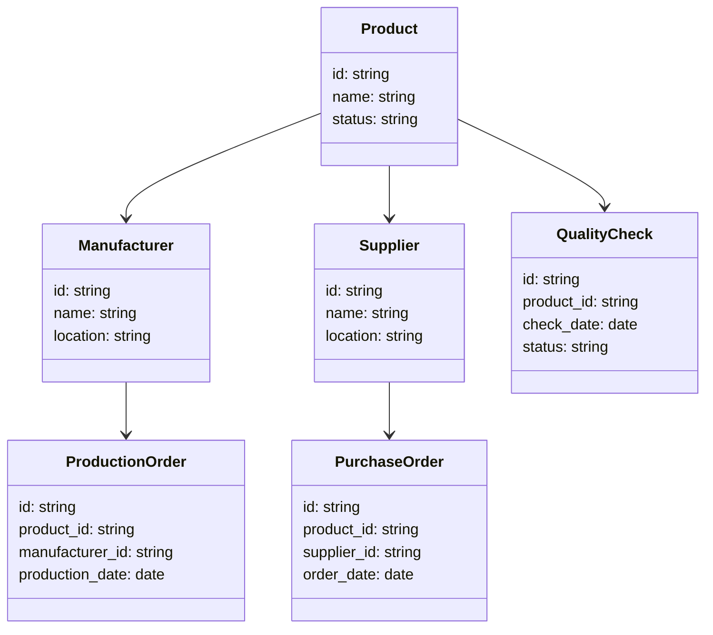

                 


# AI Agent在产品质量控制与追溯系统中的应用

> **关键词**: AI Agent, 产品质量控制, 追溯系统, 智能制造, 数据分析, 机器学习

> **摘要**: 本文详细探讨了AI Agent在产品质量控制与追溯系统中的应用，从基本概念到算法原理，从系统设计到项目实战，全面分析了AI Agent如何通过智能化手段提升产品质量控制的效率和准确性。通过实际案例分析和系统架构设计，本文展示了AI Agent在现代制造业中的巨大潜力和应用价值。

---

## 第1章: AI Agent与产品质量控制概述

### 1.1 AI Agent的基本概念

AI Agent（人工智能代理）是指能够感知环境、自主决策并执行任务的智能体。它具备以下核心特征：
- **自主性**: 能够独立决策和行动。
- **反应性**: 能够实时感知环境并做出响应。
- **目标导向性**: 具备明确的目标导向能力。

AI Agent与传统自动化的区别在于其智能化和自主性，能够处理复杂场景下的不确定性问题。

### 1.2 产品质量控制的基本概念

产品质量控制是指通过技术手段对产品生产过程中的各个环节进行监控，确保产品符合质量标准。其关键环节包括原材料采购、生产过程监控、成品检验等。

### 1.3 AI Agent在产品质量控制中的应用背景

传统产品质量控制依赖人工检查和固定规则，存在效率低、精度差的问题。随着AI技术的发展，AI Agent能够通过实时数据分析、自主决策和优化策略，显著提升产品质量控制的效率和准确性。

---

## 第2章: AI Agent在产品质量追溯系统中的核心概念

### 2.1 产品质量追溯系统的定义与特点

产品质量追溯系统是一种通过记录和追踪产品生命周期中的关键信息，实现问题快速定位和处理的系统。其特点包括：
- **实时性**: 可以实时记录和追踪产品信息。
- **全面性**: 覆盖产品生命周期的各个环节。
- **可追溯性**: 支持问题的快速定位和追溯。

### 2.2 AI Agent在产品质量追溯中的作用

AI Agent在产品质量追溯系统中主要承担以下角色：
- **数据采集与处理**: 实时采集生产过程中的数据，并进行预处理。
- **数据分析与决策**: 通过机器学习算法对数据进行分析，识别潜在问题。
- **决策支持**: 根据分析结果提供优化建议和决策支持。

### 2.3 产品质量追溯系统的实体关系分析

通过实体关系图（ER图）和数据流分析，可以清晰地展示产品质量追溯系统中各实体之间的关系。以下是一个简化的ER图示例：

```mermaid
er
    %% 产品质量追溯系统 ER 图
    %% 实体：Product, Manufacturer, Supplier, PurchaseOrder, ProductionOrder, QualityCheck
    %% 关系：Product -> Manufacturer, Product -> Supplier, Supplier -> PurchaseOrder, Manufacturer -> ProductionOrder, Product -> QualityCheck

    entity Product {
        id: string
        name: string
        description: string
    }

    entity Manufacturer {
        id: string
        name: string
        location: string
    }

    entity Supplier {
        id: string
        name: string
        location: string
    }

    entity PurchaseOrder {
        id: string
        product_id: string
        supplier_id: string
        order_date: date
    }

    entity ProductionOrder {
        id: string
        product_id: string
        manufacturer_id: string
        production_date: date
    }

    entity QualityCheck {
        id: string
        product_id: string
        check_date: date
        status: string
    }

    Product --> Manufacturer
    Product --> Supplier
    Supplier --> PurchaseOrder
    Manufacturer --> ProductionOrder
    Product --> QualityCheck
```

---

## 第3章: AI Agent的算法原理与数学模型

### 3.1 AI Agent的核心算法

AI Agent在产品质量控制中主要使用以下算法：
- **强化学习算法**: 通过试错机制优化决策策略。
- **监督学习算法**: 基于历史数据进行分类和预测。
- **聚类算法**: 将相似的产品质量数据进行分组，识别异常情况。

### 3.2 AI Agent的数学模型

AI Agent的数学模型主要包括以下部分：
- **状态空间模型**: 表示系统的当前状态。
- **动作空间模型**: 表示AI Agent可以执行的动作。
- **奖励函数模型**: 表示AI Agent执行动作后获得的奖励或惩罚。

例如，强化学习中的奖励函数可以表示为：
$$ R(s, a) = \begin{cases} 
1 & \text{如果动作 } a \text{ 在状态 } s \text{ 下是正确的} \\
-1 & \text{如果动作 } a \text{ 在状态 } s \text{ 下是错误的}
\end{cases} $$

---

## 第4章: AI Agent在产品质量控制中的系统设计与实现

### 4.1 系统应用场景

以汽车制造行业为例，AI Agent可以用于以下场景：
- **原材料采购**: 通过分析供应商的历史数据，优化采购决策。
- **生产过程监控**: 实时监控生产线上的传感器数据，识别潜在缺陷。
- **成品检验**: 通过图像识别技术快速检测产品表面缺陷。

### 4.2 系统功能设计

以下是产品质量控制系统的领域模型：



### 4.3 系统架构设计

以下是产品质量控制系统的架构图：


---

## 第5章: AI Agent在产品质量控制中的项目实战

### 5.1 环境安装与配置

以下是安装AI Agent所需环境的配置示例：

```bash
# 安装Python和依赖库
pip install numpy
pip install scikit-learn
pip install tensorflow
```

### 5.2 核心代码实现

以下是AI Agent在产品质量控制中的核心代码示例：

```python
# 强化学习算法实现
import numpy as np
from collections import deque
import random

class AI-Agent:
    def __init__(self, state_space, action_space):
        self.state_space = state_space
        self.action_space = action_space
        self.q_table = np.zeros((state_space, action_space))

    def take_action(self, state):
        if random.uniform(0, 1) < 0.9:  # 探索与利用策略
            return np.argmax(self.q_table[state])
        else:
            return random.randint(0, self.action_space - 1)

    def update_q_table(self, state, action, reward, next_state):
        alpha = 0.1  # 学习率
        gamma = 0.9  # 折扣因子
        self.q_table[state][action] = (1 - alpha) * self.q_table[state][action] + alpha * (reward + gamma * np.max(self.q_table[next_state]))
```

### 5.3 实际案例分析

通过分析某汽车制造企业的实际案例，可以验证AI Agent在产品质量控制中的应用效果。例如，通过AI Agent优化采购策略，企业能够降低原材料缺陷率，显著提高产品质量。

---

## 第6章: 最佳实践与总结

### 6.1 最佳实践

在实际应用中，建议采取以下措施：
- **数据质量管理**: 确保数据的准确性和完整性。
- **模型优化**: 根据实际场景不断优化AI Agent的算法和参数。
- **人机协作**: 结合人工检查和AI Agent的优势，实现高效的质量控制。

### 6.2 小结

AI Agent通过智能化手段显著提升了产品质量控制的效率和准确性。其在制造业中的应用前景广阔，特别是在复杂和动态的生产环境中，AI Agent能够充分发挥其优势。

### 6.3 注意事项

在实际应用中，需要注意以下几点：
- **数据隐私**: 确保数据的安全性和隐私性。
- **系统稳定性**: 确保AI Agent系统的稳定性和可靠性。
- **可解释性**: 提高AI决策的可解释性，便于问题排查。

### 6.4 拓展阅读

推荐以下书籍和论文，以深入理解AI Agent的应用：
- 《强化学习：理论与算法》
- 《机器学习实战》
- 《AI Agent在工业4.0中的应用》

---

## 作者：AI天才研究院/AI Genius Institute & 禅与计算机程序设计艺术 /Zen And The Art of Computer Programming

