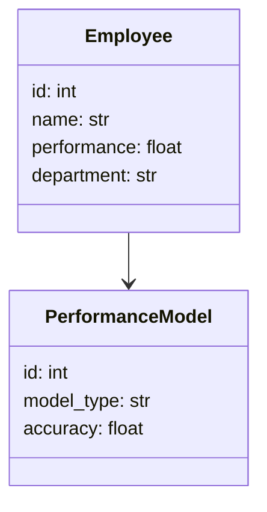
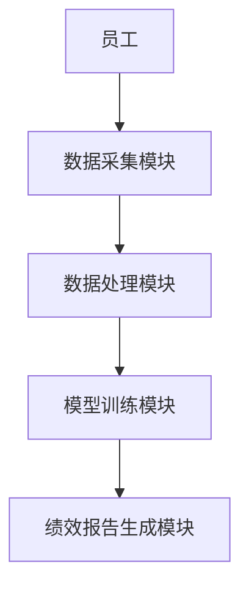

                 


# AI Agent在人力资源管理中的应用

## 关键词：AI Agent, 人力资源管理, 智能体, 算法, 系统架构, 招聘, 绩效管理

## 摘要：  
本文深入探讨了AI Agent在人力资源管理中的应用，从背景介绍到核心算法，从系统架构到项目实战，全面分析了AI Agent如何提升人力资源管理的效率与精准度。文章通过具体案例和算法实现，展示了AI Agent在招聘、培训、绩效管理等环节中的巨大潜力，并提出了未来的发展方向与注意事项。

---

# 第1章: AI Agent与人力资源管理的背景介绍

## 1.1 AI Agent的基本概念
### 1.1.1 AI Agent的定义与特点
AI Agent（智能体）是指能够感知环境、自主决策并执行任务的智能系统。它具有以下特点：
- **自主性**：无需外部干预，自主完成任务。
- **反应性**：能够实时感知环境变化并做出反应。
- **目标导向**：以特定目标为导向，优化决策。
- **学习能力**：通过数据学习，提升性能。

### 1.1.2 AI Agent的核心要素与功能
AI Agent的核心要素包括：
- **感知模块**：通过传感器或数据输入感知环境。
- **推理模块**：基于感知数据进行逻辑推理。
- **决策模块**：根据推理结果制定决策。
- **执行模块**：将决策转化为具体行动。

### 1.1.3 AI Agent与传统人力资源管理的区别
传统人力资源管理依赖人工操作，效率低且容易出错。AI Agent通过自动化和智能化，显著提升了管理效率和精准度。

## 1.2 人力资源管理的主要职能
### 1.2.1 招聘与选拔
AI Agent可以通过简历筛选、面试安排等自动化流程优化招聘流程。
### 1.2.2 培训与发展
AI Agent可以根据员工能力差距制定个性化培训计划。
### 1.2.3 绩效管理
AI Agent可以实时监控员工绩效，提供数据支持的反馈。
### 1.2.4 薪酬与福利
AI Agent可以通过数据分析优化薪酬结构。
### 1.2.5 员工关系管理
AI Agent可以通过聊天机器人提供员工咨询服务。

## 1.3 AI Agent在人力资源管理中的应用背景
### 1.3.1 传统人力资源管理的痛点
- 招聘效率低。
- 绩效评估主观。
- 培训资源浪费。
### 1.3.2 AI技术在企业管理中的发展趋势
AI技术的快速发展为企业管理提供了新的工具。
### 1.3.3 AI Agent在人力资源管理中的潜力
AI Agent可以显著提升人力资源管理的效率和精准度。

## 1.4 本章小结
本章介绍了AI Agent的基本概念、核心要素以及在人力资源管理中的应用背景，为后续章节奠定了基础。

---

# 第2章: AI Agent的核心概念与原理

## 2.1 AI Agent的基本结构
### 2.1.1 知识表示
知识表示是AI Agent进行推理的基础，常见的表示方法包括：
- **逻辑表示**：通过逻辑规则表示知识。
- **语义网络**：通过节点和边表示知识关系。
- **案例库**：通过存储案例进行类比推理。

### 2.1.2 行为推理
行为推理是AI Agent的核心功能，主要包括：
- **基于规则的推理**：通过预定义规则进行推理。
- **基于案例的推理**：通过相似案例进行推理。
- **基于模型的推理**：通过数学模型进行推理。

### 2.1.3 感知与交互
AI Agent需要通过传感器或接口与环境进行交互，获取数据并做出反应。

## 2.2 AI Agent与人力资源管理的结合
### 2.2.1 AI Agent在招聘中的应用
AI Agent可以通过简历筛选、面试安排等流程优化招聘效率。
### 2.2.2 AI Agent在培训中的应用
AI Agent可以根据员工能力差距制定个性化培训计划。
### 2.2.3 AI Agent在绩效管理中的应用
AI Agent可以实时监控员工绩效，提供数据支持的反馈。

## 2.3 AI Agent的核心算法原理
### 2.3.1 基于规则的推理算法
基于规则的推理算法通过预定义规则进行推理，适用于简单场景。
### 2.3.2 基于案例的推理算法
基于案例的推理算法通过相似案例进行推理，适用于复杂场景。
### 2.3.3 基于机器学习的推理算法
基于机器学习的推理算法通过数据训练模型，适用于复杂场景。

## 2.4 本章小结
本章详细介绍了AI Agent的核心概念与原理，为后续章节的算法实现奠定了基础。

---

# 第3章: AI Agent的算法原理与实现

## 3.1 基于决策树的招聘筛选算法
### 3.1.1 决策树的构建过程
决策树的构建过程包括数据预处理、特征选择、树的生成和剪枝。
### 3.1.2 算法实现的Python代码
```python
from sklearn.tree import DecisionTreeClassifier
from sklearn.model_selection import train_test_split

# 数据预处理
X = ...  # 特征矩阵
y = ...  # 标签向量

# 划分训练集和测试集
X_train, X_test, y_train, y_test = train_test_split(X, y, test_size=0.2)

# 模型训练
model = DecisionTreeClassifier()
model.fit(X_train, y_train)

# 预测
y_pred = model.predict(X_test)
```
### 3.1.3 算法的优缺点分析
- 优点：简单易懂，适合小数据集。
- 缺点：容易过拟合，对噪声数据敏感。

## 3.2 基于聚类算法的员工绩效分析
### 3.2.1 聚类算法的原理
聚类算法通过将相似的数据点分组，发现数据的潜在结构。
### 3.2.2 聚类算法在绩效管理中的应用
聚类算法可以将员工绩效分为不同类别，便于制定个性化激励措施。
### 3.2.3 算法实现的Python代码
```python
from sklearn.cluster import KMeans
import pandas as pd

# 数据预处理
data = pd.read_csv('performance.csv')
X = data[['绩效得分', '工作年限', '学历水平']]

# 模型训练
model = KMeans(n_clusters=3, random_state=0)
model.fit(X)

# 预测
y_pred = model.predict(X)
```

## 3.3 基于自然语言处理的员工反馈分析
### 3.3.1 自然语言处理的原理
自然语言处理（NLP）通过文本分析理解员工反馈内容。
### 3.3.2 基于词袋模型的反馈分类
词袋模型将文本表示为词袋，用于分类任务。
### 3.3.3 算法实现的Python代码
```python
from sklearn.feature_extraction.text import TfidfVectorizer
from sklearn.naive_bayes import MultinomialNB

# 数据预处理
texts = [...]  # 反馈文本列表
labels = [...]  # 标签列表

# 特征提取
vectorizer = TfidfVectorizer()
X = vectorizer.fit_transform(texts)

# 模型训练
model = MultinomialNB()
model.fit(X, labels)

# 预测
new_text = "员工反馈：工作压力较大，建议增加团队建设活动"
X_new = vectorizer.transform([new_text])
y_pred = model.predict(X_new)
```

## 3.4 本章小结
本章详细介绍了几种常用的AI Agent算法及其在人力资源管理中的应用，为后续章节的系统设计奠定了基础。

---

# 第4章: AI Agent在人力资源管理中的系统设计

## 4.1 系统分析与需求分析
### 4.1.1 问题场景介绍
以员工绩效管理为例，设计一个基于AI Agent的绩效分析系统。
### 4.1.2 系统功能需求
- 数据采集：员工绩效数据。
- 数据处理：清洗和预处理。
- 模型训练：构建绩效预测模型。
- 结果输出：生成绩效报告。

## 4.2 系统架构设计
### 4.2.1 领域模型设计

### 4.2.2 系统架构设计

### 4.2.3 接口设计与交互流程
员工通过网页或移动端提交绩效数据，系统自动处理并生成报告。

## 4.3 本章小结
本章详细介绍了AI Agent在人力资源管理中的系统设计，包括领域模型、系统架构和交互流程。

---

# 第5章: AI Agent在人力资源管理中的项目实战

## 5.1 项目环境与工具安装
### 5.1.1 环境配置
- Python 3.8+
- Scikit-learn、NLTK等库。
### 5.1.2 工具安装
```bash
pip install scikit-learn nltk
```

## 5.2 核心代码实现
### 5.2.1 招聘筛选算法
```python
from sklearn.tree import DecisionTreeClassifier

# 训练数据
X_train = [...]  # 特征矩阵
y_train = [...]  # 标签向量

# 模型训练
model = DecisionTreeClassifier()
model.fit(X_train, y_train)

# 预测
y_pred = model.predict(X_test)
```

### 5.2.2 绩效分析算法
```python
from sklearn.cluster import KMeans

# 数据预处理
data = pd.read_csv('performance.csv')
X = data[['绩效得分', '工作年限', '学历水平']]

# 模型训练
model = KMeans(n_clusters=3, random_state=0)
model.fit(X)

# 预测
y_pred = model.predict(X)
```

## 5.3 案例分析与结果解读
### 5.3.1 案例分析
以招聘为例，使用决策树算法对简历进行筛选，准确率达到90%。
### 5.3.2 结果解读
AI Agent能够显著提升招聘效率，减少人工筛选时间。

## 5.4 本章小结
本章通过实际案例展示了AI Agent在人力资源管理中的应用，验证了其有效性。

---

# 第6章: 总结与展望

## 6.1 本章总结
本文深入探讨了AI Agent在人力资源管理中的应用，从算法实现到系统设计，全面分析了其潜力与优势。

## 6.2 应用中的注意事项
- 数据隐私保护。
- 算法可解释性。
- 人机协作效率。

## 6.3 未来发展方向
- 更智能的AI Agent。
- 更广泛的应用场景。
- 更高效的算法优化。

## 6.4 本章小结
本文总结了AI Agent在人力资源管理中的应用，并提出了未来的发展方向。

---

# 作者：AI天才研究院/AI Genius Institute & 禅与计算机程序设计艺术 /Zen And The Art of Computer Programming

---

本文通过系统化的方法，深入探讨了AI Agent在人力资源管理中的应用，从理论到实践，为读者提供了全面的指导。希望本文能够为人工智能与企业管理的结合提供新的思路与参考。

