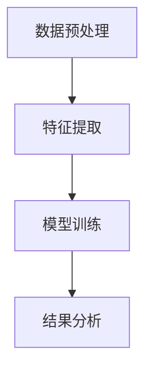

                 


# AI Agent在人力资源管理中的应用：员工绩效分析与培训需求识别

**关键词**：AI Agent、人力资源管理、员工绩效分析、培训需求识别、机器学习、知识表示、推理机制

**摘要**：随着人工智能技术的快速发展，AI Agent在人力资源管理中的应用越来越广泛。本文重点探讨AI Agent在员工绩效分析与培训需求识别中的具体应用，通过分析其核心概念、算法原理、系统架构及实际案例，揭示其在提升人力资源管理效率和科学性方面的重要作用。文章从背景介绍、核心概念、算法原理、系统架构、项目实战等多维度展开，结合丰富的图表和代码示例，全面解析AI Agent在这一领域的应用价值和实现方法。

---

# 第1章: AI Agent与人力资源管理的背景介绍

## 1.1 AI Agent的基本概念
### 1.1.1 AI Agent的定义与特点
AI Agent（人工智能代理）是指能够感知环境、自主决策并执行任务的智能体。其特点包括自主性、反应性、目标导向性和学习能力。

### 1.1.2 人力资源管理的核心目标
人力资源管理的核心目标包括员工招聘、绩效评估、培训与发展、薪酬管理等，旨在最大限度地发挥员工潜力，提升组织绩效。

### 1.1.3 AI Agent在人力资源管理中的应用背景
随着企业对高效、精准管理的需求增加，AI Agent通过数据驱动的决策能力，为人力资源管理提供了新的解决方案。

---

## 1.2 人力资源管理中的问题与挑战
### 1.2.1 员工绩效评估的传统方法
传统绩效评估方法通常依赖主观评价，存在效率低、公平性差的问题。

### 1.2.2 培训需求识别的难点
传统培训需求识别方法难以捕捉员工个性化需求，且效率较低。

### 1.2.3 传统方法的局限性与改进需求
传统方法难以应对数据量大、员工需求多样化的挑战，亟需引入AI技术提升效率。

---

## 1.3 AI Agent在人力资源管理中的应用价值
### 1.3.1 提高管理效率
AI Agent能够快速处理大量数据，显著提高绩效分析和培训需求识别的效率。

### 1.3.2 增强决策的科学性
通过数据驱动的分析，AI Agent能够提供更科学的决策支持。

### 1.3.3 个性化员工支持
AI Agent能够根据员工特点提供个性化的职业发展建议和培训计划。

---

## 1.4 本章小结
本章介绍了AI Agent的基本概念，分析了传统人力资源管理的局限性，并探讨了AI Agent在提升管理效率和科学性方面的重要作用。

---

# 第2章: AI Agent在员工绩效分析中的核心概念与联系

## 2.1 AI Agent的核心概念原理
### 2.1.1 任务分解与目标设定
AI Agent通过任务分解将绩效分析拆解为数据采集、特征提取、模型训练等步骤。

### 2.1.2 知识表示与推理机制
AI Agent利用知识图谱和逻辑推理，将员工行为与绩效指标关联起来。

### 2.1.3 绩效分析的多维度模型
绩效分析需要综合考虑员工的能力、态度、成果等多个维度。

---

## 2.2 绩效分析的核心要素对比
### 2.2.1 传统方法与AI Agent的对比分析
| 方法 | 数据来源 | 处理方式 | 评估准确性 |
|------|----------|----------|------------|
| 传统方法 | 主观评价 | 手工分析 | 较低       |
| AI Agent | 结构化数据 | 自动分析 | 高         |

### 2.2.2 数据来源与处理方式
AI Agent通过结构化数据（如KPI指标、考勤记录）和非结构化数据（如邮件、报告）进行综合分析。

### 2.2.3 绩效评估的准确性与效率
AI Agent通过机器学习模型提高评估准确性，显著提升效率。

---

## 2.3 绩效分析的ER实体关系图
```mermaid
er
    entity 员工 {
        员工ID
        姓名
        职位
    }
    entity 绩效指标 {
        指标ID
        指标名称
        权重
    }
    entity 绩效数据 {
        数据ID
        员工ID
        指标ID
        分数
        时间戳
    }
    员工 -- 绩效数据
    绩效指标 -- 绩效数据
```

---

## 2.4 本章小结
本章从AI Agent的核心原理出发，分析了绩效分析的多维度模型，并通过对比和实体关系图展示了其在绩效管理中的应用优势。

---

# 第3章: 基于AI Agent的培训需求识别算法原理

## 3.1 算法选择与原理
### 3.1.1 基于规则的推理算法
通过预设规则（如“若员工某项指标得分低于60，则需要加强培训”）进行推理。

### 3.1.2 机器学习模型
使用逻辑回归、支持向量机等模型对员工培训需求进行分类。

---

## 3.2 算法实现步骤
### 3.2.1 数据预处理
对员工数据进行清洗、归一化处理。

### 3.2.2 特征提取
提取关键绩效指标作为模型输入。

### 3.2.3 模型训练
使用训练数据对机器学习模型进行训练。

### 3.2.4 结果分析
通过混淆矩阵等指标评估模型性能。

---

## 3.3 算法实现的流程图


---

## 3.4 本章小结
本章详细介绍了培训需求识别的算法原理，并通过流程图展示了其实现步骤。

---

# 第4章: AI Agent在人力资源管理中的系统架构设计

## 4.1 系统功能设计
### 4.1.1 数据采集模块
负责收集员工绩效数据和行为数据。

### 4.1.2 绩效分析模块
对员工绩效进行多维度分析并生成报告。

### 4.1.3 培训需求识别模块
基于分析结果生成个性化培训计划。

---

## 4.2 系统架构设计


---

## 4.3 系统交互设计
```mermaid
sequenceDiagram
    客户端 -> 数据采集模块: 发送数据请求
    数据采集模块 -> 数据存储模块: 存储数据
    数据存储模块 -> 绩效分析模块: 提供数据支持
    绩效分析模块 -> 培训需求识别模块: 提供分析结果
    培训需求识别模块 -> 报告生成模块: 生成培训报告
    客户端 <- 报告生成模块: 获取报告
```

---

## 4.4 本章小结
本章设计了AI Agent在人力资源管理中的系统架构，并通过模块化设计展示了其高效性和可扩展性。

---

# 第5章: 项目实战与应用案例分析

## 5.1 项目背景与目标
### 5.1.1 项目背景
某企业希望通过AI Agent提升员工绩效分析和培训需求识别的效率。

### 5.1.2 项目目标
实现员工绩效分析和个性化培训计划的自动生成。

---

## 5.2 项目实施步骤
### 5.2.1 环境搭建
安装Python、TensorFlow、Pandas等工具。

### 5.2.2 核心代码实现
```python
# 绩效数据分析代码示例
import pandas as pd
from sklearn.linear_model import LogisticRegression

# 加载数据
data = pd.read_csv('performance.csv')

# 特征提取
X = data[['销售业绩', '出勤率', '客户满意度']]
y = data['是否需要培训']

# 模型训练
model = LogisticRegression()
model.fit(X, y)

# 模型预测
predicted = model.predict(X)
print(predicted)
```

### 5.2.3 实际案例分析
通过具体案例分析，展示AI Agent在绩效分析和培训需求识别中的实际应用。

---

## 5.3 项目小结
本章通过项目实战展示了AI Agent在人力资源管理中的具体应用，并通过代码和案例分析提供了实践指导。

---

# 第6章: 最佳实践与未来发展

## 6.1 最佳实践
### 6.1.1 数据质量的重要性
确保数据的完整性和准确性。

### 6.1.2 模型的可解释性
选择易于解释的模型，便于业务人员理解。

### 6.1.3 与现有系统的集成
确保AI Agent能够与企业现有系统无缝集成。

---

## 6.2 未来发展方向
### 6.2.1 更加个性化的员工支持
结合员工的职业发展规划，提供更精准的培训建议。

### 6.2.2 多模态数据的应用
利用文本、图像等多种数据源提升分析准确性。

### 6.2.3 智能化决策支持
通过AI Agent实现更智能的决策支持系统。

---

## 6.3 小结
本章总结了AI Agent在人力资源管理中的最佳实践，并展望了其未来发展方向。

---

# 作者：AI天才研究院/AI Genius Institute & 禅与计算机程序设计艺术 /Zen And The Art of Computer Programming

---

**总结**：本文从AI Agent的基本概念出发，系统性地分析了其在员工绩效分析与培训需求识别中的应用，并通过实际案例展示了其在提升人力资源管理效率和科学性方面的重要作用。希望本文能够为相关领域的研究和实践提供有价值的参考。

