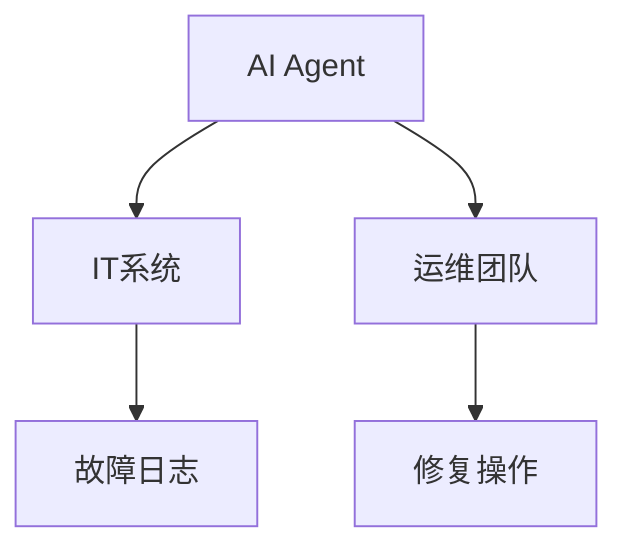
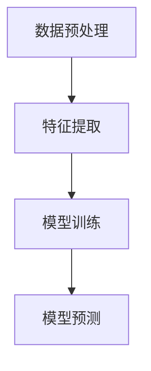
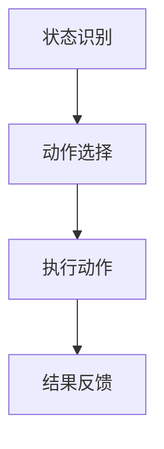
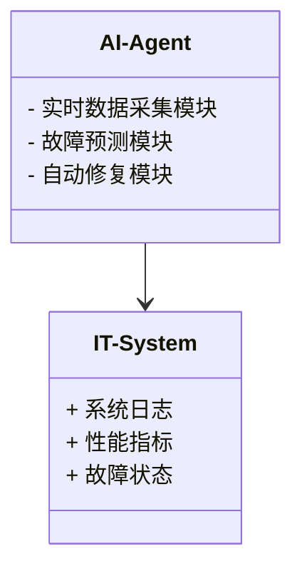
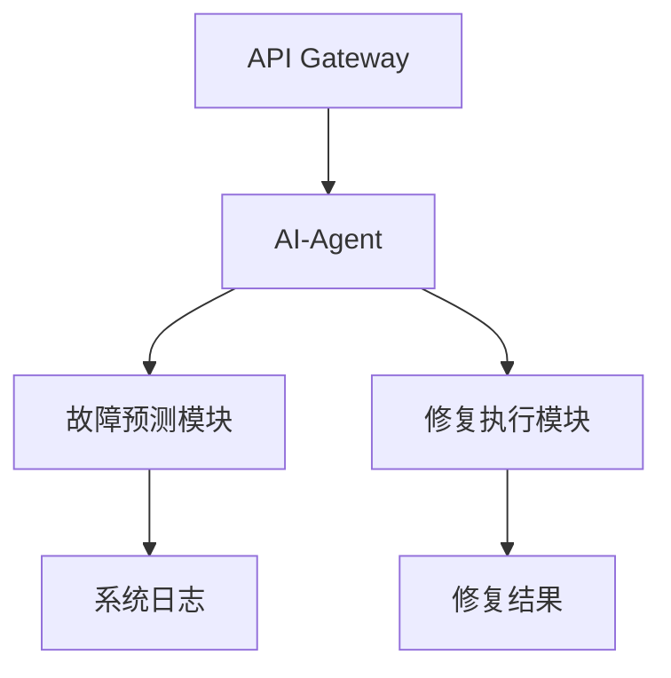
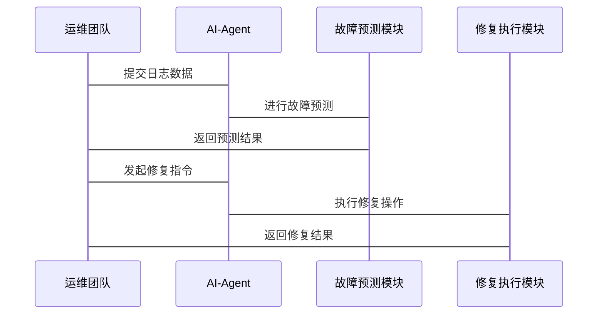

                 


# AI Agent在企业IT运维中的应用：故障预测与修复

**关键词：** AI Agent, 企业IT运维, 故障预测, 故障修复, 人工智能, 自动化运维

**摘要：** 本文探讨了AI Agent在企业IT运维中的应用，特别是其在故障预测与修复方面的作用。文章从背景、核心概念、算法原理、系统设计、项目实战等多个方面进行详细分析，旨在为企业IT运维提供新的思路和解决方案。

---

# 第1章 AI Agent与企业IT运维概述

## 1.1 AI Agent的基本概念
- 1.1.1 什么是AI Agent
- 1.1.2 AI Agent的核心特征
- 1.1.3 企业IT运维中的AI Agent角色

## 1.2 企业IT运维的现状与挑战
- 1.2.1 传统IT运维的痛点
- 1.2.2 故障预测与修复的重要性
- 1.2.3 AI Agent在IT运维中的应用前景

## 1.3 故障预测与修复的背景
- 1.3.1 故障预测的定义与目标
- 1.3.2 故障修复的定义与目标
- 1.3.3 故障预测与修复的边界与外延

## 1.4 本章小结

---

# 第2章 AI Agent的核心概念

## 2.1 AI Agent的组成与结构
- 2.1.1 感知层
- 2.1.2 决策层
- 2.1.3 执行层

## 2.2 AI Agent的工作原理
- 2.2.1 数据采集与处理
- 2.2.2 模型训练与推理
- 2.2.3 行动决策与执行

## 2.3 AI Agent与其他技术的对比
- 2.3.1 与传统自动化运维的区别
- 2.3.2 与机器学习模型的对比
- 2.3.3 与规则引擎的对比

## 2.4 核心概念属性特征对比表
| 特性 | AI Agent | 传统自动化运维 | 机器学习模型 |
|------|----------|----------------|-------------|
| 数据来源 | 实时日志、指标 | 静态规则 | 历史数据 |
| 决策方式 | 自主学习 | 预定义规则 | 基于模型预测 |
| 执行能力 | 可自主修复 | 仅执行预定义任务 | 无执行能力 |

## 2.5 实体关系图


---

# 第3章 AI Agent的算法原理

## 3.1 基于机器学习的故障预测算法
### 3.1.1 算法流程


### 3.1.2 代码实现
```python
import pandas as pd
from sklearn.ensemble import RandomForestClassifier

# 数据加载与预处理
data = pd.read_csv('fault_logs.csv')
data = data.dropna()

# 特征提取
features = data[['cpu_usage', 'memory_usage', 'network_latency']]
target = data['fault_flag']

# 模型训练
model = RandomForestClassifier()
model.fit(features, target)

# 模型预测
new_fault = model.predict(features.iloc[-1:])[0]
print(f"预测故障状态：{new_fault}")
```

### 3.1.3 数学模型
$$ P(fault | features) = \sum_{i=1}^{n} w_i \cdot I(f_i) $$

## 3.2 基于强化学习的故障修复策略
### 3.2.1 算法流程


### 3.2.2 代码实现
```python
import numpy as np
from collections import deque

# 状态空间和动作空间定义
state_space = ['low', 'medium', 'high']
action_space = ['no_action', 'reset_service', 'restart_server']

# 强化学习模型初始化
class Agent:
    def __init__(self):
        self.memory = deque(maxlen=1000)
        self.gamma = 0.99

    def remember(self, state, action, reward, next_state):
        self.memory.append((state, action, reward, next_state))

    def act(self, state):
        # 这里简化为随机选择动作
        return np.random.choice(action_space)

# 训练过程
agent = Agent()
for episode in range(100):
    state = get_current_state()
    action = agent.act(state)
    reward = get_reward(action)
    next_state = get_next_state(action)
    agent.remember(state, action, reward, next_state)
```

### 3.2.3 数学模型
$$ Q(s, a) = Q(s, a) + \alpha \cdot [r + \gamma \cdot max_{a'} Q(s', a') - Q(s, a)] $$

---

# 第4章 系统分析与架构设计

## 4.1 问题场景介绍
- IT系统的故障预测与修复需求
- 系统日志分析的复杂性
- 传统方法的局限性

## 4.2 系统功能设计
### 4.2.1 领域模型


### 4.2.2 系统架构


### 4.2.3 接口设计
- 输入接口：实时日志、性能指标
- 输出接口：预测结果、修复指令

### 4.2.4 交互流程


---

# 第5章 项目实战

## 5.1 项目介绍
- 项目目标：实现基于AI Agent的故障预测与修复系统
- 项目范围：企业IT系统的日志分析与故障处理
- 项目工具：Python、TensorFlow、Django

## 5.2 系统核心实现
### 5.2.1 环境搭建
```bash
pip install numpy pandas scikit-learn
```

### 5.2.2 核心代码实现
```python
# 故障预测模块
def predict_fault(logs):
    # 数据预处理
    df = pd.DataFrame(logs)
    df = df.dropna()

    # 特征提取
    features = df[['cpu_usage', 'memory_usage', 'network_latency']]
    target = df['fault_flag']

    # 模型加载
    model = load_model('fault_model.pkl')
    return model.predict(features)[-1]

# 自动修复模块
def auto_fix(fault_type):
    if fault_type == 'high_memory_usage':
        subprocess.run('free_memory.sh', shell=True)
    elif fault_type == 'network_latency':
        subprocess.run('optimize_network.sh', shell=True)
```

### 5.2.3 系统测试
- 测试用例设计
- 测试结果分析
- 性能优化建议

### 5.2.4 案例分析
- 案例背景
- 数据分析
- 预测结果
- 修复过程
- 结果评估

## 5.3 项目小结
- 项目成果
- 经验总结
- 改进建议

---

# 第6章 总结与展望

## 6.1 总结
- 本章回顾了文章的主要内容
- 强调了AI Agent在故障预测与修复中的重要性
- 总结了实现的关键点和注意事项

## 6.2 未来展望
- AI Agent技术的发展趋势
- 更广泛的应用场景
- 可能的挑战与解决方案

## 6.3 最佳实践Tips
- 数据质量的重要性
- 模型选择的策略
- 系统安全与可靠性保障

## 6.4 本章小结

---

# 作者：AI天才研究院/AI Genius Institute & 禅与计算机程序设计艺术 /Zen And The Art of Computer Programming

---

通过以上目录结构，文章将系统地介绍AI Agent在企业IT运维中的应用，从基础概念到算法实现，再到系统设计和项目实战，层层递进，帮助读者全面理解并掌握相关知识。

