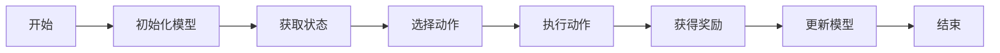

                 


# AI Agent在企业专利分析与技术趋势预测中的应用

## 关键词：AI Agent，专利分析，技术趋势预测，自然语言处理，机器学习，知识图谱，强化学习

## 摘要：本文探讨了AI Agent在企业专利分析与技术趋势预测中的应用，详细介绍了AI Agent的核心原理、算法实现、系统架构以及实际项目案例。通过分析专利数据，利用自然语言处理和强化学习等技术，AI Agent能够帮助企业更高效地进行专利布局、技术预测和创新决策支持。

---

# 第一章：AI Agent的基本概念与应用背景

## 1.1 AI Agent的定义与核心概念

### 1.1.1 AI Agent的基本定义
AI Agent（人工智能代理）是指能够感知环境、自主决策并执行任务的智能体。它具备以下核心特征：
- **自主性**：无需外部干预，自主完成任务。
- **反应性**：能够实时感知环境并做出反应。
- **目标导向**：基于目标进行决策和行动。
- **学习能力**：通过数据和经验不断优化自身性能。

### 1.1.2 AI Agent的核心特征
- **多智能体协作**：多个AI Agent可以协同工作，共同完成复杂任务。
- **动态适应性**：能够根据环境变化调整策略。
- **知识表示**：通过知识图谱等技术，构建领域知识体系。

### 1.1.3 AI Agent与传统自动化工具的区别
传统自动化工具通常基于固定规则执行任务，而AI Agent具备学习和自适应能力，能够处理复杂和动态的环境。

## 1.2 企业专利分析的背景与挑战

### 1.2.1 专利分析的定义与重要性
专利分析是通过对专利数据的挖掘，获取技术趋势、竞争态势等信息，为企业创新决策提供支持。

### 1.2.2 传统专利分析方法的局限性
- **数据量大**：专利数据量庞大，人工分析效率低。
- **信息孤岛**：专利数据分散，缺乏关联性分析。
- **预测难度大**：技术趋势预测依赖经验，缺乏科学依据。

### 1.2.3 技术趋势预测的难点与价值
技术趋势预测是专利分析的重要部分，但面临数据复杂、模型构建困难等挑战。其价值在于帮助企业提前布局技术方向，避免资源浪费。

---

# 第二章：AI Agent的核心原理与技术架构

## 2.1 AI Agent的核心原理

### 2.1.1 多智能体系统的基本概念
多智能体系统由多个AI Agent组成，通过协作完成复杂任务。每个Agent具备独立的目标和决策能力。

### 2.1.2 基于强化学习的决策机制
强化学习通过奖励机制，使AI Agent在与环境交互中不断优化决策策略。常用算法包括Q-Learning和Deep Q-Network。

### 2.1.3 知识图谱构建与语义理解
知识图谱通过构建实体关系图，帮助AI Agent理解专利数据中的语义信息。自然语言处理技术如BERT用于文本分析。

## 2.2 AI Agent的技术架构

### 2.2.1 数据采集与预处理模块
- **数据来源**：包括专利数据库、文献资料等。
- **数据清洗**：去除噪声数据，提取关键信息。
- **数据转换**：将文本数据转换为结构化数据。

### 2.2.2 知识表示与推理模块
- **知识图谱构建**：通过实体识别和关系抽取，构建专利知识图谱。
- **语义理解**：利用自然语言处理技术，理解专利文本语义。

### 2.2.3 行为决策与执行模块
- **决策算法**：基于强化学习的决策机制，制定专利分析策略。
- **执行任务**：根据决策结果，执行专利检索、趋势预测等任务。

---

# 第三章：AI Agent在专利分析中的具体应用

## 3.1 专利数据的智能化处理

### 3.1.1 自然语言处理在专利文本分析中的应用
- **文本分类**：将专利分为不同技术领域。
- **实体识别**：提取专利中的关键技术点。
- **关键词提取**：识别专利中的核心词汇。

### 3.1.2 基于深度学习的专利分类与检索
- **模型选择**：使用BERT进行文本表示。
- **检索算法**：基于向量相似度进行专利检索。

### 3.1.3 知识图谱构建与专利关联分析
- **知识图谱构建**：将专利数据转化为图结构。
- **关联分析**：通过图遍历算法，发现技术间的关联关系。

## 3.2 技术趋势预测的AI Agent实现

### 3.2.1 基于时间序列分析的技术趋势预测
- **算法选择**：使用ARIMA模型预测技术发展趋势。
- **数据处理**：将专利申请数量转化为时间序列数据。

### 3.2.2 基于主题模型的技术热点识别
- **主题模型**：使用LDA模型识别技术热点。
- **主题演化分析**：分析技术主题随时间的变化趋势。

### 3.2.3 基于强化学习的未来技术预测
- **强化学习模型**：构建强化学习框架，预测未来技术趋势。
- **模型训练**：通过专利数据训练模型，使其具备预测能力。

## 3.3 企业创新决策支持系统

### 3.3.1 基于AI Agent的专利布局优化
- **布局策略**：根据技术趋势预测，制定专利布局策略。
- **资源分配**：优化企业研发投入，提高专利申请效率。

### 3.3.2 竞争对手分析与技术规避策略
- **竞争对手分析**：通过专利数据，分析竞争对手的技术布局。
- **技术规避策略**：制定规避风险的技术路线。

### 3.3.3 创新路径规划与资源分配
- **创新路径规划**：基于技术趋势预测，制定创新路径。
- **资源分配优化**：合理分配研发资源，提高创新效率。

---

# 第四章：AI Agent算法原理与实现

## 4.1 基于强化学习的决策算法

### 4.1.1 强化学习的基本原理
- **环境与动作**：AI Agent在环境中执行动作，获得奖励。
- **策略优化**：通过不断试错，优化决策策略。

### 4.1.2 基于深度强化学习的专利分析决策流程
1. **环境感知**：获取专利数据。
2. **状态表示**：将专利数据转化为状态表示。
3. **动作选择**：基于当前状态，选择下一步动作。
4. **奖励机制**：根据结果，调整奖励函数。

### 4.1.3 算法实现的伪代码示例
```python
class AI-Agent:
    def __init__(self, statespace, actionspace):
        self.statespace = statespace
        self.actionspace = actionspace
        self.model = self.build_model()

    def build_model(self):
        # 构建强化学习模型
        pass

    def act(self, state):
        # 根据状态选择动作
        pass

    def learn(self, state, action, reward, next_state):
        # 更新模型参数
        pass
```

### 4.1.4 算法流程图（使用Mermaid）


---

# 第五章：系统分析与架构设计方案

## 5.1 问题场景介绍
企业专利分析系统需要处理大量专利数据，进行技术趋势预测，并提供决策支持。

## 5.2 项目介绍
本项目旨在构建一个基于AI Agent的企业专利分析系统，实现专利数据的智能化处理和趋势预测。

## 5.3 系统功能设计
- **数据采集模块**：采集专利数据。
- **知识图谱构建模块**：构建专利知识图谱。
- **技术趋势预测模块**：预测技术发展趋势。
- **决策支持模块**：提供创新决策支持。

## 5.4 系统架构设计（使用Mermaid）


## 5.5 系统交互设计（使用Mermaid）
```mermaid
sequence-diagram
    participant 用户
    participant 数据采集模块
    participant 知识图谱构建模块
    participant 技术趋势预测模块
    participant 决策支持模块
    用户->数据采集模块: 请求专利数据
    data采集模块->知识图谱构建模块: 提供专利数据
    知识图谱构建模块->技术趋势预测模块: 提供知识图谱
    技术趋势预测模块->决策支持模块: 提供技术预测结果
    决策支持模块->用户: 提供决策建议
```

---

# 第六章：项目实战与最佳实践

## 6.1 环境安装
- **工具安装**：安装Python、TensorFlow、PyTorch等工具。
- **数据准备**：获取专利数据集。

## 6.2 系统核心实现源代码
```python
import tensorflow as tf
from tensorflow.keras import layers

class AI-Agent(tf.keras.Model):
    def __init__(self, input_dim, output_dim):
        super().__init__()
        self.dense1 = layers.Dense(64, activation='relu', input_shape=(input_dim,))
        self.dense2 = layers.Dense(output_dim)

    def call(self, inputs):
        x = self.dense1(inputs)
        return self.dense2(x)
```

## 6.3 代码应用解读与分析
- **输入处理**：将专利数据转换为输入向量。
- **模型训练**：使用专利数据训练AI Agent模型。
- **结果解读**：根据模型输出，进行技术趋势预测。

## 6.4 实际案例分析
- **案例背景**：某企业希望预测未来5年的技术趋势。
- **分析过程**：利用AI Agent进行专利数据挖掘和趋势预测。
- **结果展示**：生成技术趋势报告，为企业决策提供支持。

## 6.5 项目小结
本项目展示了AI Agent在专利分析中的应用，证明了其在技术趋势预测和创新决策支持中的价值。

---

# 第七章：总结与展望

## 7.1 总结
本文详细探讨了AI Agent在企业专利分析与技术趋势预测中的应用，介绍了其核心原理、技术架构和实现方法，并通过实际案例展示了其应用价值。

## 7.2 未来展望
未来，AI Agent在专利分析中的应用将更加广泛，技术也将更加成熟。可能出现的新方向包括更复杂的强化学习算法和更高效的自然语言处理技术。

---

# 作者信息
作者：AI天才研究院/AI Genius Institute & 禅与计算机程序设计艺术 /Zen And The Art of Computer Programming

---

# 附录
## 附录A：AI Agent相关工具与库
- TensorFlow
- PyTorch
- spaCy
- Gensim

## 附录B：常用专利数据库
- 中国国家知识产权局（CNIPA）
- 美国专利商标局（USPTO）
- 欧洲专利局（EPO）

---

通过以上内容，我们详细探讨了AI Agent在企业专利分析与技术趋势预测中的应用，从理论到实践，全面展示了其在企业创新决策中的重要价值。

