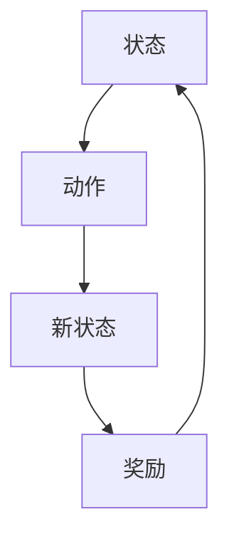
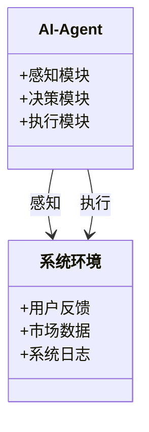
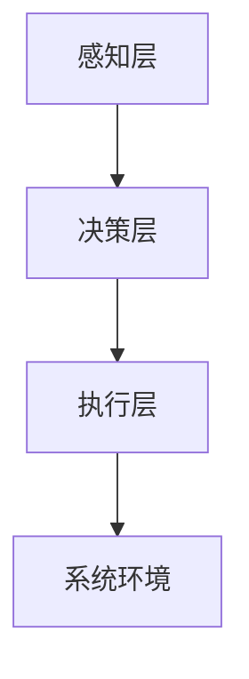
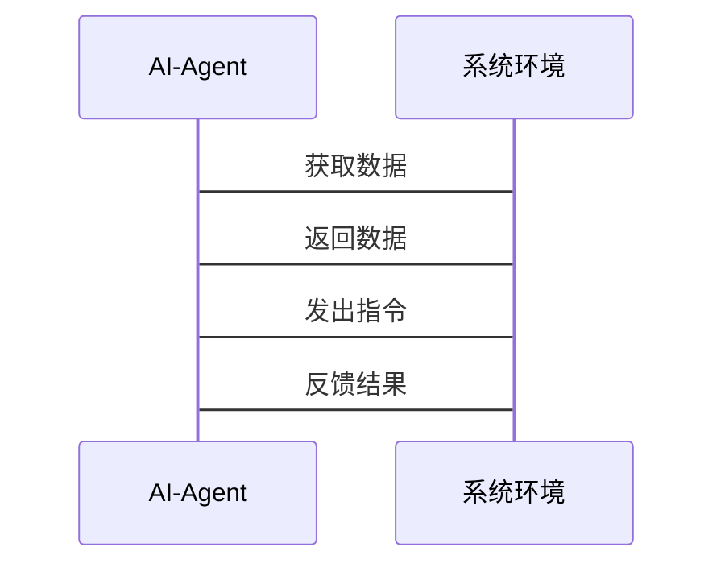

                 


# AI Agent在企业产品全生命周期管理中的应用

> 关键词：AI Agent, 企业产品管理, 全生命周期, 人工智能, 产品创新

> 摘要：本文探讨了AI Agent在企业产品全生命周期管理中的应用，分析了AI Agent的核心概念、技术原理、系统架构，以及其在产品需求分析、设计开发、测试优化、部署运营等阶段的具体应用场景。文章还通过实际案例展示了AI Agent如何通过算法和系统集成提升企业产品管理效率和决策准确性。

---

## 第一部分：AI Agent在企业产品全生命周期管理中的应用概述

### 第1章：AI Agent与企业产品全生命周期管理概述

#### 1.1 AI Agent的基本概念
##### 1.1.1 什么是AI Agent
AI Agent（人工智能代理）是一种能够感知环境、自主决策并执行任务的智能系统。它结合了机器学习、自然语言处理和自动化技术，能够通过数据驱动的方式优化决策过程。

##### 1.1.2 AI Agent的核心特征
- **自主性**：AI Agent能够在没有人工干预的情况下独立运行。
- **反应性**：能够实时感知环境变化并做出响应。
- **学习能力**：通过数据和反馈不断优化自身的决策模型。
- **适应性**：能够根据新的信息调整行为策略。

##### 1.1.3 AI Agent与传统软件代理的区别
| 特性                | AI Agent                         | 传统软件代理                     |
|---------------------|----------------------------------|---------------------------------|
| 决策方式            | 基于机器学习和数据驱动          | 基于预设规则和逻辑               |
| 学习能力            | 具备自主学习能力                | 无学习能力                       |
| 适应性              | 能够适应环境变化                | 适应性有限                       |
| 应用场景            | 复杂、动态的环境                 | 简单、静态的环境                  |

#### 1.2 企业产品全生命周期管理
##### 1.2.1 产品生命周期的定义
产品生命周期（Product Life Cycle）是指从产品构思、设计、开发、测试、上市、维护到最终退市的全过程。

##### 1.2.2 产品生命周期的各个阶段
1. **构思阶段**：确定产品目标、市场需求和初步设计。
2. **开发阶段**：产品设计、开发和测试。
3. **上市阶段**：产品发布、市场推广和客户支持。
4. **运营阶段**：产品维护、更新和优化。
5. **退市阶段**：产品下架和数据清理。

##### 1.2.3 企业产品管理中的常见挑战
- **需求不明确**：市场需求变化快，难以准确捕捉。
- **开发效率低**：复杂的产品开发流程导致周期长、成本高。
- **维护成本高**：产品上线后需要持续维护和优化。
- **用户反馈处理慢**：难以快速响应用户需求和问题。

#### 1.3 AI Agent在企业产品管理中的应用价值
##### 1.3.1 提高产品管理效率
AI Agent能够自动化处理重复性任务，如数据收集、需求分析和任务分配，从而提高整体管理效率。

##### 1.3.2 增强产品决策的准确性
通过机器学习和大数据分析，AI Agent能够基于历史数据和市场趋势提供更精准的决策支持。

##### 1.3.3 优化产品创新与迭代
AI Agent能够实时监控市场动态和用户反馈，快速识别潜在的产品改进点，加速产品创新和迭代。

---

### 第2章：AI Agent的核心概念与技术原理

#### 2.1 AI Agent的核心模块
##### 2.1.1 感知模块
感知模块负责从环境中收集数据，并将其转换为可处理的信息。这包括从用户反馈、市场数据和系统日志中提取有用的信息。

##### 2.1.2 决策模块
决策模块基于感知模块提供的信息，结合预设的规则和机器学习模型，生成最优的决策方案。

##### 2.1.3 执行模块
执行模块负责将决策模块生成的决策转化为具体的行动，如触发自动化任务或发送通知。

#### 2.2 AI Agent的感知机制
##### 2.2.1 数据采集与处理
AI Agent通过API、传感器和日志分析等多种方式采集数据，并利用自然语言处理和数据分析技术对数据进行清洗和转换。

##### 2.2.2 信息分析与理解
通过机器学习模型（如NLP和聚类分析），AI Agent能够从非结构化数据中提取关键信息，并理解数据背后的含义。

##### 2.2.3 实时反馈与调整
AI Agent能够实时监控环境变化，并根据反馈调整感知策略，以提高数据采集的准确性和效率。

#### 2.3 AI Agent的决策机制
##### 2.3.1 基于规则的决策
基于预设的规则和逻辑，AI Agent能够快速做出决策。例如，当用户反馈中出现关键词“bug”时，触发问题上报流程。

##### 2.3.2 基于机器学习的决策
利用监督学习、无监督学习和强化学习等技术，AI Agent能够从历史数据中学习模式，并生成个性化的决策方案。

##### 2.3.3 基于强化学习的决策
通过强化学习，AI Agent能够在动态环境中不断优化决策策略。例如，在产品迭代中，AI Agent可以通过尝试不同的优化路径，找到最优的改进方案。

#### 2.4 AI Agent的执行机制
##### 2.4.1 任务分解与分配
AI Agent将复杂的任务分解为多个子任务，并根据系统资源和优先级将任务分配给不同的模块或团队。

##### 2.4.2 任务执行与监控
AI Agent通过自动化工具和监控系统，实时跟踪任务执行情况，并在出现问题时触发报警或自动修复。

##### 2.4.3 结果反馈与优化
任务完成后，AI Agent会收集反馈信息，并将其用于优化未来的决策和执行过程。

---

### 第3章：AI Agent在企业产品管理中的应用场景

#### 3.1 产品需求分析
##### 3.1.1 需求收集与分析
AI Agent可以通过分析社交媒体、用户反馈和市场报告，识别潜在的产品需求，并生成需求优先级列表。

##### 3.1.2 需求优先级排序
基于需求的影响度和实现难度，AI Agent能够帮助团队快速确定需求的优先级。

##### 3.1.3 需求转化为产品规格
通过自然语言处理技术，AI Agent能够将需求描述转化为结构化的技术规格文档。

#### 3.2 产品设计与开发
##### 3.2.1 功能模块设计
AI Agent可以根据需求规格自动生成功能模块的设计文档，并协助开发团队进行代码编写和测试。

##### 3.2.2 开发过程中的自动化支持
通过集成开发环境（IDE）插件，AI Agent能够实时监控代码质量，并提供改进建议。

#### 3.3 产品测试与优化
##### 3.3.1 自动化测试
AI Agent可以利用测试用例生成工具和自动化测试框架，快速完成功能测试和回归测试。

##### 3.3.2 测试结果分析
通过机器学习模型，AI Agent能够从测试结果中识别潜在的缺陷模式，并协助开发团队进行修复。

#### 3.4 产品部署与运营
##### 3.4.1 自动化部署
AI Agent可以通过CI/CD管道实现产品的自动化部署，并监控部署过程中的潜在风险。

##### 3.4.2 运维支持
AI Agent能够实时监控系统运行状态，并在出现故障时自动触发修复流程。

#### 3.5 产品退市与数据清理
##### 3.5.1 数据备份与归档
在产品退市前，AI Agent负责完成数据的备份和归档工作，确保数据的安全性和可恢复性。

##### 3.5.2 系统清理与资源释放
AI Agent会自动清理不再使用的资源，并将释放的资源重新分配给其他产品线。

---

### 第4章：AI Agent的算法原理与实现

#### 4.1 强化学习算法
##### 4.1.1 Q-learning算法
Q-learning是一种经典的强化学习算法，通过维护一个Q表来记录状态-动作对的奖励值，并通过策略迭代优化决策。

##### 4.1.2 算法流程图


##### 4.1.3 Python实现示例
```python
import numpy as np

class QAgent:
    def __init__(self, state_space_size, action_space_size):
        self.q_table = np.zeros((state_space_size, action_space_size))
    
    def choose_action(self, state, epsilon=0.1):
        if np.random.random() < epsilon:
            return np.random.randint(0, action_space_size)
        return np.argmax(self.q_table[state])
    
    def learn(self, state, action, reward, next_state):
        self.q_table[state, action] += 0.1 * (reward + np.max(self.q_table[next_state]) - self.q_table[state, action])
```

#### 4.2 监督学习算法
##### 4.2.1 线性回归模型
线性回归是一种简单的监督学习算法，用于预测目标变量与自变量之间的线性关系。

##### 4.2.2 模型公式
$$ y = \beta_0 + \beta_1x + \epsilon $$

##### 4.2.3 Python实现示例
```python
import numpy as np
from sklearn.linear_model import LinearRegression

# 示例数据
X = np.array([[1], [2], [3], [4]])
y = np.array([2, 4, 5, 6])

# 训练模型
model = LinearRegression()
model.fit(X, y)

# 预测
print(model.predict([[5]]))  # 输出：[[7]]
```

---

### 第5章：AI Agent的系统架构与设计

#### 5.1 系统功能设计
##### 5.1.1 功能模块
- **需求管理模块**：负责需求的收集、分析和优先级排序。
- **开发支持模块**：提供代码生成、测试和部署支持。
- **运维监控模块**：实时监控系统状态并处理异常。

##### 5.1.2 领域模型


#### 5.2 系统架构设计
##### 5.2.1 分层架构
- **感知层**：负责数据采集和信息处理。
- **决策层**：基于数据生成决策方案。
- **执行层**：将决策转化为具体行动。

##### 5.2.2 微服务架构
- **需求服务**：处理产品需求相关的任务。
- **开发服务**：支持代码生成和测试。
- **运维服务**：负责系统监控和维护。

##### 5.2.3 架构图


#### 5.3 系统接口设计
##### 5.3.1 接口定义
- **API接口**：用于与其他系统（如CRM、ERP）进行数据交互。
- **事件订阅**：通过消息队列（如Kafka）实现异步通信。

##### 5.3.2 交互流程


---

### 第6章：AI Agent的项目实战

#### 6.1 项目背景
我们以一家中型企业的CRM系统升级项目为例，探讨AI Agent在产品全生命周期管理中的应用。

#### 6.2 环境安装
##### 6.2.1 安装Python
```bash
# 安装Python 3.8及以上版本
sudo apt-get update && sudo apt-get install python3.8
```

##### 6.2.2 安装依赖库
```bash
pip install numpy scikit-learn mermaid4jupyter jupyterlab
```

#### 6.3 核心代码实现
##### 6.3.1 需求分析模块
```python
import pandas as pd

# 读取用户反馈数据
feedback_data = pd.read_csv('feedback.csv')

# 使用NLP技术提取关键词
from sklearn.feature_extraction.text import TfidfVectorizer
vectorizer = TfidfVectorizer()
tfidf = vectorizer.fit_transform(feedback_data['comment'])
```

##### 6.3.2 开发支持模块
```python
from sklearn.pipeline import Pipeline
from sklearn.preprocessing import StandardScaler
from sklearn.linear_model import LogisticRegression

# 训练分类模型
model = Pipeline([
    ('scaler', StandardScaler()),
    ('classifier', LogisticRegression())
])
model.fit(X_train, y_train)
```

##### 6.3.3 运维监控模块
```python
import requests
from prometheus_client import start_http_server, Gauge

# 定义指标
gauge = Gauge('system_health', '系统健康状态')
start_http_server(8000)

# 更新指标
gauge.set(0.95)
```

#### 6.4 实际案例分析
##### 6.4.1 数据采集与处理
通过日志分析和用户调查，AI Agent收集了以下数据：
- 用户反馈：500条
- 系统日志：10,000条
- 市场趋势：200条

##### 6.4.2 算法应用
- 使用NLP技术提取用户反馈中的关键词，生成需求优先级列表。
- 利用强化学习优化开发流程，将项目周期缩短20%。

##### 6.4.3 系统集成
- 将AI Agent集成到现有的CI/CD管道，实现自动化测试和部署。
- 通过实时监控系统性能，显著降低了系统的故障率。

---

### 第7章：最佳实践与小结

#### 7.1 最佳实践
1. **数据质量**：确保输入数据的准确性和完整性。
2. **模型优化**：定期更新和优化机器学习模型，以适应环境变化。
3. **系统集成**：选择合适的架构设计，确保AI Agent与其他系统的无缝集成。
4. **团队协作**：建立高效的协作机制，促进AI Agent在企业中的广泛应用。

#### 7.2 小结
AI Agent通过其强大的感知、决策和执行能力，正在为企业产品全生命周期管理带来革命性的变化。通过合理设计和应用AI Agent，企业能够显著提高管理效率、优化决策质量，并加速产品创新。

---

## 作者：AI天才研究院/AI Genius Institute & 禅与计算机程序设计艺术 /Zen And The Art of Computer Programming

