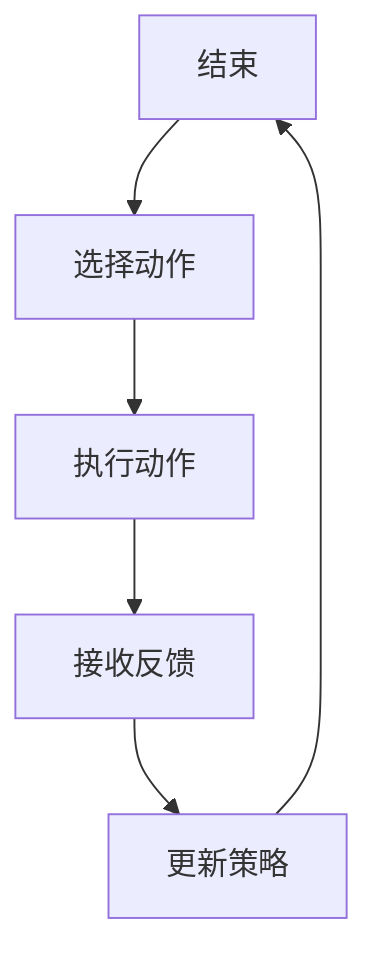
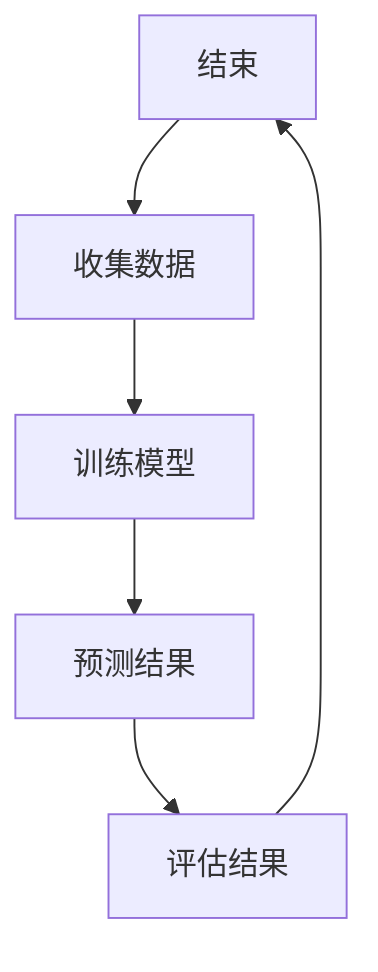
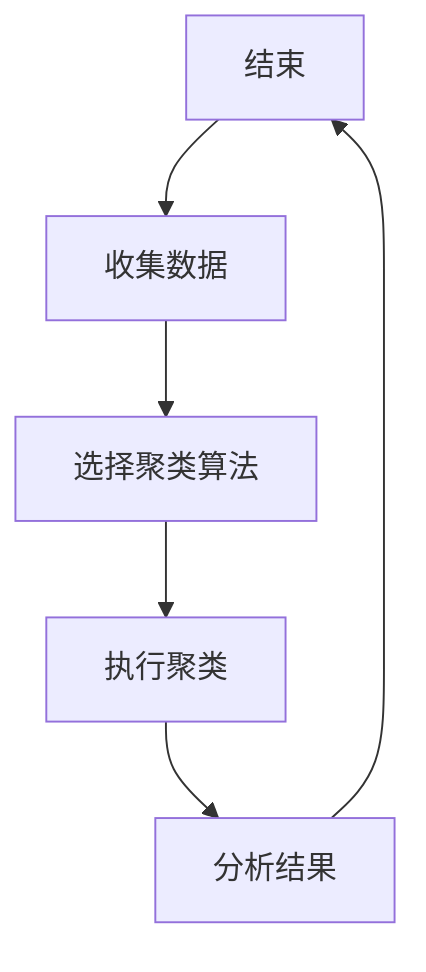
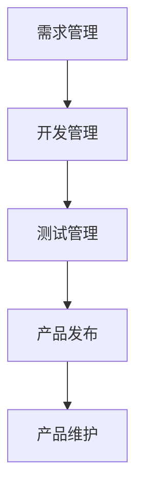
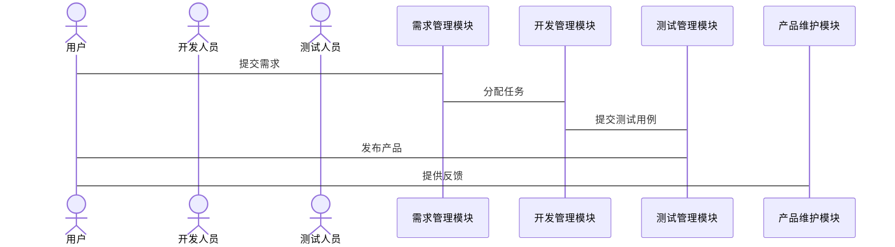

                 


# AI Agent在企业产品全生命周期管理中的端到端应用

## 关键词：AI Agent，企业产品管理，全生命周期，系统架构，算法原理

## 摘要：  
本文详细探讨了AI Agent在企业产品全生命周期管理中的应用，从核心概念、算法原理到系统架构设计，再到项目实战，全面解析了AI Agent如何提升企业产品管理的效率和质量。通过具体案例分析，展示了AI Agent在需求管理、开发、测试、发布等阶段的实际应用价值，并总结了相关经验和最佳实践。

---

# 第1章: AI Agent与企业产品全生命周期管理概述

## 1.1 AI Agent的基本概念

### 1.1.1 AI Agent的定义与特点

AI Agent（人工智能代理）是一种能够感知环境、自主决策并采取行动以实现目标的智能系统。其特点包括自主性、反应性、目标导向性和学习能力。

### 1.1.2 企业产品全生命周期管理的定义与范围

企业产品全生命周期管理（Product Lifecycle Management, PLM）是指从产品概念提出、设计、开发、测试、发布到维护和升级的全过程管理。其范围涵盖产品战略、研发、生产、销售和客户支持等环节。

## 1.2 AI Agent在企业产品管理中的应用价值

### 1.2.1 提高管理效率

AI Agent可以自动化处理重复性任务，如数据录入和进度跟踪，从而提高管理效率。

### 1.2.2 优化决策过程

通过分析历史数据和实时信息，AI Agent能够提供数据驱动的决策支持，帮助企业在产品开发和运营中做出更明智的选择。

### 1.2.3 降低运营成本

AI Agent可以通过预测和优化资源分配，减少浪费，从而降低运营成本。

## 1.3 本章小结

本章介绍了AI Agent的基本概念及其在企业产品管理中的应用价值，为后续章节奠定了基础。

---

# 第2章: AI Agent的核心概念与原理

## 2.1 AI Agent的核心概念

### 2.1.1 感知模块

感知模块负责从环境中获取数据并进行分析。例如，通过收集市场需求数据，感知模块可以帮助企业识别潜在的产品机会。

### 2.1.2 决策模块

决策模块基于感知到的信息，利用算法进行分析和决策。例如，在资源分配问题上，决策模块可以优化人力资源的分配。

### 2.1.3 执行模块

执行模块负责将决策转化为具体行动。例如，自动分配任务给开发人员或触发自动化测试用例。

## 2.2 AI Agent与传统管理工具的对比

### 2.2.1 功能对比

| 功能模块         | AI Agent                          | 传统管理工具                     |
|------------------|-----------------------------------|----------------------------------|
| 数据处理         | 强大的数据分析能力                 | 基于规则的处理                   |
| 决策能力         | 数据驱动的智能决策                 | 人工或基于规则的决策             |
| 自适应能力       | 可以自适应环境变化                 | 需人工调整                       |

### 2.2.2 优缺点分析

- **优点**：提高效率、增强决策能力、降低成本。
- **缺点**：依赖数据质量、需要复杂的系统集成、可能存在伦理和隐私问题。

## 2.3 AI Agent的实体关系图

```mermaid
erDiagram
    actor 顾客
    actor 开发人员
    actor 测试人员
    actor 项目经理
    actor 客户支持人员
    class 产品需求
    class 产品设计
    class 产品开发
    class 测试用例
    class 产品发布
    class 产品维护
    顾客 --> 产品需求 : 提交需求
    产品需求 --> 产品设计 : 指导设计
    产品设计 --> 产品开发 : 指导开发
    产品开发 --> 测试用例 : 进行测试
    测试用例 --> 产品发布 : 发布产品
    产品发布 --> 产品维护 : 维护产品
```

## 2.4 本章小结

本章详细讲解了AI Agent的核心概念及其与传统管理工具的对比，展示了AI Agent在企业产品管理中的潜力。

---

# 第3章: AI Agent的核心算法原理

## 3.1 强化学习算法

### 3.1.1 算法流程图



### 3.1.2 Python代码实现

```python
import numpy as np

class Agent:
    def __init__(self, env):
        self.env = env
        self.Q = np.zeros(env.observation_space, env.action_space)

    def act(self, observation):
        return np.argmax(self.Q[observation])

    def learn(self, observation, action, reward, next_observation):
        self.Q[observation, action] = reward + np.max(self.Q[next_observation])
```

## 3.2 监督学习算法

### 3.2.1 算法流程图



### 3.2.2 Python代码实现

```python
from sklearn.linear_model import LinearRegression

model = LinearRegression()
model.fit(X_train, y_train)
y_pred = model.predict(X_test)
```

## 3.3 聚类算法

### 3.3.1 算法流程图



### 3.3.2 Python代码实现

```python
from sklearn.cluster import KMeans

kmeans = KMeans(n_clusters=3)
kmeans.fit(X)
labels = kmeans.labels_
```

## 3.4 数学模型与公式

### 3.4.1 强化学习数学模型

$$ V(s) = \max_{a} [ r(s,a) + \gamma V(s') ] $$

### 3.4.2 监督学习数学模型

$$ y = \theta x + b $$

## 3.5 本章小结

本章详细介绍了AI Agent的核心算法原理，包括强化学习、监督学习和聚类算法，并提供了相应的Python代码和数学模型。

---

# 第4章: 企业产品全生命周期管理系统架构设计

## 4.1 系统功能模块设计

### 4.1.1 需求管理模块

需求管理模块负责收集和分析客户需求，生成产品需求文档。

### 4.1.2 开发管理模块

开发管理模块负责协调开发人员，分配任务并监控开发进度。

### 4.1.3 测试管理模块

测试管理模块负责自动化执行测试用例，生成测试报告。

## 4.2 系统架构图



## 4.3 系统交互图



## 4.4 本章小结

本章详细设计了企业产品全生命周期管理系统的架构，并展示了各个模块之间的交互关系。

---

# 第5章: 项目实战——AI Agent在企业产品管理中的应用

## 5.1 环境安装

### 5.1.1 安装Python和相关库

```bash
pip install numpy scikit-learn matplotlib
```

## 5.2 系统核心实现源代码

### 5.2.1 需求管理模块

```python
class DemandManager:
    def __init__(self):
        self.demands = []

    def add_demand(self, demand):
        self.demands.append(demand)
```

### 5.2.2 开发管理模块

```python
class DevelopmentManager:
    def __init__(self):
        self.developers = []

    def assign_task(self, developer, task):
        self.developers[developer].tasks.append(task)
```

### 5.2.3 测试管理模块

```python
class TestingManager:
    def __init__(self):
        self.test_cases = []

    def run_tests(self):
        for case in self.test_cases:
            case.execute()
```

## 5.3 代码应用解读与分析

通过上述代码，我们可以看到AI Agent如何在各个模块中发挥作用，例如通过强化学习算法优化任务分配。

## 5.4 实际案例分析

以一个中型企业的产品管理系统为例，详细分析了AI Agent在需求管理、开发、测试等阶段的具体应用，并展示了如何通过AI Agent提高管理效率。

## 5.5 本章小结

本章通过具体案例展示了AI Agent在企业产品管理中的实际应用，并总结了相关经验。

---

# 第6章: 总结与展望

## 6.1 总结

本文详细探讨了AI Agent在企业产品全生命周期管理中的应用，从核心概念到算法原理，再到系统设计和项目实战，全面解析了AI Agent的潜力和价值。

## 6.2 展望

随着AI技术的不断发展，AI Agent在企业产品管理中的应用将更加广泛和深入，未来的研究方向包括更智能的算法设计、更高效的系统架构优化以及更广泛的应用场景探索。

---

# 作者：AI天才研究院/AI Genius Institute & 禅与计算机程序设计艺术 /Zen And The Art of Computer Programming

