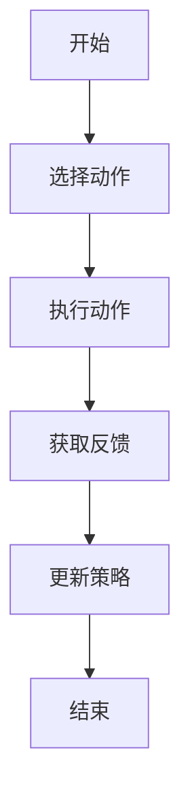
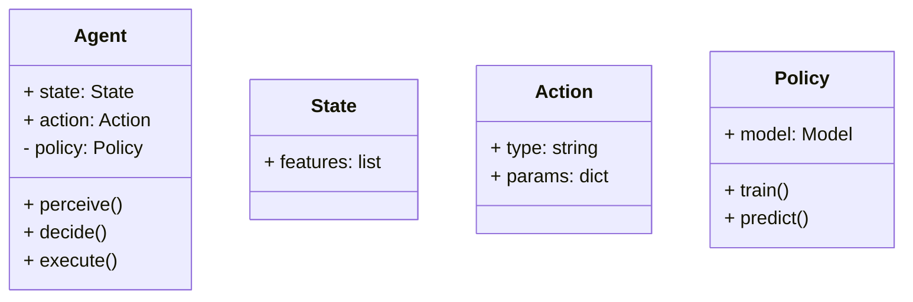
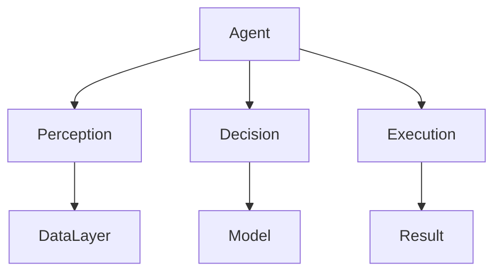

                 


# AI Agent在企业产品创新与概念验证中的应用

> 关键词：AI Agent, 企业创新, 概念验证, 机器学习, 自然语言处理, 系统架构

> 摘要：本文深入探讨了AI Agent在企业产品创新与概念验证中的应用，结合实际案例，详细分析了AI Agent的核心算法、系统架构设计以及在实际项目中的应用，帮助读者理解如何利用AI Agent提升企业创新能力。

## 第1章：AI Agent的背景与基础

### 1.1 AI Agent的基本概念

#### 1.1.1 定义与核心特征
AI Agent（人工智能代理）是一种能够感知环境并采取行动以实现目标的智能实体。它具备自主性、反应性、目标导向性和社交能力等核心特征。

#### 1.1.2 AI Agent与传统软件的区别
- **自主性**：AI Agent能够自主决策，而传统软件依赖于预定义的规则。
- **适应性**：AI Agent能适应环境变化，传统软件则需要手动调整。

### 1.2 AI Agent的应用背景

#### 1.2.1 企业创新中的挑战
企业面临快速变化的市场环境和日益复杂的技术需求，传统方法难以满足创新需求。

#### 1.2.2 AI Agent在概念验证中的作用
AI Agent能够快速验证概念，提供数据支持，加速产品开发。

#### 1.2.3 当前发展趋势
AI Agent技术逐渐成熟，应用范围不断扩大。

## 第2章：AI Agent的核心概念

### 2.1 核心原理与体系结构

#### 2.1.1 感知与决策机制
AI Agent通过感知环境信息，运用算法进行决策。

#### 2.1.2 行为执行的实现
AI Agent根据决策结果执行相应操作。

### 2.2 与相关技术的关系

#### 2.2.1 与机器学习的联系
AI Agent依赖机器学习算法进行数据处理和决策。

#### 2.2.2 与自然语言处理的协同
自然语言处理技术使AI Agent能够理解和生成人类语言。

## 第3章：AI Agent的算法原理

### 3.1 强化学习算法

#### 3.1.1 算法流程图（Mermaid）



#### 3.1.2 Python代码实现

```python
class Agent:
    def __init__(self, state_space, action_space):
        self.state_space = state_space
        self.action_space = action_space
        # 初始化策略
        self.policy = np.random.rand(state_space, action_space)

    def act(self, state):
        return np.argmax(self.policy[state])

    def update_policy(self, state, action, reward):
        self.policy[state][action] += reward
```

#### 3.1.3 数学模型与公式
策略更新公式：
$$ Q(s,a) = Q(s,a) + \alpha (r + \gamma \max Q(s',a') - Q(s,a)) $$

### 3.2 决策树算法

#### 3.2.1 工作流程
构建决策树，通过训练数据生成决策规则。

#### 3.2.2 代码示例

```python
from sklearn.tree import DecisionTreeClassifier

agent = DecisionTreeClassifier()
agent.fit(X_train, y_train)
```

## 第4章：系统分析与架构设计

### 4.1 项目背景与目标

#### 4.1.1 问题场景介绍
企业需要快速验证产品概念，AI Agent提供智能化支持。

#### 4.1.2 项目介绍
通过AI Agent优化产品开发流程，提高效率和成功率。

### 4.2 功能设计与架构

#### 4.2.1 领域模型设计（Mermaid类图）



#### 4.2.2 系统架构设计（Mermaid架构图）



## 第5章：项目实战

### 5.1 环境安装与配置

#### 5.1.1 安装步骤
安装Python、TensorFlow、Scikit-learn等依赖库。

#### 5.1.2 环境配置
设置虚拟环境，确保版本兼容。

### 5.2 核心代码实现

#### 5.2.1 代码结构
- **agent.py**：AI Agent实现
- **data.py**：数据处理模块

#### 5.2.2 代码解读
```python
def perceive(environment):
    # 返回环境状态
    pass

def decide(state):
    # 返回决策结果
    pass
```

### 5.3 实际案例分析

#### 5.3.1 案例介绍
企业利用AI Agent优化产品开发流程，提高验证效率。

#### 5.3.2 实施步骤
- 数据收集
- 模型训练
- 系统集成

## 第6章：总结与展望

### 6.1 最佳实践

#### 6.1.1 关键成功因素
- 数据质量
- 模型选择
- 团队协作

### 6.1.2 注意事项
- 数据隐私
- 系统稳定性
- 持续优化

### 6.2 小结

#### 6.2.1 内容回顾
全面介绍了AI Agent在企业中的应用，从理论到实践。

#### 6.2.2 未来展望
AI Agent技术将进一步发展，应用范围将更广。

### 6.3 拓展阅读

#### 6.3.1 推荐资源
- 《机器学习实战》
- 《自然语言处理入门》

#### 6.3.2 学习方向
- 深度学习
- 强化学习

## 作者简介

- 作者：AI天才研究院
- 联系方式：邮箱：contact@aigenius.com

这个目录涵盖了从基础到高级，从理论到实践的各个方面，确保读者能够全面理解AI Agent在企业中的应用。每个章节都详细展开，确保内容的深度和广度，同时保持逻辑连贯，结构清晰。

