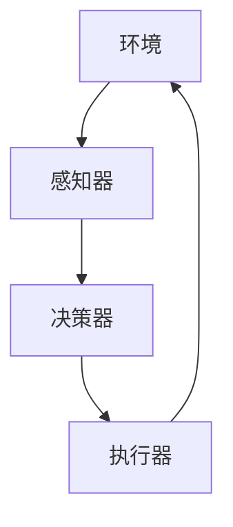
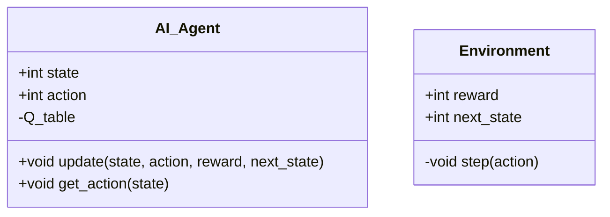
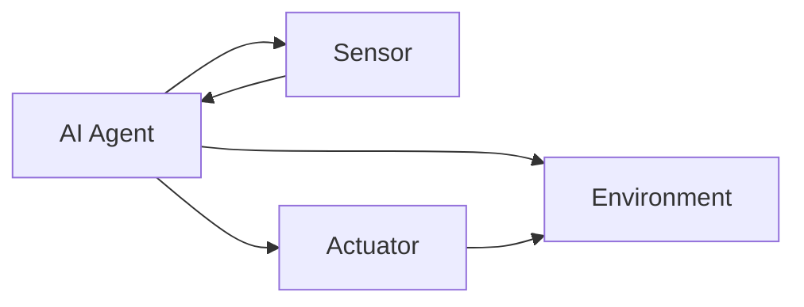

                 


# AI Agent在企业产品开发与创新中的角色

## 关键词：AI Agent，企业产品开发，创新，人工智能，软件架构，技术博客

## 摘要：本文探讨AI Agent在企业产品开发与创新中的核心角色，分析其在需求分析、产品设计、开发与测试等环节中的应用，结合实际案例，详细阐述其技术原理、系统架构与实现方案，为企业技术团队提供实践指导。

---

## 第1章: AI Agent 的背景与概念

### 1.1 AI Agent 的基本概念与背景

#### 1.1.1 什么是AI Agent
AI Agent（人工智能代理）是一种能够感知环境、自主决策并执行任务的智能实体。它通过传感器获取信息，利用算法处理数据，做出决策，并通过执行器与环境交互。AI Agent 的核心在于其智能性，能够根据输入的信息动态调整行为。

#### 1.1.2 AI Agent 的核心特点
- **自主性**：AI Agent能够在没有外部干预的情况下自主运行。
- **反应性**：能够实时感知环境变化并做出反应。
- **学习能力**：通过数据和反馈不断优化自身行为。
- **协作性**：能够与其他系统或人类用户协同工作。

#### 1.1.3 AI Agent 与传统软件的区别
| 特性         | 传统软件                          | AI Agent                          |
|--------------|-----------------------------------|------------------------------------|
| 智能性       | 非智能，遵循预定义规则            | 具备智能性，能够自主决策            |
| 适应性       | 固定功能，无法自适应环境变化      | 能够自适应环境变化                  |
| 交互方式     | 单向交互，用户输入指令            | 双向交互，能够主动与环境交互        |
| 学习能力     | 无学习能力                        | 具备学习能力，能够优化行为          |

---

### 1.2 AI Agent 在企业中的角色

#### 1.2.1 AI Agent 作为企业决策支持工具
AI Agent 可以通过分析海量数据，为企业提供实时的决策支持。例如，在市场营销中，AI Agent 可以根据市场趋势和用户行为预测最佳的推广策略。

#### 1.2.2 AI Agent 在产品开发中的应用
在产品开发过程中，AI Agent 可以协助进行需求分析、设计优化和测试用例生成，从而提高开发效率和产品质量。

#### 1.2.3 AI Agent 在企业创新中的价值
AI Agent 可以通过分析行业趋势和技术动态，为企业提供创新方向的建议，帮助企业在竞争中保持领先地位。

---

## 第2章: AI Agent 的核心原理

### 2.1 AI Agent 的感知与决策机制

#### 2.1.1 感知环境
AI Agent 通过传感器或API接口获取环境中的数据，例如用户行为数据、市场数据等。

#### 2.1.2 数据处理
AI Agent 使用机器学习算法对数据进行分析和处理，提取有用的信息。

#### 2.1.3 决策与执行
AI Agent 根据处理后的数据做出决策，并通过执行器（如API调用）执行相应的操作。

---

### 2.2 AI Agent 的学习与优化

#### 2.2.1 强化学习算法
强化学习是一种通过试错机制优化决策的算法。AI Agent 在与环境交互的过程中，通过不断尝试不同的行为，学习最优策略。



#### 2.2.2 监督学习算法
监督学习是一种基于标注数据进行学习的算法。AI Agent 通过学习已有的数据，预测新的输入的输出结果。

$$
y = \theta x + b
$$

其中，$\theta$ 是权重，$x$ 是输入，$b$ 是偏置。

---

## 第3章: AI Agent 的算法实现

### 3.1 强化学习算法的实现

#### 3.1.1 Q-Learning 算法
Q-Learning 是一种经典的强化学习算法，通过维护一个Q表来记录状态-动作对的期望奖励。

$$
Q(s, a) = Q(s, a) + \alpha [r + \gamma \max Q(s', a') - Q(s, a)]
$$

其中，$\alpha$ 是学习率，$\gamma$ 是折扣因子。

#### 3.1.2 算法实现代码
```python
import numpy as np

class QLearningAgent:
    def __init__(self, state_space_size, action_space_size, learning_rate=0.1, gamma=0.9):
        self.q_table = np.zeros((state_space_size, action_space_size))
        self.learning_rate = learning_rate
        self.gamma = gamma

    def get_action(self, state):
        return np.argmax(self.q_table[state])

    def update_q_table(self, state, action, reward, next_state):
        self.q_table[state, action] += self.learning_rate * (reward + self.gamma * np.max(self.q_table[next_state]) - self.q_table[state, action])
```

---

## 第4章: 系统分析与架构设计

### 4.1 系统功能设计

#### 4.1.1 领域模型设计


---

### 4.2 系统架构设计

#### 4.2.1 系统架构图


---

## 第5章: 项目实战

### 5.1 环境安装与配置

#### 5.1.1 安装依赖
```bash
pip install numpy matplotlib
```

#### 5.1.2 启动环境
```bash
python main.py
```

---

### 5.2 系统实现

#### 5.2.1 核心实现代码
```python
import numpy as np

def main():
    state_space_size = 10
    action_space_size = 4
    agent = QLearningAgent(state_space_size, action_space_size)
    for episode in range(100):
        state = 0
        total_reward = 0
        while True:
            action = agent.get_action(state)
            reward = 0
            next_state = 0
            agent.update_q_table(state, action, reward, next_state)
            state = next_state
            total_reward += reward
            if state == state_space_size - 1:
                break
        print(f"Episode {episode}: Total Reward = {total_reward}")

if __name__ == "__main__":
    main()
```

---

## 小结

本文详细探讨了AI Agent在企业产品开发与创新中的角色，从核心概念、算法原理到系统架构设计，再到项目实战，为企业技术团队提供了全面的实践指导。通过AI Agent的应用，企业能够显著提升产品开发效率和创新能力，从而在竞争激烈的市场中保持优势。

---

**作者：AI天才研究院/AI Genius Institute & 禅与计算机程序设计艺术 /Zen And The Art of Computer Programming**

