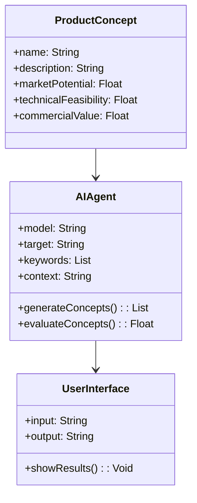
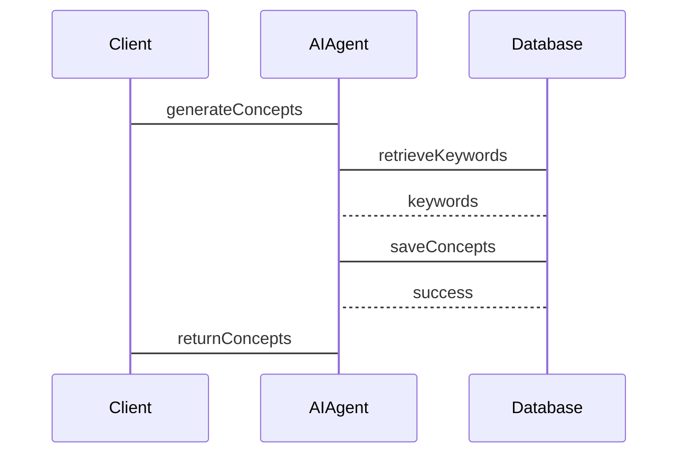

                 


# AI Agent在企业产品概念生成与评估中的角色

> 关键词：AI Agent, 生成式AI, 企业产品概念, 产品概念评估, 创新效率

> 摘要：本文探讨了AI Agent在企业产品概念生成与评估中的核心作用。通过分析生成式AI的原理、AI Agent在产品概念生成中的策略、评估方法以及系统架构设计，展示了AI Agent如何提升企业创新效率、降低试错成本，并为企业提供更高效、更智能的产品开发支持。文章结合实际案例和系统设计，深入剖析了AI Agent在企业产品概念生成与评估中的具体应用，为企业的技术创新和产品开发提供了新的思路和方法。

---

# 第一部分: AI Agent与企业产品概念生成的背景与基础

## 第1章: AI Agent的基本概念与技术基础

### 1.1 AI Agent的定义与核心概念
#### 1.1.1 AI Agent的定义
AI Agent（人工智能代理）是指能够感知环境、自主决策并采取行动以实现特定目标的智能实体。它可以通过传感器获取信息，通过执行器与环境交互，并基于预设的目标和规则做出决策。

#### 1.1.2 AI Agent的核心属性与特征
AI Agent具有以下核心属性：
- **自主性**：能够自主决策和行动。
- **反应性**：能够感知环境并实时响应。
- **目标导向性**：所有行动都以实现特定目标为导向。
- **学习能力**：能够通过经验改进自身的决策能力。

#### 1.1.3 AI Agent与传统软件的区别
传统的软件程序依赖于明确的规则和逻辑，而AI Agent具备学习和适应能力，能够处理复杂和不确定的环境。

---

### 1.2 AI Agent在企业中的应用背景
#### 1.2.1 企业产品开发的传统模式
企业产品开发的传统模式通常依赖于人工调研、经验判断和试错，效率较低且成本较高。

#### 1.2.2 现代企业对创新效率的需求
在竞争激烈的市场环境中，企业需要快速生成和验证产品概念，以满足市场需求和提升竞争力。

#### 1.2.3 AI Agent在企业创新中的潜力
AI Agent可以通过生成式AI技术快速生成创意，并通过智能评估优化产品概念，显著提高创新效率。

---

### 1.3 生成式AI的基本原理
#### 1.3.1 生成式AI的定义与特点
生成式AI是一种能够生成新内容的人工智能技术，其核心是基于深度学习模型的生成能力。

#### 1.3.2 基于Transformer的生成模型
当前主流的生成式AI模型基于Transformer架构，通过自注意力机制捕捉上下文信息。

#### 1.3.3 大语言模型的文本生成机制
大语言模型（如GPT系列）通过预训练和微调，能够生成与上下文相关的高质量文本。

---

## 第2章: 生成式AI的原理与技术实现

### 2.1 生成式AI的核心算法
#### 2.1.1 Transformer模型的结构
Transformer模型由编码器和解码器组成，编码器负责将输入序列转换为上下文向量，解码器负责根据编码器输出生成目标序列。

#### 2.1.2 注意力机制的数学公式
$$
\text{Attention}(Q, K, V) = \text{softmax}\left(\frac{QK^T}{\sqrt{d_k}}\right)V
$$

其中：
- $Q$：查询向量
- $K$：键向量
- $V$：值向量
- $d_k$：键的维度

#### 2.1.3 解码器的生成过程
解码器通过自注意力机制生成序列，逐步预测下一个词并更新上下文。

---

### 2.2 大语言模型的训练机制
#### 2.2.1 自监督学习的定义
自监督学习是一种通过预测未标注数据中隐藏结构来学习表示的方法。

#### 2.2.2 预训练任务的设计
预训练任务包括掩码语言模型（如BERT）和生成任务（如GPT）。

#### 2.2.3 模型的微调与适应
微调是指在预训练的基础上，针对特定任务进行Fine-tuning，以适应具体应用场景。

---

### 2.3 生成式AI的评估指标
#### 2.3.1 分歧度（Perplexity）
Perplexity衡量模型预测下一个词的能力，值越低表示模型越准确。

#### 2.3.2 多样性（Diversity）
多样性衡量生成结果的丰富程度，通常通过不同的评估指标（如困惑度、 BLEU、ROUGE）进行评估。

#### 2.3.3 相关性（Relevance）
相关性衡量生成内容与任务目标的相关性，通常通过人工评估或基于相似度的算法进行判断。

---

## 第3章: 企业产品概念生成的AI Agent方法论

### 3.1 产品概念生成的流程
#### 3.1.1 需求分析阶段
通过市场调研、用户需求分析等方式明确产品目标和核心功能。

#### 3.1.2 概念生成阶段
利用AI Agent生成多个产品概念，并通过模型评估筛选出最优方案。

#### 3.1.3 初步筛选阶段
根据初步评估结果，筛选出具有潜力的概念进行进一步优化。

---

### 3.2 基于AI Agent的概念生成策略
#### 3.2.1 基于关键词的生成策略
通过输入关键词，生成与关键词相关的产品概念。

#### 3.2.2 基于上下文的生成策略
结合具体场景和上下文信息，生成更符合实际需求的概念。

#### 3.2.3 基于用户反馈的生成策略
根据用户反馈不断优化生成策略，提高生成结果的准确性。

---

### 3.3 生成式AI在产品概念生成中的优势
#### 3.3.1 提高创新效率
AI Agent能够快速生成大量创意，显著提高产品开发效率。

#### 3.3.2 降低试错成本
通过智能筛选和优化，减少无效概念的生成，降低试错成本。

#### 3.3.3 拓展创意边界
生成式AI能够突破人类思维的局限，生成更多创新性的概念。

---

## 第4章: 产品概念评估的AI Agent实现

### 4.1 产品概念评估的维度
#### 4.1.1 市场可行性
评估概念是否符合市场需求，是否有足够的市场潜力。

#### 4.1.2 技术可行性
评估概念是否具备实现的技术条件和可行性。

#### 4.1.3 商业价值
评估概念的商业价值和盈利能力。

---

### 4.2 基于生成式AI的评估方法
#### 4.2.1 生成式AI的评估指标
- **市场潜力**：通过数据分析预测市场需求和竞争情况。
- **技术可行性**：通过技术评估判断实现难度。
- **商业价值**：通过财务模型评估盈利能力。

#### 4.2.2 基于对比分析的评估方法
通过对比不同概念的优缺点，筛选出最优方案。

#### 4.2.3 基于情感分析的评估方法
利用情感分析技术评估用户对概念的接受度和喜好程度。

---

### 4.3 AI Agent在评估中的具体实现
#### 4.3.1 评估数据的准备
收集和整理相关数据，包括市场数据、用户反馈等。

#### 4.3.2 评估模型的训练
基于收集的数据，训练评估模型，优化评估指标。

#### 4.3.3 评估结果的可视化
通过可视化工具展示评估结果，便于决策者理解和分析。

---

## 第5章: 企业产品概念生成与评估的系统架构设计

### 5.1 系统需求分析
#### 5.1.1 功能需求
- 产品概念生成功能
- 产品概念评估功能
- 数据管理功能

#### 5.1.2 性能需求
- 响应速度
- 并发处理能力

---

### 5.2 系统功能设计
#### 5.2.1 领域模型（Mermaid 类图）


---

### 5.3 系统架构设计
#### 5.3.1 系统架构（Mermaid 架构图）


---

### 5.4 系统接口设计
#### 5.4.1 API 接口
- `/generateConcepts`：生成产品概念
- `/evaluateConcepts`：评估产品概念
- `/getData`：获取数据

#### 5.4.2 接口设计（Mermaid 序列图）


---

## 第6章: 项目实战与总结

### 6.1 项目实战
#### 6.1.1 环境搭建
安装必要的依赖和工具，如Python、TensorFlow、Kubernetes等。

#### 6.1.2 系统核心实现
实现AI Agent的核心功能，包括概念生成和评估。

#### 6.1.3 代码实现（Python示例）
```python
def generate_concepts(keywords):
    # 实现生成概念的功能
    pass

def evaluate_concepts(concepts):
    # 实现评估概念的功能
    pass
```

---

### 6.2 项目总结
#### 6.2.1 总结与反思
AI Agent在企业产品概念生成与评估中的应用显著提升了效率和质量。

#### 6.2.2 展望未来
未来，随着生成式AI技术的不断进步，AI Agent将在企业创新中发挥更大的作用。

---

# 第六部分: 最佳实践与总结

## 第6章: 最佳实践与总结

### 6.1 最佳实践 tips
- 结合企业实际需求选择合适的AI Agent技术。
- 定期优化和更新模型，以适应市场变化。
- 建立完善的评估体系，确保生成概念的质量。

### 6.2 小结
本文详细探讨了AI Agent在企业产品概念生成与评估中的角色，展示了其在提高创新效率、降低试错成本方面的巨大潜力。

### 6.3 注意事项
- 数据质量对生成结果的影响至关重要。
- 生成式AI的结果需要结合人工审核和优化。
- 系统设计需要考虑可扩展性和可维护性。

### 6.4 拓展阅读
- 《生成式AI：原理与应用》
- 《AI Agent在企业创新中的应用》

---

# 作者

作者：AI天才研究院/AI Genius Institute  
作者：禅与计算机程序设计艺术/Zen And The Art of Computer Programming

