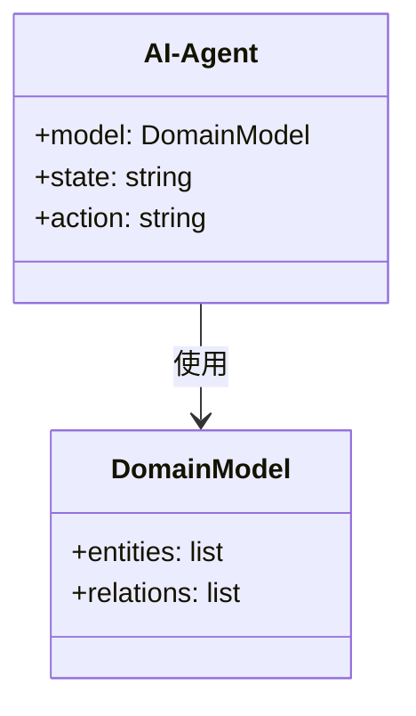
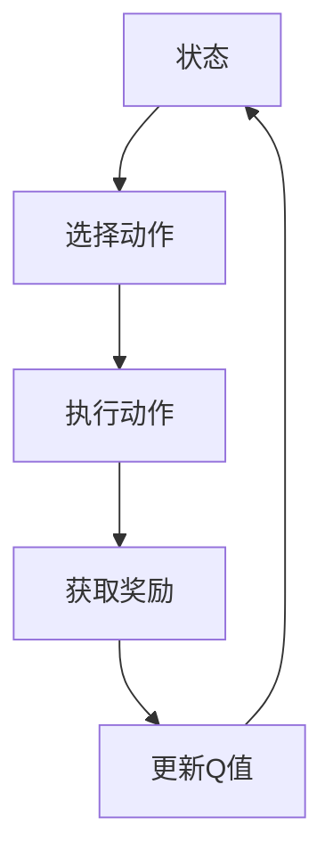
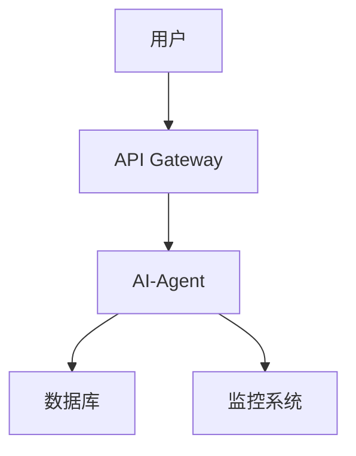

                 


# AI Agent在企业产品生命周期管理与优化中的应用

> 关键词：AI Agent, 产品生命周期管理, 强化学习, 系统架构, 数学模型

> 摘要：本文深入探讨了AI Agent在企业产品生命周期管理中的应用，涵盖从背景到系统架构的各个方面，通过实例分析和代码实现，展示了AI Agent如何优化产品开发、生产和退市阶段的管理流程。

---

# 第一部分: AI Agent与企业产品生命周期管理概述

## 第1章: AI Agent与企业产品生命周期管理概述

### 1.1 问题背景与描述

#### 1.1.1 产品生命周期管理的重要性
产品生命周期管理（Product Lifecycle Management，PLM）是企业管理和优化产品从研发到退市全过程的核心流程。随着市场竞争加剧和客户需求多样化，传统的手动管理模式难以应对日益复杂的挑战。

#### 1.1.2 AI Agent在现代企业中的角色
AI Agent作为智能代理，能够自动化处理复杂任务，实时反馈和优化决策，成为企业提升效率和竞争力的关键工具。

#### 1.1.3 问题的解决与优化
通过AI Agent，企业可以实现产品开发周期缩短、成本降低、质量提升等目标，优化整个产品生命周期。

### 1.2 产品生命周期管理的核心要素

#### 1.2.1 产品开发阶段
涉及需求分析、设计、测试和发布，AI Agent可辅助任务分配、风险评估和进度监控。

#### 1.2.2 产品生产与运营阶段
AI Agent用于质量控制、库存管理和生产优化，确保生产效率和产品质量。

#### 1.2.3 产品退市与回收阶段
AI Agent帮助制定退市策略，优化回收流程，降低环境影响。

### 1.3 AI Agent的基本概念与属性

#### 1.3.1 AI Agent的定义
智能代理，具备感知环境、自主决策和执行任务的能力，分为基于模型、基于规则和强化学习三种类型。

#### 1.3.2 AI Agent的核心属性对比
| 属性 | 基于模型 | 基于规则 | 强化学习 |
|------|----------|----------|----------|
| 决策方式 | 使用领域模型 | 依赖预定义规则 | 通过环境反馈优化策略 |
| 适用场景 | 复杂决策 | 简单规则 | 动态环境 |

#### 1.3.3 AI Agent的ER实体关系图
```mermaid
erDiagram
    actor User {
        +id : int
        +name : string
    }
    class AI-Agent {
        +id : int
        +name : string
        +state : string
    }
    class Product {
        +id : int
        +name : string
        +status : string
    }
    User --> AI-Agent : 请求
    AI-Agent --> Product : 监控
    AI-Agent --> AI-Agent : 状态更新
```

---

## 第2章: AI Agent的核心概念与联系

### 2.1 AI Agent的原理与分类

#### 2.1.1 基于模型的AI Agent
使用领域模型（Mermaid类图）进行推理，适用于复杂场景。



#### 2.1.2 基于规则的AI Agent
基于预定义规则执行任务，适用于简单场景。

#### 2.1.3 强化学习驱动的AI Agent
通过与环境交互，学习最优策略，适用于动态环境。

### 2.2 AI Agent的核心算法原理

#### 2.2.1 强化学习算法
Q-learning算法用于状态-动作空间探索。

#### 2.2.2 Q-learning算法流程图


#### 2.2.3 算法实现代码示例
```python
import numpy as np

class AI-Agent:
    def __init__(self, state_space, action_space):
        self.Q = np.zeros((state_space, action_space))
        
    def choose_action(self, state, epsilon):
        if np.random.random() < epsilon:
            return np.random.randint(action_space)
        return np.argmax(self.Q[state])
        
    def update_Q(self, state, action, reward, next_state, gamma):
        self.Q[state, action] = reward + gamma * np.max(self.Q[next_state])
```

---

## 第3章: AI Agent的算法原理与数学模型

### 3.1 强化学习算法原理

#### 3.1.1 Q-learning算法
$$ Q(s, a) = r + \gamma \max Q(s', a') $$

#### 3.1.2 动作选择策略
$$ \epsilon \text{-贪心策略} $$

---

## 第4章: 企业级AI Agent系统分析

### 4.1 系统应用场景

#### 4.1.1 产品开发中的优化
AI Agent辅助任务分配和进度监控。

#### 4.1.2 生产过程中的监控
实时监控生产流程，优化资源配置。

#### 4.1.3 产品退市策略的制定
基于市场反馈，制定最优退市计划。

### 4.2 系统功能设计

#### 4.2.1 领域模型（Mermaid类图）


#### 4.2.2 系统架构设计（Mermaid架构图）


#### 4.2.3 系统接口与交互流程（Mermaid序列图）
```mermaid
sequenceDiagram
    actor 用户
    被动识别->AI-Agent
    用户->AI-Agent: 请求
    AI-Agent->数据库: 查询状态
    AI-Agent->用户: 返回结果
```

---

## 第5章: 系统架构与实现

### 5.1 系统架构设计

#### 5.1.1 分层架构
分为用户层、业务逻辑层和数据层。

#### 5.1.2 微服务架构
各功能模块独立，便于扩展和维护。

#### 5.1.3 组件交互流程
各组件协同工作，确保系统高效运行。

### 5.2 系统接口设计

#### 5.2.1 RESTful API
提供标准接口，便于与其他系统集成。

#### 5.2.2 实时通信协议
如WebSocket，支持实时反馈。

---

## 第6章: 项目实战

### 6.1 环境安装

```bash
pip install numpy matplotlib
```

### 6.2 核心实现

```python
import numpy as np
import matplotlib.pyplot as plt

class QLearningAgent:
    def __init__(self, state_size, action_size):
        self.Q = np.zeros((state_size, action_size))
        
    def choose_action(self, state, epsilon):
        if np.random.random() < epsilon:
            return np.random.randint(action_size)
        return np.argmax(self.Q[state])
        
    def update_Q(self, state, action, reward, next_state, gamma):
        self.Q[state, action] = reward + gamma * np.max(self.Q[next_state])
```

### 6.3 案例分析

#### 6.3.1 产品开发阶段
AI Agent优化任务分配，缩短开发周期。

#### 6.3.2 生产阶段
实时监控生产流程，优化资源配置。

#### 6.3.3 退市阶段
基于市场反馈，制定最优退市计划。

### 6.4 项目小结
AI Agent显著提升了产品生命周期管理的效率和质量，为企业带来竞争优势。

---

## 第7章: 最佳实践与小结

### 7.1 小结
AI Agent在企业产品生命周期管理中的应用前景广阔，能够显著提升效率和决策质量。

### 7.2 注意事项
选择合适的算法，确保数据质量和系统的可扩展性。

### 7.3 拓展阅读
推荐相关书籍和论文，深入学习AI Agent的应用。

---

作者：AI天才研究院/AI Genius Institute & 禅与计算机程序设计艺术 /Zen And The Art of Computer Programming

