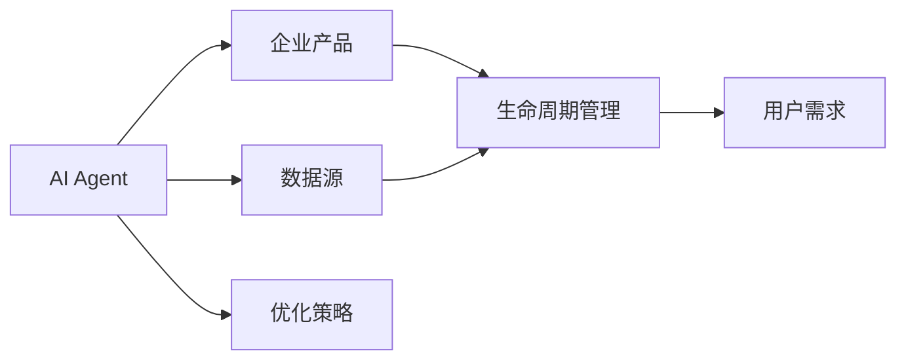

                 

# AI Agent在企业产品生命周期管理中的应用

**关键词：** AI Agent, 企业产品, 生命周期管理, 人工智能, 企业管理

**摘要：**  
本文探讨了AI Agent在企业产品生命周期管理中的应用，详细分析了AI Agent的核心概念、算法原理、系统架构以及实际项目中的应用案例。文章从企业产品生命周期的各个阶段出发，结合AI Agent的技术特点，展示了其在需求分析、开发测试、用户运营和市场预测等环节中的价值。通过理论分析和实际案例相结合的方式，本文深入探讨了AI Agent如何提升企业产品管理的效率和智能化水平，同时提供了系统设计的思路和最佳实践。

---

接下来，我会根据您的要求，逐步完成整篇文章的撰写。以下是第一部分的内容：  

---

## 第一部分: AI Agent与企业产品生命周期管理的背景介绍

### 第1章: AI Agent与企业产品生命周期管理概述

#### 1.1 问题背景与定义

##### 1.1.1 企业产品生命周期管理的定义与特点  
企业产品生命周期管理（Product Lifecycle Management, PLM）是指从产品规划、设计、开发、生产、销售到最终退市的全过程管理。其特点包括：  
- **全生命周期覆盖**：从产品概念到退市的全生命周期管理。  
- **数据驱动**：依赖数据进行决策和优化。  
- **协作性**：涉及多部门、多角色的协作。  

##### 1.1.2 AI Agent的定义与核心特征  
AI Agent（人工智能代理）是一种能够感知环境、自主决策并执行任务的智能体。其核心特征包括：  
- **自主性**：无需外部干预，自主完成任务。  
- **反应性**：能够实时感知环境变化并做出反应。  
- **目标导向**：基于目标驱动行为。  

##### 1.1.3 问题的提出与研究意义  
传统企业产品管理存在效率低下、数据孤岛、决策滞后等问题。引入AI Agent可以实现智能化、自动化管理，提升企业竞争力。

---

#### 1.2 问题描述与目标

##### 1.2.1 传统企业产品管理中的痛点  
- **数据分散**：各部门数据孤立，难以统一管理。  
- **效率低下**：人工操作占主导，效率难以提升。  
- **决策滞后**：依赖历史数据，缺乏实时反馈。  

##### 1.2.2 引入AI Agent的必要性  
AI Agent可以通过自动化处理、实时反馈和智能决策，解决传统管理中的痛点。  

##### 1.2.3 本研究的目标与范围界定  
本研究旨在探讨AI Agent在企业产品生命周期管理中的具体应用，包括技术实现和实际案例分析。

---

### 第2章: AI Agent在企业产品生命周期管理中的应用前景

#### 2.1 企业产品生命周期的阶段划分

##### 2.1.1 产品规划与设计阶段  
AI Agent可以用于需求分析、市场预测和产品设计优化。  

##### 2.1.2 产品开发与测试阶段  
AI Agent可以自动化测试用例生成、缺陷预测和代码优化。  

##### 2.1.3 产品发布与运营阶段  
AI Agent可以进行用户行为分析、实时反馈处理和舆情监控。  

##### 2.1.4 产品终止与迭代阶段  
AI Agent可以预测产品退市时间、分析用户反馈并制定迭代策略。  

#### 2.2 AI Agent在各阶段的应用场景

##### 2.2.1 产品规划中的需求分析与预测  
通过自然语言处理（NLP）分析用户反馈，生成需求文档。  

##### 2.2.2 开发阶段的自动化测试与优化  
基于生成式AI生成测试用例，并优化代码结构。  

##### 2.2.3 运营阶段的用户行为分析与反馈  
利用强化学习模型实时处理用户反馈并优化用户体验。  

##### 2.2.4 迭代阶段的市场趋势预测与策略调整  
通过时间序列分析预测市场趋势，并自动生成调整策略。  

---

### 第3章: AI Agent与企业产品生命周期管理的结合

#### 3.1 核心概念与联系

##### 3.1.1 AI Agent的核心原理  
AI Agent通过感知环境、分析数据、生成决策并执行操作，实现对产品生命周期的智能化管理。  

##### 3.1.2 企业产品生命周期管理的系统架构  
企业产品生命周期管理系统通常包括需求管理模块、开发模块、运营模块和终止模块。  

##### 3.1.3 两者的结合方式与价值点  
AI Agent通过嵌入企业产品生命周期管理系统，实现自动化、智能化的管理流程，提升效率和决策能力。

---

#### 3.2 核心概念的对比分析

##### 3.2.1 AI Agent与传统自动化工具的对比  
| 特性         | AI Agent                     | 传统自动化工具                 |  
|--------------|----------------------------|--------------------------------|  
| 自主性       | 高                           | 低                           |  
| 学习能力     | 强                           | 无                           |  
| 决策能力     | 强                           | 无                           |  

##### 3.2.2 企业产品生命周期管理的数字化转型  
通过AI Agent实现从传统人工管理向数字化、智能化管理的转变。

---

#### 3.3 实体关系图

---

接下来，我会继续完成后续章节的内容，包括算法原理、系统架构设计、项目实战和最佳实践。希望这个思考过程对您有所帮助！

