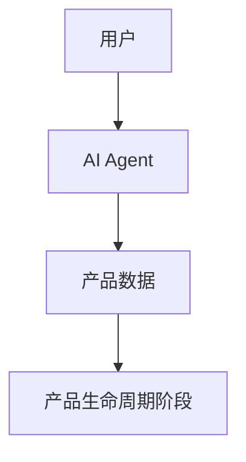
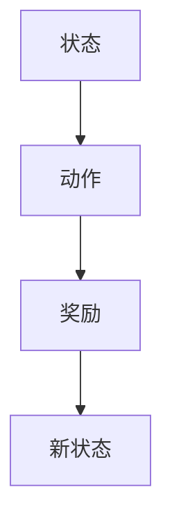
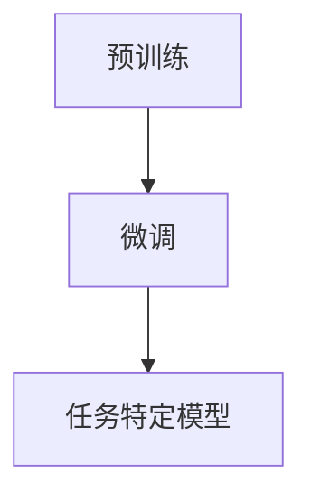
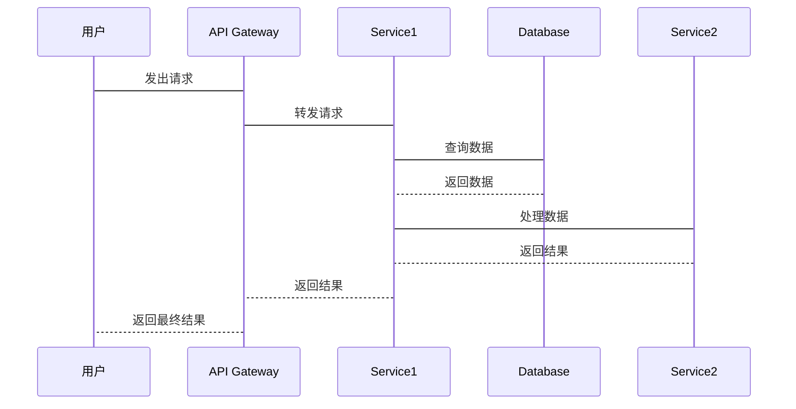

                 


# AI Agent在企业产品生命周期管理中的应用

## 关键词：AI Agent, 企业产品生命周期管理, 人工智能, 自动化, 系统设计

## 摘要：本文探讨了AI Agent在企业产品生命周期管理中的应用，从背景、核心概念到算法原理、系统设计，再到项目实战和小结，全面解析AI Agent如何提升企业产品管理效率和决策能力。

---

# 第一部分: AI Agent与企业产品生命周期管理概述

## 第1章: AI Agent与企业产品生命周期管理的背景介绍

### 1.1 什么是AI Agent

AI Agent（人工智能代理）是指能够感知环境并采取行动以实现目标的智能实体。它具备以下核心特点：

- **自主性**：能够独立决策和行动。
- **反应性**：能实时感知环境变化并做出反应。
- **目标导向**：所有行动均以实现特定目标为导向。

### 1.2 企业产品生命周期管理

企业产品生命周期管理（Product Lifecycle Management, PLM）是指从产品构思、设计、生产、销售到退市的整个过程中的管理活动。主要包含以下阶段：

1. **概念阶段**：市场调研、需求分析。
2. **开发阶段**：设计、开发、测试。
3. **生产阶段**：生产制造、质量控制。
4. **销售阶段**：市场推广、销售支持。
5. **维护阶段**：产品维护、更新升级。
6. **退市阶段**：产品退市、资产处理。

### 1.3 AI Agent在企业产品生命周期管理中的应用价值

AI Agent通过智能化手段，显著提升企业产品生命周期管理的效率和质量：

- **提高效率**：自动化处理重复性任务，缩短产品上市时间。
- **降低错误率**：智能决策减少人为错误，提高决策精准度。
- **实现智能化决策**：利用大数据分析和机器学习，提供数据支持的决策依据。

---

## 第2章: AI Agent的核心概念与联系

### 2.1 AI Agent的核心概念原理

AI Agent的工作原理基于多种技术：

- **强化学习**：通过试错机制不断优化决策策略。
- **大模型微调**：利用预训练大模型，针对具体任务进行微调。
- **对话生成机制**：实现与用户自然语言交互。

### 2.2 核心概念属性特征对比

以下是AI Agent与传统自动化工具的对比表格：

| 特性 | AI Agent | 传统自动化工具 |
|------|----------|----------------|
| 智能性 | 高       | 低             |
| 学习能力 | 强       | 无             |
| 适应性 | 高       | 低             |

### 2.3 ER实体关系图架构



---

## 第3章: AI Agent在企业产品生命周期管理中的算法原理

### 3.1 强化学习算法

强化学习是一种通过试错机制来优化决策的算法：



代码实现：

```python
def train_model(model, optimizer, criterion, train_loader, epochs):
    for epoch in range(epochs):
        for batch_idx, (data, target) in enumerate(train_loader):
            optimizer.zero_grad()
            output = model(data)
            loss = criterion(output, target)
            loss.backward()
            optimizer.step()
```

### 3.2 大模型微调算法

大模型微调是通过预训练大模型，针对具体任务进行微调：



数学公式：

$$
\text{Loss} = \lambda_1 \text{CE}(f(x), y) + \lambda_2 \text{KL}(f(x), g(x))
$$

---

## 第4章: 系统分析与架构设计方案

### 4.1 问题场景介绍

企业产品生命周期管理存在以下问题：

- 数据分散，难以整合。
- 任务复杂，难以自动化。
- 决策依赖人工经验。

### 4.2 系统功能设计

系统功能包括：

- **数据采集**：整合产品生命周期各阶段数据。
- **任务自动化**：实现设计、测试等任务的自动化。
- **智能决策支持**：提供数据驱动的决策支持。

### 4.3 系统架构设计

```mermaid
graph LR
    Client[客户端] --> API Gateway[网关]
    API Gateway --> Service1[服务1]
    Service1 --> Database[数据库]
    Service1 --> Service2[服务2]
```

### 4.4 系统接口设计

- **输入接口**：接收用户指令和数据。
- **输出接口**：返回处理结果和状态。

### 4.5 系统交互流程



---

## 第5章: 项目实战

### 5.1 环境安装

安装所需库：

```bash
pip install transformers torch mermaid4j
```

### 5.2 核心代码实现

实现AI Agent：

```python
from transformers import AutoModelForCausalLM, AutoTokenizer

model = AutoModelForCausalLM.from_pretrained('gpt2')
tokenizer = AutoTokenizer.from_pretrained('gpt2')

def generate_response(prompt):
    inputs = tokenizer(prompt, return_tensors='pt')
    outputs = model.generate(inputs.input_ids, max_length=100)
    return tokenizer.decode(outputs[0], skip_special_tokens=True)
```

### 5.3 案例分析

以产品设计阶段为例，AI Agent可以自动生成设计文档并进行初步审查。

### 5.4 经验总结

通过实践，AI Agent能够显著提高产品管理的效率和质量，但也需要处理数据隐私和模型泛化等问题。

---

## 第6章: 总结与展望

### 6.1 总结

AI Agent在企业产品生命周期管理中的应用前景广阔，能够显著提升效率和决策能力。

### 6.2 注意事项

- 数据隐私保护
- 模型可解释性
- 人机协作

### 6.3 拓展阅读

建议阅读相关书籍和文献，深入学习AI Agent和企业应用的结合。

---

## 作者：AI天才研究院 & 禅与计算机程序设计艺术

---

希望这篇博客能够为读者提供深入的见解和实用的知识，帮助他们在企业产品生命周期管理中更好地应用AI Agent技术。

