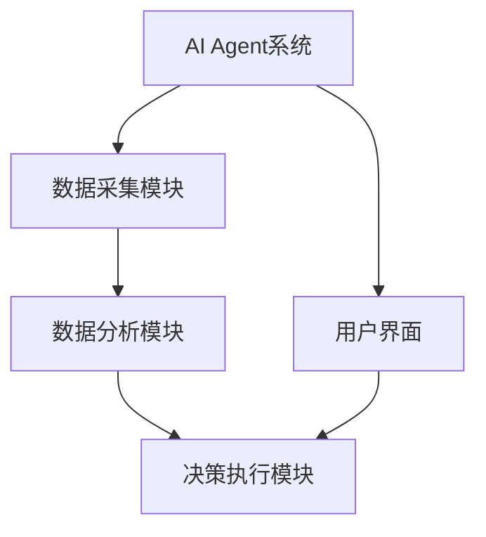
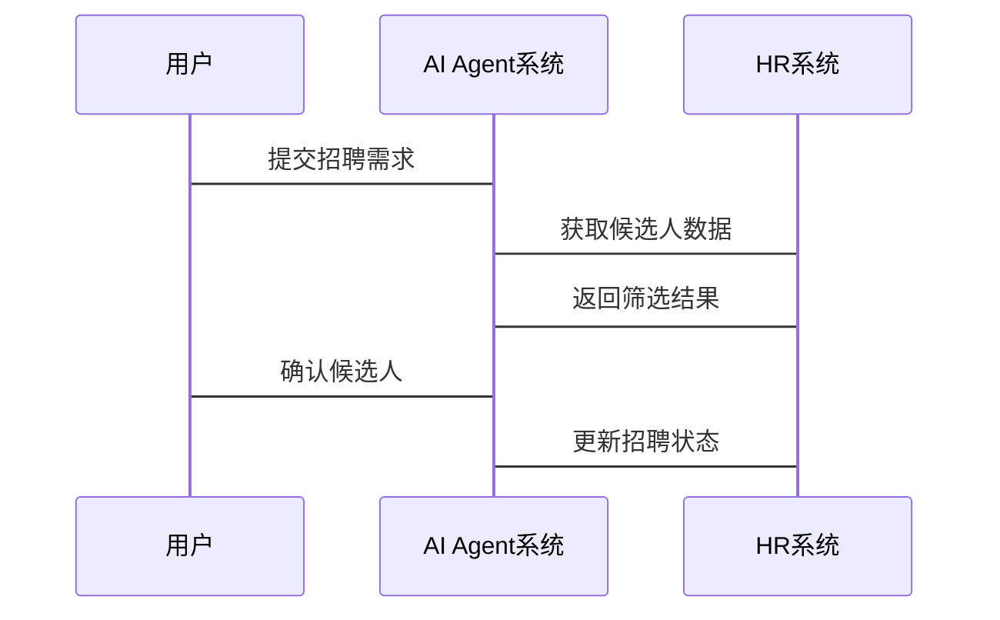

                 


```markdown
# AI Agent在企业人才发展与继任计划中的应用

> 关键词：AI Agent, 企业人才发展, 继任计划, 人工智能, 智能化管理

> 摘要：本文详细探讨了AI Agent在企业人才发展与继任计划中的应用，从核心概念、算法原理到系统架构和项目实战，全面解析了如何利用AI Agent优化企业人才管理流程。通过实际案例分析，展示了AI Agent在招聘优化、培训推荐和继任计划中的具体应用，帮助企业在智能化时代更好地实现人才管理目标。

---

## 第1章: AI Agent与企业人才管理概述

### 1.1 AI Agent的基本概念
#### 1.1.1 AI Agent的定义与特点
AI Agent（人工智能代理）是指能够感知环境、执行任务并做出决策的智能系统。其特点包括智能化、自主性、反应性和社会性。

#### 1.1.2 AI Agent在企业中的应用背景
随着企业对高效、精准人才管理的需求增加，AI Agent通过自动化和智能化手段，帮助企业优化招聘、培训和晋升流程。

#### 1.1.3 企业人才管理的现状与挑战
传统人才管理存在效率低、主观性强、数据孤岛等问题，AI Agent通过数据驱动的方法解决了这些挑战。

### 1.2 AI Agent在人才管理中的作用
#### 1.2.1 提高人才匹配效率
AI Agent通过分析简历和岗位需求，实现精准匹配，提升招聘效率。

#### 1.2.2 优化人才发展路径
AI Agent根据员工表现和潜力，制定个性化的职业发展计划。

#### 1.2.3 实现人才数据的智能化分析
AI Agent利用机器学习算法，对人才数据进行深度分析，为企业决策提供支持。

---

## 第2章: AI Agent的核心概念与原理

### 2.1 AI Agent的核心概念
#### 2.1.1 AI Agent的组成与功能
AI Agent由感知模块、推理模块、决策模块和执行模块组成，具备感知环境、推理分析、制定策略和执行任务的功能。

#### 2.1.2 AI Agent与传统人才管理工具的区别
AI Agent具有自主学习和决策能力，而传统工具依赖人工操作。

#### 2.1.3 AI Agent在人才管理中的核心优势
AI Agent能够处理海量数据，提供实时反馈，并具备预测和优化能力。

### 2.2 AI Agent的算法原理
#### 2.2.1 基于机器学习的AI Agent工作流程
AI Agent通过数据采集、特征提取、模型训练和预测推理，实现智能化决策。

#### 2.2.2 常见算法介绍
- **决策树**：用于分类和回归问题。
- **随机森林**：通过多棵决策树的集成提高准确性。
- **神经网络**：用于复杂的模式识别。

#### 2.2.3 AI Agent的训练与优化过程
包括数据清洗、特征工程、模型训练、调参和评估优化。

---

## 第3章: AI Agent在企业人才发展中的应用

### 3.1 招聘优化
#### 3.1.1 基于AI Agent的简历筛选
AI Agent通过自然语言处理技术，自动筛选简历，识别关键词和潜在匹配度。

#### 3.1.2 智能职位匹配
AI Agent分析岗位需求和候选人技能，推荐最佳匹配的候选人。

#### 3.1.3 面试安排与反馈优化
AI Agent协助安排面试时间，并提供面试反馈分析，帮助HR优化招聘流程。

### 3.2 培训与职业发展
#### 3.2.1 个性化培训推荐
AI Agent根据员工技能和职业目标，推荐定制化的培训课程。

#### 3.2.2 职业路径规划
AI Agent分析员工表现和市场趋势，制定个性化的职业发展路径。

#### 3.2.3 培训效果评估与反馈
AI Agent跟踪培训效果，提供数据支持和反馈，帮助员工提升技能。

---

## 第4章: AI Agent在继任计划中的应用

### 4.1 人才评估与潜力预测
#### 4.1.1 基于AI Agent的员工绩效预测
AI Agent通过历史数据和行为分析，预测员工未来绩效。

#### 4.1.2 员工能力与岗位匹配度分析
AI Agent评估员工技能与岗位需求的匹配度，识别高潜力员工。

#### 4.1.3 继任者潜力评估模型
AI Agent构建评估模型，综合考虑员工的能力、经验和表现，评估其成为继任者的潜力。

### 4.2 继任计划的制定与执行
#### 4.2.1 继任计划的智能化
AI Agent协助制定和执行继任计划，包括职位空缺预警、候选人储备和晋升安排。

#### 4.2.2 继任计划的动态调整
AI Agent实时监控企业变化和员工表现，动态调整继任计划，确保计划的有效性。

---

## 第5章: AI Agent的系统架构与设计

### 5.1 系统功能设计
#### 5.1.1 数据采集模块
负责收集员工数据、岗位需求和市场趋势。

#### 5.1.2 数据分析模块
利用机器学习算法，分析数据并生成决策支持。

#### 5.1.3 决策执行模块
根据分析结果，执行招聘、培训和晋升等操作。

### 5.2 系统架构设计


### 5.3 接口设计
系统通过RESTful API接口与企业现有的HR系统集成，确保数据互通和功能协同。

### 5.4 交互流程图


---

## 第6章: 项目实战

### 6.1 环境安装
- **工具安装**：安装Python、TensorFlow、Scikit-learn等工具。
- **数据准备**：收集员工数据和岗位需求数据。

### 6.2 核心代码实现
```python
import numpy as np
from sklearn.tree import DecisionTreeClassifier
from sklearn.model_selection import train_test_split

# 数据预处理
data = np.array([[85, 1], [70, 0], [88, 1], [65, 0]])
X = data[:, 0].reshape(-1, 1)
y = data[:, 1]

# 模型训练
model = DecisionTreeClassifier()
model.fit(X, y)

# 预测
new_data = np.array([[75, ]]).reshape(-1, 1)
prediction = model.predict(new_data)
print(prediction)
```

### 6.3 代码解读与分析
- **数据预处理**：将数据分为输入和目标变量。
- **模型训练**：使用决策树算法训练分类模型。
- **预测**：输入新数据，预测结果并输出。

### 6.4 案例分析
通过实际案例分析，展示AI Agent如何在招聘和晋升中提供支持，优化企业人才管理流程。

---

## 第7章: 总结与展望

### 7.1 最佳实践 tips
- 数据质量是关键，确保数据的完整性和准确性。
- 定期更新模型，适应企业需求的变化。
- 结合人工审核，确保决策的公平性和透明性。

### 7.2 小结
AI Agent通过智能化手段，显著提升了企业人才管理的效率和精准度。

### 7.3 注意事项
- 数据隐私保护是重中之重。
- 避免过度依赖AI，保持人工审核的必要性。
- 定期评估模型性能，及时优化。

### 7.4 拓展阅读
推荐阅读《机器学习实战》和《AI在企业中的应用》，深入了解AI技术的更多应用场景。

---

## 作者：AI天才研究院/AI Genius Institute & 禅与计算机程序设计艺术 /Zen And The Art of Computer Programming
```

