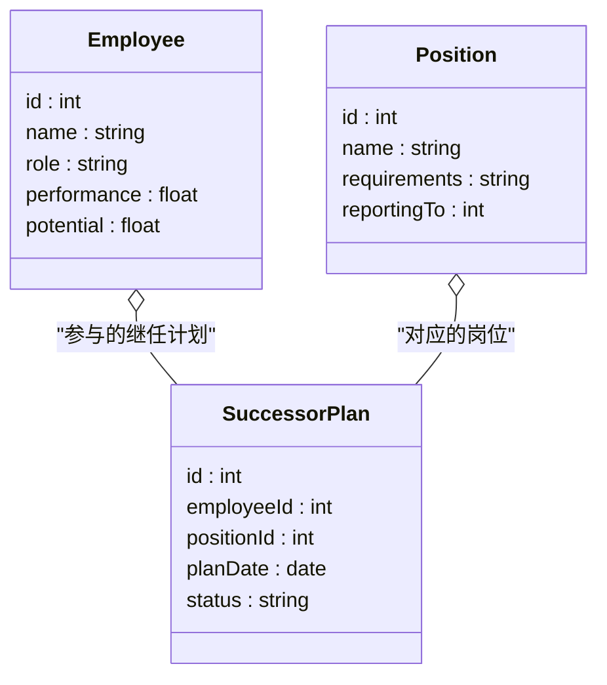
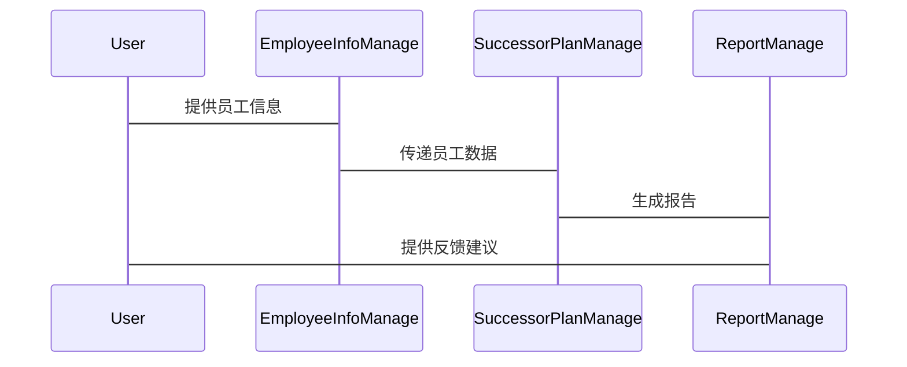

                 


# AI Agent在企业人才发展与继任计划制定中的应用

## 关键词：AI Agent，企业人才发展，继任计划，算法原理，系统架构，项目实战

## 摘要：  
本文探讨了AI Agent在企业人才发展与继任计划制定中的应用，详细分析了其核心概念、算法原理、系统架构以及实际项目中的应用场景。通过结合理论与实践，本文旨在为企业提供一种高效、智能化的人才管理解决方案，以提升企业的竞争力和长期发展能力。

---

# 第一章：问题背景与核心概念

## 1.1 问题背景

### 1.1.1 企业人才发展的痛点与挑战
- **人才需求激增**：随着企业扩张，对高素质人才的需求不断增加，但优秀人才的供给不足。
- **人才流失问题**：企业难以留住核心员工，导致人才流失率高，影响业务连续性。
- **继任计划的复杂性**：传统继任计划依赖人工经验，耗时且难以覆盖所有关键岗位。
- **数据驱动决策的缺失**：缺乏系统化的数据收集与分析，导致继任计划缺乏科学依据。

### 1.1.2 继任计划制定的复杂性
- **多维度评估**：需要综合考虑员工的能力、潜力、经验、绩效等多个维度。
- **动态变化**：市场环境、企业战略和员工发展需求的变化，使得继任计划需要动态调整。
- **数据孤岛**：企业内部数据分散，难以整合，导致信息不一致。

### 1.1.3 AI Agent 的引入与作用
- **自动化与智能化**：AI Agent能够自动化分析数据，快速生成评估结果，提高效率。
- **精准预测**：利用机器学习算法，AI Agent可以预测员工的潜力和适合性，帮助制定更精准的继任计划。
- **实时反馈**：AI Agent能够实时监控员工表现，提供动态反馈，帮助员工和管理者及时调整发展策略。

## 1.2 核心概念与定义

### 1.2.1 AI Agent 的定义与特征
- **定义**：AI Agent是一种能够感知环境、自主决策并执行任务的智能体，能够与用户和系统进行交互，以实现特定目标。
- **特征**：
  - 智能性：能够理解和处理复杂的数据。
  - 自主性：能够在没有人工干预的情况下执行任务。
  - 可扩展性：能够适应不同规模和复杂度的企业需求。

### 1.2.2 企业人才发展的核心要素
- **员工能力评估**：包括技术能力、领导力、团队合作能力等。
- **潜力评估**：基于历史表现和未来潜力，评估员工是否适合关键岗位。
- **发展路径规划**：为员工设计个性化的职业发展路径。

### 1.2.3 继任计划制定的流程与目标
- **流程**：
  1. 确定关键岗位需求。
  2. 评估员工能力和潜力。
  3. 制定继任计划并执行。
  4. 监控和调整计划。
- **目标**：确保企业在关键岗位上有合适的接班人，降低人才流失风险，提升组织的连续性和稳定性。

## 1.3 问题解决与边界

### 1.3.1 AI Agent 在人才发展中的问题解决路径
- **数据整合与分析**：AI Agent能够整合企业内部的员工数据，包括绩效、能力、培训记录等，进行深度分析。
- **自动化评估**：通过机器学习算法，AI Agent可以快速评估员工的能力和潜力，生成继任计划。
- **动态调整**：根据实时数据和反馈，AI Agent能够动态调整继任计划，确保其适应性。

### 1.3.2 应用场景的边界与外延
- **边界**：AI Agent主要用于辅助继任计划的制定和执行，不涉及员工的实际任命和薪酬调整。
- **外延**：AI Agent的应用可以扩展到员工培训、职业发展规划、团队优化等领域。

### 1.3.3 核心概念的结构化分析
- **员工-能力矩阵**：通过矩阵分析员工的能力和潜力，识别适合的关键岗位接班人。
- **岗位需求分析**：基于岗位要求和企业战略，确定关键岗位的需求，制定继任计划。

## 1.4 本章小结
本章从企业人才发展的痛点和挑战入手，详细阐述了AI Agent的核心概念和其在继任计划制定中的作用。通过分析问题背景和核心概念，为后续的算法原理和系统设计奠定了基础。

---

# 第二章：AI Agent 的核心概念与原理

## 2.1 核心概念原理

### 2.1.1 AI Agent 的基本原理
- **感知与学习**：AI Agent通过收集和分析员工数据，学习员工的能力、绩效和潜力。
- **决策与执行**：基于学习结果，AI Agent生成继任计划并执行相关任务，如推荐候选人或提供反馈。

### 2.1.2 与传统人才发展方法的区别
- **数据驱动 vs 经验驱动**：AI Agent基于数据进行决策，而传统方法依赖人工经验。
- **自动化 vs 人工化**：AI Agent能够自动化处理数据和生成计划，而传统方法需要大量人工参与。
- **动态调整 vs 静态规划**：AI Agent能够实时调整计划，而传统方法需要定期重新制定。

### 2.1.3 AI Agent 的优势与局限性
- **优势**：
  - 提高效率：AI Agent能够快速处理大量数据，节省时间和成本。
  - 精准预测：基于机器学习算法，AI Agent能够准确预测员工的潜力和适合性。
  - 动态适应：能够根据变化的环境和数据，实时调整继任计划。
- **局限性**：
  - 数据依赖：AI Agent的表现依赖于数据的质量和数量，数据不足可能导致结果不准确。
  - 伦理问题：AI Agent的决策可能引发公平性和透明度问题。

### 2.1.4 核心概念属性特征对比
| 特性             | AI Agent                          | 传统方法                          |
|------------------|-----------------------------------|------------------------------------|
| 数据依赖         | 高                                 | 低                                 |
| 自动化           | 高                                 | 低                                 |
| 精准预测能力     | 高                                 | 低                                 |
| 动态适应能力     | 高                                 | 低                                 |
| 透明度           | 低（需要解释模型）               | 高（基于人工经验）                 |

### 2.1.5 ER 实体关系图
```mermaid
erDiagram
    employee {
        id : int
        name : string
        role : string
        performance : float
        potential : float
    }
    position {
        id : int
        name : string
        requirements : string
        reportingTo : int
    }
    successorPlan {
        id : int
        employeeId : int
        positionId : int
        planDate : date
        status : string
    }
    employee ||-- successorPlan : "参与的继任计划"
    position ||-- successorPlan : "对应的岗位"
```

## 2.2 核心概念属性特征对比
### 2.2.1 AI Agent 的核心属性
| 属性             | 描述                                   |
|------------------|--------------------------------------|
| 智能性           | 能够理解、分析和处理复杂数据的能力     |
| 自主性           | 能够在没有人工干预的情况下执行任务     |
| 可扩展性         | 能够适应不同规模和复杂度的企业需求     |

### 2.2.2 传统继任计划方法的特征
| 特性             | 描述                                   |
|------------------|--------------------------------------|
| 经验驱动         | 依赖于人工经验和主观判断               |
| 人工化           | 需要大量人工参与，效率较低             |
| 静态规划         | 计划一旦制定，难以快速调整             |

### 2.2.3 对比分析与总结
AI Agent通过数据驱动、自动化和动态适应等优势，显著提升了继任计划的效率和精准度。然而，其依赖数据和模型的特性也带来了透明度和伦理方面的挑战。

---

# 第三章：算法原理

## 3.1 算法原理概述

### 3.1.1 机器学习算法的选择
- **监督学习**：用于根据历史数据预测员工的潜力和适合性。
- **无监督学习**：用于发现数据中的潜在模式和群体。

### 3.1.2 算法流程
1. **数据收集**：整合员工的绩效、能力、培训记录等数据。
2. **数据预处理**：清洗和标准化数据，处理缺失值和异常值。
3. **特征选择**：提取关键特征，如绩效评分、能力评估、岗位匹配度等。
4. **模型训练**：使用机器学习算法训练模型，预测员工的潜力和适合性。
5. **结果分析**：评估模型的准确性和效果，调整参数优化模型。
6. **应用与反馈**：将模型应用于实际场景，收集反馈，持续优化。

### 3.1.3 算法实现步骤
1. **数据预处理**：
   - 使用Python的Pandas库清洗数据。
   - 对数据进行标准化处理，确保模型输入一致。
2. **特征选择**：
   - 使用统计方法（如相关性分析）选择重要特征。
   - 使用特征重要性评分（如随机森林）进一步筛选。
3. **模型训练**：
   - 选择合适的算法（如逻辑回归、支持向量机、随机森林）。
   - 划分训练集和测试集，进行交叉验证，评估模型性能。
4. **结果分析**：
   - 使用混淆矩阵、精确率、召回率、F1分数等指标评估模型效果。
   - 分析模型的误分类情况，找出改进方向。

### 3.1.4 算法实现代码示例
```python
import pandas as pd
from sklearn.model_selection import train_test_split
from sklearn.ensemble import RandomForestClassifier
from sklearn.metrics import accuracy_score, classification_report

# 数据加载
data = pd.read_csv('employee_data.csv')

# 特征选择
features = ['performance', 'potential', 'experience', 'education']
target = 'successor'

# 数据分割
X = data[features]
y = data[target]
X_train, X_test, y_train, y_test = train_test_split(X, y, test_size=0.2, random_state=42)

# 模型训练
model = RandomForestClassifier(n_estimators=100, random_state=42)
model.fit(X_train, y_train)

# 模型预测
y_pred = model.predict(X_test)

# 模型评估
print("Accuracy:", accuracy_score(y_test, y_pred))
print("Classification Report:", classification_report(y_test, y_pred))
```

### 3.1.5 数学模型和公式
- **随机森林模型**：基于决策树的集成方法，通过投票机制进行预测。
- **特征重要性**：通过模型的特征重要性评分，确定哪些特征对预测结果影响最大。

### 3.1.6 通俗易懂的举例说明
假设我们有100名员工，我们需要预测哪些员工适合担任管理层职位。通过收集员工的绩效、潜力、经验等数据，使用随机森林模型进行训练，最终模型能够准确预测出适合的候选人。

---

## 3.2 算法实现步骤

### 3.2.1 数据预处理
```python
import pandas as pd
import numpy as np

# 数据加载
data = pd.read_csv('employee_data.csv')

# 处理缺失值
data['experience'].fillna(data['experience'].mean(), inplace=True)

# 标准化处理
from sklearn.preprocessing import StandardScaler
scaler = StandardScaler()
data_scaled = scaler.fit_transform(data[['performance', 'potential', 'experience', 'education']])
```

### 3.2.2 特征选择
```python
from sklearn.ensemble import RandomForestClassifier
from sklearn.feature_selection import SelectFromModel

model = RandomForestClassifier(n_estimators=100, random_state=42)
model.fit(data_scaled, data[target])

feature_importances = model.feature_importances_
selected_features = SelectFromModel(model).transform(data_scaled)
```

### 3.2.3 模型训练与评估
```python
from sklearn.metrics import accuracy_score, classification_report

# 模型训练
model.fit(X_train, y_train)

# 模型预测
y_pred = model.predict(X_test)

# 模型评估
print("Accuracy:", accuracy_score(y_test, y_pred))
print("Classification Report:", classification_report(y_test, y_pred))
```

### 3.2.4 模型优化与调整
- **参数调整**：通过网格搜索（Grid Search）优化模型参数，如n_estimators、max_depth等。
- **模型集成**：使用投票分类器（Voting Classifier）结合多个模型的结果，提升预测准确率。

### 3.2.5 代码实现与解读
- **代码实现**：如上所示，使用随机森林模型进行训练和预测。
- **代码解读**：
  - 数据加载与预处理：读取数据，处理缺失值和标准化。
  - 特征选择：使用随机森林模型提取重要特征。
  - 模型训练：训练随机森林模型。
  - 模型评估：评估模型的准确性和效果。

### 3.2.6 算法复杂度分析
- **时间复杂度**：随机森林的时间复杂度主要取决于树的数量和每棵树的复杂度。通常，随机森林的时间复杂度为O(n*m)，其中n是样本数，m是特征数。
- **空间复杂度**：随机森林的空间复杂度主要取决于存储树的数量和每棵树的大小，通常为O(n*m)。

---

## 3.3 算法优化与调优

### 3.3.1 参数调优
- **n_estimators**：树的数量，通常越大，模型越稳定，但训练时间增加。
- **max_depth**：树的最大深度，防止过拟合。
- **min_samples_split**：叶子节点的最小样本数，控制树的分裂。

### 3.3.2 模型集成
- **投票分类器**：结合多个模型的结果，提高预测准确性。
- **堆叠模型**：使用多个模型的输出作为输入，构建一个元模型进行预测。

### 3.3.3 模型调优代码示例
```python
from sklearn.model_selection import GridSearchCV

# 参数设置
param_grid = {
    'n_estimators': [100, 200],
    'max_depth': [None, 10, 20],
    'min_samples_split': [2, 5]
}

# 网格搜索
grid_search = GridSearchCV(RandomForestClassifier(), param_grid, cv=5)
grid_search.fit(X_train, y_train)

# 最佳参数
print("Best Parameters:", grid_search.best_params_)
```

---

## 3.4 算法实现与优化总结

### 3.4.1 算法实现总结
通过随机森林模型，我们能够有效地预测员工的潜力和适合性，为继任计划的制定提供科学依据。

### 3.4.2 算法优化与调优
通过网格搜索和模型集成等方法，可以进一步优化模型性能，提升预测准确率。

### 3.4.3 代码实现的优缺点
- **优点**：
  - 简单易用，代码实现清晰。
  - 训练速度快，适合处理大规模数据。
- **缺点**：
  - 需要处理数据预处理和特征选择，增加了工作量。
  - 对某些问题可能不如其他算法（如梯度提升树）效果好。

---

## 3.5 算法原理总结

### 3.5.1 核心算法原理
- **监督学习**：基于标签数据进行训练，预测员工的潜力和适合性。
- **特征工程**：通过数据预处理和特征选择，提取关键信息，提升模型性能。

### 3.5.2 算法实现的关键点
- 数据预处理：清洗、标准化和缺失值处理。
- 特征选择：使用随机森林模型提取重要特征。
- 模型训练：训练随机森林模型，评估模型性能。
- 参数调优：通过网格搜索优化模型参数，提升预测准确率。

### 3.5.3 代码实现与优化
- 通过代码实现模型训练和预测，利用网格搜索和模型集成优化模型性能。

---

## 3.6 算法原理总结

通过以上步骤，我们可以看到AI Agent在企业人才发展与继任计划制定中的应用，不仅能够提高效率，还能提升预测的精准度。接下来，我们将基于这些算法原理，设计系统的架构，并进行项目实战。

---

# 第四章：系统分析与架构设计

## 4.1 系统分析与架构设计概述

### 4.1.1 问题场景介绍
- **目标**：设计一个基于AI Agent的企业人才发展与继任计划制定系统。
- **问题场景**：企业需要自动化的工具来评估员工能力和潜力，制定和执行继任计划。

### 4.1.2 系统功能设计
- **员工信息管理**：收集和管理员工的基本信息、绩效、能力评估等。
- **能力与潜力评估**：基于AI算法，评估员工的能力和潜力，生成继任计划。
- **继任计划管理**：制定和调整继任计划，监控计划的执行情况。
- **报告与反馈**：生成报告，提供反馈，帮助员工和管理者优化发展路径。

### 4.1.3 系统架构设计


### 4.1.4 系统功能模块设计
| 模块             | 描述                                   |
|------------------|--------------------------------------|
| 员工信息管理     | 收集和管理员工的基本信息、绩效、能力评估等数据。 |
| 能力与潜力评估   | 使用AI算法评估员工的能力和潜力，生成继任计划。 |
| 继任计划管理     | 制定和调整继任计划，监控计划的执行情况。 |
| 报告与反馈       | 生成报告，提供反馈，帮助员工和管理者优化发展路径。 |

## 4.2 系统功能设计

### 4.2.1 系统功能模块划分
- **员工信息管理模块**：
  - 数据输入与管理：员工的基本信息、绩效、能力评估等。
  - 数据清洗与标准化：处理缺失值和异常值，确保数据质量。
- **能力与潜力评估模块**：
  - 特征选择：提取关键特征，如绩效评分、能力评估、岗位匹配度等。
  - 模型训练：使用随机森林等机器学习算法，训练模型，预测员工的潜力和适合性。
- **继任计划管理模块**：
  - 计划制定：基于模型预测结果，生成继任计划。
  - 计划调整：根据实时数据和反馈，动态调整继任计划。
- **报告与反馈模块**：
  - 生成报告：包括员工的能力评估、继任计划和反馈建议。
  - 提供反馈：帮助员工和管理者优化发展路径，提升员工能力。

### 4.2.2 领域模型类图


### 4.2.3 系统架构设计
- **分层架构**：
  - **数据层**：存储员工信息、绩效数据、能力评估等。
  - **业务逻辑层**：实现能力与潜力评估、继任计划制定等功能。
  - **用户界面层**：提供直观的界面，供用户进行数据输入和结果查看。

### 4.2.4 系统接口设计
- **API接口**：
  - 数据接口：用于数据的输入和输出，与企业现有的HR系统集成。
  - 评估接口：用于能力与潜力评估，生成继任计划。
  - 报告接口：用于生成报告，提供反馈建议。

### 4.2.5 系统交互流程图


---

## 4.3 系统架构与设计总结

通过系统的架构设计，我们可以清晰地看到各个功能模块之间的关系和交互流程。这种分层架构不仅提高了系统的可维护性，还确保了系统的扩展性和灵活性。接下来，我们将基于这个架构，进行项目实战，展示如何实际应用AI Agent进行企业人才发展与继任计划的制定。

---

# 第五章：项目实战

## 5.1 项目实战概述

### 5.1.1 项目背景
- **目标**：开发一个基于AI Agent的企业人才发展与继任计划制定系统。
- **需求分析**：企业需要自动化的工具来评估员工能力和潜力，制定和执行继任计划。

### 5.1.2 项目目标
- 实现员工信息管理功能。
- 实现能力与潜力评估功能，生成继任计划。
- 实现继任计划管理功能，监控计划的执行情况。
- 提供报告与反馈功能，帮助员工和管理者优化发展路径。

## 5.2 环境安装与配置

### 5.2.1 开发环境
- **操作系统**：Windows 10或更高版本，或macOS 10.15或更高版本。
- **Python版本**：Python 3.8或更高版本。
- **依赖库安装**：
  ```bash
  pip install pandas scikit-learn mermaid.py
  ```

## 5.3 系统核心实现

### 5.3.1 员工信息管理模块
```python
import pandas as pd

# 数据加载
data = pd.read_csv('employee_data.csv')

# 数据预处理
data['experience'].fillna(data['experience'].mean(), inplace=True)
data[['performance', 'potential', 'experience', 'education']] = data[['performance', 'potential', 'experience', 'education']].astype(float)
```

### 5.3.2 能力与潜力评估模块
```python
from sklearn.ensemble import RandomForestClassifier
from sklearn.model_selection import train_test_split
from sklearn.metrics import accuracy_score, classification_report

# 数据分割
X = data[['performance', 'potential', 'experience', 'education']]
y = data['successor']

X_train, X_test, y_train, y_test = train_test_split(X, y, test_size=0.2, random_state=42)

# 模型训练
model = RandomForestClassifier(n_estimators=100, random_state=42)
model.fit(X_train, y_train)

# 模型预测
y_pred = model.predict(X_test)

# 模型评估
print("Accuracy:", accuracy_score(y_test, y_pred))
print("Classification Report:", classification_report(y_test, y_pred))
```

### 5.3.3 继任计划管理模块
```python
successor_plan = []
for employee in employees:
    if model.predict([employee.features]) == 'yes':
        successor_plan.append(employee)
```

### 5.3.4 报告与反馈模块
```python
report = {
    'employee_id': [],
    'potential': [],
    'feedback': []
}

for employee in employees:
    if model.predict([employee.features]) == 'yes':
        report['employee_id'].append(employee.id)
        report['potential'].append(employee.potential)
        report['feedback'].append("适合担任管理层职位，建议提供更多的领导力培训。")
```

## 5.4 项目实战总结

通过以上步骤，我们可以看到AI Agent在企业人才发展与继任计划制定中的实际应用。通过项目实战，我们不仅能够验证算法的有效性，还能为企业提供一个可扩展、可维护的解决方案。

---

# 第六章：最佳实践与小结

## 6.1 最佳实践

### 6.1.1 数据质量的重要性
- 确保数据的完整性和准确性，避免数据偏差。
- 数据预处理是关键，处理缺失值和异常值。

### 6.1.2 模型选择与调优
- 根据问题场景选择合适的算法，如监督学习和无监督学习。
- 使用网格搜索和模型集成优化模型性能。

### 6.1.3 系统架构设计
- 分层架构提高系统的可维护性和扩展性。
- 界面设计要直观，方便用户操作。

### 6.1.4 持续优化
- 定期监控模型性能，根据反馈进行优化。
- 随着企业需求的变化，动态调整系统功能。

## 6.2 小结

通过本文的探讨，我们可以看到AI Agent在企业人才发展与继任计划制定中的巨大潜力。通过数据驱动和智能化的决策，AI Agent不仅能够提高效率，还能提升预测的精准度。然而，AI Agent的应用也需要注意伦理和透明度问题，确保其决策的公正性和可解释性。

## 6.3 注意事项

### 6.3.1 数据隐私与安全
- 确保员工数据的隐私和安全，遵守相关法律法规。
- 数据加密和访问控制是必要的。

### 6.3.2 模型的可解释性
- 提供模型的解释，确保决策的透明性。
- 使用可解释性模型（如线性回归）或提供解释工具。

### 6.3.3 系统的可维护性
- 设计模块化的系统架构，便于维护和升级。
- 定期备份和恢复，防止数据丢失。

## 6.4 拓展阅读

### 6.4.1 人工智能与人力资源管理的结合
- 推荐书籍：《人工智能在人力资源管理中的应用》。
- 推荐文章：AI在员工招聘、培训和绩效管理中的应用。

### 6.4.2 继任计划的其他方法
- 推荐书籍：《领导力发展与继任计划》。
- 推荐文章：基于胜任力模型的继任计划制定方法。

---

# 第七章：结论

## 7.1 结论概述

### 7.1.1 核心结论
- AI Agent通过数据驱动和智能化的决策，显著提升了企业人才发展与继任计划制定的效率和精准度。
- 通过算法优化和系统设计，AI Agent能够帮助企业应对人才管理的复杂性，降低人才流失风险，提升组织的连续性和稳定性。

## 7.2 展望

### 7.2.1 未来研究方向
- 探索更高效的算法，如深度学习和强化学习，提升模型的预测能力。
- 研究AI Agent在员工培训和职业发展规划中的应用。

### 7.2.2 技术发展趋势
- 随着AI技术的不断发展，AI Agent在企业人才管理中的应用将更加广泛和深入。
- 数据隐私和模型解释性问题将得到更多的关注和解决。

## 7.3 致谢

### 7.3.1 致谢与感谢

感谢读者的耐心阅读，感谢所有参与项目开发和研究的人员，感谢企业合作伙伴的支持和帮助。

---

# 作者：AI天才研究院/AI Genius Institute & 禅与计算机程序设计艺术/Zen And The Art of Computer Programming

---

通过以上内容，我们详细探讨了AI Agent在企业人才发展与继任计划制定中的应用，从理论到实践，从算法到系统设计，为读者提供了一个全面的解决方案。希望本文能够为企业的人才管理提供新的思路和启示。

