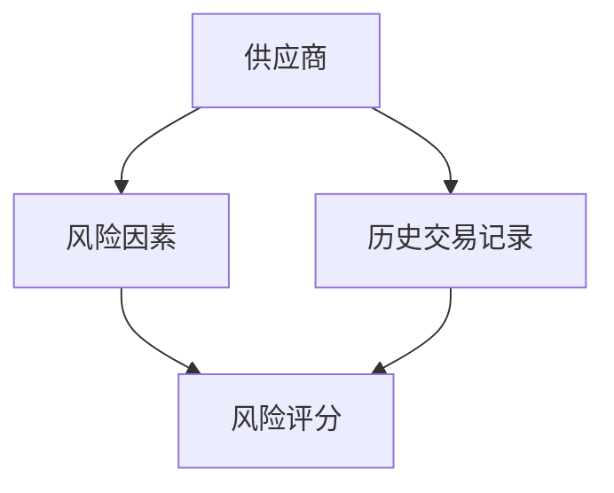
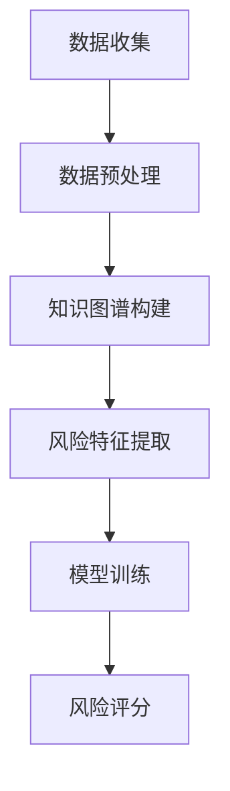
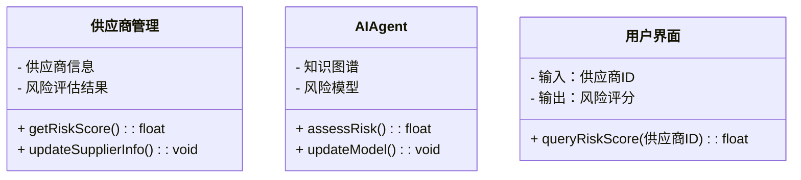
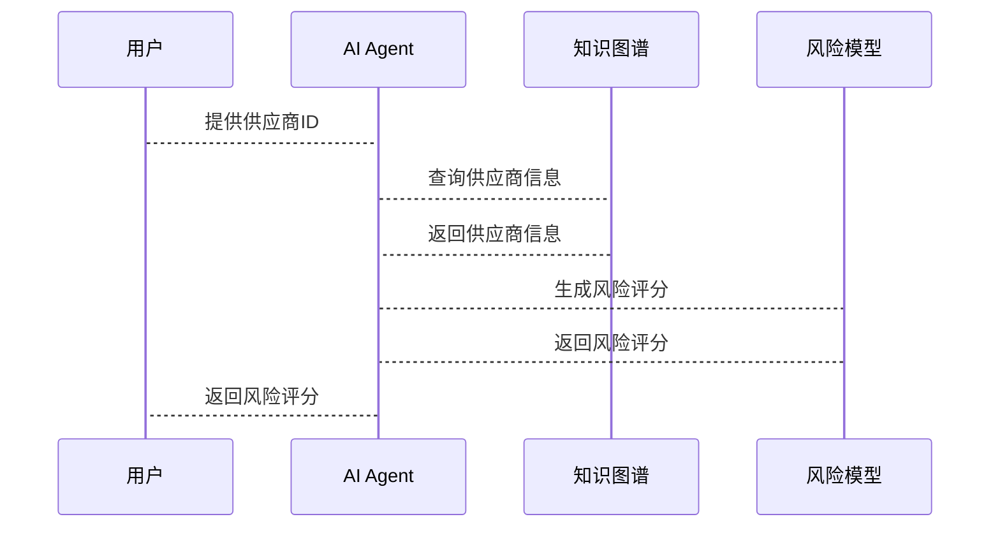

                 


# AI Agent在企业供应商风险评估与动态管理中的应用

**关键词**：AI Agent，供应商风险管理，知识图谱，动态风险评分，企业供应链管理

**摘要**：本文探讨AI Agent在企业供应商风险评估与动态管理中的应用，分析其核心概念、技术原理及系统设计，结合实际案例，展示AI Agent如何优化供应商管理流程，降低风险，提升企业竞争力。

---

# 第一部分：AI Agent与企业供应商管理概述

## 第1章：AI Agent的基本概念

### 1.1 AI Agent的定义与特征

- **AI Agent**：智能体，能够感知环境并自主决策的实体。
- **特征**：
  - 自主性：无需外部干预，自主决策。
  - 反应性：实时感知环境变化，动态调整策略。
  - 持续学习：通过数据反馈不断优化模型。

### 1.2 企业供应商管理的背景与挑战

- **背景**：
  - 供应链管理是企业运营的核心，涉及供应商选择、风险评估、动态管理等环节。
  - 传统供应商管理依赖人工经验，存在效率低、覆盖面窄、实时性差等问题。
- **挑战**：
  - 数据分散：供应商信息分布广泛，难以整合。
  - 风险复杂：供应商风险因素多样，如财务状况、交付能力、合规性等。
  - 动态变化：市场环境波动，供应商风险需实时评估。

### 1.3 AI Agent在供应商管理中的应用前景

- **优势**：
  - 提高评估效率：通过自动化处理，快速分析大量数据。
  - 减少人为误差：AI Agent基于数据驱动的决策，准确性更高。
  - 实时监控：动态跟踪供应商表现，及时调整管理策略。
- **前景**：
  - AI Agent将深度融入供应链管理，推动企业向智能化、数据化方向转型。

---

# 第二部分：AI Agent的核心概念与技术

## 第2章：知识图谱构建

### 2.1 知识图谱的定义与特点

- **知识图谱**：结构化数据的网络，描述实体及其关系。
- **特点**：
  - 结构化：数据以实体和关系的形式组织。
  - 可扩展性：支持大规模数据集成。
  - 可查询性：支持复杂查询。

### 2.2 知识图谱在供应商评估中的应用

- **应用**：
  - 整合供应商信息：将供应商的历史数据、市场表现、财务状况等信息整合到知识图谱中。
  - 深度分析：通过图结构分析供应商之间的关联，识别潜在风险。

## 第3章：自然语言处理（NLP）

### 3.1 NLP的基本原理

- **NLP**：处理自然语言文本的技术，包括文本理解、生成等任务。
- **核心任务**：
  - 分词：将文本分割成词语。
  - 语法分析：分析句子结构。
  - 情感分析：识别文本情感倾向。

### 3.2 NLP在供应商信息分析中的应用

- **应用**：
  - 供应商文档分析：自动解析供应商提供的合同、报告等文本，提取关键信息。
  - 风险预警：通过分析供应商的历史文档，识别潜在风险因素。

## 第4章：强化学习与决策优化

### 4.1 强化学习的定义与特点

- **强化学习**：通过试错机制，学习最优策略。
- **特点**：
  - 奖励驱动：通过奖励机制指导决策。
  - 状态转移：根据当前状态和动作，转移到新的状态。

### 4.2 强化学习在供应商风险管理中的应用

- **应用**：
  - 动态调整风险评分：根据实时数据，动态优化供应商风险评分。
  - 战略决策：基于历史数据和市场变化，制定最优的供应商管理策略。

## 第5章：实体关系图（ER图）设计

### 5.1 实体与关系定义

- **实体**：
  - 供应商：企业供应商信息，包括名称、联系方式、历史交易记录等。
  - 风险因素：影响供应商稳定性的因素，如财务状况、交付能力、合规性等。
- **关系**：
  - 供应商-风险因素：供应商可能面临多种风险因素，形成关联关系。

### 5.2 ER图展示



---

# 第三部分：AI Agent的算法原理与实现

## 第4章：基于知识图谱的供应商风险评估算法

### 4.1 算法概述

- **目标**：基于知识图谱，评估供应商风险，生成风险评分。
- **流程**：
  1. 数据收集：收集供应商相关信息，构建知识图谱。
  2. 风险特征提取：从知识图谱中提取影响风险的特征。
  3. 模型训练：基于特征训练风险评估模型。
  4. 风险评分：对供应商进行风险评分。

### 4.2 算法实现

- **数据预处理**：
  - 清洗数据：去除重复和错误数据。
  - 标准化：将数据标准化，方便模型训练。
- **知识图谱构建**：
  - 使用图数据库（如Neo4j）构建知识图谱。
  - 定义实体和关系，建立图结构。
- **风险评估模型训练**：
  - 使用监督学习算法（如随机森林、支持向量机）训练模型。
  - 输入：供应商特征；输出：风险评分。

### 4.3 数学模型

- **风险评分公式**：
  $$ R = \sum_{i=1}^{n} w_i \cdot f_i $$
  其中，$R$ 是风险评分，$w_i$ 是特征权重，$f_i$ 是特征值。

### 4.4 算法流程图



---

## 第5章：动态风险评分模型

### 5.1 模型概述

- **目标**：实时更新供应商风险评分，反映最新动态。
- **特点**：
  - 实时性：根据最新数据，动态更新评分。
  - 自适应性：模型能够自动调整参数，适应市场变化。

### 5.2 模型实现

- **数据流**：
  - 实时数据输入：如市场波动、供应商表现等。
  - 数据处理：清洗、转换实时数据。
  - 风险评分更新：基于强化学习算法，更新风险评分。

### 5.3 数学模型

- **动态评分公式**：
  $$ R_{new} = R_{old} \cdot \alpha + \beta \cdot f_{new} $$
  其中，$R_{new}$ 是新评分，$R_{old}$ 是旧评分，$\alpha$ 和 $\beta$ 是权重，$f_{new}$ 是新特征。

---

# 第四部分：系统分析与架构设计

## 第6章：系统功能设计

### 6.1 领域模型类图



### 6.2 系统架构设计


### 6.3 接口设计

- **查询接口**：
  - 输入：供应商ID
  - 输出：风险评分
- **更新接口**：
  - 输入：供应商ID，更新信息
  - 输出：更新结果

### 6.4 交互流程



---

## 第7章：项目实战

### 7.1 环境安装

- **工具安装**：
  - Python：编程语言
  - Scikit-learn：机器学习库
  - Neo4j：图数据库
  - Flask：Web框架

### 7.2 核心代码实现

```python
from sklearn.ensemble import RandomForestClassifier
import neo4j
import requests

# 数据预处理
def preprocess(data):
    # 数据清洗和标准化
    pass

# 知识图谱构建
def build_kg(data):
    # 使用Neo4j构建知识图谱
    pass

# 风险评估模型训练
def train_model(train_data):
    model = RandomForestClassifier()
    model.fit(train_data)
    return model

# 动态评分更新
def update_score(supplier_id, new_feature):
    # 调用API，更新评分
    response = requests.post(f"http://localhost:8000/update/{supplier_id}", json=new_feature)
    return response.json()
```

### 7.3 案例分析

- **案例背景**：
  - 某企业与多家供应商合作，希望优化供应商风险管理。
- **实施过程**：
  - 数据收集与预处理
  - 知识图谱构建
  - 模型训练与部署
  - 动态评分监控
- **结果分析**：
  - 提高了供应商评估效率，降低了管理成本。

---

## 第8章：总结与展望

### 8.1 总结

- AI Agent通过自动化、智能化的方式，显著提升了企业供应商风险管理的效率和准确性。
- 知识图谱和强化学习的应用，为供应商评估提供了强大的技术支撑。
- 动态风险评分模型实现了实时监控，适应市场变化。

### 8.2 展望

- **技术优化**：进一步优化算法，提高模型准确性和效率。
- **应用扩展**：探索AI Agent在供应链其他环节的应用，如供应商选择、库存管理等。
- **生态建设**：构建开放的AI Agent生态系统，促进企业间数据共享与协作。

---

## 第9章：注意事项与最佳实践

### 9.1 注意事项

- **数据隐私**：确保供应商数据的安全性和隐私性。
- **模型解释性**：保证模型的可解释性，便于用户理解和调整。
- **实时性优化**：优化系统性能，确保实时响应。

### 9.2 最佳实践

- **数据质量管理**：建立完善的数据采集和处理流程，确保数据准确性。
- **模型持续优化**：定期更新模型，适应市场变化。
- **团队协作**：组建跨学科团队，推动技术与业务的深度融合。

---

## 第10章：拓展阅读

### 10.1 推荐书籍

- 《机器学习实战》：深入讲解机器学习算法及其应用。
- 《知识图谱：概念、方法与应用》：系统介绍知识图谱的构建与应用。

### 10.2 在线资源

- [Neo4j 官方文档](https://neo4j.com/docs/)
- [Scikit-learn 官方文档](https://scikit-learn.org/stable/index.html)

---

# 作者：AI天才研究院/AI Genius Institute & 禅与计算机程序设计艺术 /Zen And The Art of Computer Programming

