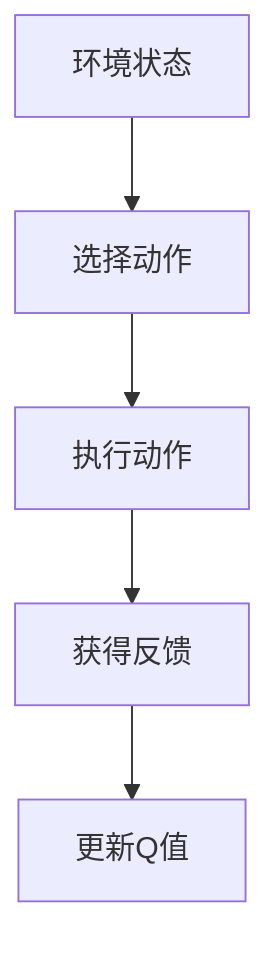
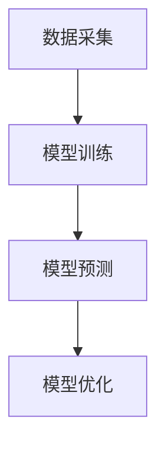
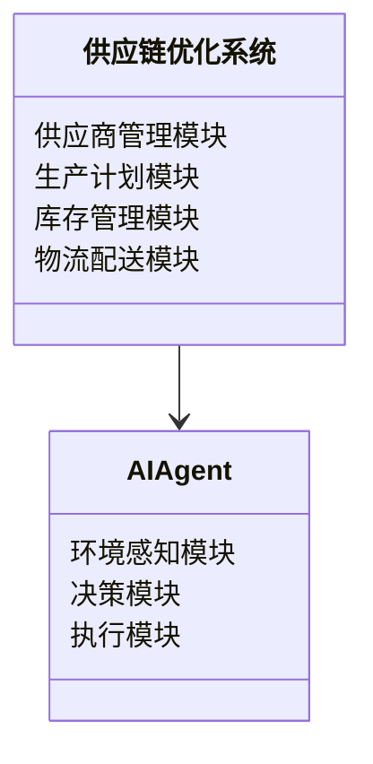
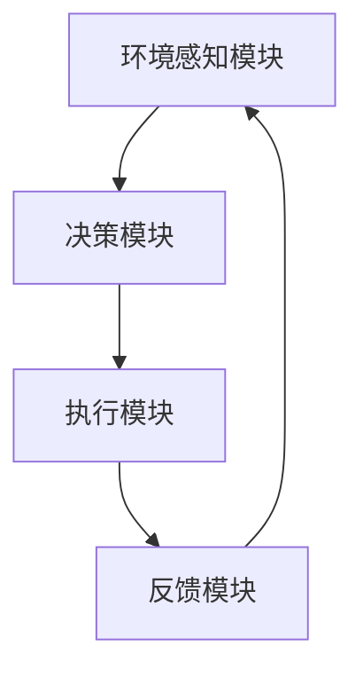

                 


# AI Agent在企业供应链优化中的角色与实践

## 关键词：AI Agent，企业供应链优化，智能决策，算法原理，系统架构，实际案例

## 摘要：  
本文探讨了AI Agent在企业供应链优化中的核心作用及其实际应用。通过分析AI Agent的基本概念、算法原理、系统架构以及项目实战，详细阐述了AI Agent如何通过智能决策、自主学习和实时优化提升企业供应链效率。文章结合实际案例，展示了AI Agent在供应链优化中的显著优势，并对未来的发展趋势进行了展望。

---

# 第1章: AI Agent与供应链优化的背景介绍

## 1.1 AI Agent的基本概念

### 1.1.1 AI Agent的定义与特点
AI Agent（人工智能代理）是指能够感知环境、自主决策并执行任务的智能实体。它具有以下特点：
- **自主性**：无需人工干预，自主完成任务。
- **反应性**：能够实时感知环境变化并做出反应。
- **学习能力**：通过数据和经验不断优化决策能力。
- **协作性**：能够与其他系统或AI Agent协同工作。

### 1.1.2 AI Agent的工作原理
AI Agent通过以下步骤实现智能决策：
1. **感知环境**：通过传感器或数据接口获取环境信息。
2. **分析决策**：基于获取的信息，结合预设算法和知识库进行分析，生成决策方案。
3. **执行操作**：根据决策结果执行操作，并实时反馈结果以优化后续决策。

### 1.1.3 AI Agent在企业中的应用背景
随着企业对效率和灵活性的要求不断提高，传统供应链优化方法逐渐暴露出效率低、响应慢等问题。AI Agent的引入为企业供应链优化提供了新的可能性。

---

## 1.2 供应链优化的基本概念

### 1.2.1 供应链的定义与组成
供应链是指从原材料采购到产品交付给最终用户的整个过程，主要包括：
- 供应商管理
- 生产计划
- 库存管理
- 物流配送
- 客户服务

### 1.2.2 供应链优化的目标与挑战
供应链优化的目标是降低成本、提高效率、增强灵活性和客户满意度。然而，供应链优化面临以下挑战：
- 复杂的业务流程
- 不确定性因素（如市场需求波动）
- 数据孤岛和信息不透明

### 1.2.3 AI Agent与供应链优化的结合
AI Agent通过智能决策和自主学习，能够实时优化供应链中的各个环节，例如：
- **需求预测**：基于历史数据和市场趋势，预测需求波动。
- **库存优化**：动态调整库存水平，避免过剩或短缺。
- **物流调度**：实时优化运输路线，降低物流成本。

---

## 1.3 AI Agent在供应链优化中的演进

### 1.3.1 从传统供应链到智能供应链的演进
传统供应链优化依赖于人工经验和静态模型，而智能供应链优化则借助AI技术实现了动态调整和实时优化。

### 1.3.2 AI Agent在供应链优化中的角色定位
AI Agent作为智能供应链的核心组件，承担着感知环境、分析决策和执行操作的任务。

### 1.3.3 当前AI Agent在供应链优化中的应用现状
当前，AI Agent已在多个领域得到广泛应用，例如：
- **零售业**：实时优化库存和销售预测。
- **制造业**：优化生产计划和供应链协调。
- **物流行业**：动态调整运输路线和配送时间。

---

## 1.4 本章小结
本章介绍了AI Agent的基本概念、工作原理以及在供应链优化中的应用背景。通过对比传统供应链优化方法，突出了AI Agent在提升供应链效率和灵活性方面的优势。

---

# 第2章: AI Agent的核心概念与原理

## 2.1 AI Agent的核心概念

### 2.1.1 AI Agent的定义与分类
AI Agent可以根据功能和应用场景分为以下几类：
- **简单反应式Agent**：基于当前感知做出反应，不依赖历史信息。
- **基于模型的反应式Agent**：利用内部模型和历史信息进行决策。
- **目标驱动式Agent**：为实现特定目标而采取行动。
- **效用驱动式Agent**：通过最大化效用函数实现最优决策。

### 2.1.2 AI Agent的工作原理
AI Agent的工作原理包括以下步骤：
1. **环境感知**：通过传感器或数据接口获取环境信息。
2. **目标设定**：根据当前状态和历史数据设定优化目标。
3. **决策制定**：基于预设算法和知识库生成决策方案。
4. **行动执行**：根据决策结果执行操作并反馈结果。

### 2.1.3 AI Agent与传统供应链优化方法的对比
以下是AI Agent与传统供应链优化方法的对比分析：

| 对比维度         | AI Agent                        | 传统供应链优化方法            |
|------------------|---------------------------------|------------------------------|
| 决策速度         | 实时优化                         | 静态模型优化                  |
| 灵活性           | 高度灵活                         | 较低灵活性                     |
| 数据依赖性       | 高度依赖实时数据                 | 依赖历史数据                   |
| 优化效果         | 更优的实时优化                   | 较难应对动态变化               |

---

## 2.2 AI Agent的原理与算法

### 2.2.1 基于强化学习的AI Agent算法
强化学习是一种通过试错机制优化决策的算法。以下是一个简单的强化学习流程：

1. **状态感知**：获取当前环境状态。
2. **动作选择**：基于当前状态选择一个动作。
3. **环境反馈**：执行动作后获得反馈。
4. **奖励机制**：根据反馈调整策略，最大化累计奖励。

以下是一个简单的Q-learning算法流程图：



数学公式：
$$ Q(s, a) = Q(s, a) + \alpha (r + \max Q(s', a) - Q(s, a)) $$

其中：
- \( s \)：当前状态
- \( a \)：动作
- \( r \)：奖励
- \( \alpha \)：学习率

---

## 2.3 AI Agent与传统供应链优化方法的对比

### 2.3.1 传统供应链优化方法的特点
传统供应链优化方法依赖于数学建模和静态数据分析，适用于相对稳定的环境。然而，面对复杂多变的市场需求和供应链波动，传统方法往往力不从心。

### 2.3.2 AI Agent在供应链优化中的优势
AI Agent通过实时数据感知和自主学习，能够快速响应环境变化，实现动态优化。

---

## 2.4 本章小结
本章详细介绍了AI Agent的核心概念、工作原理以及与传统供应链优化方法的对比。通过强化学习算法和实时数据处理，AI Agent在供应链优化中展现出显著优势。

---

# 第3章: AI Agent在供应链优化中的算法原理

## 3.1 强化学习在AI Agent中的应用

### 3.1.1 强化学习的基本原理
强化学习是一种通过试错机制优化决策的算法。以下是一个简单的强化学习流程：

1. **状态感知**：获取当前环境状态。
2. **动作选择**：基于当前状态选择一个动作。
3. **环境反馈**：执行动作后获得反馈。
4. **奖励机制**：根据反馈调整策略，最大化累计奖励。

以下是一个简单的Q-learning算法流程图：


数学公式：
$$ Q(s, a) = Q(s, a) + \alpha (r + \max Q(s', a) - Q(s, a)) $$

其中：
- \( s \)：当前状态
- \( a \)：动作
- \( r \)：奖励
- \( \alpha \)：学习率

---

## 3.2 基于监督学习的AI Agent算法

### 3.2.1 监督学习的基本原理
监督学习是一种通过 labeled 数据训练模型的算法。以下是一个简单的监督学习流程：

1. **数据采集**：收集带标签的数据。
2. **模型训练**：使用训练数据训练模型。
3. **模型预测**：基于训练好的模型进行预测。
4. **模型优化**：根据预测结果优化模型。

以下是一个简单的线性回归算法流程图：



数学公式：
$$ y = \theta x + b $$

其中：
- \( y \)：预测结果
- \( \theta \)：权重
- \( x \)：输入特征
- \( b \)：偏置

---

## 3.3 基于知识图谱的AI Agent推理

### 3.3.1 知识图谱的基本概念
知识图谱是一种以图结构形式表示知识的工具，包含实体和关系。

### 3.3.2 基于知识图谱的推理机制
通过知识图谱推理，AI Agent能够基于已有的知识库进行逻辑推理，生成新的知识。

---

## 3.4 本章小结
本章详细介绍了强化学习、监督学习和基于知识图谱的AI Agent算法原理，并通过数学公式和流程图展示了这些算法的实现过程。

---

# 第4章: AI Agent在企业供应链优化中的系统架构

## 4.1 问题场景介绍

### 4.1.1 供应链优化的复杂性
供应链优化涉及多个环节，包括供应商选择、生产计划、库存管理和物流配送等。

### 4.1.2 AI Agent在供应链优化中的应用价值
通过AI Agent实现供应链的智能化优化，能够显著提高效率和降低成本。

---

## 4.2 系统功能设计

### 4.2.1 领域模型设计
以下是一个简单的供应链优化领域模型：



### 4.2.2 系统架构设计
以下是一个典型的AI Agent驱动的供应链优化系统架构图：



---

## 4.3 项目实战

### 4.3.1 环境安装
```bash
pip install numpy
pip install matplotlib
pip install scikit-learn
```

### 4.3.2 系统核心实现源代码

```python
import numpy as np
from sklearn.linear_model import LinearRegression

# 数据准备
X = np.array([1, 2, 3, 4, 5]).reshape(-1, 1)
y = np.array([2, 4, 5, 4, 5])

# 模型训练
model = LinearRegression()
model.fit(X, y)

# 模型预测
print(model.predict([[6]]))
```

### 4.3.3 代码应用解读与分析
上述代码实现了一个简单的线性回归模型，用于预测需求量。通过训练数据，模型能够预测未来的销售量。

### 4.3.4 实际案例分析
假设某企业希望优化其库存管理，通过AI Agent实现需求预测。通过训练历史销售数据，AI Agent能够预测未来的销售量，帮助企业优化库存水平。

---

## 4.4 本章小结
本章通过实际案例展示了AI Agent在供应链优化中的应用，并详细讲解了系统架构和实现过程。

---

# 第5章: AI Agent在供应链优化中的未来趋势与挑战

## 5.1 未来发展趋势

### 5.1.1 技术进步带来的新可能
随着AI技术的不断发展，AI Agent在供应链优化中的应用将更加广泛和深入。

### 5.1.2 供应链智能化的未来方向
未来的供应链将更加智能化和自动化，AI Agent将在其中发挥核心作用。

---

## 5.2 挑战与解决方案

### 5.2.1 数据隐私与安全
AI Agent的应用需要处理大量的企业数据，数据隐私和安全是一个重要挑战。

### 5.2.2 算法的可解释性
复杂的AI算法往往缺乏可解释性，这可能影响企业的决策信心。

---

## 5.3 本章小结
本章探讨了AI Agent在供应链优化中的未来发展趋势和面临的挑战，并提出了相应的解决方案。

---

# 第6章: 总结与展望

## 6.1 总结
本文详细探讨了AI Agent在企业供应链优化中的核心作用及其实际应用。通过分析AI Agent的基本概念、算法原理、系统架构以及项目实战，展示了AI Agent在提升供应链效率和灵活性方面的巨大潜力。

## 6.2 展望
随着AI技术的不断发展，AI Agent在供应链优化中的应用前景将更加广阔。未来的研究方向包括提高算法的可解释性、加强数据隐私保护以及探索新的应用场景。

---

# 作者：AI天才研究院/AI Genius Institute & 禅与计算机程序设计艺术 /Zen And The Art of Computer Programming

---

以上是《AI Agent在企业供应链优化中的角色与实践》的技术博客文章的完整内容。

