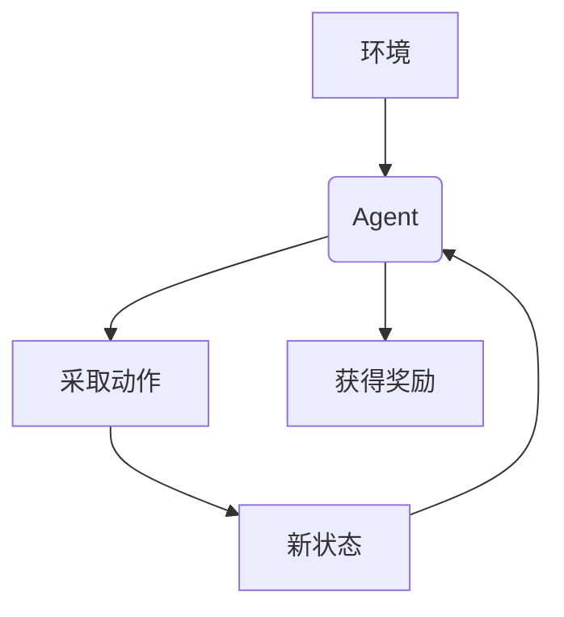

                 


# AI Agent在企业供应链韧性提升中的角色

> 关键词：AI Agent，供应链韧性，企业供应链，人工智能，供应链优化

> 摘要：本文探讨了AI Agent在企业供应链韧性提升中的关键作用，分析了AI Agent的核心原理、算法机制、系统设计以及实际应用案例。文章详细讲解了AI Agent如何通过感知、决策和执行机制优化供应链的适应性和恢复能力，并通过案例分析展示了其在供应链风险管理中的成功实践。

---

## 第一部分: AI Agent与供应链韧性背景

### 第1章: AI Agent与供应链韧性背景

#### 1.1 AI Agent的基本概念

##### 1.1.1 AI Agent的定义
人工智能代理（AI Agent）是指能够感知环境、做出决策并采取行动以实现特定目标的智能实体。AI Agent可以是软件程序，也可以是物理机器人，它们通过传感器和数据处理系统与环境交互，以优化任务执行效率。

##### 1.1.2 AI Agent的核心特征
AI Agent的核心特征包括自主性、反应性、目标导向和社会能力。自主性使其能够独立决策；反应性使其能够实时感知环境变化；目标导向使其专注于实现特定目标；社会能力使其能够与其他系统或人类协作。

##### 1.1.3 AI Agent在供应链中的应用潜力
在供应链管理中，AI Agent可以用于库存监控、需求预测、物流优化和风险预警。例如，AI Agent可以通过实时数据分析，预测供应链中的潜在风险，并提出优化建议，从而提升供应链的整体效率和韧性。

#### 1.2 供应链韧性的概念

##### 1.2.1 供应链韧性的定义
供应链韧性是指供应链在面对不确定性（如疫情、自然灾害或供应商问题）时，能够快速适应、恢复并保持稳定运营的能力。一个有韧性的供应链能够在危机中维持业务连续性，减少中断带来的损失。

##### 1.2.2 供应链韧性的重要性
在全球化背景下，供应链中断的风险日益增加。提升供应链韧性可以减少企业因中断而遭受的经济损失，确保供应链的稳定性和可持续性。

##### 1.2.3 供应链韧性的影响因素
影响供应链韧性的主要因素包括供应链的复杂性、供应商的多样性、库存策略、信息共享能力以及应急响应机制。通过优化这些因素，企业可以显著提升供应链的韧性。

#### 1.3 AI Agent在供应链韧性中的角色

##### 1.3.1 AI Agent如何提升供应链韧性
AI Agent通过实时数据分析和预测，帮助企业识别潜在风险，并制定应对策略。例如，在疫情初期，AI Agent可以通过分析历史销售数据和市场趋势，预测需求变化，并优化库存水平，从而减少供应链中断的风险。

##### 1.3.2 AI Agent与供应链优化的关系
AI Agent通过自动化决策和优化算法，显著提高了供应链的效率和响应速度。例如，AI Agent可以优化物流路径，减少运输成本和时间，从而提升供应链的整体性能。

##### 1.3.3 供应链韧性提升的挑战与机遇
尽管AI Agent在提升供应链韧性方面具有巨大潜力，但其应用也面临一些挑战，如数据隐私问题、模型可解释性以及算法的实时性要求。企业需要在技术创新和实际应用之间找到平衡点，以充分发挥AI Agent的潜力。

---

## 第2章: AI Agent的核心概念与供应链韧性

### 2.1 AI Agent的核心原理

#### 2.1.1 感知机制
AI Agent的感知机制通过传感器或数据源获取环境信息。例如，供应链中的传感器可以实时监控库存水平和物流状态，并将数据传输给AI Agent进行处理。

#### 2.1.2 决策机制
基于感知到的信息，AI Agent利用算法和模型做出决策。例如，强化学习算法可以帮助AI Agent在复杂环境中找到最优解决方案，从而优化供应链的运作。

#### 2.1.3 执行机制
AI Agent根据决策结果采取行动。例如，AI Agent可以向供应商发出订单请求，或调整生产计划以应对需求变化。

### 2.2 AI Agent与供应链韧性之间的关系

#### 2.2.1 AI Agent如何增强供应链的适应性
AI Agent通过实时数据分析和预测，帮助供应链快速适应市场变化。例如，在市场需求突然增加时，AI Agent可以迅速调整生产计划，确保供应链能够及时满足需求。

#### 2.2.2 AI Agent如何优化供应链的响应速度
通过自动化决策，AI Agent可以显著缩短供应链的响应时间。例如，在检测到供应商延迟交付时，AI Agent可以立即寻找替代供应商，从而避免供应链中断。

#### 2.2.3 AI Agent如何提高供应链的恢复能力
在供应链中断发生后，AI Agent可以通过优化资源配置和协调各环节，快速恢复供应链的正常运作。例如，在自然灾害导致某工厂关闭时，AI Agent可以帮助企业重新分配订单，确保生产活动的持续性。

---

## 第3章: AI Agent在供应链韧性中的应用案例

### 3.1 供应链风险预测与管理

#### 3.1.1 利用AI Agent预测供应链风险
AI Agent可以通过分析历史数据和市场趋势，预测供应链中的潜在风险。例如，通过分析供应商的历史交货记录，AI Agent可以识别出高风险供应商，并提前制定替代方案。

#### 3.1.2 AI Agent在供应链风险管理中的应用
在风险管理方面，AI Agent可以帮助企业制定应急计划，并在风险发生时快速响应。例如，当检测到某个供应商可能出现延迟交付时，AI Agent可以立即启动应急计划，寻找替代供应商。

#### 3.1.3 案例分析：某企业供应链风险管理的实践
某电子产品制造企业利用AI Agent进行供应链风险管理。通过分析供应商的历史数据和市场趋势，AI Agent成功预测出一个供应商的潜在延迟交付问题，并建议企业提前寻找替代供应商。在实际操作中，该企业避免了因供应商延迟交付而导致的生产中断，节省了大量成本。

---

## 第4章: AI Agent的算法原理与供应链优化

### 4.1 AI Agent的算法原理

#### 4.1.1 强化学习算法
强化学习是一种常用的AI Agent算法，通过试错和奖励机制优化决策。例如，AI Agent可以通过强化学习算法优化物流路径，减少运输成本和时间。

#### 4.1.2 分析AI Agent的数学模型
强化学习的数学模型通常包括状态、动作、奖励和策略。例如，状态可以是当前的库存水平，动作可以是下单或调整生产计划，奖励可以是成本降低的幅度，策略是AI Agent选择动作的规则。

#### 4.1.3 强化学习算法的流程图
以下是一个强化学习算法的流程图：



### 4.2 AI Agent在供应链优化中的应用

#### 4.2.1 供应链库存优化
通过强化学习算法，AI Agent可以优化库存水平，减少库存成本和缺货风险。例如，AI Agent可以根据历史销售数据和市场需求预测，制定最优的库存策略。

#### 4.2.2 供应链物流优化
AI Agent可以通过优化物流路径和运输方式，降低物流成本和时间。例如，AI Agent可以分析实时交通状况，选择最优的运输路线，确保货物按时送达。

---

## 第5章: 供应链系统的AI Agent架构设计

### 5.1 供应链系统的总体架构

#### 5.1.1 系统功能设计
供应链系统需要具备库存监控、需求预测、物流管理和风险管理等功能。AI Agent可以在这些功能模块中发挥重要作用，例如实时监控库存水平并预测需求变化。

#### 5.1.2 系统架构设计
供应链系统的架构可以采用分层结构，包括数据层、业务逻辑层和应用层。AI Agent可以部署在业务逻辑层，通过调用数据层的实时数据，优化业务流程。

#### 5.1.3 系统接口设计
系统接口设计需要考虑与现有供应链系统的兼容性。例如，AI Agent可以通过API接口与企业的ERP系统集成，实现实时数据共享和业务流程优化。

---

## 第6章: 项目实战与案例分析

### 6.1 项目环境安装

#### 6.1.1 安装Python和相关库
要实现AI Agent，首先需要安装Python和相关的机器学习库，例如TensorFlow和Scikit-learn。安装命令如下：

```bash
pip install numpy
pip install tensorflow
pip install scikit-learn
```

#### 6.1.2 安装Jupyter Notebook
Jupyter Notebook是一个常用的开发工具，可以通过以下命令安装：

```bash
pip install jupyter
jupyter notebook
```

### 6.2 项目核心代码实现

#### 6.2.1 加载数据
假设我们有一个包含供应链数据的CSV文件，例如库存、销售和供应商信息。代码如下：

```python
import pandas as pd

# 加载数据
data = pd.read_csv('supply_chain.csv')
print(data.head())
```

#### 6.2.2 数据预处理
数据预处理包括数据清洗和特征工程。例如，处理缺失值和标准化数据：

```python
# 处理缺失值
data = data.dropna()

# 标准化数据
from sklearn.preprocessing import StandardScaler
scaler = StandardScaler()
scaled_data = scaler.fit_transform(data)
```

#### 6.2.3 训练AI Agent模型
使用强化学习算法训练AI Agent模型，例如Q-learning：

```python
import numpy as np

# 初始化Q表
Q = np.zeros((env.n_states, env.n_actions))

# 设置超参数
alpha = 0.1
gamma = 0.9
epsilon = 0.1

# Q-learning算法
for episode in range(n_episodes):
    state = env.reset()
    while True:
        # 选择动作
        if np.random.random() < epsilon:
            action = env.random_action()
        else:
            action = np.argmax(Q[state])
        
        # 执行动作
        next_state, reward, done = env.step(action)
        
        # 更新Q表
        Q[state][action] += alpha * (reward + gamma * np.max(Q[next_state]) - Q[state][action])
        
        state = next_state
        if done:
            break
```

### 6.3 案例分析与总结

#### 6.3.1 案例分析
通过上述代码实现的AI Agent模型，可以在实际供应链管理中应用，例如优化库存管理和物流路径。案例分析可以展示AI Agent在实际中的应用效果和改进空间。

#### 6.3.2 项目总结
总结项目的关键点，包括AI Agent的优势、应用中的挑战以及未来的改进方向。例如，AI Agent可以通过数据驱动的方式显著提升供应链的效率和韧性，但在实际应用中需要考虑数据质量和模型的可解释性。

---

## 第7章: 总结与展望

### 7.1 总结
本文详细探讨了AI Agent在企业供应链韧性提升中的角色，分析了其核心原理、算法机制和系统设计。通过实际案例分析，展示了AI Agent在供应链风险管理、库存优化和物流优化中的应用潜力。

### 7.2 展望
未来，随着人工智能技术的不断发展，AI Agent在供应链管理中的应用将更加广泛和深入。例如，结合区块链技术可以提高供应链的透明度和安全性；结合物联网技术可以实现更实时的监控和优化。

---

## 作者信息

作者：AI天才研究院/AI Genius Institute & 禅与计算机程序设计艺术 /Zen And The Art of Computer Programming

---

以上是《AI Agent在企业供应链韧性提升中的角色》的技术博客文章的完整结构和内容。

