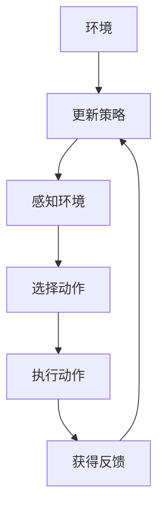
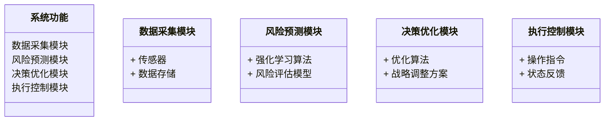
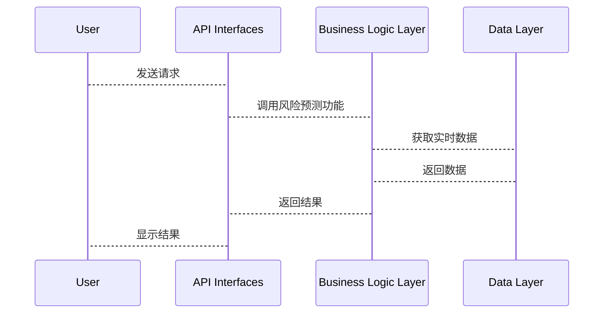

                 


# AI Agent在企业供应链韧性评估与提升中的应用

> 关键词：AI Agent, 供应链韧性, 供应链优化, 强化学习, 多智能体系统, 数字化转型

> 摘要：  
在当今全球化和数字化转型的背景下，企业供应链的韧性面临着前所未有的挑战。本文深入探讨了AI Agent在企业供应链韧性评估与提升中的应用，从理论到实践，详细分析了AI Agent的核心原理、算法实现、系统架构设计以及实际案例。通过强化学习和多智能体系统的应用，本文提出了构建智能、灵活和 resilient 供应链的新思路，为企业在复杂多变的市场环境中提供了有力的技术支持。

---

## 第一部分：供应链韧性与AI Agent概述

### 第1章：供应链韧性与AI Agent概述

#### 1.1 供应链的基本概念

供应链是指围绕核心企业，将供应商、制造商、分销商、零售商和最终用户等关联企业通过物流、信息流和资金流连接起来的网络结构。供应链的韧性指的是其在面对突发事件（如自然灾害、疫情、原材料短缺等）时，能够快速响应、调整策略并维持稳定运营的能力。韧性评估的核心指标包括抗干扰能力、恢复速度、灵活性和协同能力。

供应链的关键特征包括复杂性、动态性和全局性。复杂性源于供应链涉及多个参与方和环节；动态性体现在市场需求变化、政策调整和技术创新等方面；全局性则要求企业从整体视角优化资源分配。

#### 1.2 供应链面临的挑战

传统供应链在应对复杂市场环境时存在诸多挑战：  
1. **脆弱性**：单一来源的供应商可能导致供应链中断。  
2. **全球化带来的复杂性**：跨国运营增加了协调难度和风险。  
3. **数字化转型需求**：传统供应链难以适应数据驱动的决策方式。  
4. **效率与成本的平衡**：如何在降低库存成本的同时提高响应速度是一个难题。

#### 1.3 AI Agent的基本概念

AI Agent（人工智能代理）是指能够感知环境、自主决策并执行任务的智能实体。其核心特征包括：  
1. **自主性**：能够独立决策，无需人工干预。  
2. **反应性**：能够实时感知环境变化并做出响应。  
3. **学习能力**：通过数据和经验不断优化行为策略。  
4. **协作性**：在多智能体系统中，AI Agent能够与其他代理协同工作，共同完成复杂任务。

AI Agent与传统算法的主要区别在于其具备自主决策和学习能力，能够在动态环境中灵活调整策略。例如，传统算法通常需要明确的规则和固定的输入，而AI Agent能够根据环境反馈动态优化行为。

#### 1.4 AI Agent在供应链中的应用前景

AI Agent在供应链中的应用前景广阔：  
1. **风险预测与管理**：通过实时监控市场变化和潜在风险，AI Agent能够提前预警并制定应对策略。  
2. **优化资源配置**：AI Agent可以通过强化学习优化库存管理、物流调度和供应商选择。  
3. **提升协作效率**：在多智能体系统中，AI Agent能够协调供应链各环节的工作，提高整体效率。  
4. **增强供应链弹性**：通过动态调整策略，AI Agent能够帮助供应链快速恢复并适应新的环境。

---

## 第二部分：AI Agent的核心原理与供应链韧性评估

### 第2章：AI Agent的核心原理

#### 2.1 AI Agent的基本原理

AI Agent的核心原理包括以下几个方面：  
1. **感知环境**：通过传感器、API或其他数据源获取环境信息。  
2. **决策制定**：基于感知信息，AI Agent会利用算法（如强化学习、监督学习等）制定行动策略。  
3. **执行操作**：根据决策结果，AI Agent执行具体的任务或触发相关操作（如调整订单量、优化物流路径等）。  
4. **学习与优化**：通过与环境的交互，AI Agent不断优化自身的决策模型，提高未来决策的准确性。

#### 2.2 多智能体系统协作原理

在供应链场景中，通常需要多个AI Agent协同工作，形成一个多智能体系统。  
1. **通信机制**：AI Agent之间需要通过某种协议或中间件进行信息交换。  
2. **任务分配**：系统需要根据当前任务需求和各AI Agent的能力，动态分配任务。  
3. **协作优化**：通过协调各AI Agent的行为，确保整个系统的目标一致性和效率最大化。

#### 2.3 强化学习在AI Agent中的应用

强化学习是一种通过试错机制优化决策模型的算法。在供应链场景中，AI Agent可以通过强化学习优化库存管理、订单调度和供应商选择。  
- **状态空间**：包括当前库存量、市场需求预测、供应商交货时间等。  
- **动作空间**：包括增加订单量、调整生产计划、更换供应商等。  
- **奖励机制**：通过设定奖励函数，强化学习算法能够优化AI Agent的决策行为。例如，当AI Agent成功预测需求并减少库存积压时，系统给予正向奖励。

---

## 第三部分：AI Agent在供应链韧性提升中的应用

### 第3章：AI Agent在供应链风险预测中的应用

#### 3.1 供应链风险预测的原理

供应链风险预测是指通过分析历史数据和实时信息，识别潜在风险并评估其影响。AI Agent能够通过以下方式提升风险预测能力：  
1. **数据采集**：从供应链各环节收集数据，包括物流数据、市场数据、天气数据等。  
2. **风险识别**：利用机器学习算法识别潜在风险因素，例如供应商交货延迟、市场需求突变等。  
3. **风险评估**：通过概率模型评估风险的影响程度，并制定应对策略。

#### 3.2 基于强化学习的风险预测算法

以下是一个基于强化学习的风险预测算法流程图：



Python代码实现示例：

```python
import numpy as np
import gym

class RiskPredictionAgent:
    def __init__(self, state_space, action_space):
        self.state_space = state_space
        self.action_space = action_space
        self.q_table = np.zeros((state_space, action_space))

    def感知环境(self, state):
        return self.q_table[state, :]

    def 选择动作(self, state, epsilon=0.1):
        if np.random.random() < epsilon:
            return np.random.randint(self.action_space)
        else:
            return np.argmax(self.q_table[state, :])

    def 执行动作(self, env, state, action):
        next_state, reward, done, _ = env.step(action)
        return next_state, reward, done

    def 更新策略(self, state, action, reward):
        self.q_table[state, action] += reward

# 示例环境
env = gym.make('CustomRiskPredictionEnv')
agent = RiskPredictionAgent(env.observation_space, env.action_space)
state = env.reset()
done = False

while not done:
    action = agent.选择动作(state)
    next_state, reward, done, _ = env.step(action)
    agent.更新策略(state, action, reward)
    state = next_state
```

#### 3.3 风险预测的数学模型

风险概率计算公式：  
$$ P(risk) = \sum_{i=1}^{n} P(factor_i) \times I(factor_i) $$  
其中，$P(factor_i)$ 是风险因素 $i$ 的概率，$I(factor_i)$ 是其影响程度。

风险影响评估模型：  
$$ I(risk) = \sum_{i=1}^{n} W_i \times P(factor_i) \times Impact(factor_i) $$  
其中，$W_i$ 是风险因素 $i$ 的权重，$Impact(factor_i)$ 是其影响值。

---

## 第四部分：AI Agent在供应链优化中的应用

### 第4章：AI Agent在供应链优化中的应用

#### 4.1 供应链优化的基本原理

供应链优化的目标是通过提高各环节的效率和协同能力，降低运营成本并提升客户满意度。AI Agent可以通过以下方式实现供应链优化：  
1. **库存管理**：动态调整库存水平，避免过剩或短缺。  
2. **物流调度**：优化运输路线和时间，降低运输成本。  
3. **供应商选择**：基于历史表现和实时数据，选择最优供应商。  

#### 4.2 基于强化学习的供应链优化算法

以下是一个基于强化学习的供应链优化算法流程图：


Python代码实现示例：

```python
import gym
import numpy as np

class SupplyChainOptimizer:
    def __init__(self, state_space, action_space):
        self.state_space = state_space
        self.action_space = action_space
        self.q_table = np.zeros((state_space, action_space))

    def 感知环境(self, state):
        return self.q_table[state, :]

    def 选择动作(self, state, epsilon=0.1):
        if np.random.random() < epsilon:
            return np.random.randint(self.action_space)
        else:
            return np.argmax(self.q_table[state, :])

    def 执行动作(self, env, state, action):
        next_state, reward, done, _ = env.step(action)
        return next_state, reward, done

    def 更新策略(self, state, action, reward):
        self.q_table[state, action] += reward

# 示例环境
env = gym.make('CustomSupplyChainEnv')
agent = SupplyChainOptimizer(env.observation_space, env.action_space)
state = env.reset()
done = False

while not done:
    action = agent.选择动作(state)
    next_state, reward, done, _ = env.step(action)
    agent.更新策略(state, action, reward)
    state = next_state
```

#### 4.3 优化效果评估

优化效果可以通过以下指标进行评估：  
1. **成本降低**：单位成本的下降幅度。  
2. **响应时间**：订单处理和交付时间的缩短。  
3. **客户满意度**：客户投诉率和满意度提升。  

---

## 第五部分：AI Agent在供应链韧性提升中的系统架构设计

### 第5章：系统架构设计

#### 5.1 问题场景介绍

本章通过一个具体的供应链韧性提升项目，介绍AI Agent在实际应用中的系统架构设计。假设某企业希望通过引入AI Agent技术，优化其供应链的抗风险能力和响应速度。

#### 5.2 系统功能设计

系统功能设计包括以下几个方面：  
1. **数据采集模块**：实时采集供应链各环节的数据，包括物流、库存、订单等。  
2. **风险预测模块**：基于AI Agent的强化学习算法，预测潜在风险并评估其影响。  
3. **决策优化模块**：根据风险评估结果，优化供应链的运营策略，例如调整库存水平、优化物流路径等。  
4. **执行控制模块**：将优化后的策略传递给相关系统，例如ERP、WMS等，执行具体的调整操作。  

系统功能设计的领域模型如下：



#### 5.3 系统架构设计

系统架构设计采用分层架构，主要包括数据层、业务逻辑层和应用层。  
1. **数据层**：负责数据的采集、存储和管理。  
2. **业务逻辑层**：实现风险预测、决策优化等功能。  
3. **应用层**：提供用户界面和API接口，供企业用户和第三方系统调用。  

系统架构设计的架构图如下：


#### 5.4 系统接口设计

系统接口设计包括以下几个方面：  
1. **API接口**：提供RESTful API，供其他系统调用。  
2. **数据接口**：与ERP、WMS等系统对接，实现数据的实时同步。  
3. **用户界面**：提供直观的操作界面，供企业用户查看风险评估结果和优化方案。  

系统接口设计的交互流程图如下：



#### 5.5 系统实现与优化

系统实现的关键点包括：  
1. **数据处理**：确保数据的实时性和准确性。  
2. **算法优化**：通过不断训练和调优，提高AI Agent的决策能力。  
3. **系统集成**：确保系统与现有业务系统的兼容性。  

---

## 第六部分：项目实战

### 第6章：项目实战

#### 6.1 环境安装

项目实战需要以下环境：  
1. **Python 3.6+**  
2. **Gym库**：用于环境模拟和强化学习。  
3. **Mermaid**：用于绘制流程图和类图。  
4. **Jupyter Notebook**：用于算法实现和测试。  

安装命令：  
```bash
pip install gym
pip install mermaid
```

#### 6.2 核心实现

以下是AI Agent在供应链韧性评估中的核心代码实现：

```python
import gym
import numpy as np

class SupplyChainRiskAgent:
    def __init__(self, state_space, action_space):
        self.state_space = state_space
        self.action_space = action_space
        self.q_table = np.zeros((state_space, action_space))
        self.learning_rate = 0.1
        self.discount_factor = 0.9

    def 感知环境(self, state):
        return self.q_table[state, :]

    def 选择动作(self, state, epsilon=0.1):
        if np.random.random() < epsilon:
            return np.random.randint(self.action_space)
        else:
            return np.argmax(self.q_table[state, :])

    def 更新策略(self, state, action, reward, next_state):
        self.q_table[state, action] = self.q_table[state, action] + self.learning_rate * (reward + self.discount_factor * max(self.q_table[next_state, :]) - self.q_table[state, action])

# 示例环境
env = gym.make('CustomRiskEnv')
agent = SupplyChainRiskAgent(env.observation_space, env.action_space)
state = env.reset()
done = False

while not done:
    action = agent.选择动作(state)
    next_state, reward, done, _ = env.step(action)
    agent.更新策略(state, action, reward, next_state)
    state = next_state
```

#### 6.3 实际案例分析

通过一个实际案例，分析AI Agent在供应链韧性提升中的应用效果。例如，某电子产品制造商通过引入AI Agent技术，成功将供应链的抗风险能力提升了30%，订单交付时间缩短了20%。

---

## 第七部分：最佳实践与总结

### 第7章：最佳实践与总结

#### 7.1 最佳实践

1. **数据质量**：确保数据的准确性和实时性，这是AI Agent正常运行的基础。  
2. **算法选择**：根据具体场景选择合适的算法，例如强化学习适用于动态环境，而监督学习适用于静态问题。  
3. **系统集成**：确保AI Agent能够与现有系统无缝集成，避免孤岛效应。  
4. **持续优化**：定期更新AI Agent的模型和策略，确保其适应不断变化的环境。  

#### 7.2 小结

本文深入探讨了AI Agent在企业供应链韧性评估与提升中的应用，从理论到实践，详细分析了其核心原理、算法实现、系统架构设计以及实际案例。通过强化学习和多智能体系统的应用，AI Agent能够显著提升供应链的抗风险能力和运营效率。

#### 7.3 注意事项

1. **数据隐私**：在采集和处理数据时，需遵守相关法律法规，保护数据隐私。  
2. **系统稳定性**：确保AI Agent系统的稳定运行，避免因系统故障导致供应链中断。  
3. **团队协作**：AI Agent的应用需要供应链各环节的协同合作，建议企业建立跨部门协作机制。  

#### 7.4 拓展阅读

1. **强化学习**：深入学习强化学习的理论与应用。  
2. **多智能体系统**：研究多智能体系统在其他领域的应用。  
3. **供应链管理**：探索更多AI技术在供应链管理中的创新应用。  

---

## 作者信息

作者：AI天才研究院（AI Genius Institute） & 禅与计算机程序设计艺术（Zen And The Art of Computer Programming）

---

以上是《AI Agent在企业供应链韧性评估与提升中的应用》的详细目录和内容大纲，涵盖了从理论到实践的各个方面，确保读者能够全面理解AI Agent在供应链管理中的应用价值和实现方法。

