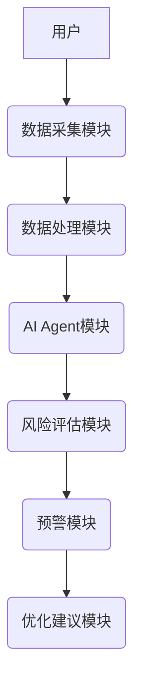

                 


# AI Agent在企业供应链韧性评估与预警中的应用

> **关键词**：AI Agent, 企业供应链, 供应链韧性, 预警系统, 风险管理

> **摘要**：  
本文系统地探讨了AI Agent在企业供应链韧性评估与预警中的应用。通过分析供应链韧性的关键要素、AI Agent的核心原理及其在供应链管理中的应用场景，本文深入阐述了AI Agent如何通过智能预测、风险评估和优化决策等技术手段，提升企业供应链的弹性和抗风险能力。结合实际案例和系统架构设计，本文为读者提供了从理论到实践的全面指导，助力企业在复杂多变的市场环境中实现供应链的智能化管理。

---

## 第一章：引言

### 1.1 供应链的基本概念  
供应链是企业与供应商、制造商、分销商和客户之间形成的产品流动和信息传递的网络。它涵盖了从原材料采购、生产制造到产品交付的整个过程。供应链的韧性是指其在面对突发事件（如自然灾害、疫情、供应链中断等）时，能够快速恢复并维持正常运作的能力。

### 1.2 AI Agent的引入  
AI Agent（人工智能代理）是指能够感知环境、自主决策并执行任务的智能实体。它可以分为简单反射型、基于模型的反射型、目标驱动型和效用驱动型四种类型。AI Agent的核心能力包括感知、推理、规划和执行。

### 1.3 供应链韧性评估的重要性  
供应链的韧性直接关系到企业的生存能力。通过评估供应链韧性，企业可以识别潜在风险，优化资源分配，并制定应对策略。AI Agent的应用使得供应链韧性评估更加智能化和高效。

---

## 第二章：AI Agent的核心原理

### 2.1 AI Agent的定义与分类  
AI Agent是一种能够自主决策并执行任务的智能系统。它可以根据环境信息做出反应，优化决策过程，并与人类或其他系统进行交互。

### 2.2 供应链韧性的评估框架  
供应链韧性评估框架包括以下几个方面：
1. **供应链的复杂性**：供应链的长度和复杂程度。
2. **供应商的多样性**：供应商的数量和地理分布。
3. **库存水平**：库存的充足性和分布情况。
4. **信息流的效率**：信息传递的速度和准确性。
5. **应急响应能力**：企业在突发事件中的应对能力。

---

## 第三章：AI Agent在供应链风险管理中的应用

### 3.1 供应链风险的来源  
供应链风险主要来源于以下几个方面：
- **供应商风险**：供应商的生产能力、交付能力和财务状况。
- **物流风险**：物流中断、运输延迟或损坏。
- **市场需求波动**：需求预测的准确性。
- **自然灾害**：如地震、洪水等。

### 3.2 AI Agent在风险评估中的应用  
AI Agent可以通过以下方式提升供应链风险评估能力：
1. **实时监控**：通过传感器和物联网设备实时监控供应链各环节的状态。
2. **异常检测**：利用机器学习算法检测供应链中的异常情况。
3. **风险预测**：基于历史数据和当前状态预测潜在风险。

---

## 第四章：AI Agent在供应链预测与优化中的应用

### 4.1 供应链预测的需求与挑战  
供应链预测是供应链管理中的核心任务之一。然而，预测的准确性受到数据质量、模型复杂性和外部因素的影响。

### 4.2 AI Agent在预测中的应用  
AI Agent可以通过以下方式提升供应链预测能力：
1. **需求预测**：基于历史销售数据和市场趋势，预测未来的需求。
2. **库存优化**：根据需求预测和供应商情况优化库存水平。
3. **路径优化**：通过强化学习优化物流路径，降低运输成本。

---

## 第五章：AI Agent的核心算法与数学模型

### 5.1 强化学习算法  
强化学习是一种通过试错机制优化决策的算法。其核心是通过动作和奖励的反馈机制，逐步优化策略。

#### Q-Learning算法  
Q-Learning是一种经典的强化学习算法，其目标是找到最优策略。公式如下：  
$$ Q(s, a) = Q(s, a) + \alpha [r + \max Q(s', a') - Q(s, a)] $$  
其中，$Q(s, a)$表示状态$s$下动作$a$的Q值，$\alpha$是学习率，$r$是奖励，$s'$是下一状态。

### 5.2 图神经网络  
图神经网络是一种处理图结构数据的深度学习模型。它在供应链网络中具有广泛的应用，可以用于节点分类、边预测等任务。

---

## 第六章：系统架构设计

### 6.1 系统功能设计  
供应链韧性评估系统的功能模块包括：
1. **数据采集**：从传感器、数据库等来源获取数据。
2. **风险评估**：基于AI Agent评估供应链风险。
3. **预警系统**：根据风险等级触发预警。
4. **优化建议**：提供优化决策建议。

### 6.2 系统架构图  
以下是系统架构的Mermaid图：



### 6.3 接口设计  
系统主要接口包括：
1. **数据接口**：与传感器和数据库的接口。
2. **用户接口**：供用户查询和管理界面。
3. **预警接口**：与企业预警系统的对接。

---

## 第七章：项目实战

### 7.1 项目背景与目标  
某汽车制造企业希望通过AI Agent提升供应链韧性，减少因供应商延迟或物流中断导致的生产停滞。

### 7.2 环境安装  
需要安装Python、TensorFlow和Keras库。

### 7.3 核心代码实现  
以下是AI Agent的风险评估代码示例：

```python
import tensorflow as tf
from tensorflow.keras import layers

# 构建模型
model = tf.keras.Sequential([
    layers.Dense(64, activation='relu', input_shape=(input_dim,)),
    layers.Dense(32, activation='relu'),
    layers.Dense(1, activation='sigmoid')
])

# 编译模型
model.compile(optimizer='adam', loss='binary_crossentropy', metrics=['accuracy'])

# 训练模型
model.fit(x_train, y_train, epochs=10, batch_size=32)
```

### 7.4 案例分析  
通过AI Agent的实时监控和预测，企业成功降低了供应链中断的风险，提升了整体供应链的韧性。

---

## 第八章：总结与展望

### 8.1 本章总结  
本文详细探讨了AI Agent在企业供应链韧性评估与预警中的应用，从理论到实践进行了全面分析。

### 8.2 未来展望  
未来，随着AI技术的进步，AI Agent在供应链管理中的应用将更加广泛，如与区块链和物联网的结合将进一步提升供应链的智能化水平。

---

**作者：AI天才研究院/AI Genius Institute & 禅与计算机程序设计艺术 /Zen And The Art of Computer Programming**

