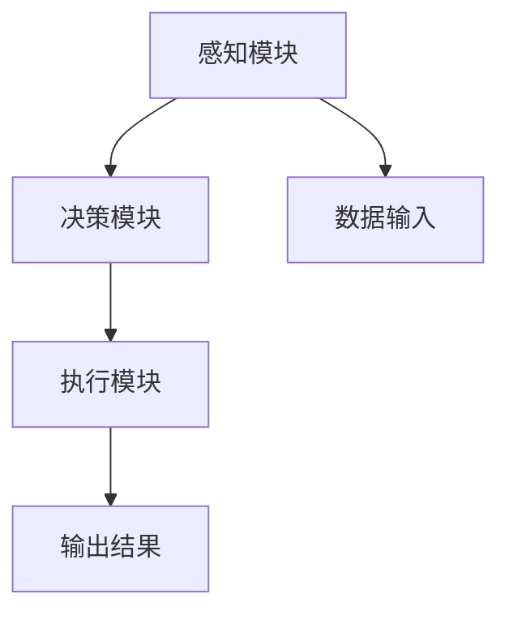
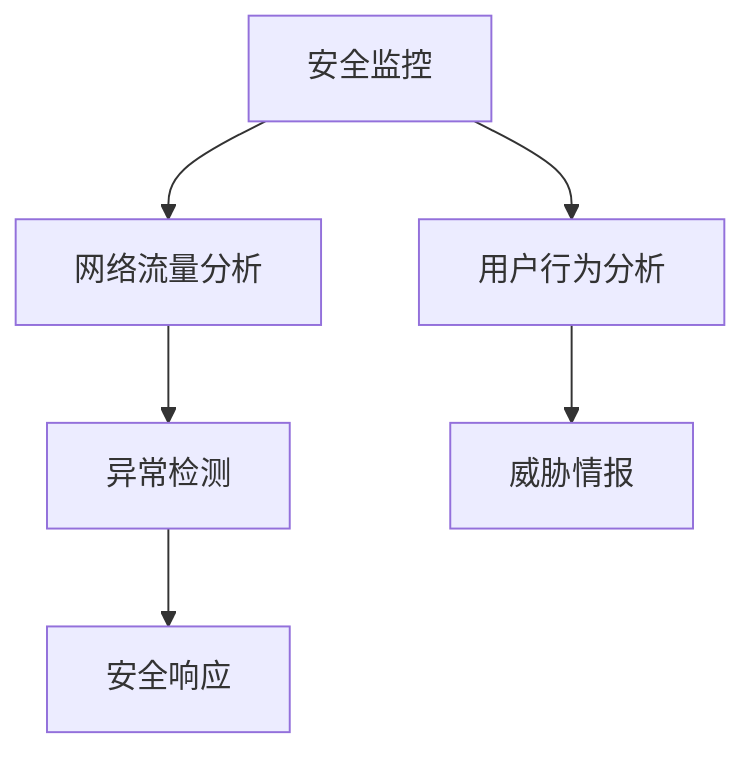
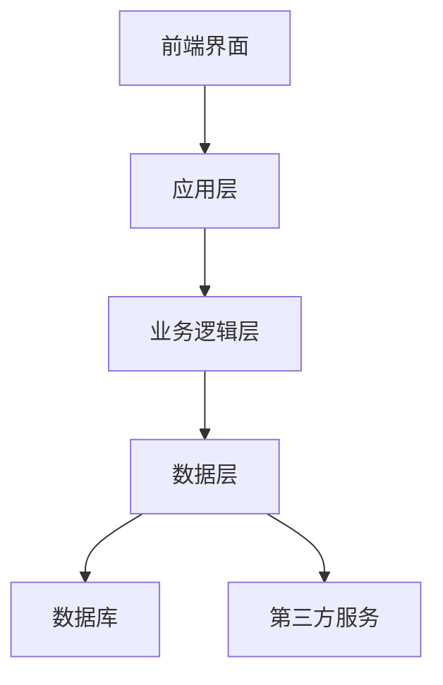
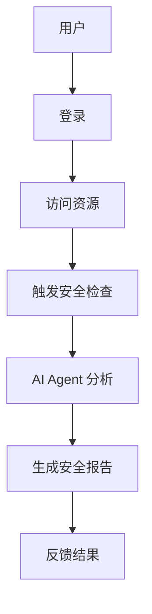

                 


# AI Agent在企业信息安全与隐私保护中的应用

> 关键词：AI Agent, 企业信息安全, 隐私保护, 人工智能, 数据安全

> 摘要：本文深入探讨AI Agent在企业信息安全与隐私保护中的应用，从概念、原理到实际应用，结合具体案例，分析其优势和挑战，为企业信息安全提供新的思路和解决方案。

---

# 第一部分: AI Agent 的核心概念与背景

## 第1章: AI Agent 的基本概念与背景介绍

### 1.1 问题背景与问题描述

#### 1.1.1 企业信息安全与隐私保护的现状
企业信息安全和隐私保护已成为全球性挑战。随着数字化转型的推进，企业面临的数据量激增，数据泄露事件频发。传统的安全措施已难以应对日益复杂的威胁。

#### 1.1.2 当前信息安全与隐私保护的主要挑战
- 数据泄露风险增加
- 黑客攻击手段多样化
- 数据隐私法规趋严
- 企业内部员工误操作风险

#### 1.1.3 AI Agent 在信息安全与隐私保护中的作用
AI Agent 可以通过实时监控、异常检测和智能响应，显著提升企业安全防护能力。

### 1.2 AI Agent 的定义与特点

#### 1.2.1 AI Agent 的定义
AI Agent 是一种智能代理系统，能够通过感知环境、分析数据、做出决策并执行操作来实现特定目标。

#### 1.2.2 AI Agent 的核心特点
- **自主性**：无需人工干预，自主执行任务。
- **反应性**：实时感知环境变化并做出反应。
- **学习能力**：通过机器学习不断提升安全能力。

#### 1.2.3 AI Agent 与传统安全工具的区别
| 特性         | AI Agent                | 传统安全工具            |
|--------------|-------------------------|--------------------------|
| 数据处理     | 强大数据分析能力        | 数据处理能力有限         |
| 自适应能力   | 能够自适应环境变化      | 需人工调整策略            |
| 响应速度     | 实时响应                | 响应速度较慢             |

### 1.3 AI Agent 的边界与外延

#### 1.3.1 AI Agent 的适用范围
- 网络安全监控
- 数据隐私保护
- 用户行为分析

#### 1.3.2 AI Agent 的局限性
- 对算法模型的依赖性高
- 需要大量的数据支持
- 可能存在误报或漏报

#### 1.3.3 AI Agent 与其他技术的结合
- **结合区块链技术**：提升数据安全性和隐私保护能力。
- **结合边缘计算**：实现更高效的实时数据分析。

### 1.4 本章小结

---

## 第2章: AI Agent 的核心概念与联系

### 2.1 AI Agent 的核心概念

#### 2.1.1 感知模块
AI Agent 的感知模块负责收集和分析环境数据，通常包括网络流量、用户行为和系统日志等。

#### 2.1.2 决策模块
决策模块基于感知到的信息，利用机器学习模型生成安全策略和响应措施。

#### 2.1.3 执行模块
执行模块负责将决策模块生成的指令转化为实际操作，例如封锁恶意IP地址或触发报警机制。

### 2.2 核心概念的属性特征对比

#### 2.2.1 不同 AI Agent 模型的对比分析
| 模型类型         | 基于规则的AI Agent | 基于机器学习的AI Agent | 基于知识图谱的AI Agent |
|------------------|--------------------|-------------------------|-------------------------|
| 数据依赖性       | 低                 | 高                     | 高                     |
| 学习能力         | 无                 | 强                     | 强                     |
| 适应性           | 低                 | 高                     | 高                     |

#### 2.2.2 使用 Mermaid 绘制 ER 实体关系图



### 2.3 本章小结

---

## 第3章: AI Agent 的算法原理

### 3.1 算法原理概述

#### 3.1.1 AI Agent 的核心算法
- **生成对抗网络（GAN）**：用于检测和生成异常流量。
- **联邦学习（Federated Learning）**：在保护数据隐私的前提下进行模型训练。

#### 3.1.2 算法的优缺点分析
| 算法类型         | 优点                         | 缺点                         |
|------------------|------------------------------|-----------------------------|
| GAN              | 高效异常检测                 | 易受对抗攻击影响              |
| Federated Learning | 保护数据隐私                | 训练效率较低                 |

### 3.2 算法原理的数学模型与公式

#### 3.2.1 算法的数学模型

##### 生成对抗网络 (GAN)
生成器的目标是最小化判别器的损失，判别器的目标是区分真实数据和生成数据。数学表达式如下：

$$ \text{生成器损失} = -\log(D(G(z))) $$
$$ \text{判别器损失} = -[\log(D(x)) + \log(1 - D(G(z)))] $$

##### 联邦学习 (Federated Learning)
假设每个参与方有数据集 $D_i$，全局模型参数 $\theta$ 在所有参与方之间进行同步更新。

$$ \theta_{i+1} = \theta_i + \eta \nabla_{\theta_i} J(\theta_i) $$

#### 3.2.2 使用 Mermaid 绘制算法流程图

##### GAN 算法流程图

```mermaid
graph TD
    GAN[生成对抗网络] --> Generator[生成器]
    Generator --> D(z)[输入噪声]
    Generator --> D(x)[生成数据]
    D(x) --> Discriminator[判别器]
    D(z) --> Discriminator
    Discriminator --> Output[输出结果]
```

##### Federated Learning 流程图

```mermaid
graph TD
    FL[联邦学习] --> Participants[参与方]
    Participants --> Data[数据]
    Participants --> Model[模型]
    Model --> Aggregator[聚合器]
    Aggregator --> Global Model[全局模型]
```

#### 3.2.3 使用 Python 实现算法核心代码

##### GAN 的核心代码

```python
import torch
import torch.nn as nn

# 定义生成器
class Generator(nn.Module):
    def __init__(self, input_size, hidden_size, output_size):
        super(Generator, self).__init__()
        self.fc = nn.Linear(input_size, hidden_size)
        self.fc1 = nn.Linear(hidden_size, output_size)
    
    def forward(self, x):
        x = self.fc(x)
        x = torch.relu(x)
        x = self.fc1(x)
        return torch.sigmoid(x)

# 定义判别器
class Discriminator(nn.Module):
    def __init__(self, input_size, hidden_size, output_size):
        super(Discriminator, self).__init__()
        self.fc = nn.Linear(input_size, hidden_size)
        self.fc1 = nn.Linear(hidden_size, output_size)
    
    def forward(self, x):
        x = self.fc(x)
        x = torch.relu(x)
        x = self.fc1(x)
        return torch.sigmoid(x)
```

##### 联邦学习的核心代码

```python
import numpy as np

# 初始化模型参数
theta = np.random.rand(4, 1)

# 定义损失函数
def loss_function(y_pred, y_true):
    return np.mean((y_pred - y_true)**2)

# 梯度下降优化
def optimize(theta, gradient, learning_rate):
    return theta - learning_rate * gradient
```

### 3.3 本章小结

---

## 第4章: AI Agent 的系统分析与架构设计

### 4.1 问题场景介绍

#### 4.1.1 企业信息安全场景
- 网络攻击检测
- 用户行为分析
- 数据隐私保护

#### 4.1.2 项目介绍
一个基于AI Agent的企业安全防护系统，旨在实时监测网络流量，识别异常行为，并自动采取防护措施。

### 4.2 系统功能设计

#### 4.2.1 领域模型设计
使用 Mermaid 绘制领域模型类图：



### 4.3 系统架构设计

#### 4.3.1 系统架构图
使用 Mermaid 绘制系统架构图：



#### 4.3.2 系统接口设计
- **API 接口**：提供 RESTful API 用于数据交互和模型调用。
- **消息队列**：使用 Kafka 进行异步通信。

#### 4.3.3 系统交互流程图
使用 Mermaid 绘制交互流程图：



### 4.4 本章小结

---

## 第5章: AI Agent 的项目实战

### 5.1 环境安装与配置

#### 5.1.1 安装 Python 环境
使用 Anaconda 或虚拟环境管理工具安装 Python 3.8+。

#### 5.1.2 安装依赖库
安装必要的库：
- `torch`
- `numpy`
- `scikit-learn`

#### 5.1.3 安装安全监控工具
例如，安装 `suricata` 或 `zeek` 用于网络流量监控。

### 5.2 系统核心代码实现

#### 5.2.1 网络流量分析代码

```python
import pandas as pd
import numpy as np

# 加载网络流量数据
data = pd.read_csv('network_traffic.csv')

# 异常检测模型训练
from sklearn.ensemble import IsolationForest
model = IsolationForest(random_state=42)
model.fit(data.drop(columns=['timestamp']))

# 预测异常样本
outliers = model.predict(data.drop(columns=['timestamp']))
outliers[outliers == -1] = 1
outliers[outliers == 1] = 0
data['is_anomaly'] = outliers
```

#### 5.2.2 安全响应策略实现

```python
import requests

def send_alert(message):
    url = 'http://alert_server/api/send'
    payload = {'message': message}
    response = requests.post(url, json=payload)
    return response.status_code

# 发送异常告警
alert = 'Detected unusual network activity'
send_alert(alert)
```

### 5.3 案例分析与实际应用

#### 5.3.1 案例分析
分析一起典型的网络攻击事件，展示AI Agent 如何通过异常检测和快速响应阻止攻击。

#### 5.3.2 代码应用解读
解释代码实现的每一步，并分析其在实际中的应用效果。

### 5.4 项目小结

---

## 第6章: AI Agent 的最佳实践与未来展望

### 6.1 最佳实践

#### 6.1.1 小结
总结本章内容，强调AI Agent 在企业信息安全中的重要性。

#### 6.1.2 注意事项
- 定期更新模型
- 保护数据隐私
- 建立完善的应急响应机制

#### 6.1.3 未来展望
- 更智能的威胁检测
- 更高效的数据隐私保护
- 更广泛的应用场景

### 6.2 拓展阅读
推荐相关书籍和论文，供读者进一步学习。

---

# 作者

**作者：AI天才研究院/AI Genius Institute & 禅与计算机程序设计艺术 /Zen And The Art of Computer Programming**

---

**Note:** 以上目录大纲和内容设计仅为示例，实际文章需要根据具体的实现细节和实际案例进行补充和调整。

