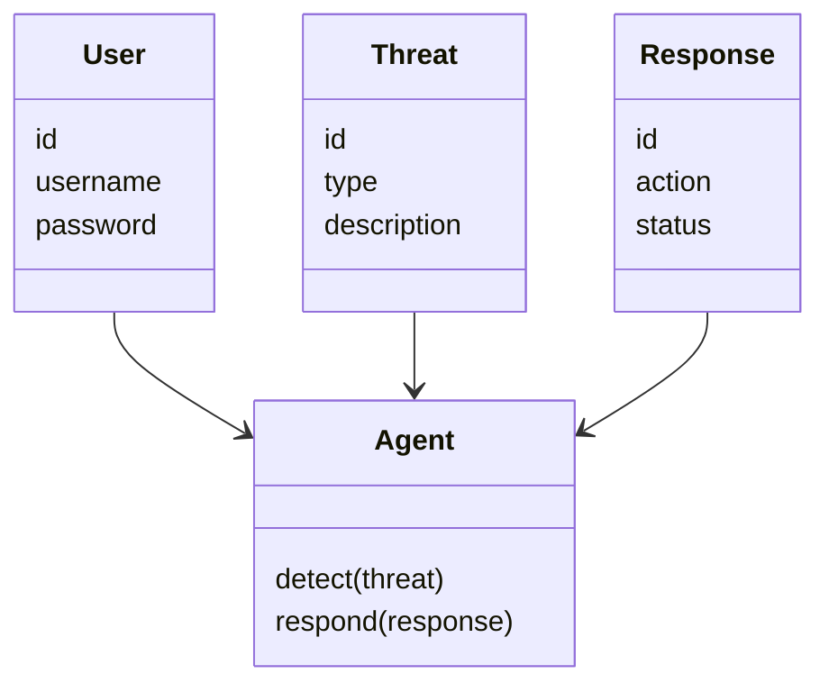

                 


```markdown
# AI Agent在企业信息安全威胁检测与响应中的前沿应用

## 关键词：AI Agent, 企业信息安全, �威脅檢測, 智能響應, 深度學習, 系統架構

## 摘要：  
随着企业信息安全威胁的日益复杂化和智能化，传统的安全防护手段已难以应对新型威胁。本文深入探讨了AI Agent在企业信息安全中的前沿应用，从核心概念、算法原理到系统架构，全面解析了AI Agent如何通过智能化的威胁检测与响应，为企业信息安全提供强有力的支持。通过具体案例分析和项目实战，展示了AI Agent在实际应用中的优势和潜力。

---

## 第1章: AI Agent与企业信息安全概述

### 1.1 AI Agent的基本概念

#### 1.1.1 AI Agent的定义与特点  
AI Agent（人工智能代理）是一种能够感知环境、自主决策并执行任务的智能实体。其特点包括：  
- **智能性**：基于数据和算法，具备自主决策能力。  
- **适应性**：能够根据环境变化动态调整行为。  
- **实时性**：能够在短时间内完成威胁检测与响应。  

#### 1.1.2 企业信息安全的基本概念  
企业信息安全是指保护企业信息资产免受未经授权的访问、泄露、破坏或干扰。常见的威胁包括网络攻击、数据泄露、恶意软件等。  

#### 1.1.3 AI Agent在信息安全中的作用  
AI Agent能够通过智能化的威胁检测与响应，弥补传统安全防护的不足，提升企业信息安全的整体能力。  

### 1.2 企业信息安全的现状与挑战

#### 1.2.1 传统信息安全威胁的局限性  
传统的基于规则的防火墙和入侵检测系统存在以下问题：  
- 需要手动配置规则，灵活性差。  
- 无法应对未知的新型威胁。  

#### 1.2.2 新型威胁的出现与特点  
随着人工智能技术的普及，攻击者也开始利用AI技术发起更加复杂的攻击。新型威胁的特点包括：  
- **智能化**：攻击方式更加隐蔽和个性化。  
- **自动化**：攻击工具能够自动传播和变异。  
- **多样化**：攻击手段多样化，难以被传统防护手段识别。  

#### 1.2.3 企业信息安全的痛点与需求  
- **痛点**：  
  - 威胁检测的准确性不足。  
  - 响应速度慢，难以应对快速变化的威胁。  
- **需求**：  
  - 实时、精准的威胁检测能力。  
  - 自动化、智能化的响应机制。  

### 1.3 AI Agent在信息安全中的应用前景

#### 1.3.1 AI Agent在威胁检测中的优势  
AI Agent能够通过机器学习算法，从海量数据中发现潜在威胁，显著提高检测的准确性。  

#### 1.3.2 AI Agent在响应与修复中的作用  
AI Agent能够根据检测到的威胁，快速制定响应策略，自动化执行修复操作，减少人为干预。  

#### 1.3.3 企业信息安全智能化转型的必要性  
随着AI技术的成熟，企业信息安全的智能化转型已成为提升安全防护能力的关键。  

### 1.4 本章小结  
本章介绍了AI Agent的基本概念，分析了企业信息安全的现状与挑战，并探讨了AI Agent在信息安全中的应用前景，为后续章节的深入分析奠定了基础。

---

## 第2章: AI Agent的核心概念与工作原理

### 2.1 AI Agent的核心概念

#### 2.1.1 感知层: 数据采集与特征提取  
AI Agent通过采集网络流量、日志等数据，提取关键特征用于威胁检测。  

#### 2.1.2 决策层: 威胁分析与响应策略  
AI Agent基于感知层提供的数据，利用机器学习模型进行威胁分析，并制定响应策略。  

#### 2.1.3 执行层: 响应动作与效果评估  
AI Agent根据决策层的指令，执行相应的响应动作，并评估效果。  

### 2.2 AI Agent的工作流程

#### 2.2.1 数据采集与预处理  
AI Agent首先采集相关数据，并进行清洗、归一化等预处理操作。  

#### 2.2.2 威胁检测与分类  
利用机器学习模型对预处理后的数据进行分类，识别潜在威胁。  

#### 2.2.3 响应策略的制定与执行  
根据检测结果，AI Agent制定响应策略，并执行相应的操作。  

### 2.3 AI Agent的实体关系图

```mermaid
er
actor: 用户
agent: AI Agent
threat: 威胁事件
response: 响应措施
rule: 规则库
data_source: 数据源
```

### 2.4 本章小结  
本章详细讲解了AI Agent的核心概念和工作原理，为后续章节的算法和系统设计提供了理论基础。

---

## 第3章: 基于AI Agent的威胁检测算法原理

### 3.1 威胁检测的基本原理

#### 3.1.1 基于规则的威胁检测  
基于预先定义的规则，检测特定的威胁行为。  
例如：检测异常登录行为，规则可以是“多次失败登录尝试”。  

#### 3.1.2 统计学习的威胁检测  
通过统计分析，识别异常行为模式。  
例如：使用聚类算法识别网络流量中的异常流量。  

#### 3.1.3 深度学习的威胁检测  
利用深度学习模型（如CNN、RNN）从数据中自动学习特征，识别威胁。  
例如：使用LSTM模型检测时间序列中的异常行为。  

### 3.2 基于深度学习的威胁检测算法

#### 3.2.1 神经网络模型简介  
神经网络是一种受生物神经网络启发的计算模型，能够通过多层非线性变换学习数据特征。  

#### 3.2.2 卷积神经网络(CNN)在威胁检测中的应用  
CNN适用于处理图像和时序数据，常用于网络流量分析和恶意代码检测。  

#### 3.2.3 循环神经网络(RNN)在威胁检测中的应用  
RNN适用于处理序列数据，常用于时间序列分析和异常检测。  

### 3.3 威胁检测算法的实现

```python
import numpy as np
from sklearn.metrics import accuracy_score

# 示例: 使用随机森林进行威胁检测
from sklearn.ensemble import RandomForestClassifier

# 数据准备
X_train, y_train = ...  # 训練データ
X_test, y_test = ...    # 機械学習モデルの構築と評価

model = RandomForestClassifier()
model.fit(X_train, y_train)

y_pred = model.predict(X_test)
print("Accuracy:", accuracy_score(y_test, y_pred))
```

### 3.4 本章小结  
本章详细讲解了威胁检测的基本原理和基于深度学习的威胁检测算法，展示了AI Agent在威胁检测中的强大能力。

---

## 第4章: 系統分析与架構设计方案

### 4.1 问题场景介绍  
企业面临多种安全威胁，需要一个智能化的威胁检测与响应系统。  

### 4.2 项目介绍  
设计一个基于AI Agent的企业信息安全威胁检测与响应系统。  

### 4.3 系统功能设计



### 4.4 系统架构设计


### 4.5 本章小结  
本章通过系统分析与架构设计，展示了AI Agent在企业信息安全中的具体实现方式。

---

## 第5章: 项目实战

### 5.1 环境安装  
安装Python、机器学习库（如scikit-learn、TensorFlow）和可视化工具（如Matplotlib）。  

### 5.2 系统核心实现源代码

```python
# 示例代码: 使用随机森林进行威胁分类
import numpy as np
from sklearn.ensemble import RandomForestClassifier
from sklearn.metrics import accuracy_score

# 数据准备
X_train = ...  # 特征数据
y_train = ...  # 标签数据
X_test = ...   # 测试数据
y_test = ...   # 测试标签

# 模型训练
model = RandomForestClassifier(n_estimators=100)
model.fit(X_train, y_train)

# 模型预测
y_pred = model.predict(X_test)
print("Accuracy:", accuracy_score(y_test, y_pred))
```

### 5.3 实际案例分析  
通过具体案例分析，展示AI Agent在威胁检测与响应中的实际应用效果。  

### 5.4 本章小结  
本章通过项目实战，展示了AI Agent在企业信息安全中的具体实现和应用效果。

---

## 第6章: 最佳实践与注意事项

### 6.1 最佳实践  
- 确保模型训练数据的质量和多样性。  
- 定期更新模型以应对新的威胁。  

### 6.2 小结  
总结AI Agent在企业信息安全中的应用优势和注意事项。  

### 6.3 注意事项  
- 模型的泛化能力需要通过交叉验证来评估。  
- 系统的响应策略需要与企业的安全政策相匹配。  

### 6.4 拓展阅读  
推荐相关书籍和论文，帮助读者深入学习AI Agent在信息安全中的应用。

---

## 作者信息  

作者：AI天才研究院/AI Genius Institute & 禅与计算机程序设计艺术 /Zen And The Art of Computer Programming
```

