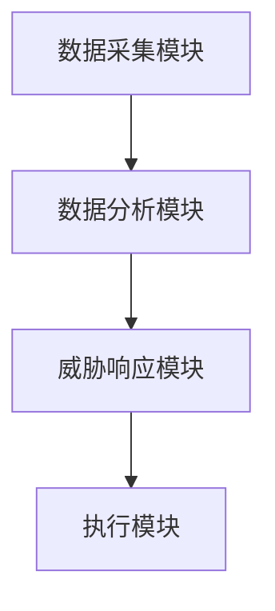
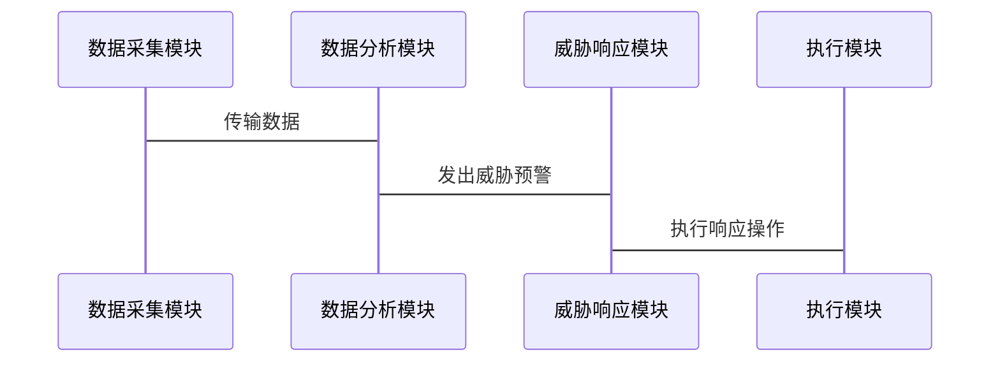

                 


# AI Agent在企业信息安全态势感知与威胁响应中的应用

## 关键词：AI Agent，企业信息安全，态势感知，威胁响应，人工智能，信息安全，威胁检测

## 摘要：本文深入探讨了AI Agent在企业信息安全态势感知与威胁响应中的应用，分析了其核心算法与系统架构，结合实际案例，详细阐述了AI Agent在威胁检测、响应策略优化以及知识图谱构建中的技术细节，最后总结了其在企业信息安全中的应用价值与未来发展方向。

---

## 第一部分：企业信息安全态势感知与威胁响应的背景与挑战

### 第1章：信息安全态势感知与威胁响应概述

#### 1.1 信息安全态势感知的概念与定义

##### 1.1.1 信息安全态势感知的定义
信息安全态势感知（Situation Awareness in Cybersecurity）是指通过收集、分析和理解与信息安全相关的数据和信息，以识别、评估和预测潜在威胁的能力。其目标是实时掌握企业的网络安全状态，为威胁响应提供决策支持。

##### 1.1.2 信息安全态势感知的核心要素
- **数据源**：包括网络流量日志、系统日志、安全设备日志等。
- **分析模型**：基于机器学习、深度学习等算法的分析模型。
- **决策支持**：通过态势分析，提供威胁预警和响应建议。

##### 1.1.3 信息安全态势感知的演进历程
信息安全态势感知经历了从简单日志收集到智能分析的演进过程，随着AI技术的发展，逐步引入了机器学习和知识图谱等高级分析方法。

#### 1.2 威胁响应的基本概念

##### 1.2.1 威胁的定义与分类
- **威胁**：任何可能破坏企业信息安全的事件或行为，包括病毒、DDoS攻击、数据泄露等。
- **分类**：基于来源、目标、影响等因素进行分类。

#### 1.3 企业信息安全态势感知与威胁响应的现状

##### 1.3.1 当前企业信息安全面临的挑战
- **复杂性**：企业网络环境日益复杂，威胁来源多样化。
- **实时性**：威胁响应需要快速决策，传统方法难以满足实时性要求。
- **准确性**：如何提高威胁检测的准确性和响应的有效性是关键问题。

#### 1.4 AI Agent在信息安全领域的应用前景

##### 1.4.1 AI Agent的基本概念与特点
- AI Agent是一种智能代理，能够感知环境、自主决策并执行任务。
- 具有学习能力、适应性和自主性等特点。

##### 1.4.2 AI Agent在信息安全领域的优势
- 提高威胁检测的准确性。
- 实现智能化的威胁响应。
- 降低人工干预成本。

---

## 第二部分：AI Agent在态势感知与威胁响应中的核心概念

### 第2章：AI Agent在态势感知与威胁响应中的角色

#### 2.1 信息安全态势感知的模型与框架

##### 2.1.1 基于AI的态势感知模型
- **基于神经网络的异常检测模型**：使用深度学习算法检测网络中的异常流量。
- **基于知识图谱的态势感知框架**：通过构建知识图谱，分析威胁之间的关联关系。

##### 2.1.2 基于流数据的态势感知方法
- 使用流数据处理技术，实时分析网络流量，发现潜在威胁。

#### 2.2 威胁响应的策略与机制

##### 2.2.1 基于规则的威胁响应策略
- 根据预定义的规则，自动响应威胁事件。

##### 2.2.2 基于AI的自适应威胁响应机制
- 通过机器学习模型，动态调整威胁响应策略。

##### 2.2.3 基于博弈论的威胁响应策略
- 模拟攻击者与防御者的博弈过程，优化威胁响应策略。

#### 2.3 AI Agent在态势感知与威胁响应中的角色

##### 2.3.1 AI Agent作为态势感知的核心引擎
- 使用深度学习模型，分析网络流量，发现潜在威胁。

##### 2.3.2 AI Agent作为威胁响应的执行者
- 根据分析结果，自动执行威胁响应操作。

##### 2.3.3 AI Agent在人机协同中的作用
- 通过人机协同，提高威胁响应的准确性和效率。

---

## 第三部分：AI Agent在态势感知与威胁响应中的算法原理

### 第3章：基于深度学习的威胁检测算法

#### 3.1 基于神经网络的异常检测
- 使用卷积神经网络（CNN）或循环神经网络（RNN）进行异常检测。

##### 3.1.1 模型实现
```python
import tensorflow as tf
from tensorflow.keras import layers

model = tf.keras.Sequential([
    layers.Conv2D(32, (3,3), activation='relu', input_shape=(None, 28, 28)),
    layers.MaxPooling2D((2,2)),
    layers.Conv2D(64, (3,3), activation='relu'),
    layers.MaxPooling2D((2,2)),
    layers.Flatten(),
    layers.Dense(128, activation='relu'),
    layers.Dense(1, activation='sigmoid')
])
```

##### 3.1.2 模型原理
通过卷积层提取图像特征，池化层降低维度，最终输出一个概率值，判断是否为异常流量。

#### 3.2 基于Transformer的自然语言处理在威胁情报中的应用

##### 3.2.1 Transformer模型的基本原理
- 使用自注意力机制，处理威胁情报中的文本数据。

##### 3.2.2 模型实现
```python
import tensorflow as tf
from tensorflow.keras import layers

class TransformerBlock(layers.Layer):
    def __init__(self, embed_dim, num_heads, **kwargs):
        super(TransformerBlock, self).__init__(**kwargs)
        self.embed_dim = embed_dim
        self.num_heads = num_heads
        self.att = layers.MultiHeadAttention(num_heads=num_heads, key_dim=embed_dim//num_heads)
        self.ffn = layers.Dense(embed_dim, activation='relu')

    def call(self, inputs, training=None):
        attn_output = self.att(inputs, inputs)
        ffn_output = self.ffn(attn_output)
        return ffn_output
```

#### 3.3 基于图神经网络的威胁传播建模

##### 3.3.1 图神经网络的基本原理
- 使用图卷积网络（GCN）或图注意力网络（GAT）建模威胁传播。

##### 3.3.2 模型实现
```python
import tensorflow as tf
from tensorflow.keras import layers

class GATLayer(layers.Layer):
    def __init__(self, input_dim, output_dim, **kwargs):
        super(GATLayer, self).__init__(**kwargs)
        self.W = layers.Dense(output_dim, input_dim)
        self.a = layers.Dense(1, input_dim)

    def call(self, inputs):
        h = self.W(inputs)
        attention = tf.sigmoid(self.a(h))
        output = h * attention
        return output
```

---

## 第四部分：企业信息安全态势感知与威胁响应的系统架构设计

### 第4章：系统架构设计

#### 4.1 系统功能设计

##### 4.1.1 系统模块划分
- 数据采集模块：负责收集网络流量、系统日志等数据。
- 数据分析模块：基于机器学习模型进行威胁检测和分析。
- 威胁响应模块：根据分析结果，执行相应的响应操作。

##### 4.1.2 系统流程
1. 数据采集模块收集数据并传输到数据分析模块。
2. 数据分析模块对数据进行处理和分析，识别潜在威胁。
3. 威胁响应模块根据分析结果，执行相应的响应操作。

#### 4.2 系统架构设计

##### 4.2.1 系统架构图


##### 4.2.2 系统接口设计
- 数据接口：数据采集模块与数据分析模块之间的接口。
- 响应接口：数据分析模块与威胁响应模块之间的接口。

#### 4.3 系统交互流程

##### 4.3.1 系统交互序列图


---

## 第五部分：AI Agent在企业信息安全态势感知与威胁响应中的项目实战

### 第5章：项目实战

#### 5.1 环境安装

##### 5.1.1 环境需求
- 操作系统：Linux/Windows/MacOS
- 开发工具：Python 3.8+
- 依赖库：TensorFlow, Keras, Pandas, NumPy

#### 5.2 核心实现

##### 5.2.1 数据采集模块实现
```python
import logging
import sys
import socket

def data_collector():
    sock = socket.socket(socket.AF_INET, socket.SOCK_DGRAM)
    sock.bind(('0.0.0.0', 5000))
    while True:
        data, addr = sock.recvfrom(65535)
        print(f"received message: {data}")
```

##### 5.2.2 数据分析模块实现
```python
import tensorflow as tf
from tensorflow.keras import layers

def threat_detection_model():
    model = tf.keras.Sequential([
        layers.Conv2D(32, (3,3), activation='relu', input_shape=(None, 28, 28)),
        layers.MaxPooling2D((2,2)),
        layers.Conv2D(64, (3,3), activation='relu'),
        layers.MaxPooling2D((2,2)),
        layers.Flatten(),
        layers.Dense(128, activation='relu'),
        layers.Dense(1, activation='sigmoid')
    ])
    return model
```

#### 5.3 案例分析

##### 5.3.1 案例背景
某企业遭受DDoS攻击，通过AI Agent实现威胁检测和响应。

##### 5.3.2 分析过程
- 数据采集模块收集网络流量数据。
- 数据分析模块识别异常流量，确定攻击来源。
- 威胁响应模块自动触发防御机制，阻止攻击。

#### 5.4 项目总结

##### 5.4.1 项目成果
- 成功实现基于AI Agent的态势感知与威胁响应系统。
- 提高了企业信息安全防护能力。

---

## 第六部分：AI Agent在企业信息安全态势感知与威胁响应中的最佳实践

### 第6章：最佳实践

#### 6.1 经验分享

##### 6.1.1 数据质量的重要性
确保数据的完整性和准确性，是提高威胁检测准确性的关键。

##### 6.1.2 模型的可解释性
在实际应用中，模型的可解释性非常重要，特别是在需要向非技术人员解释决策过程时。

#### 6.2 小结

##### 6.2.1 本文总结
本文详细探讨了AI Agent在企业信息安全态势感知与威胁响应中的应用，分析了其核心算法与系统架构，并结合实际案例，展示了其在威胁检测与响应中的应用价值。

#### 6.3 注意事项

##### 6.3.1 模型的实时性
在实际应用中，需要注意模型的实时性，确保能够及时响应威胁。

##### 6.3.2 数据隐私与安全
在处理企业数据时，必须遵守相关法律法规，确保数据隐私与安全。

#### 6.4 拓展阅读

##### 6.4.1 相关技术领域
- 基于强化学习的威胁响应优化。
- 基于知识图谱的威胁情报分析。

##### 6.4.2 建议阅读的书籍与论文
- 《Deep Learning for Cybersecurity》
- 《Adversarial Machine Learning for Cybersecurity》

---

## 作者：AI天才研究院/AI Genius Institute & 禅与计算机程序设计艺术 /Zen And The Art of Computer Programming

---

### 本文小结
本文深入探讨了AI Agent在企业信息安全态势感知与威胁响应中的应用，从核心概念、算法原理到系统架构设计，再到实际项目实战，全面分析了其技术细节与应用价值。希望本文能够为相关领域的研究者和实践者提供有价值的参考与启发。

