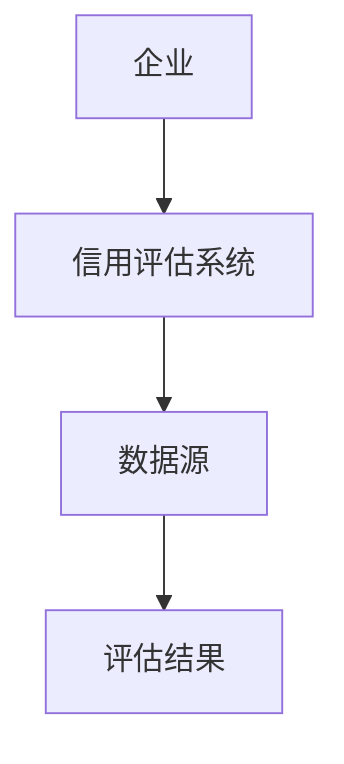
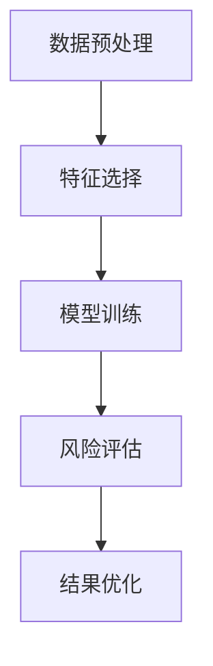
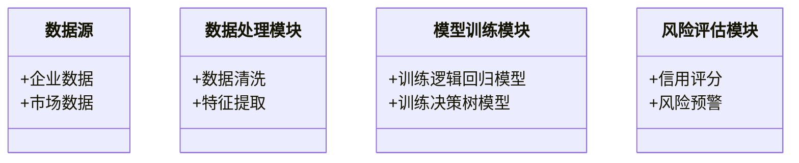
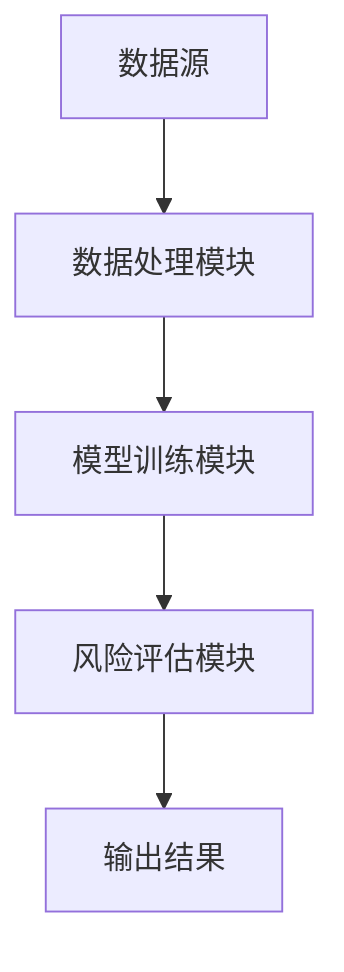

                 


# AI Agent在企业信用风险评估中的应用

## 关键词：
AI Agent，信用风险评估，机器学习，风险管理，企业信用评分

## 摘要：
本文详细探讨了AI Agent在企业信用风险评估中的应用。通过分析AI Agent的核心概念、算法原理、系统架构，以及实际项目中的应用，展示了如何利用AI技术提升信用风险评估的效率和准确性。文章从背景介绍、核心概念、算法实现、系统设计到项目实战，层层深入，为读者提供全面的视角和实用的指导。

---

# 第一部分: AI Agent与企业信用风险评估概述

## 第1章: AI Agent与信用风险评估的背景

### 1.1 问题背景与定义

#### 1.1.1 企业信用风险的基本概念
企业信用风险是指企业在经营过程中，由于外部环境或内部管理问题导致的债务违约风险。传统信用风险评估依赖于人工分析和简单的统计模型，存在效率低、精度差的问题。

#### 1.1.2 AI Agent在信用评估中的作用
AI Agent通过自动化数据处理、特征提取和模型预测，能够快速、准确地评估企业的信用风险。其优势在于能够处理海量数据，发现传统方法难以察觉的模式和趋势。

#### 1.1.3 当前信用风险评估的主要挑战
- 数据量大且复杂
- 模型解释性差
- 实时性要求高

### 1.2 问题描述与解决思路

#### 1.2.1 传统信用风险评估的局限性
传统方法依赖经验判断，主观性强，难以应对复杂的市场变化。

#### 1.2.2 引入AI Agent的优势
AI Agent能够快速处理多源数据，实时更新评估结果，降低人为错误。

#### 1.2.3 解决方案的可行性分析
通过机器学习模型和大数据处理技术，AI Agent能够有效提升信用评估的准确性和效率。

### 1.3 AI Agent的核心概念与特征

#### 1.3.1 AI Agent的定义与分类
AI Agent是一种智能代理，能够感知环境、自主决策并执行任务。在信用评估中，AI Agent通常分为监督型和无监督型两类。

#### 1.3.2 AI Agent在信用评估中的属性特征对比表
| 属性 | 传统方法 | AI Agent |
|------|----------|-----------|
| 数据量 | 小       | 大         |
| 实时性 | 低       | 高         |
| 精度   | 中       | 高         |

#### 1.3.3 ER实体关系图架构（Mermaid流程图）


---

# 第二部分: AI Agent的算法原理与数学模型

## 第2章: AI Agent算法原理

### 2.1 算法原理概述

#### 2.1.1 基于监督学习的信用风险评估
监督学习通过标记数据训练模型，预测企业的信用评分。常用算法包括逻辑回归和决策树。

#### 2.1.2 基于无监督学习的异常检测
无监督学习用于发现数据中的异常模式，识别潜在的高风险企业。

#### 2.1.3 基于强化学习的动态风险评估
强化学习通过不断试错，优化评估策略，适应市场变化。

### 2.2 数学模型与公式

#### 2.2.1 信用评分模型（如逻辑回归）
$$ P(y=1|x) = \frac{e^{w \cdot x + b}}{1 + e^{w \cdot x + b}} $$
其中，\( y \) 是信用评分，\( x \) 是输入特征，\( w \) 和 \( b \) 是模型参数。

#### 2.2.2 风险评分矩阵（如马尔可夫链）
$$ P_{ij} = \frac{p_i}{\sum_{k} p_k} $$
表示从状态 \( i \) 到状态 \( j \) 的转移概率。

### 2.3 算法实现流程（Mermaid流程图）


---

## 第3章: 系统分析与架构设计

### 3.1 系统分析

#### 3.1.1 问题场景介绍
企业信用评估系统需要处理来自多个数据源的实时数据，包括财务数据、市场数据和舆情数据。

#### 3.1.2 项目目标与范围
开发一个基于AI Agent的信用评估系统，实现自动化、实时化的风险评估。

#### 3.1.3 项目可行性分析
技术可行性高，数据来源丰富，但需要解决数据隐私和模型解释性问题。

### 3.2 系统架构设计

#### 3.2.1 领域模型类图（Mermaid）


#### 3.2.2 系统架构图（Mermaid）


---

# 第三部分: 项目实战与应用

## 第4章: 项目实战

### 4.1 环境安装

#### 4.1.1 安装Python和必要的库
```bash
pip install numpy pandas scikit-learn
```

#### 4.1.2 数据集准备
使用公开的企业信用数据集，包括财务指标、市场表现和舆情信息。

### 4.2 核心代码实现

#### 4.2.1 数据预处理代码
```python
import pandas as pd
import numpy as np

# 读取数据
data = pd.read_csv('credit_data.csv')

# 数据清洗
data = data.dropna()
data = pd.get_dummies(data)
```

#### 4.2.2 模型训练代码
```python
from sklearn.model_selection import train_test_split
from sklearn.linear_model import LogisticRegression

# 划分数据集
X_train, X_test, y_train, y_test = train_test_split(data.drop('credit_score', axis=1), data['credit_score'], test_size=0.2)

# 训练模型
model = LogisticRegression()
model.fit(X_train, y_train)
```

#### 4.2.3 模型评估代码
```python
from sklearn.metrics import accuracy_score

# 预测结果
y_pred = model.predict(X_test)

# 计算准确率
print(accuracy_score(y_test, y_pred))
```

### 4.3 代码解读与分析

#### 4.3.1 数据预处理
使用pandas进行数据清洗和特征工程，将数据转换为适合模型训练的格式。

#### 4.3.2 模型训练
使用逻辑回归模型进行训练，输出模型参数和性能指标。

#### 4.3.3 模型评估
通过准确率、召回率等指标评估模型性能，优化模型参数。

### 4.4 实际案例分析

#### 4.4.1 案例背景
某企业财务数据异常，市场表现不佳，可能存在信用风险。

#### 4.4.2 数据处理与分析
通过数据清洗和特征提取，识别关键风险因素，如资产负债率、现金流等。

#### 4.4.3 模型预测与结果解读
模型预测该企业的信用评分为低分，提示存在较高的违约风险。

### 4.5 项目小结

通过实际案例，展示了AI Agent在信用风险评估中的应用价值，验证了模型的有效性和实用性。

---

# 第四部分: 总结与展望

## 第5章: 总结与展望

### 5.1 全文总结
本文详细探讨了AI Agent在企业信用风险评估中的应用，从背景、原理到实际应用，全面展示了其优势和价值。

### 5.2 未来研究方向

#### 5.2.1 模型优化
研究更高效的算法，如深度学习和集成学习，提升模型性能。

#### 5.2.2 数据隐私保护
探索隐私计算技术，解决数据共享中的隐私问题。

#### 5.2.3 实时性提升
优化系统架构，实现更快速的数据处理和实时评估。

### 5.3 小结与注意事项

- AI Agent的应用需要结合具体业务场景
- 数据质量和模型解释性是实际应用中的关键问题
- 需要关注数据隐私和模型的可解释性

---

# 作者：AI天才研究院/AI Genius Institute & 禅与计算机程序设计艺术 /Zen And The Art of Computer Programming

