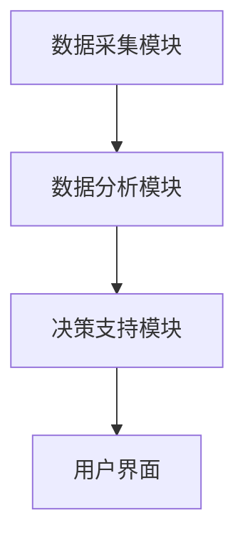
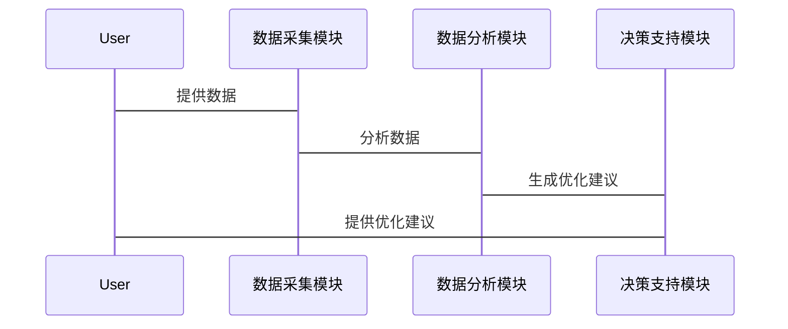

                 


# AI Agent在企业全面质量管理(TQM)中的深度应用

> 关键词：AI Agent, 全面质量管理, 智能化, 质量优化, 算法原理

> 摘要：本文探讨AI Agent在企业全面质量管理(TQM)中的深度应用，分析其在质量数据分析、预测与预防、质量改进中的作用，结合算法原理、系统架构设计和项目实战，展示如何通过AI Agent提升企业质量管理效率和效果。

---

# 引言

随着企业竞争的加剧，质量管理已成为企业生存和发展的关键。传统的质量管理方法逐渐暴露出效率低下、数据处理能力有限等问题。AI Agent作为一种智能代理技术，能够通过机器学习、自然语言处理等技术，为企业质量管理带来革命性的改变。本文将从AI Agent的基本概念、算法原理、系统架构设计到项目实战，全面分析其在企业全面质量管理中的深度应用。

---

# 第一部分: AI Agent与企业全面质量管理(TQM)概述

## 第1章: AI Agent与TQM的背景与概述

### 1.1 TQM的基本概念与核心要素

全面质量管理(TQM)是一种以顾客为中心，通过全员参与、持续改进来实现高质量产品的管理方法。其核心要素包括：

1. **顾客需求**：以顾客为中心，满足其质量要求。
2. **全员参与**：全体员工共同参与质量管理。
3. **过程导向**：关注从设计到交付的每个过程。
4. **持续改进**：通过PDCA循环不断优化质量。

### 1.2 AI Agent的基本概念与特点

AI Agent是一种智能代理，能够感知环境、自主决策并执行任务。其特点包括：

1. **智能性**：通过机器学习和数据分析做出决策。
2. **自主性**：无需人工干预，自动完成任务。
3. **适应性**：能够根据环境变化调整行为。

### 1.3 AI Agent在企业质量管理中的应用背景

传统质量管理依赖人工操作，效率低且容易出错。AI Agent通过智能化手段，能够高效处理海量数据，实时监控质量，预测潜在问题，从而提升质量管理的效率和准确性。

---

# 第二部分: AI Agent与TQM的核心概念与联系

## 第2章: AI Agent与TQM的核心概念分析

### 2.1 TQM的系统模型与AI Agent的结合

TQM的系统模型包括输入、过程、输出和顾客反馈。AI Agent能够实时监控输入数据，优化过程，预测输出结果，并根据顾客反馈调整策略。

### 2.2 AI Agent的智能特性与TQM需求的匹配

AI Agent的智能特性（如数据分析、预测、决策）与TQM的需求（如质量预测、问题预防）高度匹配，能够有效解决质量管理中的复杂问题。

### 2.3 AI Agent在TQM中的核心应用场景

1. **质量数据分析与优化**：通过机器学习分析历史数据，识别质量问题根源。
2. **质量问题预测与预防**：利用监督学习预测潜在质量问题，提前采取措施。
3. **质量改进的智能化支持**：通过强化学习优化改进方案，提升质量水平。

---

# 第三部分: AI Agent在TQM中的算法原理与数学模型

## 第3章: AI Agent的核心算法原理

### 3.1 监督学习算法在AI Agent中的应用

监督学习通过训练数据学习输入与输出的关系，用于质量预测。例如，使用决策树算法预测产品缺陷。

### 3.2 强化学习算法在AI Agent中的应用

强化学习通过试错优化策略，用于质量改进。例如，通过Q-learning算法优化生产流程。

### 3.3 算法原理的数学模型

#### 监督学习模型
$$
y = f(x) + \epsilon
$$
其中，$x$是输入数据，$y$是输出，$\epsilon$是噪声。

#### 强化学习模型
$$
Q(s, a) = Q(s, a) + \alpha (r + \gamma Q(s', a') - Q(s, a))
$$
其中，$s$是状态，$a$是动作，$\alpha$是学习率，$\gamma$是折扣因子。

---

# 第四部分: AI Agent在TQM中的系统架构设计

## 第4章: 系统分析与架构设计方案

### 4.1 问题场景介绍

企业需要实时监控生产过程中的质量数据，预测潜在问题，并优化生产流程。

### 4.2 系统功能设计

- **数据采集**：实时采集生产数据。
- **数据分析**：分析数据，识别质量问题。
- **决策支持**：提供优化建议。

### 4.3 系统架构图



### 4.4 系统交互图



---

# 第五部分: 项目实战

## 第5章: 项目实战与案例分析

### 5.1 环境安装

安装Python、TensorFlow和Scikit-learn等工具。

### 5.2 核心代码实现

```python
from sklearn.tree import DecisionTreeClassifier
import pandas as pd

# 加载数据
data = pd.read_csv('quality.csv')

# 划分特征与标签
X = data.drop('label', axis=1)
y = data['label']

# 训练决策树模型
model = DecisionTreeClassifier()
model.fit(X, y)

# 预测新数据
new_data = pd.read_csv('new_quality.csv')
predictions = model.predict(new_data.drop('label', axis=1))
print(predictions)
```

### 5.3 案例分析

通过上述代码，企业可以实时预测产品质量，提前采取措施，降低缺陷率。

---

# 第六部分: 最佳实践与总结

## 第6章: 最佳实践与总结

### 6.1 最佳实践

1. **数据质量**：确保数据准确性和完整性。
2. **模型优化**：定期更新模型，提升预测精度。
3. **团队协作**：跨部门合作，确保系统有效运行。

### 6.2 小结

AI Agent在企业全面质量管理中的应用，能够显著提升质量管理效率和效果。通过智能化手段，企业可以实现质量预测、优化和改进，从而在竞争中占据优势。

---

# 结语

AI Agent作为智能化工具，正在深刻改变企业质量管理的方式。通过本文的分析，读者可以深入了解AI Agent在TQM中的应用价值，并将其应用于实际工作中，推动企业质量管理的智能化发展。

---

# 作者

作者：AI天才研究院/AI Genius Institute & 禅与计算机程序设计艺术 /Zen And The Art of Computer Programming

