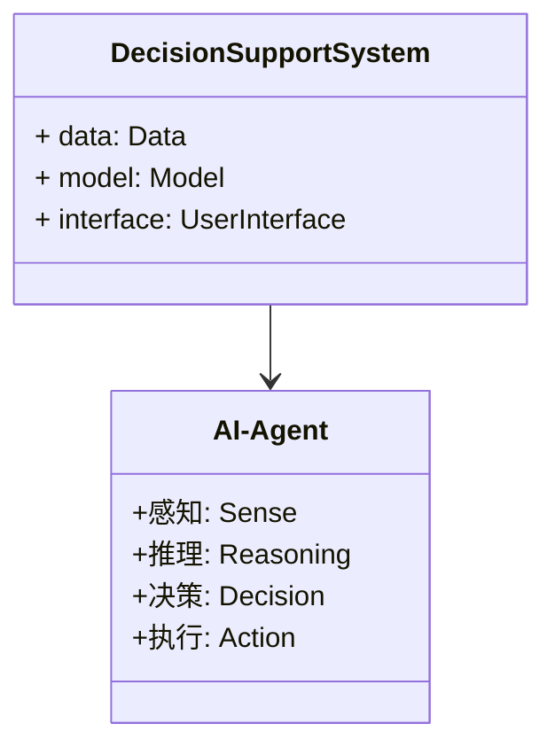
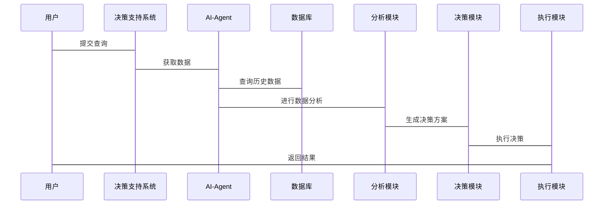

                 


```markdown
# AI Agent在企业决策支持系统中的应用

## 关键词
AI Agent, 企业决策支持系统, 强化学习, 多智能体协作, 系统架构设计

## 摘要
本文详细探讨了AI Agent在企业决策支持系统中的应用，从基本概念到算法原理，再到系统架构设计和项目实战，全面解析了AI Agent如何提升企业决策效率和准确性。通过具体案例分析和系统设计，展示了AI Agent在企业决策中的巨大潜力和实际价值。

---

## 第1章 AI Agent与企业决策支持系统概述

### 1.1 AI Agent的基本概念

#### 1.1.1 AI Agent的定义与特点
AI Agent（人工智能代理）是一种能够感知环境、自主决策并执行任务的智能实体。其特点包括：
1. **自主性**：无需外部干预，自主完成任务。
2. **反应性**：能够实时感知环境变化并做出反应。
3. **目标导向**：基于目标驱动决策。
4. **学习能力**：通过经验不断优化行为。

#### 1.1.2 AI Agent的核心要素
- **感知模块**：接收环境输入，如传感器数据。
- **推理模块**：处理信息，进行逻辑推理或概率计算。
- **决策模块**：基于推理结果做出最优决策。
- **执行模块**：将决策转化为具体行动。

#### 1.1.3 AI Agent与传统决策支持系统的区别
| 特性 | AI Agent | 传统决策支持系统 |
|------|-----------|-------------------|
| 自主性 | 高         | 低               |
| 学习能力 | 强         | 无或弱           |
| 响应速度 | 实时       | 延迟             |

### 1.2 企业决策支持系统的基本原理

#### 1.2.1 决策支持系统的定义与作用
决策支持系统（DSS）是通过数据处理、模型分析和知识推理，辅助人类决策者制定决策的工具。其作用包括：
1. 提供数据支持。
2. 建立决策模型。
3. 生成多种决策方案。

#### 1.2.2 传统决策支持系统的局限性
- 数据处理能力有限。
- 模型更新缓慢。
- 缺乏自主学习能力。

#### 1.2.3 AI Agent在决策支持系统中的优势
AI Agent的引入使得DSS更加智能和动态，能够实时适应环境变化，提供更精准的决策支持。

---

## 第2章 AI Agent的核心概念与原理

### 2.1 AI Agent的感知与推理机制

#### 2.1.1 感知环境的方式
AI Agent通过传感器、数据库或API获取环境信息。例如：
- **传感器**：实时采集物理环境数据。
- **数据库**：查询历史数据。
- **API**：调用外部服务获取信息。

#### 2.1.2 推理与知识表示
- **知识表示**：将知识以符号、规则或概率分布的形式表示。
- **推理机制**：通过逻辑推理或概率计算得出结论。

#### 2.1.3 决策与规划
基于推理结果，AI Agent制定行动计划。例如：
- **路径规划**：使用A*算法寻找最优路径。
- **任务分配**：通过多智能体协作分配任务。

### 2.2 AI Agent的执行与反馈机制

#### 2.2.1 行动规划
AI Agent根据决策结果制定行动计划，并通过执行模块将其转化为具体行动。

#### 2.2.2 反馈机制
AI Agent通过反馈机制不断优化行为，例如：
- **强化学习**：通过奖励机制调整行为策略。
- **监督学习**：通过标注数据修正模型。

#### 2.2.3 自适应优化
AI Agent能够根据反馈动态调整参数，以提高决策的准确性和效率。

### 2.3 AI Agent的分类与应用场景

#### 2.3.1 分类与特征对比
| 类型       | 特点               | 应用场景               |
|------------|--------------------|------------------------|
| 简单反射型 | 基于条件反射       | 自动化任务             |
| 基于模型型 | 基于内部模型推理   | 复杂决策问题           |
| 学习型     | 具备自主学习能力   | 数据分析与预测         |

#### 2.3.2 不同类型AI Agent的适用场景
- **简单反射型**：适用于规则明确的场景，如自动化监控。
- **基于模型型**：适用于需要复杂推理的场景，如金融投资决策。
- **学习型**：适用于数据驱动的场景，如销售预测和客户行为分析。

#### 2.3.3 AI Agent在企业决策中的应用案例
1. **销售预测**：通过学习型AI Agent分析历史销售数据，预测未来趋势。
2. **投资决策**：基于模型型AI Agent评估市场风险，制定投资策略。

---

## 第3章 AI Agent在企业决策支持系统中的算法原理

### 3.1 AI Agent的核心算法

#### 3.1.1 逻辑推理算法
- **定义**：基于逻辑规则进行推理，得出确定性结论。
- **示例**：专家系统中基于规则的推理。

#### 3.1.2 概率推理算法
- **定义**：基于概率论进行推理，考虑不确定性因素。
- **示例**：贝叶斯网络用于风险评估。

#### 3.1.3 强化学习算法
- **定义**：通过试错机制，学习最优策略。
- **示例**：在投资组合优化中应用Q-learning算法。

### 3.2 算法原理的数学模型

#### 3.2.1 逻辑推理的布尔代数模型
$$ P \land Q $$

#### 3.2.2 概率推理的贝叶斯网络模型
$$ P(A|B) = \frac{P(B|A)P(A)}{P(B)} $$

#### 3.2.3 强化学习的马尔可夫决策过程模型
$$ Q(s, a) = r + \gamma \max_{a'} Q(s', a') $$

### 3.3 算法实现的伪代码示例

#### 3.3.1 逻辑推理算法伪代码
```python
def logical_reasoning(rules, facts):
    for rule in rules:
        if all(fact in facts for fact in rule['premises']):
            return rule['conclusion']
    return None
```

#### 3.3.2 概率推理算法伪代码
```python
def bayesian_inference(priors, likelihoods):
    posterior = {}
    for h in priors:
        p = priors[h]
        for d in likelihoods:
            if d['h'] == h:
                p *= d['p']
        posterior[h] = p
    return posterior
```

#### 3.3.3 强化学习算法伪代码
```python
def q_learning(env, alpha=0.1, gamma=0.9):
    Q = defaultdict(lambda: 0)
    for _ in range(episodes):
        state = env.reset()
        while not done:
            action = choose_action(Q, state)
            next_state, reward, done = env.step(action)
            Q[state][action] = Q[state][action] * (1 - alpha) + alpha * (reward + gamma * max(Q[next_state].values()))
    return Q
```

### 3.4 本章小结

---

## 第4章 企业决策支持系统的系统架构与设计

### 4.1 问题场景介绍
企业面临复杂决策问题，如供应链优化、市场预测等，传统DSS难以实时响应和自主学习。

### 4.2 系统功能设计

#### 4.2.1 领域模型（Mermaid类图）


### 4.3 系统架构设计（Mermaid架构图）


### 4.4 系统接口设计

#### 4.4.1 接口定义
- **输入接口**：接收用户查询或系统反馈。
- **输出接口**：提供决策建议或执行结果。

### 4.5 系统交互设计（Mermaid序列图）


### 4.6 本章小结

---

## 第5章 项目实战：AI Agent在企业决策支持系统中的实现

### 5.1 环境安装
安装Python、TensorFlow、Scikit-learn等库。

### 5.2 核心实现源代码

#### 5.2.1 数据预处理代码
```python
import pandas as pd

def preprocess_data(data_path):
    data = pd.read_csv(data_path)
    # 删除缺失值
    data = data.dropna()
    # 标准化处理
    from sklearn.preprocessing import StandardScaler
    scaler = StandardScaler()
    data[['feature1', 'feature2']] = scaler.fit_transform(data[['feature1', 'feature2']])
    return data
```

#### 5.2.2 模型训练代码
```python
from sklearn.model_selection import train_test_split
from sklearn.ensemble import RandomForestClassifier

def train_model(data, target):
    X_train, X_test, y_train, y_test = train_test_split(data.drop(columns=[target]), data[target], test_size=0.2)
    model = RandomForestClassifier()
    model.fit(X_train, y_train)
    return model
```

#### 5.2.3 模型评估代码
```python
from sklearn.metrics import accuracy_score

def evaluate_model(model, X_test, y_test):
    y_pred = model.predict(X_test)
    print(f'Accuracy: {accuracy_score(y_test, y_pred)}')
```

### 5.3 案例分析与详细讲解
以销售预测为例，展示如何通过AI Agent优化决策过程。

### 5.4 项目小结

---

## 第6章 总结与展望

### 6.1 总结
AI Agent通过提升决策支持系统的智能化水平，帮助企业做出更高效和精准的决策。

### 6.2 展望
未来，AI Agent将在更多领域发挥重要作用，如智能供应链、智能金融等。

---

## 最佳实践 Tips

- **数据质量**：确保数据准确性和完整性。
- **模型优化**：定期更新模型，适应环境变化。
- **人机协作**：结合人类专家的判断，避免AI决策的局限性。

---

## 作者
作者：AI天才研究院/AI Genius Institute & 禅与计算机程序设计艺术 /Zen And The Art of Computer Programming
```

