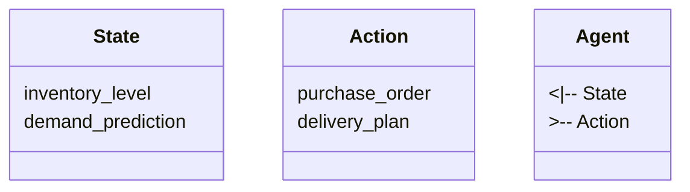
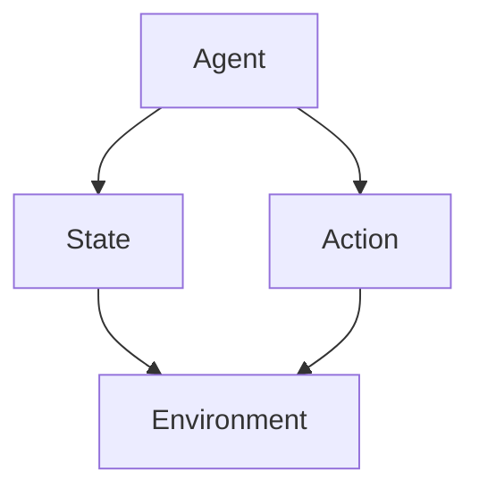
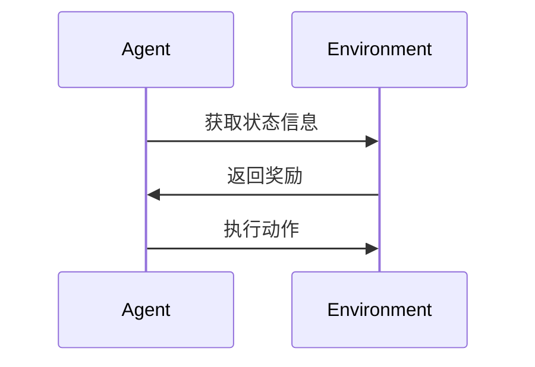

                 


# AI Agent在企业决策支持系统中的角色与实现

> 关键词：AI Agent, 企业决策支持系统, 人工智能, 决策模型, 强化学习

> 摘要：本文探讨了AI Agent在企业决策支持系统中的角色与实现。从AI Agent的基本概念和核心原理出发，详细分析了其在企业决策支持中的应用场景和系统架构设计。通过具体的算法实现和项目案例，展示了AI Agent如何通过强化学习和机器学习等技术提升企业决策的智能化水平。最后，本文总结了AI Agent在企业决策支持中的优势与挑战，并展望了未来的发展方向。

---

## 第一部分: AI Agent在企业决策支持系统中的背景与概述

### 第1章: AI Agent的基本概念与应用价值

#### 1.1 AI Agent的定义与特点

##### 1.1.1 AI Agent的定义
AI Agent（人工智能代理）是指能够感知环境、自主决策并执行任务的智能实体。它通过传感器获取信息，利用算法进行分析和推理，并通过执行器与环境交互。AI Agent的核心目标是通过智能化的方式优化决策过程，提高系统的效率和准确性。

##### 1.1.2 AI Agent的核心特点
- **自主性**：AI Agent能够自主感知环境并做出决策，无需人工干预。
- **反应性**：能够实时响应环境的变化，动态调整决策策略。
- **学习性**：通过机器学习算法不断优化自身的决策能力。
- **协作性**：能够与其他AI Agent或系统协同工作，共同完成复杂任务。

##### 1.1.3 AI Agent与传统决策系统的区别
传统的决策支持系统依赖于规则和静态数据，而AI Agent能够动态适应环境变化，具备学习和自适应能力。例如，传统的系统可能需要手动调整规则，而AI Agent可以通过强化学习不断优化决策策略。

---

#### 1.2 企业决策支持系统的需求与挑战

##### 1.2.1 传统企业决策支持系统的局限性
传统的企业决策支持系统通常基于规则和静态数据分析，难以应对复杂多变的环境。例如，面对市场需求波动或供应链问题时，传统系统可能无法及时调整策略。

##### 1.2.2 企业决策支持系统的新需求
现代企业需要更加智能化的决策支持系统，能够实时分析数据、动态调整策略并预测未来趋势。这要求系统具备更强的实时性和自适应能力。

##### 1.2.3 AI Agent在企业决策支持中的价值
AI Agent通过实时感知环境、动态优化决策，能够显著提升企业的决策效率和准确性。例如，在供应链管理中，AI Agent可以实时监控库存变化并自动调整采购策略。

---

#### 1.3 AI Agent在企业中的应用现状

##### 1.3.1 AI Agent在企业中的典型应用场景
- **供应链管理**：实时监控库存和物流，优化采购和配送策略。
- **市场营销**：根据用户行为动态调整营销策略。
- **风险管理**：实时监测市场风险，制定应对措施。

##### 1.3.2 AI Agent技术的发展趋势
随着深度学习和强化学习技术的进步，AI Agent在企业中的应用将更加广泛和智能化。未来，AI Agent将具备更强的自适应能力和协作能力。

##### 1.3.3 AI Agent在企业中的成功案例
例如，某电商平台使用AI Agent实时分析用户行为，动态调整推荐策略，显著提升了销售额。

---

## 第二部分: AI Agent的核心概念与原理

### 第2章: AI Agent的核心概念与原理

#### 2.1 AI Agent的体系结构

##### 2.1.1 AI Agent的基本组成
- **感知层**：通过传感器获取环境信息。
- **决策层**：利用算法进行分析和推理，制定决策。
- **执行层**：通过执行器将决策转化为具体行动。

##### 2.1.2 不同类型AI Agent的对比
| 类型       | 特点                                   |
|------------|--------------------------------------|
| 基于规则的 | 依赖预定义的规则，决策过程简单。      |
| 基于学习的 | 通过机器学习算法不断优化决策策略。    |
| 基于强化学习的 | 通过试错和奖励机制优化决策。          |

##### 2.1.3 AI Agent的交互机制
AI Agent通过与环境的交互不断优化自身的决策能力。例如，在游戏中，AI Agent通过试错学习最佳策略。

---

#### 2.2 AI Agent的决策模型

##### 2.2.1 基于规则的决策模型
基于规则的决策模型通过预定义的规则进行决策。例如，当库存低于某个阈值时，自动触发采购订单。

##### 2.2.2 基于机器学习的决策模型
基于机器学习的决策模型通过历史数据训练模型，预测未来趋势并制定决策。

##### 2.2.3 基于强化学习的决策模型
基于强化学习的决策模型通过试错和奖励机制优化决策策略。例如，在游戏中，AI Agent通过不断尝试不同的策略，最终找到最优解。

---

#### 2.3 AI Agent的学习机制

##### 2.3.1 监督学习在AI Agent中的应用
监督学习通过训练数据学习输入与输出之间的映射关系，用于分类、回归等任务。

##### 2.3.2 强化学习在AI Agent中的应用
强化学习通过试错和奖励机制优化决策策略。例如，在棋类游戏中，AI Agent通过不断尝试不同的走法，最终找到最优策略。

##### 2.3.3 深度学习在AI Agent中的应用
深度学习通过多层神经网络提取数据特征，用于图像识别、语音识别等任务。

---

## 第三部分: AI Agent的算法原理

### 第3章: 基于强化学习的AI Agent算法实现

#### 3.1 强化学习的基本原理

##### 3.1.1 强化学习的定义
强化学习是一种通过试错和奖励机制优化决策策略的算法。AI Agent通过与环境交互，不断探索最优策略。

##### 3.1.2 强化学习的核心要素
- **状态（State）**：环境的当前情况。
- **动作（Action）**：AI Agent采取的行动。
- **奖励（Reward）**：环境对AI Agent行为的反馈。
- **策略（Policy）**：AI Agent选择动作的概率分布。

##### 3.1.3 强化学习的数学模型
强化学习的目标是通过最大化累计奖励来优化策略。数学模型如下：
$$ V(s) = \max_a Q(s,a) $$
其中，$V(s)$ 是状态 $s$ 的价值函数，$Q(s,a)$ 是状态 $s$ 下动作 $a$ 的价值函数。

---

#### 3.2 基于强化学习的AI Agent实现

##### 3.2.1 算法实现步骤
1. 初始化策略参数。
2. 与环境交互，获取状态和奖励。
3. 更新策略参数以最大化累计奖励。

##### 3.2.2 强化学习的代码实现（Python）

```python
import numpy as np

class AI_Agent:
    def __init__(self, state_space, action_space):
        self.state_space = state_space
        self.action_space = action_space
        self.theta = np.random.randn(1, state_space)

    def take_action(self, state):
        action_probs = np.exp(self.theta * state) / np.sum(np.exp(self.theta * state))
        action = np.random.choice(self.action_space, p=action_probs)
        return action

    def update_policy(self, rewards):
        self.theta += 0.01 * rewards.mean()
```

---

## 第四部分: AI Agent在企业决策支持系统中的应用

### 第4章: 企业决策支持系统的系统分析与架构设计

#### 4.1 企业决策支持系统的需求分析

##### 4.1.1 问题场景介绍
假设我们正在设计一个供应链管理的决策支持系统，需要实时监控库存和物流情况，并动态调整采购和配送策略。

##### 4.1.2 系统功能设计
- **库存监控**：实时跟踪库存水平。
- **需求预测**：基于历史数据预测未来需求。
- **策略优化**：根据需求预测和库存情况，优化采购和配送策略。

##### 4.1.3 领域模型类图


---

#### 4.2 系统架构设计

##### 4.2.1 系统架构图


##### 4.2.2 系统接口设计
- **输入接口**：接收环境的状态信息。
- **输出接口**：输出优化后的策略。

##### 4.2.3 系统交互流程


---

## 第五部分: 项目实战

### 第5章: 基于AI Agent的企业决策支持系统实现

#### 5.1 项目环境搭建

##### 5.1.1 安装必要的库
```bash
pip install numpy matplotlib
```

##### 5.1.2 环境配置
```python
import numpy as np
import matplotlib.pyplot as plt
```

---

#### 5.2 系统核心实现

##### 5.2.1 AI Agent的核心实现
```python
class SupplyChainAgent:
    def __init__(self, inventory_limit):
        self.inventory = 0
        self.inventory_limit = inventory_limit

    def get_state(self):
        return self.inventory

    def take_action(self, action):
        if action == 'purchase':
            self.inventory = min(self.inventory + 1, self.inventory_limit)
        elif action == 'do_nothing':
            pass
        return self.inventory

    def get_reward(self):
        if self.inventory == self.inventory_limit:
            return 1
        else:
            return 0
```

##### 5.2.2 系统运行与测试
```python
agent = SupplyChainAgent(inventory_limit=5)
state = agent.get_state()
action = 'purchase' if state < 3 else 'do_nothing'
new_state = agent.take_action(action)
reward = agent.get_reward()
print(f"State: {state}, Action: {action}, Reward: {reward}")
```

---

## 第六部分: 总结与展望

### 第6章: 总结与展望

#### 6.1 总结
本文详细探讨了AI Agent在企业决策支持系统中的角色与实现。从AI Agent的基本概念到算法实现，再到系统设计和项目实战，全面展示了AI Agent在企业中的应用价值和实现方法。

#### 6.2 未来展望
随着AI技术的不断发展，AI Agent在企业决策支持系统中的应用将更加广泛和智能化。未来的研究方向包括：
- 更高效的强化学习算法。
- 更智能的多智能体协作机制。
- 更强大的实时决策能力。

#### 6.3 最佳实践Tips
- 在实际应用中，建议结合企业的具体需求选择合适的AI Agent技术。
- 定期更新和优化AI Agent的决策模型，以应对环境的变化。

---

## 作者

作者：AI天才研究院/AI Genius Institute & 禅与计算机程序设计艺术 /Zen And The Art of Computer Programming

