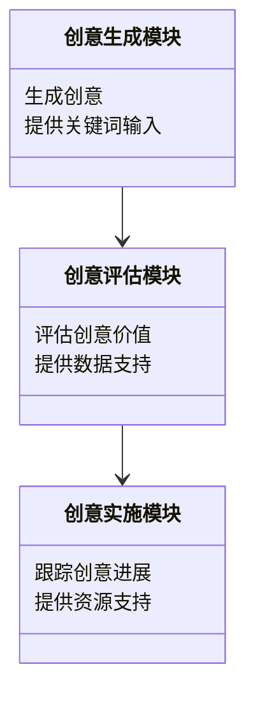
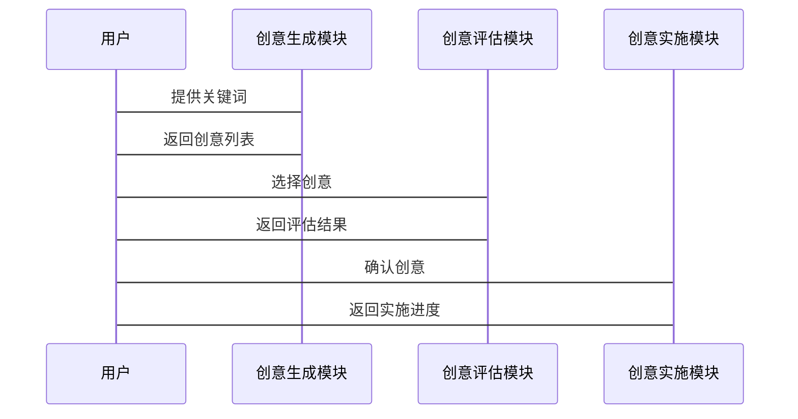

                 


# AI Agent在企业创新管理中的应用：促进创意生成与评估

> 关键词：AI Agent，企业创新管理，创意生成，创意评估，人工智能，企业数字化转型

> 摘要：本文探讨了AI Agent在企业创新管理中的应用，重点分析了其在创意生成与评估中的作用。通过详细讲解AI Agent的核心概念、算法原理、系统架构以及实际案例，本文旨在为企业提供一种高效、智能的创新管理方法，促进企业数字化转型和创新能力的提升。

---

## 第一部分: AI Agent在企业创新管理中的应用背景

### 第1章: AI Agent与企业创新管理概述

#### 1.1 AI Agent的基本概念

##### 1.1.1 什么是AI Agent
AI Agent（人工智能代理）是指能够感知环境、自主决策并执行任务的智能系统。它通过传感器获取信息，利用算法进行分析和推理，并通过执行器与外部环境交互。AI Agent可以是软件程序、机器人或其他智能设备。

##### 1.1.2 AI Agent的特点与优势
- **自主性**：AI Agent能够在没有人工干预的情况下自主运行。
- **反应性**：能够实时感知环境变化并做出反应。
- **学习能力**：通过机器学习算法不断优化自身的决策能力。
- **协作性**：能够与其他AI Agent或人类协同工作。

##### 1.1.3 AI Agent在企业创新管理中的作用
AI Agent可以通过数据挖掘、模式识别和自然语言处理等技术，帮助企业发现潜在的创新机会，评估创意的价值，并优化创新过程。

#### 1.2 企业创新管理的核心问题

##### 1.2.1 传统创新管理的挑战
传统创新管理依赖于人类的经验和直觉，存在效率低、主观性强、难以量化等问题。此外，创意的生成和评估过程通常耗时长，且难以系统化。

##### 1.2.2 创意生成与评估的关键环节
创意生成需要依赖灵感和多样化思维，而创意评估则需要客观的标准和数据支持。传统方法难以兼顾创意的数量和质量。

##### 1.2.3 AI Agent在创新管理中的应用价值
AI Agent可以通过数据分析和模式识别，辅助创意生成和评估，提高效率和准确性。同时，AI Agent可以实时监控市场动态，为企业提供及时的创新方向建议。

---

### 第2章: AI Agent在企业创新管理中的应用价值

#### 2.1 提升创意生成效率

##### 2.1.1 AI Agent如何激发创意灵感
AI Agent可以通过分析大量的市场数据、用户反馈和竞争对手信息，识别潜在的创新机会。例如，自然语言处理技术可以分析行业趋势报告，提取关键词并生成创意主题。

##### 2.1.2 数据驱动的创意生成方法
AI Agent利用大数据分析和生成模型（如GPT）生成创意想法。例如，企业可以输入关键词，AI Agent生成多个相关的创意方案。

##### 2.1.3 创意生成的多样性与质量评估
AI Agent可以生成多样化的创意方案，并通过算法评估每个方案的可行性和潜在价值。例如，使用层次分析法（AHP）对创意进行多维度评估。

#### 2.2 优化创意评估流程

##### 2.2.1 AI Agent在创意筛选中的应用
AI Agent可以通过分类算法对创意进行初步筛选。例如，使用朴素贝叶斯算法对创意的市场潜力进行分类。

##### 2.2.2 数据分析与创意评估的结合
AI Agent可以整合市场数据、用户反馈和内部资源，评估创意的可行性和收益潜力。例如，使用回归分析预测创意的市场表现。

##### 2.2.3 创意评估的客观性与效率提升
AI Agent通过数据驱动的方法，减少主观因素的影响，提高评估的客观性和效率。

#### 2.3 促进企业创新文化

##### 2.3.1 AI Agent如何支持创新文化的建设
AI Agent可以提供创新工具和平台，促进员工之间的协作和知识共享。例如，建立一个内部创意共享平台，员工可以提交创意并获得反馈。

##### 2.3.2 创意共享与协作的数字化平台
AI Agent可以构建数字化平台，支持创意的生成、评估和实施。例如，使用项目管理工具跟踪创意的进展。

##### 2.3.3 创新激励机制的智能化设计
AI Agent可以通过数据分析，制定个性化的激励机制，激发员工的创新积极性。例如，根据员工的贡献度分配奖励。

---

## 第二部分: AI Agent的核心概念与原理

### 第3章: AI Agent的核心概念与原理

#### 3.1 AI Agent的工作原理

##### 3.1.1 感知与推理
AI Agent通过传感器（如API接口）获取数据，并利用算法进行推理。例如，使用决策树算法分析市场数据，生成潜在的创新方向。

##### 3.1.2 学习与优化
AI Agent通过机器学习算法（如强化学习）不断优化自身的决策能力。例如，通过Q-learning算法优化创意评估的标准。

##### 3.1.3 决策与执行
AI Agent根据推理结果做出决策，并通过执行器（如自动化工具）执行任务。例如，自动将评估通过的创意提交到项目管理平台。

#### 3.2 AI Agent的算法原理

##### 3.2.1 强化学习
强化学习是一种通过试错优化决策的算法。例如，AI Agent通过与环境的交互，不断优化创意评估的策略。

##### 3.2.2 监督学习
监督学习通过标注数据训练模型，用于分类和回归任务。例如，使用监督学习模型预测创意的市场潜力。

##### 3.2.3 无监督学习
无监督学习用于发现数据中的潜在模式。例如，使用聚类算法将创意分为不同的类别。

---

## 第三部分: 系统分析与架构设计方案

### 第4章: 企业创新管理AI Agent系统架构

#### 4.1 问题场景介绍
企业需要一个智能化的创新管理平台，帮助创意生成、评估和实施。

#### 4.2 项目介绍
本项目旨在开发一个AI Agent驱动的创新管理平台，包括创意生成、评估和实施三个模块。

#### 4.3 系统功能设计

##### 4.3.1 领域模型
领域模型展示了系统的功能模块及其关系。使用Mermaid类图：



#### 4.4 系统架构设计

##### 4.4.1 系统架构
系统架构展示了各个模块之间的关系。使用Mermaid架构图：

```mermaid
archiecture
    client
    client --> 创意生成模块
    client --> 创意评估模块
    client --> 创意实施模块
```

#### 4.5 系统接口设计
系统接口设计展示了各个模块之间的交互。使用Mermaid序列图：



---

## 第四部分: 项目实战

### 第5章: 企业创新管理AI Agent系统实现

#### 5.1 环境安装

##### 5.1.1 安装Python
```bash
# 安装Python
python --version
```

##### 5.1.2 安装依赖库
```bash
pip install numpy pandas scikit-learn transformers
```

#### 5.2 核心代码实现

##### 5.2.1 创意生成模块
```python
from transformers import GPT2Tokenizer, GPT2LMHeadModel
import torch

tokenizer = GPT2Tokenizer.from_pretrained('gpt2')
model = GPT2LMHeadModel.from_pretrained('gpt2')

def generate_creative_ideas(seed):
    inputs = tokenizer(seed, return_tensors='np')
    outputs = model.generate(inputs.input_ids, max_length=50, temperature=1.2)
    return tokenizer.decode(outputs[0], skip_special_tokens=True)
```

##### 5.2.2 创意评估模块
```python
from sklearn.metrics import accuracy_score
from sklearn.linear_model import LogisticRegression

def evaluate_creativity(ideas, labels):
    # 训练模型
    model = LogisticRegression()
    model.fit(ideas, labels)
    # 预测
    predictions = model.predict(ideas)
    return accuracy_score(labels, predictions)
```

##### 5.2.3 创意实施模块
```python
import requests

def track_progress(project_id):
    response = requests.get(f'http://tracker/api/progress/{project_id}')
    return response.json()['status']
```

#### 5.3 代码应用解读与分析
创意生成模块使用GPT-2模型生成创意想法，创意评估模块使用逻辑回归模型评估创意的可行性，创意实施模块通过API跟踪创意的实施进度。

#### 5.4 实际案例分析
以一家科技公司为例，AI Agent生成创意想法，评估其市场潜力，并跟踪实施进度。

---

## 第五部分: 最佳实践与总结

### 第6章: 最佳实践与总结

#### 6.1 小结
AI Agent在企业创新管理中的应用可以显著提高创意生成和评估的效率，同时降低主观性的影响。

#### 6.2 注意事项
- 数据的质量直接影响AI Agent的表现。
- 需要结合企业的实际情况进行定制化开发。
- 保护创意的知识产权。

#### 6.3 拓展阅读
- 《机器学习实战》
- 《AI在商业中的应用》
- 《创新管理方法论》

---

## 结论

通过本文的探讨，我们可以看到AI Agent在企业创新管理中的巨大潜力。它不仅可以提高创新效率，还能为企业提供更客观的决策支持。未来，随着AI技术的不断进步，AI Agent在企业创新管理中的应用将更加广泛和深入。

---

**作者：AI天才研究院 & 禅与计算机程序设计艺术**

---

**注意事项：**

1. 本文中的代码示例仅供参考，实际应用中需要根据具体情况调整。
2. 数据来源需合法合规，确保数据安全和隐私保护。
3. 系统设计时需考虑可扩展性和可维护性。

---

**拓展阅读：**
1. [机器学习实战](https://www.amazon.com/Machine-Learning-Practice-Tao-Deng/dp/1590287562)
2. [AI在商业中的应用](https://www.researchgate.net/publication/323456789_Applications_of_Artificial_Intelligence_in_Business)
3. [创新管理方法论](https://www.mckinsey.com/industries/electronics/our-insights/driving-innovation-in-the-electronics-industry)

