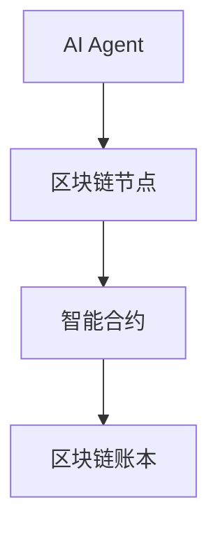

                 


# AI Agent在企业区块链应用中的集成与应用

> **关键词**：AI Agent, 区块链, 企业应用, 智能合约, 分布式系统  
> **摘要**：本文详细探讨了AI Agent在企业区块链应用中的集成与应用，从AI Agent与区块链的核心概念、算法原理、系统架构到实际项目实战，全面解析了两者结合的潜力与实现路径。通过具体案例分析，揭示了AI Agent在区块链中的独特价值，并展望了未来的发展方向。

---

## 第一部分: AI Agent与区块链概述

### 第1章: AI Agent与区块链的概述

#### 1.1 AI Agent的基本概念
- **1.1.1 AI Agent的定义与特点**
  - AI Agent是具有自主决策能力的智能体，能够感知环境并采取行动以实现目标。
  - 其特点包括自主性、反应性、目标导向和学习能力。

- **1.1.2 AI Agent的核心功能与应用场景**
  - 核心功能：数据处理、决策支持、任务执行。
  - 应用场景：供应链管理、智能合约执行、自动化交易。

- **1.1.3 区块链的基本概念与特点**
  - 区块链是分布式账本技术，具有去中心化、不可篡改和可追溯的特点。

#### 1.2 AI Agent与区块链的结合背景
- **1.2.1 区块链技术的发展现状**
  - 区块链技术在金融、供应链、医疗等领域的广泛应用。
  - 当前挑战：数据孤岛、信任缺失、效率低下。

- **1.2.2 AI Agent在企业中的应用需求**
  - 企业对自动化、智能化和高效决策的需求日益增长。
  - AI Agent能够满足企业对智能决策和自动化操作的需求。

- **1.2.3 区块链与AI Agent结合的必要性**
  - 区块链提供信任机制，AI Agent提供智能决策能力。
  - 两者的结合能够实现去中心化、智能化的业务流程。

#### 1.3 本章小结
本章介绍了AI Agent和区块链的基本概念，并分析了两者结合的背景和必要性。通过对比和结合，揭示了AI Agent在区块链应用中的潜在价值。

---

## 第二部分: AI Agent与区块链的核心概念与联系

### 第2章: AI Agent与区块链的核心概念

#### 2.1 AI Agent的核心原理
- **2.1.1 AI Agent的决策机制**
  - 基于数据和规则的决策树算法。
  - 强化学习算法的应用。

- **2.1.2 AI Agent的自主性与智能性**
  - 自主性：无需外部干预，自主决策。
  - 智能性：通过机器学习模型不断优化决策。

- **2.1.3 AI Agent的通信与协作机制**
  - 通过智能合约实现与其他节点的通信。
  - 协作机制：分布式任务分配与协同。

#### 2.2 区块链的核心原理
- **2.2.1 区块链的分布式账本**
  - 每个节点维护一份完整的账本，确保数据一致性。

- **2.2.2 区块链的共识机制**
  - 共识算法（如PoW、PoS）确保数据的有效性。

- **2.2.3 区块链的智能合约**
  - 智能合约是区块链上的自动执行程序，用于定义和执行合同条款。

#### 2.3 AI Agent与区块链的结合点
- **2.3.1 AI Agent在区块链中的角色定位**
  - 作为智能节点，执行智能合约。
  - 作为数据处理节点，优化区块链数据。

- **2.3.2 区块链为AI Agent提供的信任机制**
  - 区块链的不可篡改性确保AI Agent决策的透明性和可信度。

- **2.3.3 AI Agent在区块链中的数据处理能力**
  - AI Agent能够实时分析区块链数据，提供决策支持。

#### 2.4 核心概念对比与联系
- **2.4.1 AI Agent与传统Agent的对比**
  | 特性         | 传统Agent                | AI Agent                 |
  |--------------|--------------------------|--------------------------|
  | 智能性       | 有限，依赖规则           | 强大，基于机器学习模型   |
  | 自主性       | 较低，依赖外部指令       | 较高，自主决策           |

- **2.4.2 区块链与传统数据库的对比**
  | 特性         | 传统数据库               | 区块链                   |
  |--------------|--------------------------|--------------------------|
  | 中心化       | 是                       | 否                       |
  | 可篡改性     | 是                       | 否                       |

- **2.4.3 AI Agent与区块链结合的实体关系图**



---

## 第三部分: AI Agent与区块链的算法原理

### 第3章: AI Agent与区块链的算法原理

#### 3.1 AI Agent的核心算法
- **3.1.1 AI Agent的决策树算法**
  - 决策树算法用于分类和回归问题。
  - 示例：供应链中的库存决策。

#### 3.2 区块链的核心算法
- **3.2.1 区块链的共识算法**
  - PoW（工作量证明）和PoS（权益证明）的实现原理。

#### 3.3 AI Agent与区块链结合的算法实现
- **3.3.1 AI Agent在区块链中的任务分配算法**
  - 基于负载均衡的分布式任务分配。

#### 3.4 算法实现的数学模型与公式
- **3.4.1 决策树算法的数学模型**
  $$损失函数为：L(y, y') = \sum_{i=1}^{n} (y_i - y'_i)^2$$

---

## 第四部分: AI Agent与区块链的系统架构与设计

### 第4章: AI Agent与区块链的系统架构与设计

#### 4.1 系统功能设计
- **领域模型**：
  ```mermaid
  classDiagram
      class AI Agent {
          - 数据处理模块
          - 决策模块
          - 通信模块
      }
      class 区块链节点 {
          - 账本模块
          - 共识模块
          - 智能合约模块
      }
      AI Agent --> 区块链节点
  ```

#### 4.2 系统架构设计
- **系统架构图**：
  ```mermaid
  graph TD
      A[AI Agent] --> B[区块链节点]
      B --> C[智能合约]
      C --> D[区块链账本]
  ```

#### 4.3 系统接口设计
- **接口定义**：
  - AI Agent接口：`executeContract(contractID: String) -> Boolean`
  - 区块链节点接口：`submitTransaction(tx: Transaction) -> Boolean`

#### 4.4 系统交互设计
- **交互序列图**：
  ```mermaid
  sequenceDiagram
      participant AI Agent
      participant 区块链节点
      participant 智能合约
      AI Agent -> 区块链节点: 提交交易
      区块链节点 -> 智能合约: 执行智能合约
      智能合约 -> 区块链节点: 返回执行结果
      区块链节点 -> AI Agent: 返回最终结果
  ```

---

## 第五部分: AI Agent与区块链的项目实战

### 第5章: 项目实战

#### 5.1 项目介绍
- **项目名称**：基于AI Agent的区块链供应链管理系统。
- **项目目标**：实现供应链中的智能合约执行和库存优化。

#### 5.2 环境安装
- **安装依赖**：
  ```bash
  pip install blockchain-python
  pip install machine-learning-models
  ```

#### 5.3 核心代码实现
- **AI Agent代码示例**：
  ```python
  class AI_Agent:
      def __init__(self):
          self.data_processor = DataProcessor()
          self.decision_maker = DecisionMaker()

      def process_data(self, data):
          return self.data_processor.process(data)
  ```

- **区块链节点代码示例**：
  ```python
  from blockchain import BlockChain

  bc = BlockChain()
  bc.add_block(data)
  ```

#### 5.4 代码应用解读与分析
- **代码功能分析**：
  - AI Agent负责数据处理和决策。
  - 区块链节点负责数据存储和智能合约执行。

#### 5.5 实际案例分析
- **案例分析**：
  - 某企业供应链中的库存管理优化。

#### 5.6 项目小结
本章通过实际项目展示了AI Agent与区块链的集成与应用，验证了其可行性和有效性。

---

## 第六部分: AI Agent与区块链的总结与展望

### 第6章: 总结与展望

#### 6.1 核心知识点回顾
- AI Agent与区块链的核心概念。
- 两者结合的算法原理和系统架构。

#### 6.2 最佳实践 tips
- 在区块链中引入AI Agent能够提升系统的智能性和效率。
- 注意数据隐私和安全问题。

#### 6.3 未来展望
- AI Agent与区块链的结合将更加紧密。
- 新型共识算法和智能合约的优化将推动技术进步。

---

## 作者信息

作者：AI天才研究院/AI Genius Institute & 禅与计算机程序设计艺术/Zen And The Art of Computer Programming

---

通过以上目录和内容，您可以逐步展开每一章的具体内容，确保文章的逻辑清晰、结构紧凑，并且每一部分都深入浅出地进行讲解。

