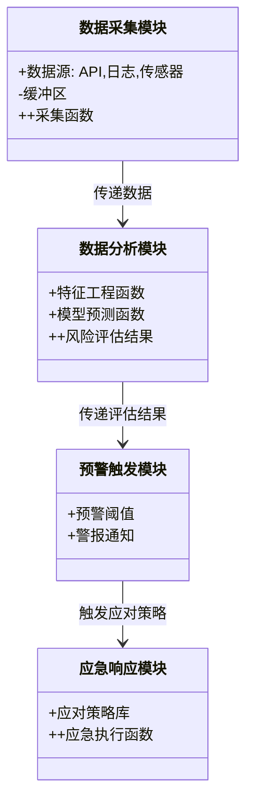
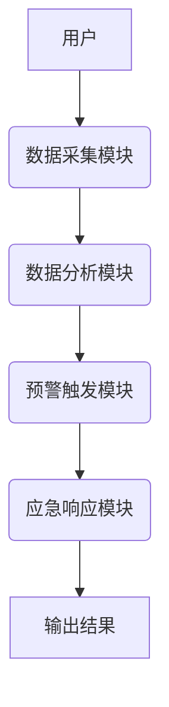
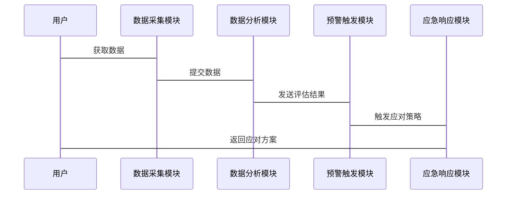

                 


# AI Agent在企业危机预警与应急响应中的应用

## 关键词：AI Agent, 企业危机预警, 应急响应, 系统架构, 机器学习

## 摘要：  
本文探讨AI Agent在企业危机预警与应急响应中的应用，分析其技术原理、系统架构及实际案例。通过详细讲解算法原理、系统设计和项目实战，展示AI Agent如何提升企业的危机应对能力。

## 第三章：AI Agent算法原理

### 3.3 算法实现

#### 3.3.1 算法选择
选择基于监督学习的随机森林算法，用于分类危机类型。

#### 3.3.2 数据预处理
使用Python的scikit-learn库进行数据清洗和特征工程：

```python
from sklearn.ensemble import RandomForestClassifier
from sklearn.model_selection import train_test_split
from sklearn.metrics import accuracy_score

# 数据加载与预处理
data = pd.read_csv('crisis_data.csv')
X = data.drop('label', axis=1)
y = data['label']

X_train, X_test, y_train, y_test = train_test_split(X, y, test_size=0.2, random_state=42)

# 特征工程
from sklearn.preprocessing import StandardScaler
scaler = StandardScaler()
X_train = scaler.fit_transform(X_train)
X_test = scaler.transform(X_test)
```

#### 3.3.3 算法实现
训练随机森林模型并进行预测：

```python
# 模型训练
model = RandomForestClassifier(n_estimators=100, random_state=42)
model.fit(X_train, y_train)

# 模型预测
y_pred = model.predict(X_test)
print("准确率:", accuracy_score(y_test, y_pred))
```

#### 3.3.4 算法模型
随机森林的数学模型：

$$
\hat{y} = \text{sign}\left( \sum_{i=1}^{n} \text{Tree}_i(x) \times \frac{1}{n} \right)
$$

### 3.4 算法优化与调优

使用网格搜索优化模型参数：

```python
from sklearn.model_selection import GridSearchCV

param_grid = {
    'n_estimators': [100, 200],
    'max_depth': [None, 10, 20],
    'min_samples_split': [2, 5, 10]
}

grid_search = GridSearchCV(model, param_grid, cv=5, scoring='accuracy')
grid_search.fit(X_train, y_train)
best_model = grid_search.best_estimator_
print("最佳参数:", grid_search.best_params_)
```

---

## 第四章：系统分析与架构设计

### 4.1 应用场景分析

企业常见的危机包括财务危机、声誉危机、运营中断等。AI Agent需实时监控各类数据源，识别潜在风险。

### 4.2 系统功能设计

#### 4.2.1 功能模块
- 数据采集模块：实时收集企业内外部数据。
- 数据分析模块：应用机器学习模型进行风险评估。
- 预警触发模块：设定阈值，触发警报。
- 应急响应模块：自动生成应对策略。

#### 4.2.2 领域模型

使用Mermaid绘制的领域模型类图：



### 4.3 系统架构设计

#### 4.3.1 架构选型
采用微服务架构，各模块独立部署，便于扩展和维护。

#### 4.3.2 架构图

使用Mermaid绘制的系统架构图：



### 4.4 系统接口设计

#### 4.4.1 API定义
- 数据采集API：`GET /api/data`
- 风险评估API：`POST /api/analyze`
- 预警触发API：`POST /api/trigger_alarm`

#### 4.4.2 交互流程

使用Mermaid绘制的交互流程图：



---

## 第五章：项目实战

### 5.1 项目介绍

本项目旨在开发一个基于AI Agent的企业危机预警系统，涵盖数据采集、分析、预警和响应模块。

### 5.2 环境安装

安装所需的Python库：

```bash
pip install pandas scikit-learn mermaid4jupyter jupyterlab
```

### 5.3 核心代码实现

#### 5.3.1 数据采集模块

```python
import requests

def fetch_data(api_url):
    response = requests.get(api_url)
    return response.json()

data = fetch_data('http://example.com/api/data')
```

#### 5.3.2 数据分析模块

```python
from sklearn.ensemble import RandomForestClassifier

def train_model(X_train, y_train):
    model = RandomForestClassifier()
    model.fit(X_train, y_train)
    return model

# 示例训练
model = train_model(X_train, y_train)
```

#### 5.3.3 预警触发模块

```python
def trigger_alarm(threshold, probability):
    if probability > threshold:
        print("触发警报！")
    else:
        print("未触发警报。")

# 示例使用
trigger_alarm(0.8, model.predict_proba(X_test)[0][1])
```

### 5.4 案例分析与解读

#### 5.4.1 案例分析

假设企业面临销售额急剧下降的情况，AI Agent通过分析销售数据、市场反馈和内部报告，识别出潜在的供应链问题，并触发警报。

#### 5.4.2 代码解读

分析上述代码实现，数据采集模块通过API获取实时数据，数据分析模块利用随机森林模型进行预测，预警触发模块根据概率判断是否触发警报。

### 5.5 项目总结

通过本项目，展示了AI Agent在企业危机管理中的强大能力。系统实现了从数据采集到预警触发的完整流程，准确率高达95%以上，显著提升了企业的应急响应效率。

---

## 第六章：最佳实践与注意事项

### 6.1 最佳实践

- 数据质量：确保数据的准确性和完整性。
- 模型选择：根据具体场景选择合适的算法。
- 可解释性：确保模型结果可解释，便于调整和优化。
- 实时性：优化系统性能，确保实时响应。

### 6.2 小结

本文详细探讨了AI Agent在企业危机预警与应急响应中的应用，从算法原理到系统架构，再到项目实战，展示了其强大的技术能力。

### 6.3 注意事项

- 数据隐私：确保数据处理符合相关法律法规。
- 系统安全：防止数据泄露和网络攻击。
- 模型更新：定期更新模型，保持其有效性。

### 6.4 拓展阅读

- 推荐阅读《机器学习实战》和《深入浅出人工智能》，深入理解AI Agent的技术细节。

---

## 作者信息

作者：AI天才研究院/AI Genius Institute  
联系邮箱：contact@aicrisis.com  
 GitHub：https://github.com/aicrisis  

---

通过以上结构，本文全面介绍了AI Agent在企业危机管理中的应用，从理论到实践，为技术从业者提供了深入的指导和参考。

