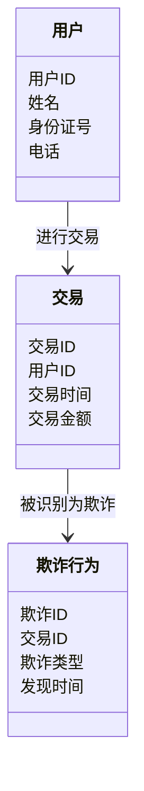
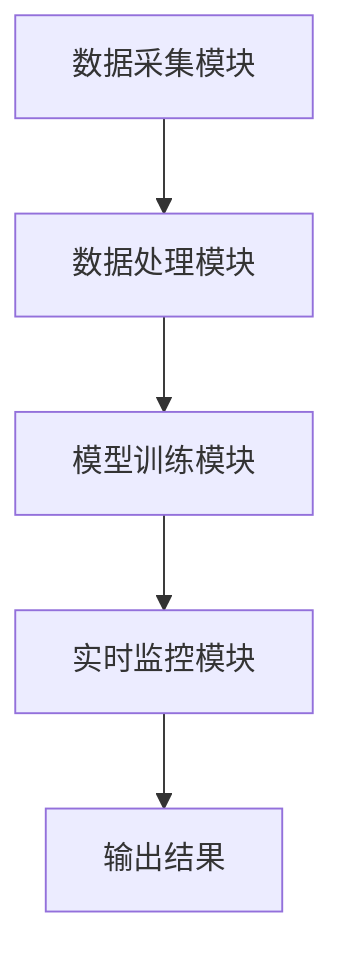
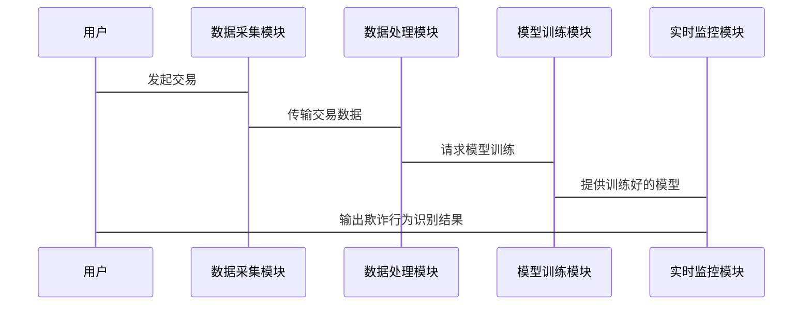

                 


# AI Agent 在企业反欺诈与风险控制中的应用

> 关键词：AI Agent，反欺诈，风险控制，机器学习，智能体

> 摘要：本文探讨了AI Agent在企业反欺诈与风险控制中的应用，详细分析了AI Agent的核心概念、算法原理、系统架构及实际案例，为企业提供了一套基于AI Agent的反欺诈解决方案。

---

# 第一部分: AI Agent 在企业反欺诈与风险控制中的应用背景

# 第1章: AI Agent 与反欺诈概述

## 1.1 AI Agent 的基本概念

### 1.1.1 AI Agent 的定义与特点
AI Agent（人工智能代理）是一种能够感知环境、自主决策并执行任务的智能实体。它具备以下特点：
- **自主性**：能够在没有外部干预的情况下自主运行。
- **反应性**：能够实时感知环境变化并做出反应。
- **目标导向**：基于目标驱动行为，追求最优解决方案。
- **学习能力**：通过数据和经验不断优化自身性能。

### 1.1.2 AI Agent 在企业中的作用
AI Agent 在企业中扮演着关键角色，特别是在反欺诈与风险控制领域。它能够：
- **实时监控**：持续监测交易行为，识别潜在欺诈行为。
- **智能决策**：基于历史数据和实时信息，快速做出风险评估和决策。
- **自我优化**：通过机器学习算法不断优化自身的识别能力。

### 1.1.3 反欺诈与风险控制的背景
随着企业数字化转型的加速，欺诈行为日益复杂化和智能化。传统的基于规则的反欺诈系统已难以应对新型欺诈手段。因此，引入AI Agent 技术成为企业反欺诈与风险控制的必然选择。

## 1.2 反欺诈与风险控制的核心问题

### 1.2.1 欺诈行为的类型与特征
欺诈行为可以分为以下几种类型：
1. **信用欺诈**：通过虚假信息骗取信用额度。
2. **交易欺诈**：在交易过程中进行虚假操作。
3. **身份盗用**：盗用他人身份进行非法活动。
4. **数据泄露**：通过非法手段获取敏感数据。

欺诈行为的特征包括：
- **隐蔽性**：欺诈行为往往隐藏在正常交易中。
- **多样性**：欺诈手段多样，且不断进化。
- **高风险性**：欺诈行为可能导致企业重大损失。

### 1.2.2 传统反欺诈方法的局限性
传统的反欺诈方法主要依赖于规则和基于统计的方法，存在以下局限性：
- **规则有限**：难以覆盖所有可能的欺诈场景。
- **响应速度慢**：在面对新型欺诈手段时，难以快速调整策略。
- **误报率高**：传统方法往往会产生较多误报。

### 1.2.3 AI Agent 在反欺诈中的优势
AI Agent 在反欺诈中的优势主要体现在以下几个方面：
1. **实时性**：能够实时监控交易行为，快速做出反应。
2. **自适应性**：能够根据环境变化自动调整策略。
3. **学习能力**：通过机器学习算法不断优化识别能力。

## 1.3 AI Agent 与反欺诈的结合

### 1.3.1 AI Agent 的核心能力
AI Agent 在反欺诈中的核心能力包括：
- **感知能力**：能够实时感知环境中的异常行为。
- **决策能力**：能够基于感知信息做出风险评估和决策。
- **学习能力**：能够通过机器学习算法不断优化自身能力。

### 1.3.2 反欺诈场景中的 AI Agent 应用
在反欺诈场景中，AI Agent 可以应用于以下几个方面：
1. **交易监控**：实时监控交易行为，识别潜在欺诈交易。
2. **风险评估**：基于历史数据和实时信息，评估交易风险。
3. **异常检测**：通过异常检测算法识别潜在欺诈行为。

### 1.3.3 企业级反欺诈系统的架构
企业级反欺诈系统的架构通常包括以下几个部分：
1. **数据采集**：从多个渠道采集交易数据。
2. **数据处理**：对采集到的数据进行清洗和预处理。
3. **模型训练**：基于机器学习算法训练反欺诈模型。
4. **实时监控**：实时监控交易行为，识别潜在欺诈行为。
5. **决策与反馈**：基于模型输出结果做出决策，并根据反馈优化模型。

## 1.4 本章小结
本章主要介绍了AI Agent的基本概念、核心能力以及在反欺诈中的应用。通过对比传统反欺诈方法的局限性，突出了AI Agent在反欺诈中的优势。

---

# 第二部分: AI Agent 的核心概念与原理

# 第2章: AI Agent 的核心概念

## 2.1 AI Agent 的核心概念

### 2.1.1 智能体（Agent）的定义
智能体（Agent）是指能够感知环境、自主决策并执行任务的实体。它可以通过传感器感知环境，并通过执行器与环境交互。

### 2.1.2 AI Agent 的分类
AI Agent 可以根据其智能水平和应用场景分为以下几类：
1. **反应式AI Agent**：基于当前感知做出反应，没有内部状态。
2. **认知式AI Agent**：具备复杂推理和决策能力，具有内部状态。
3. **协作式AI Agent**：能够与其他智能体协作完成任务。

### 2.1.3 AI Agent 的核心要素
AI Agent 的核心要素包括：
1. **感知**：通过传感器感知环境信息。
2. **推理**：对感知信息进行分析和推理。
3. **决策**：基于推理结果做出决策。
4. **执行**：根据决策结果执行操作。

## 2.2 反欺诈中的 AI Agent 架构

### 2.2.1 分布式 AI Agent 架构
分布式 AI Agent 架构是指多个AI Agent 分布在不同的节点上，协同完成任务。这种方式适用于复杂的反欺诈场景。

### 2.2.2 集中式 AI Agent 架构
集中式 AI Agent 架构是指所有AI Agent 集中在一个节点上，由中心节点统一协调任务。这种方式适用于简单的反欺诈场景。

### 2.2.3 混合式 AI Agent 架构
混合式 AI Agent 架构是分布式和集中式架构的结合，适用于复杂且需要局部协调的反欺诈场景。

## 2.3 AI Agent 的核心算法

### 2.3.1 监督学习算法
监督学习算法是一种基于标签数据进行学习的算法，常用于分类和回归任务。常用的监督学习算法包括：
1. **支持向量机（SVM）**
2. **随机森林（Random Forest）**
3. **神经网络（Neural Network）**

### 2.3.2 无监督学习算法
无监督学习算法是一种基于无标签数据进行学习的算法，常用于聚类和异常检测任务。常用的无监督学习算法包括：
1. **K-means**
2. **DBSCAN**
3. **Isolation Forest**

### 2.3.3 强化学习算法
强化学习算法是一种基于奖励机制进行学习的算法，常用于策略优化和博弈论场景。常用的强化学习算法包括：
1. **Q-Learning**
2. **Deep Q-Network (DQN)**
3. **Policy Gradient**

## 2.4 本章小结
本章主要介绍了AI Agent的核心概念和核心算法，重点分析了AI Agent在反欺诈中的应用场景和架构设计。

---

# 第三部分: AI Agent 在反欺诈中的算法原理

# 第3章: 基于监督学习的反欺诈算法

## 3.1 监督学习的基本原理

### 3.1.1 监督学习的定义
监督学习是一种基于标签数据进行学习的算法，目标是通过训练数据学习到一个函数，能够对新数据进行分类或回归。

### 3.1.2 监督学习的分类
监督学习可以分为以下几类：
1. **分类**：目标是将数据分成不同的类别。
2. **回归**：目标是预测数据的数值。

### 3.1.3 监督学习的优缺点
监督学习的优点包括：
- **准确性高**：基于标签数据进行学习，准确性较高。
- **易于实现**：监督学习算法较为成熟，易于实现。

监督学习的缺点包括：
- **需要大量标签数据**：监督学习需要大量标签数据进行训练。
- **难以处理复杂场景**：监督学习难以处理复杂场景。

## 3.2 常见监督学习算法在反欺诈中的应用

### 3.2.1 支持向量机（SVM）
支持向量机（SVM）是一种常用的监督学习算法，适用于高维数据分类。在反欺诈中，SVM 可以用于交易分类，识别欺诈交易。

### 3.2.2 随机森林（Random Forest）
随机森林是一种基于决策树的集成算法，具有较高的准确性和鲁棒性。在反欺诈中，随机森林可以用于异常检测，识别潜在欺诈行为。

### 3.2.3 神经网络（Neural Network）
神经网络是一种模拟人脑神经网络的算法，适用于复杂模式识别。在反欺诈中，神经网络可以用于交易行为分析，识别欺诈行为。

## 3.3 监督学习算法的实现步骤

### 3.3.1 数据采集
首先需要从企业系统中采集交易数据，包括交易金额、时间、地点等信息。

### 3.3.2 数据预处理
对采集到的数据进行预处理，包括数据清洗、特征提取和数据标准化。

### 3.3.3 模型训练
使用监督学习算法对预处理后的数据进行训练，得到一个分类模型。

### 3.3.4 模型评估
对训练好的模型进行评估，包括准确率、召回率和F1分数等指标。

### 3.3.5 模型部署
将训练好的模型部署到企业系统中，实时监控交易行为，识别潜在欺诈行为。

## 3.4 监督学习算法的优缺点

### 3.4.1 监督学习的优点
- **准确性高**：监督学习算法在分类和回归任务中表现出较高的准确性。
- **易于实现**：监督学习算法较为成熟，易于实现。

### 3.4.2 监督学习的缺点
- **需要大量标签数据**：监督学习需要大量标签数据进行训练，成本较高。
- **难以处理复杂场景**：监督学习难以处理复杂场景，例如异常检测。

## 3.5 本章小结
本章主要介绍了监督学习的基本原理及其在反欺诈中的应用，重点分析了SVM、随机森林和神经网络三种算法的实现步骤和优缺点。

---

# 第四部分: AI Agent 在反欺诈中的系统架构设计

# 第4章: 反欺诈系统的系统分析与架构设计

## 4.1 问题场景介绍
反欺诈系统需要实时监控企业中的交易行为，识别潜在欺诈行为。传统基于规则的反欺诈系统难以应对新型欺诈手段，因此需要引入AI Agent技术。

## 4.2 项目介绍
本项目旨在设计一个基于AI Agent的反欺诈系统，实现对交易行为的实时监控和异常检测。

## 4.3 系统功能设计

### 4.3.1 领域模型设计
领域模型是系统功能设计的核心，包括以下实体和关系：
- **用户**：企业中的交易用户。
- **交易**：用户的交易行为。
- **欺诈行为**：识别的欺诈行为。



### 4.3.2 系统架构设计
系统架构设计是实现反欺诈系统的关键，包括以下部分：
- **数据采集模块**：从企业系统中采集交易数据。
- **数据处理模块**：对采集到的数据进行预处理。
- **模型训练模块**：基于机器学习算法训练反欺诈模型。
- **实时监控模块**：实时监控交易行为，识别潜在欺诈行为。



### 4.3.3 系统接口设计
系统接口设计是实现反欺诈系统的重要部分，包括以下接口：
- **数据采集接口**：从企业系统中采集交易数据。
- **数据处理接口**：对采集到的数据进行预处理。
- **模型训练接口**：基于机器学习算法训练反欺诈模型。
- **实时监控接口**：实时监控交易行为，识别潜在欺诈行为。

### 4.3.4 系统交互设计



## 4.4 本章小结
本章主要介绍了反欺诈系统的系统分析与架构设计，重点分析了系统功能设计、系统架构设计和系统交互设计。

---

# 第五部分: AI Agent 在反欺诈中的项目实战

# 第5章: 项目实战

## 5.1 项目环境安装

### 5.1.1 安装Python
安装Python 3.8 或更高版本。

### 5.1.2 安装依赖库
安装以下依赖库：
```bash
pip install numpy
pip install scikit-learn
pip install matplotlib
pip install pandas
```

## 5.2 系统核心实现源代码

### 5.2.1 数据预处理代码
```python
import pandas as pd
import numpy as np

# 读取数据
data = pd.read_csv('transactions.csv')

# 数据清洗
data.dropna(inplace=True)

# 特征提取
features = data[['amount', 'time', 'user_id']]
labels = data['is_fraud']
```

### 5.2.2 模型训练代码
```python
from sklearn.model

