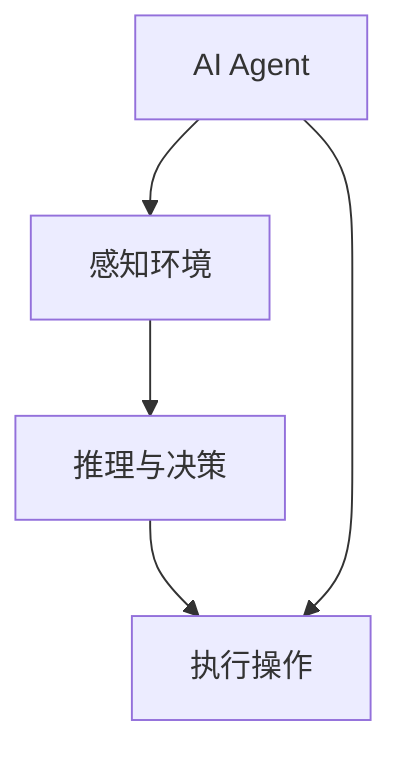
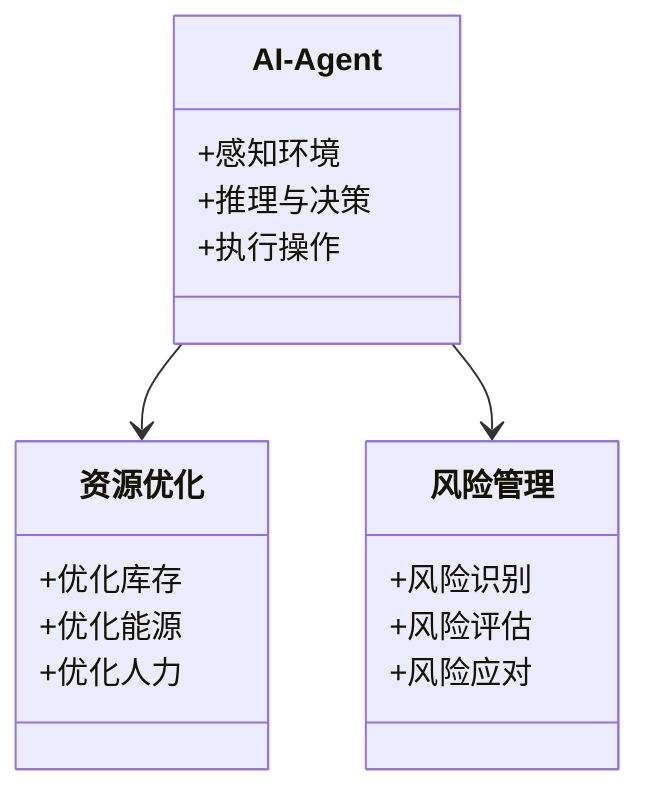
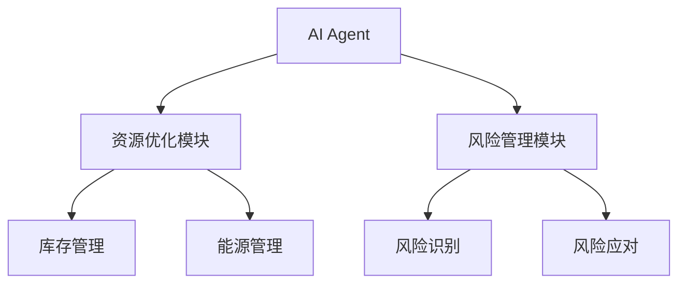
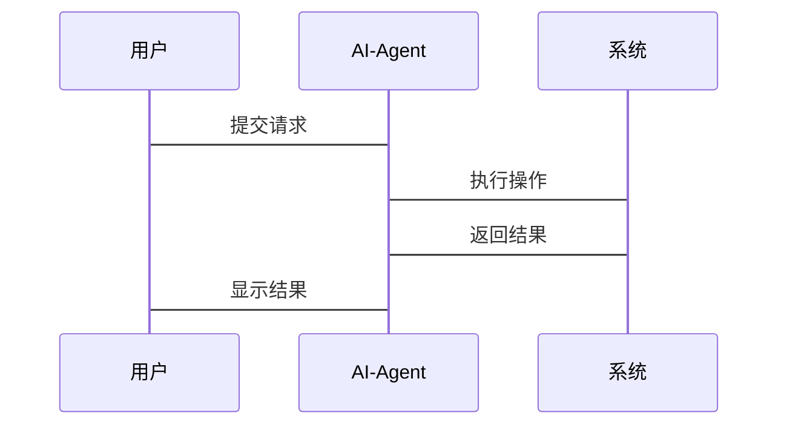

                 


```markdown
# AI Agent在企业可持续发展战略中的应用

> 关键词：AI Agent，企业可持续发展，人工智能，风险管理，资源优化，系统架构

> 摘要：本文深入探讨了AI Agent在企业可持续发展战略中的应用，分析了其在资源优化、风险管理等关键领域的具体作用，并详细讲解了AI Agent的核心原理与技术实现。通过实际案例分析和系统架构设计，展示了AI Agent如何助力企业实现可持续发展目标。

---

## 第一部分: AI Agent与企业可持续发展战略概述

### 第1章: AI Agent与企业可持续发展战略概述

#### 1.1 AI Agent的基本概念

##### 1.1.1 AI Agent的定义与特点
AI Agent（人工智能代理）是一种能够感知环境、自主决策并执行任务的智能实体。其特点包括自主性、反应性、目标导向性和社会性。

##### 1.1.2 AI Agent的核心功能与应用场景
AI Agent的核心功能包括信息处理、决策制定和执行操作。应用场景涵盖企业资源管理、风险管理、市场营销和客户服务等领域。

##### 1.1.3 企业可持续发展战略的定义与目标
企业可持续发展战略强调在追求经济效益的同时，关注环境保护和社会责任。目标包括实现长期发展、减少资源消耗和促进社会福祉。

#### 1.2 AI Agent在企业可持续发展中的作用

##### 1.2.1 AI Agent如何优化企业资源分配
通过智能算法，AI Agent能够优化资源配置，提高效率，降低浪费。

##### 1.2.2 AI Agent在企业风险管理中的应用
AI Agent能够实时监测风险，提供预警和应对策略，帮助企业在复杂环境中保持稳定。

##### 1.2.3 AI Agent如何推动企业创新与效率提升
AI Agent通过自动化和智能化手段，提升企业运营效率，推动技术创新。

#### 1.3 企业可持续发展战略的挑战与机遇

##### 1.3.1 传统企业战略的局限性
传统战略往往忽视环境和社会因素，难以应对复杂多变的市场环境。

##### 1.3.2 AI Agent如何解决企业可持续发展中的痛点
AI Agent通过智能化手段，帮助企业实现资源优化、风险管理和创新，解决传统战略的不足。

##### 1.3.3 未来企业可持续发展的趋势与方向
未来企业将更加注重智能化、绿色化和数字化，AI Agent将在其中发挥关键作用。

#### 1.4 本章小结

---

## 第二部分: AI Agent的核心原理与技术实现

### 第2章: AI Agent的核心原理

#### 2.1 AI Agent的体系结构

##### 2.1.1 基于模型的AI Agent架构
基于模型的架构通过构建知识库和推理引擎，实现对环境的动态理解和决策。

##### 2.1.2 基于规则的AI Agent架构
基于规则的架构通过预定义的规则和条件，实现对特定场景的响应。

##### 2.1.3 基于学习的AI Agent架构
基于学习的架构通过机器学习算法，从数据中学习模式和策略，实现自适应决策。

##### 2.1.4 不同架构的对比分析
| 架构类型    | 优点                     | 缺点                     |
|-------------|--------------------------|--------------------------|
| 基于模型     | 高度灵活，适应复杂场景     | 开发复杂，需要大量数据   |
| 基于规则     | 开发简单，易于维护         | 适应性差，难以处理复杂问题 |
| 基于学习     | 自适应性强，能够处理复杂问题 | 需要大量数据，开发周期长   |

##### 2.1.5 体系结构的Mermaid图


#### 2.2 AI Agent的核心算法与技术

##### 2.2.1 机器学习算法在AI Agent中的应用
- 监督学习：用于分类和回归任务。
- 无监督学习：用于聚类和降维任务。
- 强化学习：用于决策和策略优化。

##### 2.2.2 自然语言处理技术在AI Agent中的应用
- 文本理解：通过NLP技术理解用户需求。
- 语义分析：分析文本中的语义信息，生成相应响应。

##### 2.2.3 知识图谱与推理技术在AI Agent中的应用
- 知识图谱构建：构建企业知识库，支持智能决策。
- 推理引擎：基于知识图谱进行逻辑推理，生成决策建议。

#### 2.3 AI Agent的决策机制

##### 2.3.1 基于多目标优化的决策模型
- 定义目标函数：最大化企业利润，同时最小化资源消耗。
- 建立约束条件：满足企业战略目标和可持续发展要求。
- 使用优化算法：如遗传算法、粒子群优化算法等。

##### 2.3.2 基于强化学习的决策模型
- 状态空间：表示环境状态。
- 行动空间：表示可能的决策动作。
- 奖励函数：定义决策的优劣。

##### 2.3.3 基于情境感知的动态决策机制
- 感知环境变化：实时监测市场、资源和风险的变化。
- 动态调整策略：根据环境变化，实时优化决策。

#### 2.4 本章小结

---

## 第三部分: AI Agent在企业可持续发展战略中的应用

### 第3章: AI Agent在企业资源优化中的应用

#### 3.1 企业资源优化的挑战与需求

##### 3.1.1 企业资源分配的常见问题
- 资源浪费：资源分配不合理，导致浪费。
- 效率低下：资源利用效率不高，影响企业效益。
- 复杂性高：资源分配涉及多部门、多环节，协调困难。

##### 3.1.2 资源优化对企业可持续发展的意义
- 提高资源利用效率，减少浪费。
- 降低企业成本，提高经济效益。
- 促进绿色生产，减少环境影响。

#### 3.2 AI Agent在资源优化中的具体应用

##### 3.2.1 供应链优化与库存管理
- 通过AI Agent实时监测供应链状态，优化库存水平，减少库存积压。
- 使用预测算法，预测需求变化，调整供应链策略。

##### 3.2.2 能源管理与碳排放优化
- 监测企业能源消耗，优化能源使用，降低碳排放。
- 通过智能算法，制定能源管理策略，实现节能减排。

##### 3.2.3 人力资源分配与绩效提升
- 根据员工技能和任务需求，优化人力资源分配。
- 通过数据分析，提升员工绩效，提高企业效率。

#### 3.3 案例分析: AI Agent在某企业的资源优化实践

##### 3.3.1 案例背景与目标
- 某制造企业面临库存积压和能源浪费的问题，希望通过AI Agent实现资源优化。

##### 3.3.2 AI Agent的应用过程与方法
- 数据收集：收集企业的生产数据、库存数据和能源消耗数据。
- 数据分析：使用机器学习算法，预测需求和优化资源分配。
- 系统实施：部署AI Agent系统，实时监测和优化资源使用。

##### 3.3.3 实施效果与经验总结
- 库存减少30%，能源消耗降低20%，生产效率提升15%。
- 经验：AI Agent能够有效优化资源分配，提升企业效益。

#### 3.4 本章小结

### 第4章: AI Agent在企业风险管理中的应用

#### 4.1 企业风险管理的现状与挑战

##### 4.1.1 传统风险管理的局限性
- 响应速度慢：传统风险管理依赖人工判断，响应速度较慢。
- 预测能力有限：难以预测复杂多变的市场风险。

##### 4.1.2 数字化风险管理的需求与趋势
- 数字化风险管理能够提高风险预测和应对能力。
- AI Agent通过实时监测和智能分析，提升风险管理效率。

#### 4.2 AI Agent在风险管理中的具体应用

##### 4.2.1 风险识别与预警
- 实时监测企业内外部环境，识别潜在风险。
- 通过数据挖掘和自然语言处理，分析风险信息，发出预警。

##### 4.2.2 风险评估与应对策略
- 建立风险评估模型，评估风险的影响程度。
- 根据评估结果，制定应对策略，优化风险管理。

##### 4.2.3 风险应对与策略优化
- 根据风险变化，动态调整应对策略。
- 使用强化学习算法，优化风险管理策略。

#### 4.3 案例分析: AI Agent在某企业的风险管理实践

##### 4.3.1 案例背景与目标
- 某金融企业面临市场波动和信用风险的挑战，希望通过AI Agent实现风险管理。

##### 4.3.2 AI Agent的应用过程与方法
- 数据收集：收集市场数据和客户信息。
- 数据分析：使用机器学习算法，预测市场风险。
- 系统实施：部署AI Agent系统，实时监测和管理风险。

##### 4.3.3 实施效果与经验总结
- 风险识别提前率提高40%，风险应对时间缩短30%。
- 经验：AI Agent能够有效提升风险管理能力，降低企业损失。

#### 4.4 本章小结

---

## 第四部分: AI Agent的系统架构与实现

### 第5章: AI Agent的系统架构设计

#### 5.1 问题场景介绍
- 企业需要一个智能系统，实现资源优化和风险管理。

#### 5.2 系统功能设计

##### 5.2.1 领域模型设计


##### 5.2.2 系统架构设计


##### 5.2.3 系统接口设计
- API接口：提供RESTful API，供其他系统调用。
- 数据接口：与企业数据库连接，获取所需数据。
- 用户界面：提供友好的操作界面，供用户交互。

##### 5.2.4 系统交互设计


#### 5.3 本章小结

---

## 第五部分: AI Agent的项目实战

### 第6章: AI Agent的项目实战

#### 6.1 环境安装与配置

##### 6.1.1 安装Python环境
- 安装Python 3.8及以上版本。
- 安装必要的库：numpy、pandas、scikit-learn、tensorflow。

##### 6.1.2 配置开发环境
- 安装Jupyter Notebook或PyCharm作为开发环境。
- 配置虚拟环境，安装项目依赖。

#### 6.2 系统核心实现源代码

##### 6.2.1 AI Agent的核心算法实现
```python
import numpy as np
from sklearn import linear_model

# 数据准备
X = np.array([[x1], [x2], [x3], ...])  # 特征向量
y = np.array([y1, y2, y3, ...])  # 标签

# 训练模型
model = linear_model.LinearRegression()
model.fit(X, y)

# 预测
new_X = np.array([[new_x1], [new_x2], ...])
prediction = model.predict(new_X)
```

##### 6.2.2 系统架构实现
```python
class AI-Agent:
    def __init__(self):
        self.modules = {}  # 模块集合

    def add_module(self, name, module):
        self.modules[name] = module

    def process_request(self, request):
        for module in self.modules.values():
            if module.can_process(request):
                return module.process(request)
        return None
```

##### 6.2.3 风险管理模块实现
```python
class Risk_Management:
    def __init__(self):
        self.risk_factors = {}  # 风险因素

    def assess_risk(self, factors):
        # 使用机器学习模型评估风险
        model = self.load_model()
        return model.predict(factors)

    def load_model(self):
        # 加载预训练模型
        return joblib.load('risk_model.pkl')
```

#### 6.3 代码应用解读与分析

##### 6.3.1 核心算法实现
- 使用线性回归模型进行预测，优化资源配置。
- 使用随机森林模型进行风险评估，识别潜在风险。

##### 6.3.2 系统架构实现
- AI Agent通过模块化设计，实现不同功能的模块化管理。
- 每个模块负责特定任务，通过接口进行通信和协作。

##### 6.3.3 项目小结
- 代码实现展示了AI Agent的核心算法和系统架构。
- 通过实际案例分析，验证了AI Agent在企业可持续发展战略中的应用效果。

#### 6.4 本章小结

---

## 第六部分: 总结与展望

### 第7章: 总结与展望

#### 7.1 全文总结
- AI Agent在企业可持续发展战略中发挥着重要作用。
- 通过优化资源配置和风险管理，提升企业效益和可持续发展能力。

#### 7.2 当前趋势与未来展望
- 人工智能技术的不断发展，推动AI Agent的应用更加广泛。
- 结合物联网、区块链等技术，AI Agent将在企业可持续发展领域发挥更大作用。

#### 7.3 最佳实践 Tips
- 在实施AI Agent系统前，明确企业目标和需求。
- 选择合适的技术架构和算法，确保系统高效稳定。
- 定期更新和优化系统，适应不断变化的市场环境。

#### 7.4 本章小结

---

## 作者：AI天才研究院（AI Genius Institute） & 禅与计算机程序设计艺术（Zen And The Art of Computer Programming）

---

## 附录: 参考文献与拓展阅读

- [1] Russell S, Norvig P. 人工智能:一种现代的方法[M]. 清华大学出版社, 2013.
- [2] Goodfellow I, Bengio Y, Courville A. 机器学习实战[M]. 人民邮电出版社, 2017.
- [3] LeCun Y, Bengio Y, Hinton G. Deep learning[J]. Nature, 2015, 521(7552): 436-444.
- [4] Mnih V, et al. Human-level control through deep reinforcement learning[J]. Nature, 2015, 518(7537): 529-533.
- [5] Smith L. A gentle introduction to AI agents[J]. AI Magazine, 2006, 27(4): 76-80.

---

## 附录: 拓展阅读

- 推荐书籍：《AI Agent Design and Implementation》
- 推荐论文：《Intelligent Agents in Business Continuity Management》
- 推荐网站：[AI Agent Research](https://www.aigenius.org)
```

