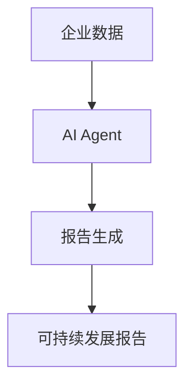
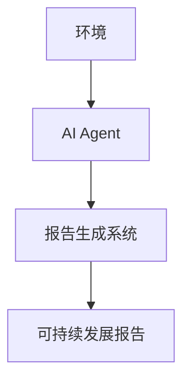
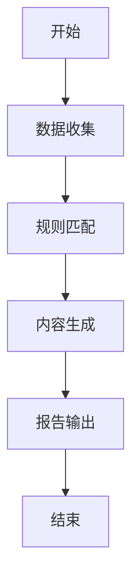
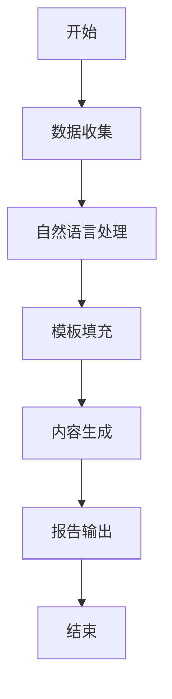
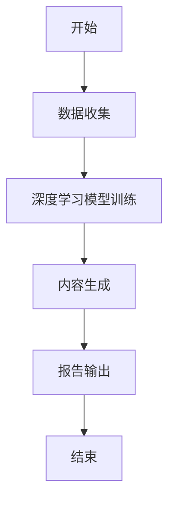
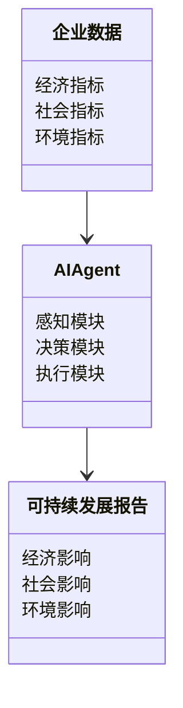
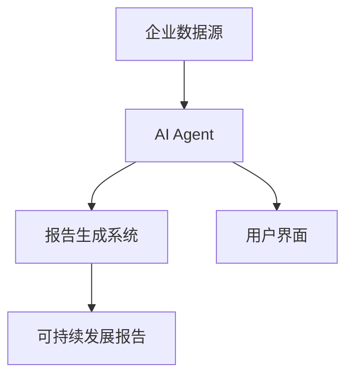
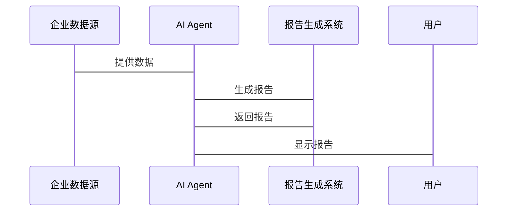

                 


# AI Agent在企业可持续发展报告生成中的应用

> 关键词：AI Agent, 企业可持续发展, 报告生成, 人工智能, 可持续性分析

> 摘要：本文详细探讨了AI Agent在企业可持续发展报告生成中的应用，从问题背景、核心概念、算法原理到系统设计和项目实战，全面解析了如何利用AI技术提升企业可持续发展报告的生成效率和质量。

---

# 第一部分: AI Agent与企业可持续发展报告的背景介绍

## 第1章: AI Agent与企业可持续发展报告的背景介绍

### 1.1 问题背景与问题描述

#### 1.1.1 企业可持续发展报告的重要性
企业可持续发展报告是企业对其经济、社会和环境影响进行全面评估的重要工具。随着全球对可持续发展的关注日益增加，企业需要定期发布高质量的可持续发展报告，以展示其社会责任履行情况。然而，传统报告生成过程存在效率低下、内容不一致、数据准确性差等问题，亟需技术手段优化。

#### 1.1.2 传统报告生成的痛点
- 数据收集复杂：企业需要从多个部门收集数据，耗时且容易出错。
- 内容一致性差：不同部门或报告撰写人员可能对报告内容的理解不一致，导致报告内容重复或遗漏。
- 数据准确性低：人工处理数据时容易出错，影响报告的可信度。

#### 1.1.3 AI Agent在报告生成中的作用
AI Agent（人工智能代理）是一种能够感知环境并采取行动以实现目标的智能系统。通过AI Agent，企业可以实现自动化数据收集、智能内容生成和报告优化，显著提升报告生成的效率和质量。

### 1.2 问题解决与边界定义

#### 1.2.1 AI Agent如何解决报告生成问题
- **自动化数据收集**：AI Agent可以自动从企业内部系统中提取相关数据，减少人工操作。
- **智能内容生成**：基于预设的规则和模板，AI Agent可以自动生成报告内容，确保一致性和准确性。
- **数据优化与校验**：AI Agent可以对数据进行清洗和校验，确保报告的可信度。

#### 1.2.2 报告生成的边界与外延
- **边界**：AI Agent主要用于报告生成过程中的数据收集、内容生成和校验，不涉及报告的最终发布和分发。
- **外延**：AI Agent可以与其他企业系统集成，如ERP、CRM等，进一步提升企业的数字化能力。

#### 1.2.3 AI Agent的应用场景与限制
- **应用场景**：
  - 数据收集与整合
  - 内容自动生成
  - 数据校验与优化
- **限制**：
  - 依赖高质量的数据输入
  - 对复杂业务逻辑的处理能力有限
  - 受限于算法和模型的准确性

### 1.3 核心概念与结构

#### 1.3.1 可持续发展报告的核心要素
- 经济影响：企业的经济效益和社会责任
- 社会影响：员工福利、社区贡献
- 环境影响：碳排放、资源利用效率

#### 1.3.2 AI Agent的构成与功能
- **感知模块**：数据收集与分析
- **决策模块**：基于数据生成报告内容
- **执行模块**：输出报告并进行校验

#### 1.3.3 两者结合的系统结构图


---

# 第二部分: AI Agent的核心概念与原理

## 第2章: AI Agent的核心概念与原理

### 2.1 AI Agent的定义与属性

#### 2.1.1 AI Agent的定义
AI Agent是一种能够感知环境、采取行动以实现目标的智能系统。它通过与环境和其他系统的交互，完成特定任务。

#### 2.1.2 AI Agent的核心属性对比表
| 属性 | 描述 |
|------|------|
| 感知能力 | 能够从环境中获取信息 |
| 决策能力 | 基于感知信息做出决策 |
| 行动能力 | 执行决策并输出结果 |
| 学习能力 | 通过反馈不断优化自身 |

#### 2.1.3 AI Agent的实体关系图（Mermaid）


### 2.2 可持续发展报告生成的算法原理

#### 2.2.1 基于规则的报告生成算法（Mermaid流程图）


#### 2.2.2 基于NLP的模板填充算法（Mermaid流程图）


#### 2.2.3 基于深度学习的自动生成算法（Mermaid流程图）


### 2.3 算法实现的数学模型与公式

#### 2.3.1 基于规则的生成模型
规则匹配的逻辑可以通过简单的条件判断实现：
$$ \text{条件} = (x > y) \land (z < w) $$

#### 2.3.2 基于NLP的模板匹配公式
模板匹配的相似度计算公式：
$$ \text{匹配度} = \sum_{i=1}^{n} \frac{\text{关键词匹配数}}{\text{关键词总数}} $$

#### 2.3.3 基于深度学习的生成模型
深度学习模型的损失函数：
$$ \text{损失} = -\sum_{i=1}^{n} \text{标签概率} \cdot \ln(\text{预测概率}) $$

---

# 第三部分: 系统分析与架构设计

## 第3章: 可持续发展报告生成系统的分析与设计

### 3.1 系统功能设计

#### 3.1.1 领域模型（Mermaid类图）


### 3.2 系统架构设计

#### 3.2.1 系统架构图（Mermaid架构图）


#### 3.2.2 系统接口设计
- 数据接口：用于与企业数据源交互
- 报告接口：用于生成和输出报告
- 用户接口：用于与用户交互

#### 3.2.3 系统交互流程（Mermaid序列图）


### 3.3 系统实现的关键点

#### 3.3.1 数据采集与处理
- 数据来源：企业内部数据库、外部数据源
- 数据清洗：去除重复数据、处理缺失值
- 数据转换：将数据转换为统一格式

#### 3.3.2 AI Agent的训练与部署
- 训练数据：企业历史报告数据、行业标准数据
- 模型选择：根据任务选择合适算法（如规则引擎、NLP模型）
- 部署方式：API服务、本地部署

#### 3.3.3 报告生成与输出
- 内容生成：基于模板生成报告内容
- 格式转换：将内容转换为PDF、Word等格式
- 输出方式：通过API返回、本地存储

---

# 第四部分: 项目实战与案例分析

## 第4章: 项目实战与案例分析

### 4.1 项目环境与工具安装

#### 4.1.1 开发环境搭建
- 操作系统：Windows 10/Ubuntu 20.04
- 开发工具：PyCharm、VS Code
- 依赖管理：pip、virtualenv

#### 4.1.2 工具安装与配置
```bash
pip install python-dotenv
pip install transformers
pip install numpy
```

### 4.2 系统核心实现

#### 4.2.1 AI Agent的训练代码（Python示例）

```python
import torch
from transformers import AutoTokenizer, AutoModelForCausalLM

# 加载预训练模型
tokenizer = AutoTokenizer.from_pretrained('gpt2')
model = AutoModelForCausalLM.from_pretrained('gpt2')

# 定义生成函数
def generate_report(prompt, max_length=500):
    inputs = tokenizer.encode(prompt, return_tensors='pt')
    outputs = model.generate(inputs, max_length=max_length, do_sample=True)
    return tokenizer.decode(outputs[0], skip_special_tokens=True)

# 示例生成
prompt = "我们的公司去年减少了碳排放..."
print(generate_report(prompt))
```

#### 4.2.2 算法实现的数学模型与公式

##### 4.2.2.1 基于规则的生成模型
规则匹配的逻辑可以通过简单的条件判断实现：
$$ \text{条件} = (x > y) \land (z < w) $$

##### 4.2.2.2 基于NLP的模板匹配公式
模板匹配的相似度计算公式：
$$ \text{匹配度} = \sum_{i=1}^{n} \frac{\text{关键词匹配数}}{\text{关键词总数}} $$

##### 4.2.2.3 基于深度学习的生成模型
深度学习模型的损失函数：
$$ \text{损失} = -\sum_{i=1}^{n} \text{标签概率} \cdot \ln(\text{预测概率}) $$

### 4.3 项目小结

---

# 第五部分: 总结与展望

## 第5章: 总结与展望

### 5.1 全文总结
通过本文的探讨，我们了解到AI Agent在企业可持续发展报告生成中的重要应用。AI Agent能够显著提升报告生成的效率和质量，为企业提供更加智能化的解决方案。

### 5.2 未来展望
随着AI技术的不断发展，AI Agent在企业可持续发展报告生成中的应用将更加广泛。未来的研究方向包括：
- 更复杂的NLP模型
- 更智能的决策算法
- 更高效的系统架构

---

作者：AI天才研究院/AI Genius Institute & 禅与计算机程序设计艺术 /Zen And The Art of Computer Programming

