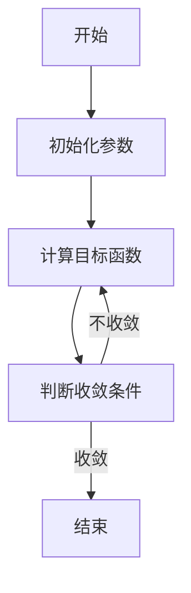
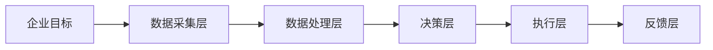

                 


# AI Agent在企业可持续发展目标追踪与报告中的应用

## 关键词：AI Agent, 可持续发展目标, 企业追踪, 数据处理, 报告生成

## 摘要：  
本文探讨AI Agent在企业可持续发展目标追踪与报告中的应用，分析其核心原理、系统架构，并结合实际案例，展示如何通过AI技术提升企业可持续发展管理的效率与准确性。文章内容涵盖背景介绍、算法原理、系统设计及项目实战，旨在为企业提供智能化解决方案。

---

## 第1章: AI Agent与可持续发展目标概述

### 1.1 AI Agent的基本概念

#### 1.1.1 AI Agent的定义与特点
AI Agent（人工智能代理）是能够感知环境、自主决策并执行任务的智能实体。其特点包括：
- **自主性**：无需外部干预，自主完成任务。
- **反应性**：实时感知环境变化，动态调整策略。
- **学习性**：通过数据学习优化决策能力。
- **协作性**：与其他系统或人员协同工作。

#### 1.1.2 AI Agent的核心原理
AI Agent通过感知输入数据，利用算法生成决策，并通过执行机构完成任务。其核心原理包括：
- 数据采集：从多种来源获取相关信息。
- 数据处理：清洗、转换和分析数据。
- 决策制定：基于分析结果生成最优决策。
- 执行反馈：根据反馈优化后续操作。

#### 1.1.3 AI Agent在企业中的应用场景
AI Agent广泛应用于企业资源管理、供应链优化、风险预警等领域，帮助企业提高效率和决策能力。

### 1.2 可持续发展目标的定义与重要性

#### 1.2.1 可持续发展目标的内涵
可持续发展目标（SDGs）是联合国提出的17个全球目标，涵盖消除贫困、保护地球、促进繁荣等方面。企业可持续发展目标是这些目标在企业层面的具体应用。

#### 1.2.2 企业可持续发展的关键要素
- 经济效益：创造价值，实现盈利。
- 社会效益：关注员工福利、社会责任。
- 环境效益：减少碳足迹，保护环境。

#### 1.2.3 可持续发展目标对企业的影响
企业通过实现可持续发展目标，提升品牌形象，降低风险，增强竞争力，同时为社会和环境做出贡献。

### 1.3 AI Agent在可持续发展目标中的作用

#### 1.3.1 AI Agent如何助力目标追踪
AI Agent能够实时监控企业的各项指标，如碳排放、资源利用效率等，确保企业目标的实现。

#### 1.3.2 AI Agent在报告生成中的优势
AI Agent能够自动生成详细报告，包括数据可视化、趋势分析和预测，帮助企业快速掌握情况。

#### 1.3.3 AI Agent的应用前景与挑战
AI Agent的应用前景广阔，但在数据隐私、模型解释性和伦理问题等方面仍面临挑战。

---

## 第2章: AI Agent的核心概念与联系

### 2.1 AI Agent的核心原理

#### 2.1.1 AI Agent的感知与决策机制
AI Agent通过传感器或API获取数据，利用机器学习模型进行分析，生成决策并执行。

#### 2.1.2 AI Agent的自主学习能力
通过强化学习和深度学习，AI Agent能够不断优化决策策略，适应复杂环境。

#### 2.1.3 AI Agent与传统算法的对比
AI Agent具有更强的适应性和自主性，而传统算法依赖于预定义规则，灵活性较低。

### 2.2 AI Agent的实体关系分析

#### 2.2.1 实体关系图（ER图）展示
```mermaid
erd
    entity 企业目标 {
        目标ID
        目标名称
        关键指标
    }
    entity 数据源 {
        数据源ID
        数据类型
        数据提供者
    }
    entity AI Agent {
        AgentID
        传感器数据
        决策规则
    }
    企业目标 --P-> 数据源: 数据支持
    AI Agent --P-> 数据源: 数据获取
    AI Agent --P-> 企业目标: 决策支持
```

---

## 第3章: AI Agent的算法原理与数学模型

### 3.1 AI Agent的核心算法

#### 3.1.1 优化算法的流程图


#### 3.1.2 算法实现的Python代码示例
```python
def optimize(parameters):
    while not convergence(parameters):
        parameters = update_parameters(parameters)
    return parameters
```

### 3.2 数学模型与公式

#### 3.2.1 优化目标函数
$$ f(x) = x^2 + 2x + 1 $$

#### 3.2.2 参数更新规则
$$ \theta_{new} = \theta_{old} - \eta \cdot \nabla f(\theta_{old}) $$

---

## 第4章: 系统分析与架构设计

### 4.1 问题场景介绍

#### 4.1.1 企业可持续发展目标追踪的挑战
企业需要实时追踪多个关键指标，如碳排放、能源消耗等，确保目标的实现。

### 4.2 系统功能设计

#### 4.2.1 领域模型
```mermaid
classDiagram
    class 企业目标 {
        目标ID
        关键指标
        目标状态
    }
    class 数据源 {
        数据源ID
        数据类型
        更新频率
    }
    class AI Agent {
        传感器数据
        决策规则
        执行反馈
    }
    企业目标 <--o> 数据源
    数据源 --> AI Agent
    AI Agent --> 企业目标
```

#### 4.2.2 系统架构设计


---

## 第5章: 项目实战

### 5.1 环境安装

#### 5.1.1 安装Python
```bash
python --version
pip install --upgrade pip
```

#### 5.1.2 安装必要的库
```bash
pip install numpy pandas scikit-learn
```

### 5.2 核心代码实现

#### 5.2.1 数据预处理
```python
import pandas as pd
data = pd.read_csv('sustainability_data.csv')
data = data.dropna()
```

#### 5.2.2 模型训练
```python
from sklearn.model import SGDRegressor
model = SGDRegressor()
model.fit(X_train, y_train)
```

#### 5.2.3 目标追踪
```python
def track_progress(targets, current):
    progress = {}
    for target in targets:
        progress[target] = (current[target] / target['goal']) * 100
    return progress
```

### 5.3 案例分析

#### 5.3.1 某公司碳排放追踪
通过AI Agent实时监测碳排放数据，生成每日报告，帮助企业优化减排策略。

---

## 第6章: 最佳实践与总结

### 6.1 最佳实践

#### 6.1.1 数据质量管理
确保数据的准确性、完整性和及时性，提高模型的预测能力。

#### 6.1.2 模型解释性
选择可解释的模型，帮助管理层理解AI决策过程。

### 6.2 小结

AI Agent在企业可持续发展目标追踪与报告中的应用前景广阔，能够显著提升企业的管理效率和决策能力。

### 6.3 注意事项

- 数据隐私和安全问题需严格把控。
- 模型的可解释性和透明度需重视。
- 定期更新模型，适应新的业务需求。

### 6.4 拓展阅读

- 《机器学习实战》
- 《深度学习》
- 《企业可持续发展报告》

---

## 作者：AI天才研究院 & 禅与计算机程序设计艺术

---

本文通过详细分析AI Agent在企业可持续发展目标追踪与报告中的应用，展示了其在提高企业效率和决策能力方面的巨大潜力。希望本文能为企业提供有价值的参考和启发。

