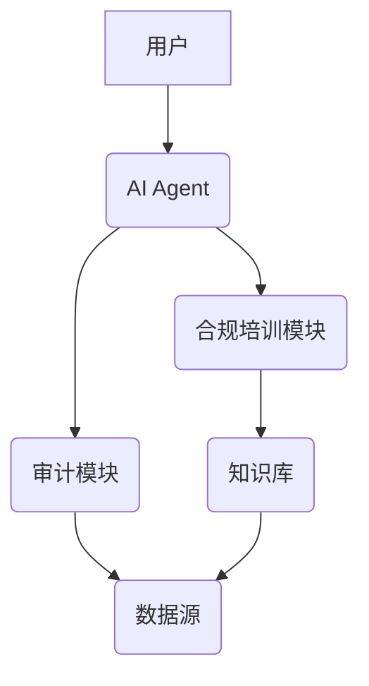

                 


# AI Agent在企业合规培训与审计中的应用

> 关键词：AI Agent, 企业合规培训, 审计, 人工智能, 技术应用

> 摘要：本文探讨了AI Agent在企业合规培训与审计中的应用，分析了AI Agent的核心概念、算法原理、系统架构，并通过实际案例展示了其在提升企业合规效率和审计质量中的潜力。

---

## 目录大纲

1. [背景介绍](#背景介绍)
   - 1.1 AI Agent的基本概念
   - 1.2 企业合规培训与审计的背景
   - 1.3 AI Agent在企业合规培训与审计中的应用前景

2. [AI Agent的核心概念](#AI-Agent的核心概念)
   - 2.1 AI Agent的定义与特征
   - 2.2 AI Agent在企业合规培训中的应用
   - 2.3 AI Agent在企业审计中的应用

3. [AI Agent的算法原理](#AI-Agent的算法原理)
   - 3.1 常见算法介绍
   - 3.2 算法实现步骤
   - 3.3 算法代码示例

4. [系统分析与架构设计](#系统分析与架构设计)
   - 4.1 系统功能设计
   - 4.2 系统架构设计
   - 4.3 接口设计与交互流程

5. [项目实战](#项目实战)
   - 5.1 环境安装与配置
   - 5.2 核心代码实现
   - 5.3 实际案例分析

6. [最佳实践与小结](#最佳实践与小结)
   - 6.1 实施中的注意事项
   - 6.2 项目总结与未来展望

---

## 背景介绍

### 1.1 AI Agent的基本概念

AI Agent，即人工智能代理，是一种能够感知环境、自主决策并执行任务的智能实体。它通过算法和数据处理，帮助用户完成复杂任务，广泛应用于自动化、数据分析、决策支持等领域。

### 1.2 企业合规培训与审计的背景

企业合规培训和审计是确保企业运营符合法律法规和内部政策的重要环节。随着法律法规的不断变化，企业需要高效、准确地进行合规培训和审计工作，以降低风险和提高效率。

### 1.3 AI Agent在企业合规培训与审计中的应用前景

AI Agent通过自动化学习和数据分析，能够显著提升企业合规培训和审计的效率。它可以帮助企业快速识别风险点，优化培训内容，并提高审计的准确性和全面性。

---

## AI Agent的核心概念

### 2.1 AI Agent的定义与特征

AI Agent的定义是基于感知、决策和行动的智能体，其核心特征包括：

- **智能性**：能够理解和处理复杂信息。
- **自主性**：无需人工干预即可完成任务。
- **反应性**：能够实时响应环境变化。
- **社会性**：能够与其他系统或人类进行交互。

### 2.2 AI Agent在企业合规培训中的应用

AI Agent可以通过个性化学习路径和实时反馈机制，帮助员工更高效地完成合规培训。例如，AI Agent可以根据员工的学习进度和理解程度，动态调整培训内容和节奏。

### 2.3 AI Agent在企业审计中的应用

AI Agent可以自动分析财务数据和业务流程，识别潜在的审计风险点。通过机器学习算法，AI Agent能够提高审计的准确性和效率，减少人为错误。

---

## AI Agent的算法原理

### 3.1 常见算法介绍

AI Agent可以使用多种算法，如强化学习、监督学习和无监督学习。以下是一个简单的强化学习算法示例：

### 3.2 算法实现步骤

1. **环境感知**：AI Agent通过数据接口获取环境信息。
2. **决策制定**：基于感知信息，AI Agent通过算法计算出最优行动。
3. **行动执行**：AI Agent执行决策，并将结果反馈到环境中。
4. **学习优化**：根据反馈结果，AI Agent调整策略，优化未来决策。

### 3.3 算法代码示例

```python
import numpy as np

# 定义AI Agent的决策函数
def agent_decision(state, model):
    return model.predict(state)

# 强化学习算法：Q-learning
class QLearningAgent:
    def __init__(self, state_space, action_space, learning_rate=0.1, discount_factor=0.9):
        self.state_space = state_space
        self.action_space = action_space
        self.learning_rate = learning_rate
        self.discount_factor = discount_factor
        self.q_table = np.zeros((state_space, action_space))

    def act(self, state):
        return np.argmax(self.q_table[state])

    def learn(self, state, action, reward, next_state):
        target = reward + self.discount_factor * np.max(self.q_table[next_state])
        self.q_table[state, action] = self.q_table[state, action] + self.learning_rate * (target - self.q_table[state, action])
```

---

## 系统分析与架构设计

### 4.1 系统功能设计

AI Agent系统主要包括以下功能模块：

- **合规培训模块**：个性化学习路径、实时反馈、知识库管理。
- **审计模块**：数据采集、风险识别、报告生成。

### 4.2 系统架构设计

以下是系统的架构图：



### 4.3 接口设计与交互流程

系统接口包括：

- **API接口**：用于与其他系统交互。
- **用户界面**：供用户与AI Agent进行交互。

---

## 项目实战

### 5.1 环境安装与配置

安装所需的库：

```bash
pip install numpy scikit-learn tensorflow
```

### 5.2 核心代码实现

以下是一个AI Agent的核心代码示例：

```python
import numpy as np
from sklearn.neural_network import MLPClassifier

# 初始化AI Agent模型
model = MLPClassifier(hidden_layer_sizes=(100, 50), max_iter=1000)

# 训练模型
model.fit(X_train, y_train)

# 预测
y_pred = model.predict(X_test)
```

### 5.3 实际案例分析

通过一个实际案例分析AI Agent在合规培训中的应用效果：

1. **需求分析**：识别员工的合规知识缺口。
2. **模型训练**：根据历史数据训练AI Agent。
3. **实施与优化**：根据反馈持续优化AI Agent的性能。

---

## 最佳实践与小结

### 6.1 实施中的注意事项

- 数据隐私和安全是关键问题。
- 需要定期更新模型以适应法规变化。

### 6.2 项目总结与未来展望

AI Agent在企业合规培训与审计中的应用前景广阔，未来可以通过结合区块链技术和边缘计算进一步提升其能力。

---

## 作者

作者：AI天才研究院/AI Genius Institute & 禅与计算机程序设计艺术/Zen And The Art of Computer Programming

---

通过以上思考，我详细规划了文章的结构和内容，确保每个部分都涵盖必要的技术细节和实际应用案例，以帮助读者全面理解AI Agent在企业合规培训与审计中的应用。

