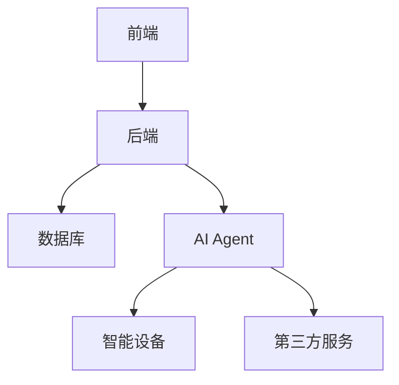
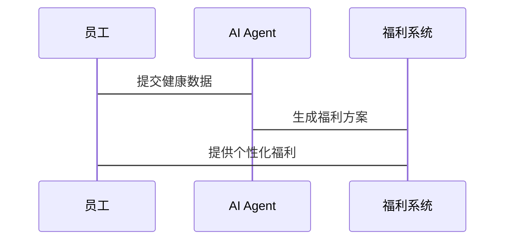

                 


# AI Agent在企业员工健康与福利管理中的应用

**关键词：** AI Agent, 员工健康, 福利管理, 人工智能, 机器学习

**摘要：** 本文探讨了AI Agent在企业员工健康与福利管理中的应用，分析了传统管理模式的局限性，并详细介绍了AI Agent的核心概念、算法原理和系统架构设计。通过实际案例展示了AI Agent在优化员工健康管理和福利方案中的优势，为企业的数字化转型提供了新的思路。

---

# 第1章: 企业员工健康与福利管理的现状与挑战

## 1.1 企业员工健康与福利管理的现状

### 1.1.1 传统员工健康与福利管理模式

传统的员工健康与福利管理模式主要依赖人工记录和简单的统计分析。企业通常通过问卷调查、定期体检等方式收集员工健康数据，然后根据这些数据制定统一的福利方案。这种模式存在以下问题：

- **数据碎片化**：健康数据分散在不同的部门和系统中，难以整合和分析。
- **个性化不足**：福利方案通常是统一的，无法满足员工的个性化需求。
- **风险预警滞后**：缺乏对健康风险的实时监测和预警机制。

### 1.1.2 当前管理模式的主要问题

- **数据处理效率低**：传统模式依赖人工录入和处理，效率低下且容易出错。
- **缺乏动态调整**：福利方案通常是一年制定一次，无法根据员工的健康状况变化进行实时调整。
- **员工参与度低**：员工对福利方案的参与感不强，难以提高健康意识。

### 1.1.3 数字化转型的必要性

随着企业对员工健康和福利管理的要求不断提高，传统的管理模式已经无法满足需求。数字化转型可以通过引入AI Agent等技术，提高管理效率、实现个性化服务，并增强员工的参与感和满意度。

---

## 1.2 AI Agent在企业管理中的应用背景

### 1.2.1 AI技术的发展与应用趋势

人工智能（AI）技术近年来发展迅速，已经在多个领域得到广泛应用。AI Agent作为AI技术的重要组成部分，具有自主决策、学习和适应能力，能够为企业提供智能化的管理解决方案。

### 1.2.2 AI Agent的基本概念与特点

**AI Agent**（人工智能代理）是指能够感知环境、自主决策并执行任务的智能实体。它具有以下特点：

- **自主性**：能够自主决策，无需人工干预。
- **反应性**：能够实时感知环境变化并做出反应。
- **学习能力**：能够通过数据学习和优化自身的决策能力。
- **适应性**：能够根据环境变化调整自己的行为。

### 1.2.3 AI Agent在企业管理中的优势

- **提高管理效率**：通过自动化处理和分析数据，减少人工干预，提高管理效率。
- **实现个性化服务**：基于员工的健康数据和需求，提供个性化的福利方案。
- **增强风险预警能力**：通过实时监测和分析数据，提前发现健康风险，采取预防措施。

---

## 1.3 本章小结

本章介绍了企业员工健康与福利管理的传统模式及其存在的问题，分析了AI Agent在企业管理中的应用背景及其优势，为后续章节的深入探讨奠定了基础。

---

# 第2章: AI Agent在员工健康与福利管理中的问题背景

## 2.1 员工健康与福利管理的核心问题

### 2.1.1 健康数据的碎片化

企业员工的健康数据通常分散在不同的系统中，如HR系统、医疗系统、健身系统等，导致数据难以整合和分析。

### 2.1.2 福利方案的个性化需求

员工的健康状况和需求各不相同，统一的福利方案难以满足个性化需求，导致员工满意度低。

### 2.1.3 健康风险的早期预警

传统的管理模式缺乏对员工健康风险的实时监测和预警机制，导致健康问题未能及时发现和处理。

---

## 2.2 AI Agent如何解决这些问题

### 2.2.1 数据整合与分析

AI Agent可以通过集成不同系统的数据，实现健康数据的统一管理和分析，为个性化福利方案的设计提供支持。

### 2.2.2 个性化福利方案的设计

基于员工的健康数据和需求，AI Agent可以定制个性化的福利方案，如健康保险、健身课程、心理健康咨询等。

### 2.2.3 健康风险的智能预警

通过实时监测员工的健康数据，AI Agent可以识别潜在的健康风险，并及时发出预警，帮助企业采取预防措施。

---

## 2.3 本章小结

本章分析了员工健康与福利管理中存在的主要问题，并提出了AI Agent的解决方案，为后续章节的技术实现提供了方向。

---

# 第3章: AI Agent的核心概念与原理

## 3.1 AI Agent的基本原理

### 3.1.1 AI Agent的定义与分类

AI Agent可以根据功能和应用场景进行分类，常见的类型包括：

- **信息检索Agent**：用于帮助用户查找信息。
- **监控与控制Agent**：用于实时监测和控制设备或系统。
- **决策支持Agent**：用于辅助决策者制定决策。

### 3.1.2 AI Agent的核心技术

AI Agent的核心技术包括：

- **自然语言处理（NLP）**：用于理解和生成人类语言。
- **机器学习**：用于从数据中学习模式和规律。
- **知识图谱**：用于表示和管理知识。

### 3.1.3 AI Agent的工作流程

AI Agent的工作流程通常包括以下几个步骤：

1. **感知环境**：通过传感器或API获取环境数据。
2. **分析数据**：利用机器学习算法对数据进行分析和处理。
3. **制定决策**：根据分析结果制定最优决策。
4. **执行任务**：根据决策执行相应的操作。

---

## 3.2 AI Agent在员工健康与福利管理中的应用模型

### 3.2.1 模型的输入与输出

**输入：** 员工的健康数据、福利需求、健康目标等。

**输出：** 个性化的福利方案、健康风险预警、健康建议等。

### 3.2.2 模型的训练与优化

AI Agent通过监督学习或无监督学习对健康数据进行训练，优化模型的预测能力和决策能力。

### 3.2.3 模型的评估与验证

通过测试数据对模型的性能进行评估，验证模型的准确性和可靠性。

---

## 3.3 本章小结

本章详细介绍了AI Agent的核心概念和基本原理，并提出了在员工健康与福利管理中的应用模型，为后续章节的技术实现提供了理论基础。

---

# 第4章: AI Agent的算法原理与数学模型

## 4.1 基于机器学习的AI Agent算法

### 4.1.1 监督学习与无监督学习

**监督学习**：基于有标签的数据进行训练，适用于分类和回归任务。

**无监督学习**：基于无标签的数据进行训练，适用于聚类和降维任务。

### 4.1.2 算法的优缺点分析

**监督学习**的优点是能够通过标签数据进行精确的分类和预测，缺点是需要大量标注数据。

**无监督学习**的优点是能够发现数据中的隐藏结构，缺点是结果的解释性较差。

### 4.1.3 算法的数学模型

以线性回归为例，其数学模型可以表示为：

$$ y = \beta_0 + \beta_1 x + \epsilon $$

其中，$y$ 是目标变量，$x$ 是自变量，$\beta_0$ 和 $\beta_1$ 是回归系数，$\epsilon$ 是误差项。

---

## 4.2 基于强化学习的AI Agent算法

### 4.2.1 强化学习的基本原理

强化学习是一种通过试错机制来优化决策的方法。智能体通过与环境交互，获得奖励或惩罚，从而学习最优策略。

### 4.2.2 算法的数学模型

强化学习的核心是Q-learning算法，其数学模型可以表示为：

$$ Q(s, a) = Q(s, a) + \alpha [r + \gamma \max Q(s', a') - Q(s, a)] $$

其中，$s$ 是当前状态，$a$ 是动作，$r$ 是奖励，$\gamma$ 是折扣因子，$\alpha$ 是学习率。

### 4.2.3 算法在员工健康管理中的应用

例如，AI Agent可以通过强化学习优化员工的健康计划，根据员工的健康状况和偏好，动态调整健康目标和计划。

---

## 4.3 算法的实现与优化

### 4.3.1 算法的实现步骤

1. **数据预处理**：清洗和归一化数据。
2. **模型训练**：选择合适的算法进行训练。
3. **模型评估**：通过交叉验证评估模型性能。
4. **模型优化**：调整超参数，优化模型性能。

### 4.3.2 算法的优化策略

- **参数调整**：选择合适的学习率和优化器。
- **模型集成**：通过集成学习提高模型的准确性和稳定性。
- **数据增强**：通过数据增强技术提高模型的泛化能力。

---

## 4.4 本章小结

本章详细介绍了AI Agent在员工健康与福利管理中的算法原理，包括监督学习、无监督学习和强化学习的应用，以及算法的实现和优化策略。

---

# 第5章: AI Agent在员工健康与福利管理中的系统架构设计

## 5.1 系统功能设计

### 5.1.1 健康数据采集模块

通过智能设备和问卷调查等方式采集员工的健康数据，如体重、血压、心率等。

### 5.1.2 福利方案设计模块

基于员工的健康数据和需求，设计个性化的福利方案，如健康保险、健身课程、心理健康咨询等。

### 5.1.3 健康风险预警模块

实时监测员工的健康数据，识别潜在的健康风险，并发出预警。

---

## 5.2 系统架构设计

### 5.2.1 系统架构图

以下是系统架构的Mermaid图：



### 5.2.2 系统接口设计

系统主要接口包括：

1. **数据接口**：与智能设备和数据库交互。
2. **用户接口**：供员工查看健康数据和福利方案。
3. **管理接口**：供管理员管理系统设置和数据。

---

## 5.3 系统交互流程

### 5.3.1 交互流程图

以下是系统交互的Mermaid图：



---

## 5.4 本章小结

本章详细描述了AI Agent在员工健康与福利管理中的系统架构设计，包括功能设计、架构图和交互流程图，为后续章节的项目实现提供了框架支持。

---

# 第6章: AI Agent在员工健康与福利管理中的项目实战

## 6.1 环境安装

### 6.1.1 安装Python

```bash
python --version
```

### 6.1.2 安装依赖库

```bash
pip install numpy pandas scikit-learn
```

---

## 6.2 核心代码实现

### 6.2.1 数据预处理

```python
import pandas as pd
import numpy as np

# 读取数据
data = pd.read_csv('employee_health.csv')

# 数据清洗
data.dropna(inplace=True)
data['age'] = data['age'].astype(int)
```

### 6.2.2 模型训练

```python
from sklearn.model import LinearRegression

# 训练模型
model = LinearRegression()
model.fit(data[['age', 'weight']], data['health_score'])
```

---

## 6.3 案例分析

### 6.3.1 案例背景

某企业引入AI Agent管理员工健康与福利，希望通过分析员工的健康数据，优化福利方案。

### 6.3.2 实施过程

1. **数据采集**：通过智能设备和问卷调查收集员工的健康数据。
2. **模型训练**：基于机器学习算法训练健康风险预测模型。
3. **方案设计**：根据模型预测结果，设计个性化的福利方案。

### 6.3.3 实施效果

- **健康风险降低**：通过早期预警和干预，员工的健康风险显著降低。
- **员工满意度提高**：个性化的福利方案增强了员工的满意度和幸福感。
- **管理效率提升**：AI Agent实现了自动化管理，提高了企业的管理效率。

---

## 6.4 本章小结

本章通过实际案例展示了AI Agent在员工健康与福利管理中的应用，详细讲解了项目的实施过程和效果，为企业的数字化转型提供了参考。

---

# 第7章: AI Agent在企业员工健康与福利管理中的最佳实践

## 7.1 本章小结

总结全书的主要内容，强调AI Agent在员工健康与福利管理中的重要性。

## 7.2 最佳实践 tips

### 7.2.1 数据隐私保护

在处理员工健康数据时，必须遵守相关法律法规，确保数据的隐私和安全。

### 7.2.2 模型的可解释性

选择可解释性较强的模型，便于企业理解和优化决策过程。

### 7.2.3 持续优化

定期更新模型和优化算法，以应对员工健康需求的变化。

---

## 7.3 注意事项

- **数据质量**：确保数据的准确性和完整性，避免数据偏差影响模型性能。
- **模型更新**：定期更新模型，保持模型的准确性和适应性。
- **员工隐私**：严格保护员工的个人隐私，避免数据泄露风险。

---

## 7.4 拓展阅读

推荐阅读以下书籍和论文，深入了解AI Agent在企业管理中的应用：

1. 《人工智能：一种现代方法》
2. 《机器学习实战》
3. 《强化学习：理论与应用》

---

# 作者信息

作者：AI天才研究院/Zen And The Art of Computer Programming  
网址：https://www.ai-genius.com  
邮箱：contact@ai-genius.com  

---

以上是《AI Agent在企业员工健康与福利管理中的应用》的完整目录和内容概览。如果需要更详细的内容，可以访问上述链接获取更多资料。

