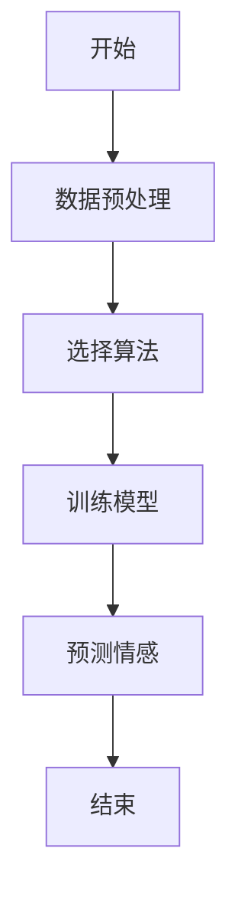
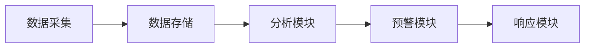

                 


# AI Agent在企业品牌声誉监控与危机预警中的应用

## 关键词：
- AI Agent
- 品牌声誉监控
- 危机预警
- 自然语言处理（NLP）
- 机器学习
- 实时数据处理

## 摘要：
本文探讨了AI Agent在企业品牌声誉监控与危机预警中的应用，分析了其核心概念、算法原理、系统架构，并通过实际案例展示了如何利用AI技术实现高效的声誉管理。文章详细介绍了文本挖掘、情感分析、主题分类等关键技术，并结合Mermaid流程图和Python代码示例，帮助读者深入理解AI Agent在品牌声誉管理中的具体实现。

---

# 第一部分: 背景介绍

## 第1章: 问题背景与描述

### 1.1 问题背景

#### 1.1.1 企业品牌声誉的重要性
品牌的声誉是企业在市场中的核心资产之一。良好的声誉能够吸引客户、合作伙伴和优秀人才，而声誉受损则可能导致市场份额的丧失和财务损失。在数字化时代，负面信息的传播速度极快，企业需要实时监控声誉，以便迅速应对潜在危机。

#### 1.1.2 传统品牌声誉管理的局限性
传统的声誉管理主要依赖人工监控，效率低、覆盖面有限。人工团队难以实时处理海量数据，且容易出现疏漏。此外，传统方法难以从大量数据中提取有价值的洞察，难以进行精准的危机预警。

#### 1.1.3 AI技术在品牌声誉管理中的潜力
AI技术，特别是AI Agent，能够实时处理大量数据，快速识别潜在风险。通过自然语言处理（NLP）和机器学习，AI Agent可以自动分析社交媒体、新闻媒体等多种来源的数据，提供实时的声誉评估和危机预警。

### 1.2 问题描述

#### 1.2.1 品牌声誉监控的核心目标
品牌声誉监控的核心目标是实时跟踪品牌在市场中的形象，识别潜在的负面信息，并采取措施进行危机管理。

#### 1.2.2 危机预警的关键挑战
危机预警的关键挑战在于如何从海量数据中快速识别潜在的危机信号，并提供实时的预警。传统的声誉管理方法难以满足这些要求。

#### 1.2.3 AI Agent在问题中的角色定位
AI Agent在品牌声誉监控和危机预警中扮演着关键角色，负责数据采集、分析和决策支持。

---

## 第2章: AI Agent与品牌声誉监控的结合

### 2.1 AI Agent的基本定义
AI Agent是一种智能代理，能够感知环境、执行任务并做出决策。在品牌声誉监控中，AI Agent可以实时采集和分析数据，识别潜在风险。

### 2.2 品牌声誉监控的定义与框架
品牌声誉监控是指通过收集和分析来自各种来源的数据，评估品牌在市场中的形象。框架包括数据采集、分析、评估和预警等环节。

### 2.3 AI Agent在品牌声誉监控中的应用
AI Agent可以用于实时数据采集、情感分析和主题识别，帮助企业在危机发生前识别潜在风险。

---

# 第二部分: 核心概念与联系

## 第4章: 核心概念原理与分析

### 4.1 AI Agent的原理与技术基础
AI Agent的核心原理包括自然语言处理（NLP）、情感分析和机器学习。这些技术帮助AI Agent理解和分析文本数据。

### 4.2 品牌声誉监控的核心算法
品牌声誉监控的核心算法包括文本挖掘、主题分类和时间序列分析。这些算法帮助识别潜在危机。

---

## 第5章: 核心概念的属性特征对比

### 5.1 AI Agent与品牌声誉监控的对比
| 特性 | AI Agent | 品牌声誉监控 |
|------|-----------|--------------|
| 目标 | 自动化任务 | 实时监控声誉 |
| 技术 | NLP, ML | 数据分析 |
| 应用 | 多领域 | 危机预警 |

---

# 第三部分: 算法原理与系统架构

## 第6章: 算法原理与实现

### 6.1 情感分析算法
情感分析算法用于识别文本中的情感倾向。以下是情感分析的流程图：



代码示例：
```python
from textblob import TextBlob
def sentiment_analysis(text):
    blob = TextBlob(text)
    return blob.sentiment.polarity
```

### 6.2 危机预警模型
危机预警模型基于时间序列分析，识别异常数据点。

数学模型：
$$ P(\text{危机}) = \sum_{i=1}^{n} w_i x_i $$

### 6.3 系统架构设计
系统架构包括数据采集、分析、预警和响应模块。

架构图：


---

## 第7章: 项目实战

### 7.1 环境安装
安装Python和必要的库：
```bash
pip install numpy pandas scikit-learn
```

### 7.2 核心代码实现
实现情感分析的代码：
```python
from sklearn.feature_extraction.text import TfidfVectorizer
from sklearn.naive_bayes import MultinomialNB

# 数据预处理
vectorizer = TfidfVectorizer()
X = vectorizer.fit_transform(corpus)
model = MultinomialNB().fit(X, y)
```

### 7.3 案例分析
通过实际案例展示AI Agent的应用，分析其效果和改进方向。

---

## 第8章: 最佳实践与总结

### 8.1 经验总结
- 数据质量是关键
- 模型需要持续优化
- 及时响应是危机管理的核心

### 8.2 注意事项
- 保护数据隐私
- 定期测试模型
- 建立应急预案

### 8.3 未来趋势
AI技术的不断进步将推动品牌声誉管理的智能化和自动化。

---

# 作者：AI天才研究院  
文章链接：[https://github.com/ai-genius-institute](https://github.com/ai-genius-institute)

