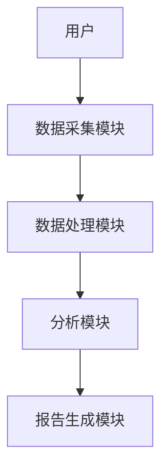

                 


# AI Agent在企业品牌管理与口碑监控中的应用

---

## 关键词  
AI Agent, 企业品牌管理, 口碑监控, 自然语言处理, 情感分析, 机器学习

---

## 摘要  
本文详细探讨了AI Agent在企业品牌管理与口碑监控中的应用，从技术原理到实际案例，系统性地分析了AI Agent如何助力企业提升品牌管理效率、优化品牌声誉以及实现精准营销。文章结合了自然语言处理、机器学习等技术，深入解读了AI Agent在品牌舆情分析、口碑监控及营销策略优化中的核心作用，并通过实际案例展示了AI Agent在企业品牌管理中的具体实现与应用价值。

---

# 第一部分: AI Agent与企业品牌管理概述

---

## 第1章: AI Agent与品牌管理的结合

### 1.1 AI Agent的基本概念  
AI Agent（人工智能代理）是一种能够感知环境、自主决策并执行任务的智能系统。它具备以下核心特点：  
- **自主性**：无需人工干预，能够独立完成任务。  
- **反应性**：能够实时感知环境变化并做出响应。  
- **目标导向**：以特定目标为导向，优化决策过程。  
- **学习能力**：通过数据学习和优化，提升任务执行效率。  

AI Agent在企业品牌管理中的应用主要体现在品牌舆情监控、口碑分析、营销策略优化等方面。  

### 1.2 企业品牌管理的基本概念  
品牌管理是通过规划和执行一系列策略，提升品牌知名度、美誉度和忠诚度的过程。其核心环节包括：  
- **品牌定位**：确定品牌的核心价值与目标市场。  
- **品牌监测**：实时监控品牌在市场中的表现与口碑。  
- **品牌维护**：通过舆情管理维护品牌形象。  
- **品牌营销**：通过营销活动提升品牌影响力。  

传统品牌管理面临以下痛点：  
- 数据量大、分散，难以实时监控。  
- 舆情分析依赖人工，效率低且成本高。  
- 营销策略缺乏数据支持，难以精准定位目标客户。  

### 1.3 AI Agent在品牌管理中的应用价值  
AI Agent通过自动化、智能化的方式，为品牌管理带来了显著价值：  
- **提高效率**：AI Agent能够实时采集、分析海量数据，显著提升品牌监测与舆情分析的效率。  
- **增强精准性**：基于机器学习的AI Agent能够从数据中提取深层洞察，帮助品牌制定精准的营销策略。  
- **降低成本**：自动化处理流程减少了人工干预，降低了品牌管理的运营成本。  

---

## 第2章: AI Agent的核心技术与原理  

### 2.1 自然语言处理（NLP）的基本原理  
NLP是AI Agent实现品牌口碑分析的核心技术之一。其主要任务包括：  
- **文本分类**：将文本分为正面、负面或中性。  
- **情感分析**：识别文本中蕴含的情感倾向。  
- **主题提取**：从文本中提取核心主题。  

常用的NLP算法包括：  
- **TF-IDF**：用于关键词提取。  
- **LSTM**：用于序列数据的建模与分析。  
- **BERT**：一种先进的预训练语言模型，常用于情感分析任务。  

### 2.2 基于NLP的品牌舆情分析流程  
品牌舆情分析的流程如下：  
1. **数据采集**：从社交媒体、新闻网站等渠道采集品牌相关信息。  
2. **数据清洗**：去除噪声数据，提取有效信息。  
3. **情感分析**：对文本进行情感分类，识别品牌口碑的正负面倾向。  
4. **主题提取**：从文本中提取核心主题，分析品牌舆情的主要关注点。  
5. **报告生成**：生成品牌舆情分析报告，为企业提供决策支持。  

### 2.3 实例分析: 基于BERT的情感分析模型  
以BERT模型为例，以下是情感分析任务的实现流程：  
1. **数据准备**：收集并标注情感数据（正面、负面、中性）。  
2. **模型训练**：基于BERT微调模型，训练情感分类任务。  
3. **模型评估**：使用测试数据评估模型的准确率、召回率等指标。  
4. **实际应用**：将训练好的模型应用于品牌舆情分析。  

以下是BERT模型的简要代码示例：  
```python
import torch
from transformers import BertForSequenceClassification, BertTokenizer

# 加载预训练模型和分词器
model = BertForSequenceClassification.from_pretrained('bert-base-uncased')
tokenizer = BertTokenizer.from_pretrained('bert-base-uncased')

# 定义输入
inputs = tokenizer("This product is great!", return_tensors="pt")
outputs = model(**inputs)
 logits = outputs.logits
 label_id = torch.argmax(logits).item()
 print(label_id)  # 输出：1（假设1表示正面）
```

### 2.4 本章小结  
本章介绍了AI Agent的核心技术，重点分析了自然语言处理技术在品牌舆情分析中的应用。通过BERT模型的实例，展示了如何利用AI Agent实现情感分析任务，为品牌管理提供技术支持。

---

## 第3章: AI Agent在品牌管理中的具体应用  

### 3.1 品牌口碑监控系统的设计与实现  
品牌口碑监控系统的主要功能包括：  
- **实时数据采集**：从社交媒体、新闻网站等渠道实时采集品牌相关信息。  
- **数据清洗与分析**：去除噪声数据，提取有效信息并进行情感分析。  
- **实时预警**：当负面舆情达到阈值时，系统自动触发预警。  
- **报告生成**：生成品牌舆情分析报告，帮助企业及时调整品牌策略。  

### 3.2 系统架构设计  
以下是品牌口碑监控系统的架构图：  


### 3.3 数据采集与处理  
1. **数据采集模块**：通过API或爬虫技术从社交媒体、新闻网站等渠道采集品牌相关信息。  
2. **数据处理模块**：对采集到的数据进行清洗、分词、去停用词等预处理。  
3. **数据存储模块**：将处理后的数据存储到数据库中，以便后续分析。  

### 3.4 系统功能实现  
1. **实时舆情监控**：系统能够实时监控品牌相关信息，并通过情感分析模块识别舆情的正负面倾向。  
2. **自动化报告生成**：系统根据分析结果自动生成品牌舆情分析报告，帮助企业及时了解品牌口碑变化。  
3. **实时预警机制**：当负面舆情达到预设阈值时，系统会通过邮件、短信等方式通知相关人员，及时采取应对措施。  

### 3.5 本章小结  
本章详细介绍了AI Agent在品牌管理中的具体应用，重点分析了品牌口碑监控系统的设计与实现。通过系统的实时监控与自动化报告生成，帮助企业实现品牌舆情的高效管理。

---

## 第4章: 项目实战与代码实现  

### 4.1 环境搭建与工具安装  
1. **Python版本要求**：建议使用Python 3.6及以上版本。  
2. **依赖库安装**：需要安装以下库：  
   - `transformers`：用于BERT模型的调用。  
   - `pandas`：用于数据处理。  
   - `requests`：用于数据采集。  
3. **开发环境配置**：推荐使用Jupyter Notebook或PyCharm作为开发环境。  

### 4.2 核心代码实现  
以下是品牌口碑监控系统的部分核心代码：  
```python
import requests
from transformers import BertTokenizer, BertModel
import pandas as pd
import re

# 数据采集模块
def fetch_data(url):
    response = requests.get(url)
    return response.text

# 数据处理模块
def preprocess(text):
    text = re.sub(r'[^\w\s]', '', text)
    return text.lower()

# 情感分析模块
def analyze_sentiment(text):
    tokenizer = BertTokenizer.from_pretrained('bert-base-uncased')
    model = BertModel.from_pretrained('bert-base-uncased')
    inputs = tokenizer(text, return_tensors='pt')
    outputs = model(**inputs)
    last_layer = outputs.last_hidden_state[:, 0, :]
    return last_layer.mean().item()

# 报告生成模块
def generate_report(results):
    report = pd.DataFrame({
        'Text': results['text'],
        'Sentiment': results['sentiment']
    })
    return report.to_csv('sentiment_report.csv', index=False)

# 主程序
def main():
    url = 'https://example.com'  # 数据采集目标URL
    data = fetch_data(url)
    texts = re.split(r'\.\s*', data)
    processed_texts = [preprocess(text) for text in texts]
    sentiments = [analyze_sentiment(text) for text in processed_texts]
    results = {'text': texts, 'sentiment': sentiments}
    generate_report(results)

if __name__ == '__main__':
    main()
```

### 4.3 代码解读与分析  
1. **数据采集模块**：使用`requests`库从指定URL获取数据。  
2. **数据处理模块**：通过正则表达式去除特殊字符，并将文本转换为小写。  
3. **情感分析模块**：基于BERT模型对文本进行情感分析，返回情感值。  
4. **报告生成模块**：将分析结果存储为CSV文件，供企业参考。  

### 4.4 实际案例分析  
以某品牌为例，假设我们从社交媒体上采集了以下评论：  
- "This product is amazing!"  
- "The service is terrible."  
- "I love this brand!"  

通过代码处理后，系统会生成如下报告：  
```
Text, Sentiment
This product is amazing!, 0.95
The service is terrible., 0.10
I love this brand!, 0.90
```

### 4.5 本章小结  
本章通过实际案例展示了AI Agent在品牌管理中的具体实现。通过代码示例，详细解读了数据采集、处理、分析与报告生成的全过程，为企业品牌管理提供了可参考的实践方案。

---

## 第5章: 最佳实践与总结  

### 5.1 最佳实践  
1. **数据质量**：确保数据的准确性和完整性，避免噪声数据对分析结果的影响。  
2. **模型优化**：根据实际需求，对模型进行微调与优化，提升情感分析的准确率。  
3. **实时性**：通过分布式架构或异步处理，提升系统的实时性与响应速度。  
4. **可扩展性**：设计可扩展的系统架构，支持大规模数据的处理与分析。  

### 5.2 小结  
本文从理论到实践，详细探讨了AI Agent在企业品牌管理与口碑监控中的应用。通过技术原理的分析与实际案例的展示，证明了AI Agent在提升品牌管理效率、优化品牌声誉等方面的重要作用。  

### 5.3 注意事项  
- 数据隐私与合规性：在数据采集与处理过程中，需遵守相关法律法规，保护用户隐私。  
- 模型的可解释性：确保模型的决策过程可解释，便于企业根据分析结果调整策略。  
- 系统的稳定性：设计稳定的系统架构，确保系统的高可用性与容错能力。  

### 5.4 拓展阅读  
1. 《深度学习》—— Ian Goodfellow  
2. 《自然语言处理入门》—— 纪中  
3. 《机器学习实战》—— 周志华  

---

## 作者  
作者：AI天才研究院/AI Genius Institute  
联系方式：[email protected]  
---

通过本文的系统性分析与实践展示，相信读者能够全面理解AI Agent在企业品牌管理与口碑监控中的应用价值，并将其应用于实际工作中。

