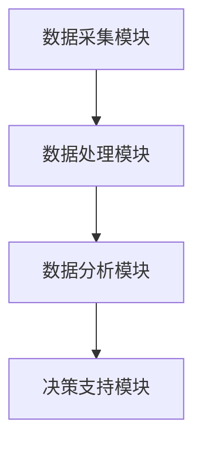

                 


# AI Agent在企业品牌资产管理中的应用

> **关键词**：AI Agent，企业品牌管理，资产价值评估，自然语言处理，机器学习

> **摘要**：随着人工智能技术的快速发展，AI Agent（人工智能代理）在企业品牌资产管理中的应用越来越广泛。本文将深入探讨AI Agent在品牌监测、品牌资产评估、品牌风险管理等方面的核心原理和实际应用。通过结合具体案例和系统架构设计，本文将揭示AI Agent如何帮助企业在数字化时代实现品牌资产的高效管理和价值提升。

---

## 第1章 AI Agent与企业品牌管理概述

### 1.1 AI Agent的基本概念

#### 1.1.1 AI Agent的定义与特点
AI Agent（人工智能代理）是指具有感知环境、理解任务目标并采取行动以实现目标的智能实体。其特点包括：
- **自主性**：能够在没有外部干预的情况下运行。
- **反应性**：能够实时感知环境变化并做出反应。
- **学习能力**：通过机器学习算法不断优化自身的决策能力。
- **可扩展性**：能够适应不同的应用场景和数据规模。

#### 1.1.2 AI Agent的核心原理
AI Agent的核心原理包括：
1. **感知环境**：通过传感器或数据接口获取外部环境信息。
2. **目标设定**：根据任务需求设定具体的目标。
3. **决策制定**：基于感知信息和历史数据，通过算法生成决策。
4. **行动执行**：根据决策结果采取行动，并实时反馈结果。

#### 1.1.3 AI Agent与传统自动化工具的区别
AI Agent与传统自动化工具的主要区别在于其智能性和适应性：
- **智能性**：AI Agent能够理解上下文并做出复杂决策，而传统自动化工具仅能执行预定义的规则。
- **适应性**：AI Agent能够根据环境变化动态调整行为，而传统自动化工具缺乏灵活性。

### 1.2 企业品牌管理的定义与挑战

#### 1.2.1 品牌管理的核心概念
品牌管理是指通过规划和执行一系列策略来提升品牌知名度、美誉度和市场价值的过程。核心要素包括：
- **品牌识别**：品牌在市场中的独特标识。
- **品牌价值**：品牌在消费者心中的价值感知。
- **品牌资产**：品牌在企业资产负债表中的无形资产价值。

#### 1.2.2 传统品牌管理的局限性
传统品牌管理面临以下挑战：
- **数据量大**：品牌数据分散在多个渠道，难以统一管理和分析。
- **实时性差**：传统方法难以实时监测品牌声誉和市场动态。
- **决策滞后**：缺乏数据驱动的决策支持，导致品牌管理效率低下。

#### 1.2.3 数字化品牌管理的趋势
随着大数据和人工智能技术的普及，数字化品牌管理成为趋势：
- **数据驱动决策**：通过AI技术实时分析品牌数据，提供精准的决策支持。
- **自动化管理**：利用AI Agent自动化处理品牌监测、资产评估等任务。
- **智能化优化**：通过机器学习不断优化品牌管理策略。

### 1.3 AI Agent在品牌管理中的应用前景

#### 1.3.1 AI Agent在品牌监测中的作用
AI Agent能够实时监测品牌相关的社交媒体、新闻媒体等渠道，及时发现并处理品牌危机。

#### 1.3.2 AI Agent在品牌资产评估中的优势
AI Agent能够基于海量数据，利用自然语言处理和机器学习算法，对品牌价值进行量化评估。

#### 1.3.3 AI Agent在品牌风险管理中的应用
AI Agent能够预测潜在的品牌风险，并提前制定应对策略，降低品牌损失。

## 1.4 本章小结
本章介绍了AI Agent的基本概念和核心原理，并分析了传统品牌管理的局限性和数字化品牌管理的趋势。通过阐述AI Agent在品牌监测、资产评估和风险管理中的应用前景，为后续章节的深入探讨奠定了基础。

---

## 第2章 AI Agent在品牌资产管理中的核心概念

### 2.1 品牌资产的核心要素

#### 2.1.1 品牌价值的构成
品牌价值由多个因素构成，包括品牌知名度、品牌忠诚度、品牌认知度等。

#### 2.1.2 品牌声誉的衡量标准
品牌声誉可以通过消费者评价、媒体口碑、社交网络情绪等指标进行衡量。

#### 2.1.3 品牌认知度的评估方法
品牌认知度可以通过市场调研、消费者行为分析等方法进行评估。

### 2.2 AI Agent与品牌资产的关系

#### 2.2.1 AI Agent如何提升品牌资产价值
AI Agent可以通过实时监测和分析品牌数据，帮助企业发现潜在的市场机会，提升品牌价值。

#### 2.2.2 AI Agent在品牌资产保护中的作用
AI Agent能够实时监测品牌相关的负面信息，并及时采取措施保护品牌资产。

#### 2.2.3 AI Agent对品牌资产动态管理的支持
AI Agent能够基于动态市场环境，实时调整品牌管理策略，支持品牌资产的动态管理。

### 2.3 品牌资产管理中的关键问题

#### 2.3.1 品牌数据的实时监测
品牌数据的实时监测是品牌资产管理的基础，需要AI Agent具备强大的数据处理能力。

#### 2.3.2 品牌风险的早期预警
通过AI Agent的预测能力，可以实现品牌风险的早期预警，避免潜在损失。

#### 2.3.3 品牌资产的量化评估
AI Agent可以通过数学模型对品牌资产进行量化评估，为企业的决策提供数据支持。

## 2.4 本章小结
本章详细阐述了品牌资产的核心要素，并探讨了AI Agent在品牌资产管理中的作用。通过分析品牌数据的实时监测、品牌风险的早期预警和品牌资产的量化评估，进一步明确了AI Agent在品牌管理中的重要性。

---

## 第3章 AI Agent的核心原理与算法基础

### 3.1 AI Agent的决策机制

#### 3.1.1 基于规则的决策系统
基于规则的决策系统通过预定义的规则进行决策，适用于任务简单、规则明确的场景。

#### 3.1.2 基于机器学习的决策系统
基于机器学习的决策系统能够从历史数据中学习规律，适用于复杂场景的决策。

#### 3.1.3 基于强化学习的决策系统
基于强化学习的决策系统通过不断试错和奖励机制优化决策策略，适用于动态环境下的决策。

### 3.2 品牌数据的特征提取与分析

#### 3.2.1 文本数据的特征提取
通过自然语言处理技术，提取品牌相关的文本数据中的关键词、情感倾向等特征。

#### 3.2.2 图像数据的特征提取
利用图像处理技术，提取品牌相关的图像数据中的颜色、形状等特征。

#### 3.2.3 时间序列数据的特征提取
通过对时间序列数据的分析，提取品牌相关的趋势、周期性等特征。

### 3.3 品牌资产评估的数学模型

#### 3.3.1 品牌价值评估的线性回归模型
线性回归模型用于品牌价值的预测，公式如下：
$$ y = \beta_0 + \beta_1x_1 + \beta_2x_2 + \dots + \beta_nx_n + \epsilon $$
其中，$y$为品牌价值，$x_i$为影响品牌价值的特征变量，$\epsilon$为误差项。

#### 3.3.2 基于神经网络的品牌资产评估模型
神经网络模型能够捕捉复杂的非线性关系，适用于品牌价值的深度评估。

#### 3.3.3 品牌资产评估的对比分析
通过对比不同模型的性能，选择最适合品牌资产评估的模型。

## 3.4 本章小结
本章详细介绍了AI Agent的决策机制，并探讨了品牌数据的特征提取与分析方法。通过数学模型的建立与对比，进一步明确了品牌资产评估的技术实现路径。

---

## 第4章 品牌资产管理的系统架构设计

### 4.1 系统功能模块划分

#### 4.1.1 数据采集模块
数据采集模块负责从社交媒体、新闻媒体等渠道获取品牌相关的数据。

#### 4.1.2 数据处理模块
数据处理模块对采集到的数据进行清洗、转换和预处理。

#### 4.1.3 数据分析模块
数据分析模块利用机器学习算法对数据进行分析，生成品牌资产评估报告。

#### 4.1.4 决策支持模块
决策支持模块基于分析结果，提供品牌管理的决策建议。

### 4.2 系统架构设计

#### 4.2.1 模块间的交互关系
使用Mermaid图展示模块间的交互关系：


#### 4.2.2 系统的高可用性设计
通过负载均衡和容灾备份等技术，确保系统的高可用性。

#### 4.2.3 系统的扩展性设计
通过模块化设计和微服务架构，提升系统的扩展性。

### 4.3 本章小结
本章详细设计了品牌资产管理系统的功能模块和系统架构，为后续的实现提供了理论基础。

---

## 第5章 项目实战

### 5.1 环境安装

#### 5.1.1 安装Python
```bash
# 安装Python
apt-get update && apt-get install python3
```

#### 5.1.2 安装依赖库
```bash
pip install numpy pandas scikit-learn
```

### 5.2 系统核心实现

#### 5.2.1 数据采集模块实现
```python
import requests
from bs4 import BeautifulSoup

def fetch_data(url):
    response = requests.get(url)
    soup = BeautifulSoup(response.text, 'html.parser')
    # 提取数据
    return extracted_data
```

#### 5.2.2 数据处理模块实现
```python
def preprocess_data(data):
    # 数据清洗和转换
    return processed_data
```

#### 5.2.3 数据分析模块实现
```python
from sklearn.linear_model import LinearRegression

def assess_brand_value(features):
    model = LinearRegression()
    model.fit(features, labels)
    return model.predict(new_features)
```

### 5.3 案例分析
通过具体案例分析，验证系统实现的效果和可行性。

### 5.4 本章小结
本章通过项目实战，详细展示了AI Agent在品牌资产管理中的具体实现过程，为读者提供了可参考的代码和技术方案。

---

## 第6章 总结与展望

### 6.1 总结
本文详细探讨了AI Agent在企业品牌资产管理中的核心原理和实际应用，通过系统架构设计和项目实战，进一步验证了AI Agent在品牌管理中的价值。

### 6.2 最佳实践
- **数据质量管理**：确保品牌数据的准确性和完整性。
- **模型优化**：定期更新和优化机器学习模型，提升预测精度。
- **系统维护**：保持系统的稳定运行，及时修复潜在问题。

### 6.3 注意事项
- **数据隐私**：在品牌数据处理过程中，需注意数据隐私保护。
- **算法解释性**：选择具有高解释性的算法，便于结果分析和决策制定。
- **系统安全性**：确保系统的安全性，防止数据泄露和攻击。

### 6.4 拓展阅读
建议读者进一步阅读以下内容：
- 《机器学习实战》
- 《自然语言处理入门》
- 《人工智能系统设计》

---

## 作者：AI天才研究院/AI Genius Institute & 禅与计算机程序设计艺术 /Zen And The Art of Computer Programming

---

以上是《AI Agent在企业品牌资产管理中的应用》的技术博客文章的完整大纲和内容，希望对您有所帮助！

