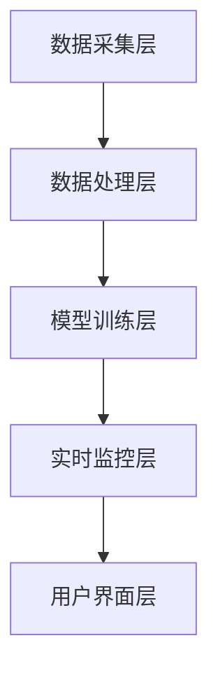
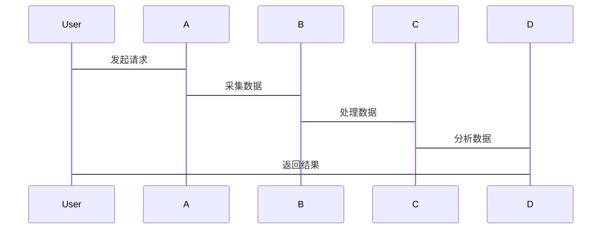

                 


# AI Agent 在企业品质管理与持续改进中的应用

> 关键词：AI Agent，企业品质管理，持续改进，人工智能，机器学习，数字化转型

> 摘要：本文深入探讨了AI Agent在企业品质管理与持续改进中的应用，从AI Agent的基本概念、核心原理到其在数字化转型中的具体应用，再到系统设计、实战案例和最佳实践，全面解析了AI Agent如何助力企业实现高效、智能的品质管理。通过本文，读者可以系统性地了解AI Agent在企业质量管理中的价值和实现路径。

---

# 第1章: AI Agent 与企业品质管理概述

## 1.1 AI Agent 的基本概念与特点

### 1.1.1 AI Agent 的定义与核心要素

AI Agent（人工智能代理）是一种能够感知环境、自主决策并执行任务的智能系统。它通常由以下几个核心要素组成：

1. **感知层**：通过传感器、数据库或其他输入源获取信息。
2. **推理层**：基于感知的信息进行分析、推理和决策。
3. **执行层**：根据决策结果执行具体的操作或任务。
4. **学习层**（可选）：通过机器学习或深度学习技术不断优化自身能力。

AI Agent的核心特点包括：
- **自主性**：能够在没有人工干预的情况下完成任务。
- **反应性**：能够实时感知环境变化并做出响应。
- **学习性**：通过数据和经验不断优化自身性能。
- **协作性**：能够与其他系统或AI Agent协同工作。

### 1.1.2 AI Agent 的主要特点与优势

AI Agent的主要特点包括：
1. **智能化**：能够理解和处理复杂的信息。
2. **高效性**：通过算法优化任务执行效率。
3. **适应性**：能够根据环境变化自动调整策略。
4. **可扩展性**：能够处理不同类型和规模的任务。

AI Agent的优势在于其能够将人工智能技术与企业业务流程深度融合，为企业提供智能化的解决方案。

### 1.1.3 企业品质管理的基本概念与目标

企业品质管理（Quality Management）是指通过一系列方法和技术，确保企业产品或服务的质量达到预期标准。其目标包括：
1. 提高产品质量。
2. 降低生产成本。
3. 提升客户满意度。
4. 实现持续改进。

AI Agent在企业品质管理中的应用，能够帮助企业实现从传统质量管理向智能化质量管理的转变。

---

## 1.2 AI Agent 在企业中的应用背景

### 1.2.1 企业品质管理的现状与挑战

传统企业品质管理存在以下问题：
1. **效率低下**：依赖人工检查，耗时且容易出错。
2. **数据孤岛**：各部门之间的数据难以共享和整合。
3. **缺乏预测性**：无法提前预测潜在的质量问题。
4. **灵活性不足**：难以快速适应市场变化。

### 1.2.2 AI 技术在企业管理中的潜在价值

AI技术在企业管理中的潜在价值包括：
1. **数据驱动决策**：通过分析海量数据，帮助企业做出更明智的决策。
2. **自动化与智能化**：通过自动化流程减少人工干预，提高效率。
3. **实时监控与预测**：通过实时数据分析，提前预测和解决问题。

### 1.2.3 AI Agent 在品质管理中的独特优势

AI Agent在品质管理中的独特优势包括：
1. **实时性**：能够实时监控生产过程，快速响应问题。
2. **精准性**：通过机器学习算法，能够精准识别潜在质量问题。
3. **可扩展性**：能够同时处理多个任务，适应企业规模的扩展。

---

## 1.3 本章小结

本章从AI Agent的基本概念和特点出发，介绍了企业品质管理的基本概念与目标，并分析了AI Agent在企业品质管理中的应用背景及其独特优势。通过本章的学习，读者可以初步了解AI Agent在企业质量管理中的价值和潜力。

---

# 第2章: AI Agent 的核心原理与技术基础

## 2.1 AI Agent 的体系结构

### 2.1.1 AI Agent 的基本组成

AI Agent的体系结构通常包括以下几个部分：
1. **感知层**：通过传感器、数据库等获取环境信息。
2. **推理层**：通过逻辑推理或机器学习模型分析信息。
3. **执行层**：根据推理结果执行具体操作。
4. **学习层**（可选）：通过机器学习优化AI Agent的能力。

### 2.1.2 不同类型 AI Agent 的特点对比

AI Agent可以根据不同的标准进行分类，以下是几种常见的分类方式：
1. **按智能水平**：
   - **反应式AI Agent**：仅能感知当前环境并做出反应。
   - **认知式AI Agent**：具有推理和规划能力。
2. **按应用领域**：
   - **服务式AI Agent**：用于提供特定服务（如客服机器人）。
   - **监控式AI Agent**：用于实时监控和预警（如工业监控系统）。

### 2.1.3 AI Agent 的工作流程与机制

AI Agent的工作流程通常包括以下步骤：
1. **感知环境**：通过传感器或API获取环境信息。
2. **分析数据**：利用机器学习模型对数据进行分析和推理。
3. **制定决策**：根据分析结果制定行动计划。
4. **执行任务**：通过执行器或API完成任务。
5. **学习优化**：根据执行结果优化自身的模型和策略。

---

## 2.2 AI Agent 的核心算法与技术

### 2.2.1 机器学习在 AI Agent 中的应用

机器学习是AI Agent的核心技术之一，常用的算法包括：
1. **监督学习**：用于分类和回归任务。
2. **无监督学习**：用于聚类和降维任务。
3. **强化学习**：用于需要策略优化的任务。

### 2.2.2 自然语言处理技术在 AI Agent 中的应用

自然语言处理（NLP）技术在AI Agent中的应用包括：
1. **意图识别**：通过分析用户输入的文本，识别用户的意图。
2. **实体识别**：从文本中提取关键实体信息。
3. **对话生成**：生成自然流畅的对话回复。

### 2.2.3 知识图谱与推理技术在 AI Agent 中的应用

知识图谱与推理技术在AI Agent中的应用包括：
1. **知识表示**：将企业知识表示为图结构。
2. **逻辑推理**：通过逻辑推理技术解决复杂问题。
3. **关联分析**：分析数据之间的关联关系。

---

## 2.3 AI Agent 与企业系统的集成

### 2.3.1 AI Agent 与企业信息系统的接口设计

AI Agent与企业信息系统的接口设计通常包括：
1. **数据接口**：通过API获取或更新数据。
2. **控制接口**：通过命令控制系统的执行。
3. **反馈接口**：将系统的反馈信息传递给AI Agent。

### 2.3.2 AI Agent 在企业数据流中的位置

AI Agent在企业数据流中的位置通常包括：
1. **数据源**：从传感器、数据库等获取数据。
2. **数据处理**：对数据进行分析和推理。
3. **数据输出**：将结果传递给执行系统或用户。

### 2.3.3 AI Agent 与企业业务流程的整合

AI Agent与企业业务流程的整合通常包括：
1. **流程优化**：通过AI Agent优化业务流程。
2. **实时监控**：通过AI Agent实时监控业务流程。
3. **智能决策**：通过AI Agent提供智能决策支持。

---

## 2.4 本章小结

本章从AI Agent的体系结构出发，详细介绍了其核心算法与技术，并探讨了AI Agent与企业系统的集成方式。通过本章的学习，读者可以深入理解AI Agent的技术基础及其在企业中的应用。

---

# 第3章: 企业品质管理的数字化转型

## 3.1 传统企业品质管理的局限性

### 3.1.1 传统品质管理的流程与痛点

传统品质管理的流程通常包括以下步骤：
1. **数据采集**：通过人工或传感器采集数据。
2. **数据整理**：将数据整理成可分析的格式。
3. **数据分析**：通过人工或简单工具分析数据。
4. **问题处理**：根据分析结果处理问题。

传统品质管理的痛点包括：
1. **效率低下**：人工操作耗时且容易出错。
2. **数据孤岛**：各部门之间的数据难以共享和整合。
3. **缺乏预测性**：无法提前预测潜在质量问题。

### 3.1.2 传统品质管理的效率与成本问题

传统品质管理的效率与成本问题主要体现在：
1. **人工成本高**：需要大量人工参与数据采集和分析。
2. **效率低**：人工操作难以快速响应问题。
3. **成本高**：由于效率低下，整体成本较高。

### 3.1.3 传统品质管理的灵活性与适应性不足

传统品质管理的灵活性与适应性不足主要体现在：
1. **难以快速适应市场变化**：传统方法难以快速调整质量管理策略。
2. **缺乏智能化**：无法通过数据驱动优化质量管理流程。

---

## 3.2 数字化品质管理的兴起

### 3.2.1 数字化品质管理的核心理念

数字化品质管理的核心理念包括：
1. **数据驱动**：通过数据分析优化质量管理。
2. **实时监控**：通过实时数据分析快速响应问题。
3. **智能化**：通过AI技术实现智能化质量管理。

### 3.2.2 数字化品质管理的主要技术手段

数字化品质管理的主要技术手段包括：
1. **物联网（IoT）**：通过物联网技术实现设备的实时监控。
2. **大数据分析**：通过大数据技术分析海量数据。
3. **机器学习**：通过机器学习算法优化质量管理。

### 3.2.3 数字化品质管理的典型应用场景

数字化品质管理的典型应用场景包括：
1. **生产过程监控**：实时监控生产过程中的关键参数。
2. **质量预测**：通过机器学习预测潜在质量问题。
3. **质量改进**：通过数据分析优化质量管理流程。

---

## 3.3 AI Agent 在数字化品质管理中的作用

### 3.3.1 AI Agent 在数据采集与处理中的应用

AI Agent在数据采集与处理中的应用包括：
1. **数据采集**：通过传感器或API采集生产过程中的数据。
2. **数据清洗**：对采集到的数据进行清洗和预处理。
3. **数据分析**：通过机器学习算法分析数据。

### 3.3.2 AI Agent 在质量分析与预测中的应用

AI Agent在质量分析与预测中的应用包括：
1. **质量分析**：通过数据分析识别潜在质量问题。
2. **质量预测**：通过机器学习模型预测未来质量问题。
3. **质量监控**：通过实时监控快速响应问题。

### 3.3.3 AI Agent 在质量改进与优化中的应用

AI Agent在质量改进与优化中的应用包括：
1. **质量优化**：通过数据分析优化质量管理流程。
2. **质量改进**：通过机器学习算法提出改进措施。
3. **持续改进**：通过AI Agent实现持续的质量改进。

---

## 3.4 本章小结

本章从传统企业品质管理的局限性出发，介绍了数字化品质管理的核心理念和主要技术手段，并详细探讨了AI Agent在数字化品质管理中的作用。通过本章的学习，读者可以了解AI Agent在企业质量管理中的具体应用。

---

# 第4章: AI Agent 在企业品质管理中的具体应用

## 4.1 AI Agent 在质量预测中的应用

### 4.1.1 质量预测的核心算法与实现

质量预测的核心算法包括：
1. **监督学习算法**：如支持向量机（SVM）、随机森林（Random Forest）。
2. **深度学习算法**：如卷积神经网络（CNN）、长短期记忆网络（LSTM）。

### 4.1.2 质量预测的实现步骤

质量预测的实现步骤包括：
1. **数据采集**：从生产过程中采集相关数据。
2. **数据预处理**：对数据进行清洗和特征提取。
3. **模型训练**：使用机器学习算法训练预测模型。
4. **模型部署**：将训练好的模型部署到生产环境中。

### 4.1.3 质量预测的实际案例

实际案例：某汽车制造企业通过AI Agent预测发动机可能出现的缺陷，减少了质量问题的发生。

---

## 4.2 AI Agent 在实时监控中的应用

### 4.2.1 实时监控的核心算法与实现

实时监控的核心算法包括：
1. **流数据处理算法**：如滑动窗口算法。
2. **异常检测算法**：如Isolation Forest、K-Means。

### 4.2.2 实时监控的实现步骤

实时监控的实现步骤包括：
1. **数据采集**：通过传感器实时采集生产数据。
2. **数据处理**：对数据进行实时处理和分析。
3. **异常检测**：通过算法检测异常数据。
4. **实时报警**：当检测到异常时，立即报警并采取措施。

### 4.2.3 实时监控的实际案例

实际案例：某电子制造企业通过AI Agent实时监控生产线上的温度和湿度，及时发现并处理异常情况。

---

## 4.3 AI Agent 在异常处理中的应用

### 4.3.1 异常处理的核心算法与实现

异常处理的核心算法包括：
1. **分类算法**：如决策树、逻辑回归。
2. **聚类算法**：如K-Means、DBSCAN。

### 4.3.2 异常处理的实现步骤

异常处理的实现步骤包括：
1. **数据采集**：采集生产过程中的异常数据。
2. **数据分析**：通过算法分析异常数据的特征。
3. **异常分类**：根据异常特征进行分类。
4. **问题解决**：根据分类结果采取相应的解决措施。

### 4.3.3 异常处理的实际案例

实际案例：某化工企业通过AI Agent分析异常数据，快速识别并解决了生产过程中的潜在问题。

---

## 4.4 本章小结

本章详细探讨了AI Agent在企业品质管理中的具体应用，包括质量预测、实时监控和异常处理。通过实际案例的分析，读者可以了解AI Agent在企业质量管理中的实际价值。

---

# 第5章: AI Agent 在企业品质管理中的系统设计

## 5.1 系统架构设计

### 5.1.1 系统架构的组成与功能

系统架构通常包括以下几个部分：
1. **数据采集层**：负责采集生产过程中的数据。
2. **数据处理层**：对数据进行清洗和预处理。
3. **模型训练层**：训练机器学习模型。
4. **实时监控层**：实时监控生产过程。
5. **用户界面层**：提供友好的用户界面。

### 5.1.2 系统架构的实现方案

系统架构的实现方案包括：
1. **数据采集**：通过传感器或API采集数据。
2. **数据存储**：将数据存储在数据库中。
3. **模型训练**：使用机器学习框架（如TensorFlow、PyTorch）训练模型。
4. **实时监控**：通过流数据处理技术实时监控数据。
5. **用户界面**：通过Web界面或移动应用提供用户交互。

---

## 5.2 系统接口设计

### 5.2.1 数据接口的设计与实现

数据接口的设计与实现包括：
1. **数据输入接口**：通过API接收数据。
2. **数据输出接口**：通过API输出分析结果。
3. **数据存储接口**：将数据存储到数据库中。

### 5.2.2 控制接口的设计与实现

控制接口的设计与实现包括：
1. **启动接口**：启动AI Agent的运行。
2. **停止接口**：停止AI Agent的运行。
3. **配置接口**：配置AI Agent的参数和配置。

---

## 5.3 系统交互流程设计

### 5.3.1 交互流程的实现步骤

交互流程的实现步骤包括：
1. **用户请求**：用户通过界面发起请求。
2. **数据采集**：系统采集相关数据。
3. **数据分析**：系统对数据进行分析和处理。
4. **结果反馈**：系统将结果反馈给用户。

### 5.3.2 交互流程的优化

交互流程的优化包括：
1. **减少响应时间**：通过优化算法和架构提高响应速度。
2. **提高准确性**：通过改进算法和模型提高分析准确性。
3. **增强用户体验**：通过优化界面和交互流程提高用户体验。

---

## 5.4 本章小结

本章从系统架构设计出发，详细介绍了系统接口设计和交互流程设计。通过本章的学习，读者可以了解AI Agent在企业品质管理中的系统实现方式。

---

# 第6章: AI Agent 在企业品质管理中的实战案例

## 6.1 项目背景与目标

### 6.1.1 项目背景

某汽车制造企业希望利用AI Agent优化其质量管理流程，减少生产成本，提高产品质量。

### 6.1.2 项目目标

项目目标包括：
1. 实现实时监控生产过程。
2. 预测潜在质量问题。
3. 提供质量改进的建议。

---

## 6.2 环境搭建与代码实现

### 6.2.1 环境搭建

环境搭建步骤包括：
1. **安装Python**：安装最新版本的Python。
2. **安装依赖库**：安装TensorFlow、Keras、Pandas等库。
3. **配置开发环境**：配置Jupyter Notebook或PyCharm作为开发环境。

### 6.2.2 核心代码实现

以下是AI Agent的核心代码实现：

```python
import numpy as np
import pandas as pd
from sklearn.model import SVC
from tensorflow.keras import layers, Model

# 数据预处理
def preprocess_data(data):
    # 数据清洗
    data = data.dropna()
    # 特征提取
    features = data.drop('label', axis=1)
    labels = data['label']
    return features, labels

# 模型训练
def train_model(features, labels):
    # 构建模型
    model = Sequential()
    model.add(layers.Dense(64, activation='relu', input_dim=features.shape[1]))
    model.add(layers.Dense(1, activation='sigmoid'))
    model.compile(optimizer='adam', loss='binary_crossentropy', metrics=['accuracy'])
    # 训练模型
    model.fit(features, labels, epochs=10, batch_size=32)
    return model

# 实时监控
def monitor_data(data):
    # 数据预处理
    processed_data = preprocess_data(data)
    # 预测结果
    predictions = model.predict(processed_data)
    # 返回结果
    return predictions
```

---

## 6.3 案例分析与结果解读

### 6.3.1 案例分析

通过上述代码实现，某汽车制造企业成功实现了生产过程的实时监控和质量预测。通过AI Agent的实时监控，企业能够快速发现并处理生产过程中的异常情况，显著降低了质量问题的发生率。

### 6.3.2 结果解读

1. **模型准确性**：通过训练模型的准确率，可以评估模型的性能。
2. **实时响应时间**：通过记录模型的响应时间，可以评估系统的实时性。
3. **质量改进效果**：通过分析质量问题的减少情况，可以评估AI Agent的实际效果。

---

## 6.4 项目小结

本章通过一个实际案例展示了AI Agent在企业品质管理中的应用。通过环境搭建、代码实现和案例分析，读者可以深入了解AI Agent在企业质量管理中的具体实现方式。

---

# 第7章: AI Agent 在企业品质管理中的最佳实践

## 7.1 实施AI Agent 的步骤与注意事项

### 7.1.1 实施步骤

实施AI Agent的步骤包括：
1. **需求分析**：明确企业的质量管理需求。
2. **数据准备**：收集和整理相关数据。
3. **模型选择**：选择适合的机器学习模型。
4. **系统设计**：设计AI Agent的系统架构。
5. **模型训练**：训练机器学习模型。
6. **系统部署**：将AI Agent部署到生产环境。
7. **持续优化**：根据反馈优化AI Agent的性能。

### 7.1.2 注意事项

注意事项包括：
1. **数据质量**：确保数据的准确性和完整性。
2. **模型选择**：选择适合业务需求的模型。
3. **系统稳定性**：确保系统的稳定性和可靠性。
4. **持续优化**：通过持续优化提高AI Agent的性能。

---

## 7.2 工具推荐与技术选型

### 7.2.1 数据处理工具

推荐使用Pandas、NumPy等数据处理工具。

### 7.2.2 机器学习框架

推荐使用TensorFlow、Keras等机器学习框架。

### 7.2.3 实时监控工具

推荐使用Flafka、Apache Flink等实时监控工具。

---

## 7.3 持续改进与未来趋势

### 7.3.1 持续改进的实施策略

持续改进的实施策略包括：
1. **数据优化**：通过优化数据采集和处理提高模型性能。
2. **模型优化**：通过改进模型结构和参数提高模型准确率。
3. **系统优化**：通过优化系统架构提高系统的稳定性和响应速度。

### 7.3.2 未来趋势

未来趋势包括：
1. **智能化**：AI Agent将更加智能化，能够自主学习和优化。
2. **实时性**：AI Agent将更加注重实时性，能够快速响应问题。
3. **协作性**：AI Agent将更加注重协作性，能够与其他系统和AI Agent协同工作。

---

## 7.4 本章小结

本章从实施AI Agent的步骤和注意事项出发，推荐了相关工具和技术，并展望了AI Agent在企业品质管理中的未来趋势。通过本章的学习，读者可以更好地实施和优化AI Agent，为企业品质管理提供更高效的解决方案。

---

# 附录: AI Agent 的相关技术细节

## 附录A: 机器学习算法公式

1. **线性回归**：
   $$ y = \theta_0 + \theta_1 x + \epsilon $$
2. **逻辑回归**：
   $$ P(y=1|x) = \frac{1}{1 + e^{-\theta^T x}} $$

---

## 附录B: 系统架构图（Mermaid）



---

## 附录C: 交互流程图（Mermaid）



---

## 附录D: 代码实现细节

以下是AI Agent的核心代码实现：

```python
import numpy as np
import pandas as pd
from sklearn.model import SVC
from tensorflow.keras import layers, Model

# 数据预处理
def preprocess_data(data):
    data = data.dropna()
    features = data.drop('label', axis=1)
    labels = data['label']
    return features, labels

# 模型训练
def train_model(features, labels):
    model = Sequential()
    model.add(layers.Dense(64, activation='relu', input_dim=features.shape[1]))
    model.add(layers.Dense(1, activation='sigmoid'))
    model.compile(optimizer='adam', loss='binary_crossentropy', metrics=['accuracy'])
    model.fit(features, labels, epochs=10, batch_size=32)
    return model

# 实时监控
def monitor_data(data):
    features, labels = preprocess_data(data)
    predictions = model.predict(features)
    return predictions
```

---

## 附录E: 扩展阅读

1. **《机器学习实战》**：深入讲解机器学习算法的实现与应用。
2. **《深度学习》**：详细介绍深度学习的原理与应用。
3. **《AI系统设计》**：系统性地讲解AI系统的设计与实现。

---

# 结语

通过本文的学习，读者可以系统性地了解AI Agent在企业品质管理中的应用，从理论到实践，从系统设计到实战案例，全面掌握AI Agent在企业质量管理中的价值和实现路径。未来，随着AI技术的不断发展，AI Agent将在企业品质管理中发挥越来越重要的作用。

---

# 作者：AI天才研究院/AI Genius Institute & 禅与计算机程序设计艺术 /Zen And The Art of Computer Programming

