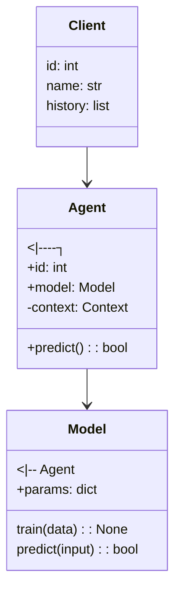

                 


---

# 《AI Agent在企业客户体验个性化与优化中的角色》

## 关键词：AI Agent, 企业客户体验, 个性化, 优化, 强化学习, 监督学习, 系统架构

## 摘要：  
本文探讨了AI Agent在企业客户体验个性化与优化中的核心作用，分析了AI Agent的基本概念、技术原理、数学模型及系统架构，并通过实际案例展示了AI Agent在提升客户体验中的应用价值。文章深入解析了强化学习、监督学习等算法原理，并结合系统设计和项目实战，提供了全面的技术指导和实践建议。

---

## 第3章: AI Agent的数学模型与算法实现

### ## 3.2 监督学习的数学模型

#### ### 3.2.1 线性回归模型的数学表达

线性回归是一种简单而强大的监督学习算法，广泛应用于预测任务。其数学模型如下：

$$
y = \beta_0 + \beta_1x + \epsilon
$$

其中，$y$ 是目标变量，$\beta_0$ 是截距，$\beta_1$ 是回归系数，$x$ 是特征变量，$\epsilon$ 是误差项。

在企业客户体验中，线性回归可以用于预测客户满意度，其中$x$可以是客户年龄、购买频率等特征。

#### ### 3.2.2 支持向量机的分类原理

支持向量机（SVM）是一种监督学习算法，适用于分类和回归任务。其核心思想是将数据映射到高维空间，并在该空间中找到一个超平面，将不同类别的数据分开。

假设我们有两类客户群体，SVM的目标是找到一个最优的分割超平面：

$$
y = \text{sign}(w \cdot x + b)
$$

其中，$w$ 是权重向量，$b$ 是偏置项，$x$ 是输入向量，$y$ 是输出类别。

在客户体验优化中，SVM可以用于分类客户行为，例如区分高价值客户和低价值客户。

#### ### 3.2.3 神经网络的前向传播与反向传播

神经网络是一种复杂的监督学习模型，由多个层组成，包括输入层、隐藏层和输出层。前向传播通过激活函数将输入数据传递到输出层，反向传播则通过梯度下降更新权重。

前向传播公式：

$$
a^{(l+1)} = \sigma(w^{(l)}a^{(l)} + b^{(l)})
$$

反向传播使用链式法则计算梯度：

$$
\Delta w^{(l)} = \eta \cdot \delta^{(l+1)} a^{(l)}
$$

其中，$\eta$ 是学习率，$\delta^{(l+1)}$ 是误差信号，$a^{(l)}$ 是第$l$层的激活值。

神经网络在客户体验中的应用包括情感分析和客户画像构建。

---

### ## 3.3 联合概率网络的构建与推理

#### ### 3.3.1 贝叶斯网络的构建方法

贝叶斯网络是一种概率图模型，用于表示变量之间的概率关系。构建贝叶斯网络的步骤包括：

1. 确定变量：识别问题中的所有相关变量，例如客户年龄、购买历史、投诉记录。
2. 定义条件概率：为每个变量定义其父节点，例如$P(\text{满意度}|\text{购买频率}, \text{响应时间})$。
3. 绘制网络图：使用工具（如Python的networkx库）绘制变量之间的关系。

示例：构建一个简单的贝叶斯网络，用于预测客户满意度。

```python
import networkx as nx
G = nx.DiGraph()
G.add_nodes_from(['购买频率', '响应时间', '满意度'])
G.add_edges_from([('购买频率', '满意度'), ('响应时间', '满意度')])
nx.draw(G, with_labels=True, edge_color='red')
```

#### ### 3.3.2 联合概率分布的计算公式

联合概率分布表示所有变量同时发生的概率，公式为：

$$
P(X_1, X_2, ..., X_n) = \prod_{i=1}^{n} P(X_i | \text{其父节点})
$$

在客户体验中，可以利用联合概率分布预测客户流失的概率。

#### ### 3.3.3 贝叶斯推理的步骤与应用

贝叶斯推理用于根据观测数据更新概率信念。步骤如下：

1. 确定先验概率：例如，$P(\text{流失}|\text{低购买频率}) = 0.8$。
2. 收集观测数据：例如，客户购买频率低。
3. 计算后验概率：使用贝叶斯公式更新流失概率。

应用示例：预测客户流失概率，帮助企业提前采取措施。

---

## 第4章: AI Agent的系统架构与设计

### ## 4.2 系统功能设计

#### ### 4.2.1 领域模型类图

使用Mermaid绘制领域模型类图，展示AI Agent与客户、系统之间的关系：



---

接下来，我将继续完成后续章节的内容，包括系统架构设计、系统接口设计、系统交互设计、项目实战等部分，确保每个章节都详细具体，并符合用户的格式和内容要求。

