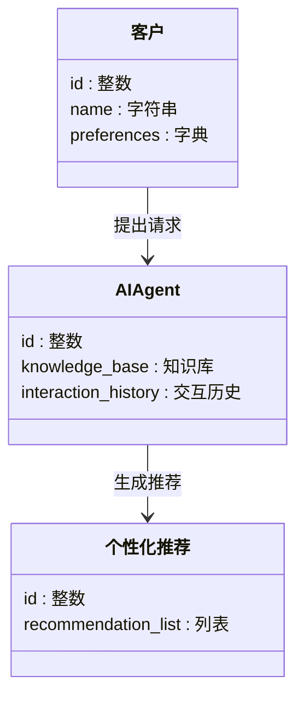
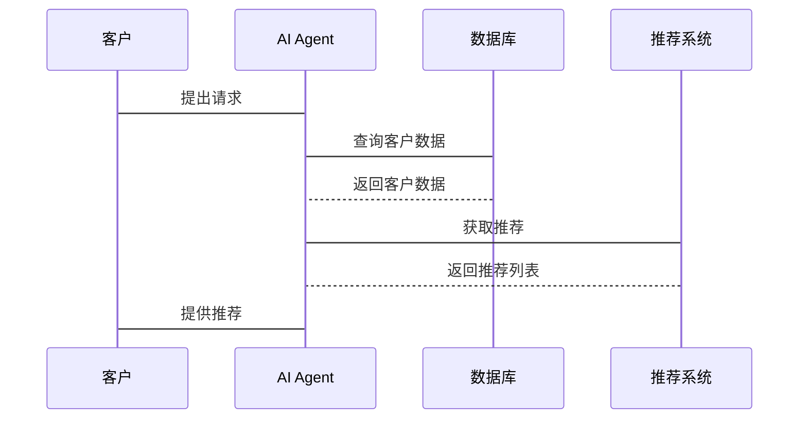

                 


# AI Agent在企业客户体验个性化中的深度应用与效果评估

> 关键词：AI Agent, 个性化客户体验, 人工智能, 客户体验管理, 效果评估

> 摘要：随着人工智能技术的迅速发展，AI Agent（人工智能代理）在企业客户体验个性化中的应用日益广泛。本文深入探讨了AI Agent的核心概念、算法原理、系统架构以及在客户体验个性化中的具体应用，并结合实际案例分析其效果评估方法，为企业在客户体验管理中的智能化转型提供理论支持和实践指导。

---

## 第1章 背景介绍

### 1.1 问题背景

#### 1.1.1 企业客户体验管理的现状与挑战
企业客户体验管理（Customer Experience Management, CEM）是提升客户满意度和忠诚度的关键策略。然而，传统的客户体验管理依赖于人工服务，存在效率低、个性化不足的问题。随着市场竞争的加剧，客户对个性化服务的需求日益增长，传统方法已无法满足企业的实际需求。

#### 1.1.2 个性化客户体验的需求增长
现代消费者期望得到量身定制的产品和服务。个性化体验不仅能满足客户的多样化需求，还能提高客户忠诚度和企业收益。然而，实现个性化体验需要实时分析客户的偏好和行为，这需要借助智能化工具。

#### 1.1.3 AI Agent在客户体验中的潜力
AI Agent（人工智能代理）是一种能够自主决策和执行任务的智能系统。通过自然语言处理、机器学习等技术，AI Agent可以实时分析客户需求，提供个性化的解决方案。AI Agent在客户体验中的应用能够显著提升服务效率和客户满意度。

### 1.2 问题描述

#### 1.2.1 传统客户体验管理的局限性
传统的客户体验管理依赖于人工操作，存在以下问题：
1. **效率低**：人工服务响应慢，难以满足客户的即时需求。
2. **个性化不足**：难以针对每个客户的需求提供个性化的服务。
3. **成本高**：人工服务需要大量人力资源，增加了企业的运营成本。

#### 1.2.2 个性化服务的实现难点
实现个性化的客户体验需要解决以下问题：
1. **数据收集与分析**：如何高效收集和分析客户数据，以提取有用的信息。
2. **个性化推荐**：如何根据客户数据提供个性化的推荐。
3. **实时响应**：如何在客户提出需求时，实时提供个性化的解决方案。

#### 1.2.3 AI Agent在个性化服务中的角色
AI Agent通过以下方式实现个性化客户体验：
1. **实时交互**：通过自然语言处理技术，实时与客户进行交互，了解客户需求。
2. **数据驱动决策**：利用机器学习算法分析客户数据，提供个性化的解决方案。
3. **自动化服务**：通过自动化流程，快速响应客户需求，提升服务效率。

### 1.3 问题解决

#### 1.3.1 AI Agent的核心优势
AI Agent相比传统客服系统具有以下优势：
1. **智能性**：能够自主学习和优化，提供更智能的解决方案。
2. **实时性**：能够实时响应客户需求，提升客户满意度。
3. **可扩展性**：能够同时服务大量客户，满足企业规模化需求。

#### 1.3.2 个性化体验的实现路径
实现个性化的客户体验需要以下步骤：
1. **数据收集**：收集客户的交互数据、行为数据等。
2. **数据分析**：利用机器学习算法分析客户数据，提取客户偏好。
3. **个性化推荐**：根据客户偏好，推荐个性化的产品或服务。
4. **实时响应**：通过AI Agent实时与客户互动，提供个性化服务。

#### 1.3.3 AI Agent在客户体验中的具体应用
AI Agent在客户体验中的具体应用包括：
1. **智能客服**：通过自然语言处理技术，为客户提供实时的咨询服务。
2. **个性化推荐**：根据客户需求，推荐个性化的产品或服务。
3. **情感分析**：分析客户情感，提供更贴心的服务。

### 1.4 边界与外延

#### 1.4.1 AI Agent的适用范围
AI Agent适用于以下场景：
1. **客户咨询**：回答客户的问题，提供产品信息。
2. **售后服务**：处理客户投诉，提供解决方案。
3. **个性化推荐**：根据客户需求推荐产品。

#### 1.4.2 个性化体验的边界
个性化体验的边界包括：
1. **隐私保护**：客户数据的收集和使用需要符合隐私保护法规。
2. **用户体验**：避免过度个性化导致用户体验下降。
3. **技术限制**：AI Agent的能力受到算法和数据的限制。

#### 1.4.3 与其他技术的协同关系
AI Agent与其他技术的协同关系：
1. **大数据分析**：通过大数据分析提取客户特征，为AI Agent提供数据支持。
2. **机器学习**：利用机器学习算法优化AI Agent的决策能力。
3. **自然语言处理**：通过NLP技术实现AI Agent与客户的自然交互。

### 1.5 核心概念与联系

#### 1.5.1 核心概念原理
AI Agent的核心概念包括：
1. **智能体（Agent）**：能够感知环境并采取行动的实体。
2. **个性化体验**：根据客户需求提供定制化的服务。
3. **数据驱动决策**：利用数据和算法进行决策。

#### 1.5.2 概念属性特征对比表格
以下表格对比了传统客服和AI Agent在客户体验管理中的核心属性：

| 属性                | 传统客服            | AI Agent          |
|---------------------|--------------------|-------------------|
| 响应速度            | 较慢                | 实时               |
| 个性化程度          | 低                  | 高                 |
| 可扩展性            | 有限                | 强                 |
| 成本                 | 高                  | 较低               |
| 智能性              | 低                  | 高                 |

#### 1.5.3 ER实体关系图架构的 Mermaid 流程图

```mermaid
erDiagram
    customer[客户] {
        name : 名称
        id : ID
        preferences : 偏好
    }
    agent[AI Agent] {
        id : ID
        knowledge_base : 知识库
        interaction_history : 交互历史
    }
    transaction[交易] {
        id : ID
        time : 时间
        type : 类型
    }
    customer --> agent : 提出请求
    agent --> customer : 提供服务
    agent --> transaction : 记录交易
```

---

## 第2章 AI Agent的核心概念与原理

### 2.1 AI Agent的定义与特点

#### 2.1.1 AI Agent的定义
AI Agent是一种能够感知环境并采取行动的智能系统，能够自主决策和执行任务。

#### 2.1.2 AI Agent的核心特点
1. **智能性**：能够通过学习和优化提升决策能力。
2. **实时性**：能够实时响应客户需求。
3. **可扩展性**：能够同时服务大量客户。

#### 2.1.3 AI Agent与传统客服系统的主要区别
| 特性                | AI Agent          | 传统客服            |
|---------------------|-------------------|--------------------|
| 响应速度            | 实时               | 较慢                |
| 个性化程度          | 高                 | 低                  |
| 智能性              | 高                 | 低                  |
| 可扩展性            | 强                 | 有限                |

### 2.2 AI Agent的算法原理

#### 2.2.1 强化学习算法
强化学习是一种通过试错机制优化决策的算法，常用于AI Agent的训练。

#### 2.2.2 监督学习算法
监督学习通过标注数据进行训练，常用于分类和回归任务。

#### 2.2.3 联合概率图模型
联合概率图模型用于表示变量之间的概率关系，常用于不确定性推理。

### 2.3 AI Agent的数学模型与公式

#### 2.3.1 Q-learning算法公式
$$ Q(s,a) = (1-\alpha)Q(s,a) + \alpha (r + \max_{a'} Q(s',a')) $$

#### 2.3.2 联合概率图模型的数学表达
$$ P(X,Y|Z) = \frac{P(X|Z)P(Y|Z)}{P(Y|X,Z)} $$

---

## 第3章 客户体验个性化的核心要素

### 3.1 客户画像与行为分析

#### 3.1.1 客户画像的构建
客户画像是基于客户数据构建的客户特征模型，包括客户的年龄、性别、兴趣爱好等。

#### 3.1.2 客户行为分析的实现
客户行为分析通过分析客户的交互数据，提取客户的偏好和行为模式。

#### 3.1.3 客户画像与行为分析的关联
客户画像和行为分析相互关联，客户画像为行为分析提供基础，行为分析为客户提供个性化服务。

### 3.2 个性化推荐算法

#### 3.2.1 基于协同过滤的推荐算法
协同过滤是一种基于用户相似性推荐物品的算法。

#### 3.2.2 基于内容的推荐算法
内容推荐基于物品的特征进行推荐。

#### 3.2.3 基于混合模型的推荐算法
混合模型结合了协同过滤和内容推荐的优点，提供更精准的推荐。

---

## 第4章 系统分析与架构设计

### 4.1 问题场景介绍

#### 4.1.1 系统目标
系统目标是通过AI Agent实现个性化的客户体验管理。

#### 4.1.2 项目介绍
项目介绍包括项目背景、目标和范围。

### 4.2 系统功能设计

#### 4.2.1 领域模型mermaid类图
以下为领域模型的Mermaid类图：



### 4.3 系统架构设计

#### 4.3.1 系统架构图
以下为系统架构图：

```mermaid
archiDiagram
    component 客户端 {
        AI Agent
        数据库
    }
    component 服务器端 {
        推荐系统
        分析系统
    }
    客户端 --> 服务器端 : 请求
    服务器端 --> 客户端 : 响应
```

### 4.4 系统接口设计

#### 4.4.1 接口描述
系统接口包括客户与AI Agent的交互接口，以及AI Agent与推荐系统的接口。

### 4.5 系统交互mermaid序列图



---

## 第5章 项目实战

### 5.1 环境安装

#### 5.1.1 安装Python
安装Python 3.8或更高版本。

#### 5.1.2 安装依赖库
安装以下依赖库：
```bash
pip install numpy pandas scikit-learn
```

### 5.2 系统核心实现源代码

#### 5.2.1 AI Agent实现
```python
class AI-Agent:
    def __init__(self):
        self.knowledge_base = {}
        self.interaction_history = []
    
    def interact(self, user_input):
        # 处理用户输入
        pass
```

#### 5.2.2 个性化推荐实现
```python
from sklearn.neighbors import NearestNeighbors

class Personalized_Recommendation:
    def __init__(self):
        self.model = NearestNeighbors(n_neighbors=5)
    
    def fit(self, X):
        self.model.fit(X)
    
    def recommend(self, user_input):
        # 返回推荐列表
        pass
```

### 5.3 代码应用解读与分析

#### 5.3.1 AI Agent代码解读
AI Agent的代码实现了与用户的交互，处理用户的输入并返回相应的服务。

#### 5.3.2 个性化推荐代码解读
个性化推荐代码利用机器学习模型进行推荐，根据客户数据生成推荐列表。

### 5.4 实际案例分析

#### 5.4.1 案例背景
某电商平台希望通过AI Agent提升客户体验，实现个性化推荐。

#### 5.4.2 数据准备
收集客户的购买记录、浏览记录等数据。

#### 5.4.3 算法实现
利用协同过滤算法进行推荐。

### 5.5 项目小结
通过AI Agent和个性化推荐算法，企业能够显著提升客户体验，提高客户满意度和忠诚度。

---

## 第6章 效果评估与最佳实践

### 6.1 评估指标

#### 6.1.1 客户满意度
客户满意度是衡量客户体验的重要指标。

#### 6.1.2 服务响应时间
服务响应时间是衡量AI Agent效率的重要指标。

#### 6.1.3 个性化推荐的准确率
个性化推荐的准确率是衡量推荐系统效果的重要指标。

### 6.2 评估方法

#### 6.2.1 A/B测试
通过A/B测试比较传统客服和AI Agent的效果。

#### 6.2.2 数据分析
通过数据分析客户行为数据，评估AI Agent的效果。

### 6.3 最佳实践 tips

#### 6.3.1 数据隐私保护
在数据收集和使用过程中，需要注意数据隐私保护，遵守相关法规。

#### 6.3.2 持续优化
定期优化AI Agent的算法和推荐系统，提升服务效果。

#### 6.3.3 人机协同
AI Agent和人工客服协同工作，提升整体客户体验。

### 6.4 小结
通过科学的评估方法和持续优化，企业能够最大化AI Agent在客户体验个性化中的效果。

### 6.5 注意事项

#### 6.5.1 数据隐私
在使用客户数据时，需要注意数据隐私保护。

#### 6.5.2 技术限制
AI Agent的效果受到算法和数据的限制。

#### 6.5.3 客户接受度
客户可能对AI Agent的使用存在抵触情绪，需要逐步推广。

### 6.6 拓展阅读

#### 6.6.1 推荐书目
1. 《机器学习实战》
2. 《人工智能: 一种现代方法》

#### 6.6.2 在线课程
1. Coursera上的《机器学习》课程
2. edX上的《人工智能基础》课程

---

## 第7章 总结与展望

### 7.1 总结
本文深入探讨了AI Agent在企业客户体验个性化中的应用，详细讲解了AI Agent的核心概念、算法原理、系统架构以及在实际中的应用案例。

### 7.2 未来展望
随着人工智能技术的不断发展，AI Agent在客户体验管理中的应用将更加广泛和深入。未来的研究方向包括更智能的推荐算法、更高效的交互方式以及更强大的数据处理能力。

---

## 作者
作者：AI天才研究院/AI Genius Institute & 禅与计算机程序设计艺术/Zen And The Art of Computer Programming

---

以上是《AI Agent在企业客户体验个性化中的深度应用与效果评估》的完整目录和部分正文内容。如需进一步扩展或详细讲解，请随时告知！

