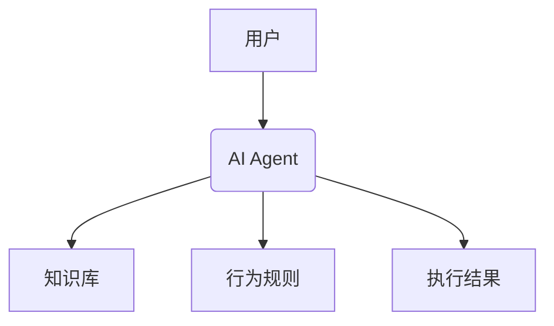
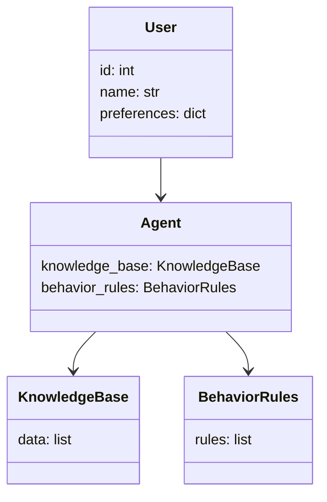
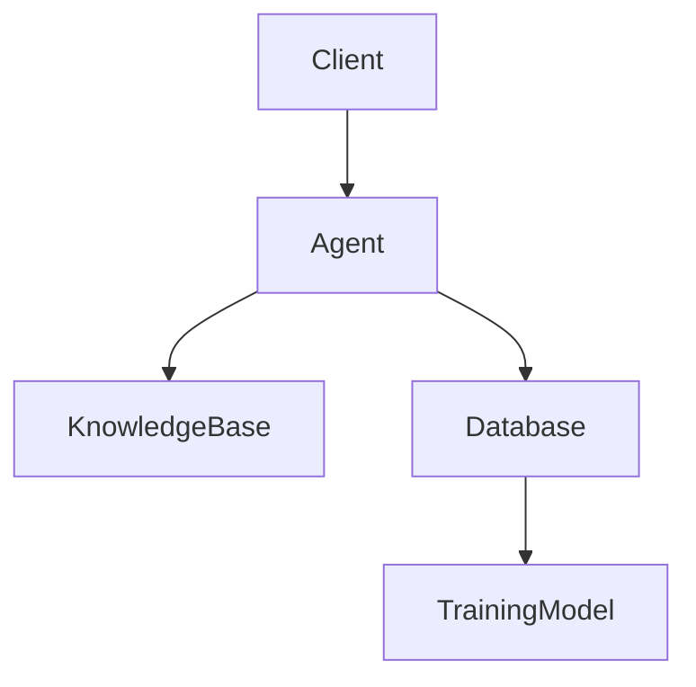
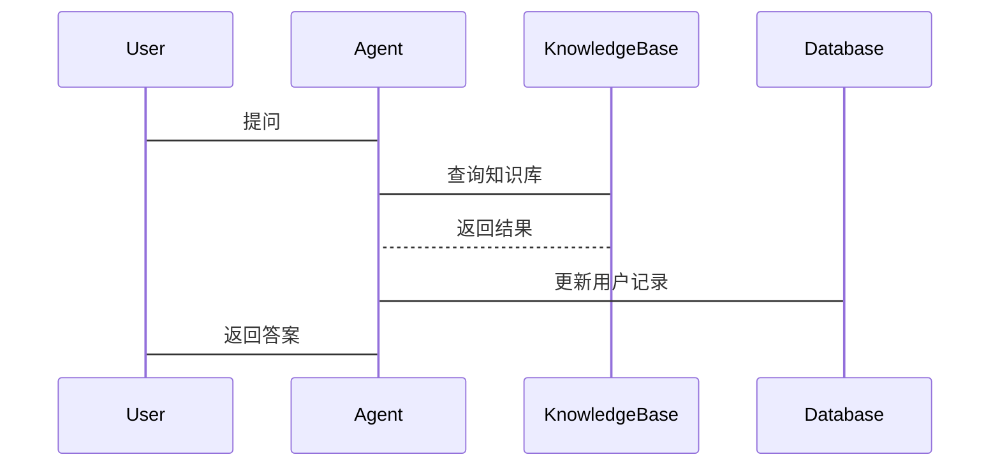

                 


# AI Agent在企业客户体验个性化中的角色

> 关键词：AI Agent，客户体验，个性化服务，人工智能，自然语言处理，系统架构设计

> 摘要：本文深入探讨了AI Agent在企业客户体验个性化中的角色，分析了其核心概念、算法原理、系统架构设计及实际应用场景。通过详细的技术分析和案例研究，展示了AI Agent如何通过智能化服务提升客户满意度和忠诚度，为企业创造更大的价值。

---

# 第1章: AI Agent与客户体验个性化概述

## 1.1 AI Agent的基本概念
### 1.1.1 AI Agent的定义与分类
AI Agent（人工智能代理）是一种能够感知环境并采取行动以实现目标的智能系统。根据功能和应用场景，AI Agent可以分为以下几类：
- **基于规则的AI Agent**：通过预定义的规则和条件进行决策，适用于简单且规则明确的任务。
- **基于机器学习的AI Agent**：通过数据学习和模式识别，能够处理复杂且动态变化的任务。
- **混合型AI Agent**：结合规则和机器学习的优势，适用于复杂场景。

### 1.1.2 AI Agent的核心功能与特点
- **智能性**：能够理解和分析复杂的信息。
- **自主性**：能够在没有人工干预的情况下执行任务。
- **学习能力**：能够通过数据优化自身行为。
- **适应性**：能够根据环境变化调整策略。

### 1.1.3 AI Agent在企业中的应用现状
目前，AI Agent已在多个领域得到广泛应用，如智能客服、个性化推荐、自动化运维等。特别是在客户体验领域，AI Agent通过提供24/7的实时服务，显著提升了客户满意度。

## 1.2 客户体验个性化的定义与重要性
### 1.2.1 客户体验的定义与影响因素
客户体验是指客户在与企业交互过程中所经历的感受和体验。影响因素包括服务质量、响应速度、个性化程度等。

### 1.2.2 个性化客户体验的必要性
个性化体验能够提高客户满意度、客户忠诚度和客户生命周期价值。通过分析客户的偏好和行为，企业可以提供更具针对性的服务。

### 1.2.3 个性化客户体验的实现方式
- **数据驱动**：通过收集和分析客户数据，识别客户偏好。
- **动态调整**：根据实时数据动态优化服务策略。
- **多渠道整合**：通过多种渠道提供一致的个性化服务。

## 1.3 AI Agent在客户体验个性化中的作用
### 1.3.1 AI Agent如何提升客户体验
AI Agent通过智能化的交互方式、实时响应和个性化推荐，显著提升了客户体验。

### 1.3.2 AI Agent在个性化服务中的优势
- **高效性**：能够快速响应客户需求。
- **精准性**：通过数据驱动实现个性化推荐。
- **一致性**：提供一致的用户体验。

### 1.3.3 AI Agent与传统客服的区别
AI Agent能够7×24小时工作，响应速度快，且能够处理大量复杂任务，而传统客服受到时间和人力资源的限制。

## 1.4 本章小结
本章介绍了AI Agent的基本概念、客户体验个性化的重要性及其在企业中的应用现状，强调了AI Agent在提升客户体验中的独特作用。

---

# 第2章: AI Agent的核心概念与联系

## 2.1 AI Agent的核心概念
### 2.1.1 AI Agent的智能性与自主性
AI Agent的智能性体现在其能够理解和处理复杂信息，而自主性则体现在其无需人工干预即可完成任务。

### 2.1.2 AI Agent的学习能力与适应性
通过机器学习算法，AI Agent能够不断优化自身行为，适应新的环境和需求。

### 2.1.3 AI Agent的决策机制与执行能力
AI Agent通过分析输入信息，结合预设规则或学习模型，做出决策并执行相应动作。

## 2.2 AI Agent与相关技术的对比
### 2.2.1 AI Agent与传统规则引擎的对比
| 特性          | AI Agent                          | 传统规则引擎                      |
|---------------|------------------------------------|------------------------------------|
| 智能性         | 高                                 | 低                                 |
| 学习能力       | 高                                 | 无                                 |
| 灵活性         | 高                                 | 低                                 |

### 2.2.2 AI Agent与机器学习模型的对比
AI Agent结合了规则和机器学习的优势，能够在复杂场景下做出更优决策。

### 2.2.3 AI Agent与自然语言处理的对比
AI Agent依赖自然语言处理技术实现与客户的自然交互，而自然语言处理则专注于语言理解和生成。

## 2.3 AI Agent的实体关系图（ER图）


## 2.4 本章小结
本章通过对比分析，强调了AI Agent的独特优势，展示了其在企业中的重要地位。

---

# 第3章: AI Agent的算法原理

## 3.1 AI Agent的算法原理
### 3.1.1 基于规则的AI Agent算法
基于规则的AI Agent通过预定义的规则和条件进行决策，适用于任务简单、规则明确的场景。

### 3.1.2 机器学习模型
机器学习模型通过训练数据学习特征和模式，能够处理复杂场景下的决策任务。

### 3.1.3 自然语言处理算法
自然语言处理算法用于理解客户的意图和情感，实现更自然的交互。

## 3.2 自然语言处理的数学模型
### 3.2.1 余弦相似度
计算两个向量之间的相似度：
$$ \cos\theta = \frac{\mathbf{a} \cdot \mathbf{b}}{\|\mathbf{a}\|\|\mathbf{b}\|} $$

### 3.2.2 词嵌入模型
使用词嵌入技术将词语映射为向量，常见的模型有Word2Vec、GloVe和BERT。

## 3.3 算法实现的Python代码示例
```python
def cosine_similarity(a, b):
    return np.dot(a, b) / (np.linalg.norm(a) * np.linalg.norm(b))

# 示例
vector1 = [1, 2, 3]
vector2 = [4, 5, 6]
similarity = cosine_similarity(vector1, vector2)
print(similarity)
```

---

# 第4章: 系统分析与架构设计

## 4.1 系统分析
### 4.1.1 问题场景
设计一个基于AI Agent的企业客户体验个性化系统，实现智能客服、个性化推荐等功能。

### 4.1.2 项目介绍
本项目旨在通过AI Agent提升客户的个性化体验，降低企业运营成本。

## 4.2 系统功能设计
### 4.2.1 领域模型类图


### 4.2.2 系统架构图


### 4.2.3 系统接口设计
- **API接口**：提供RESTful API，用于与其他系统交互。
- **数据接口**：与数据库和其他数据源对接。

## 4.3 系统交互设计


---

# 第5章: 项目实战

## 5.1 项目环境与工具
- **开发环境**：Python 3.8+
- **工具**：TensorFlow、Keras、Flask框架、NLP库（如spaCy、NLTK）

## 5.2 核心代码实现
### 5.2.1 NLU模型实现
```python
from tensorflow.keras import models
import spacy

nlp = spacy.load("en_core_web_sm")
def process_text(text):
    doc = nlp(text)
    return [token.text for token in doc]
```

### 5.2.2 对话管理模块
```python
class DialogManager:
    def __init__(self):
        self.user_id = None
        self.context = {}
    
    def handle_request(self, request):
        # 处理请求
        response = "您的请求已收到，请稍候。"
        return response
```

## 5.3 实际案例分析
通过一个智能客服系统的案例，详细分析了AI Agent在客户咨询、问题解决中的应用。

## 5.4 项目总结
本项目展示了AI Agent在企业客户体验个性化中的强大能力，同时也指出了未来改进的方向。

---

# 第6章: 总结与展望

## 6.1 全文总结
AI Agent通过智能化服务显著提升了客户体验，为企业创造了更大的价值。

## 6.2 最佳实践 tips
- **数据质量**：确保数据的准确性和完整性。
- **模型优化**：定期更新和优化AI模型。
- **用户体验**：保持与客户的持续交互，及时反馈。

## 6.3 未来展望
随着AI技术的不断进步，AI Agent将在更多领域发挥重要作用，为企业客户体验个性化带来新的可能性。

---

# 作者：AI天才研究院/AI Genius Institute & 禅与计算机程序设计艺术 /Zen And The Art of Computer Programming

---

本文通过系统化的分析和技术实现，深入探讨了AI Agent在企业客户体验个性化中的角色，为企业的智能化转型提供了重要的理论和实践参考。

