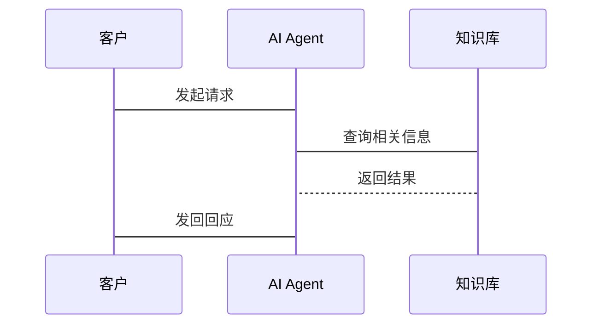

                 


# AI Agent 在企业客户服务自动化中的角色

## 关键词：AI Agent, 企业客户服务, 自动化, 自然语言处理, 机器学习, 系统架构设计

## 摘要：AI Agent 在企业客户服务自动化中的角色是当前技术发展的重要方向。本文从AI Agent 的基本概念出发，分析其在企业客户服务中的应用背景，详细探讨其核心原理与技术基础，系统地设计AI Agent 的架构，并通过项目实战展示其具体实现。最后，总结AI Agent 在企业客户服务自动化中的价值与未来发展方向。

---

# 第一部分: AI Agent 在企业客户服务自动化中的背景与概念

## 第1章: AI Agent 的基本概念与背景

### 1.1 AI Agent 的定义与核心概念

#### 1.1.1 AI Agent 的定义

AI Agent，即人工智能代理，是一种能够感知环境、理解用户需求并执行相应任务的智能系统。AI Agent 的核心目标是通过自动化的方式解决用户的问题，优化企业运营效率。与传统自动化系统相比，AI Agent 具备更强的自主性和智能性，能够处理复杂、多变的任务。

#### 1.1.2 AI Agent 的核心特征

AI Agent 的核心特征包括：

1. **智能性**：能够理解用户意图、推理并生成解决方案。
2. **自主性**：无需人工干预，能够自主完成任务。
3. **适应性**：能够根据环境变化动态调整行为。
4. **交互性**：通过自然语言或其他交互方式与用户或系统进行沟通。

#### 1.1.3 AI Agent 与传统自动化系统的区别

| 特性          | 传统自动化系统                  | AI Agent                     |
|---------------|-------------------------------|----------------------------|
| 智能性         | 基于固定规则，无法处理复杂任务  | 具备智能性，能够处理复杂任务 |
| 适应性         | 无法动态调整，仅能处理固定场景  | 具备动态调整能力             |
| 交互性         | 通常缺乏交互能力               | 具备良好的交互能力           |

### 1.2 企业客户服务自动化的背景与挑战

#### 1.2.1 企业客户服务的现状与痛点

- **人工成本高昂**：传统客户服务依赖大量人工，企业需要招聘大量客服人员。
- **响应速度慢**：人工客服无法满足客户实时需求，尤其是在高峰期。
- **服务质量不一致**：人工客服的素质和能力参差不齐，导致服务质量不稳定。
- **客户需求多样化**：客户的问题种类繁多，人工客服难以应对所有场景。

#### 1.2.2 AI Agent 在客户服务中的应用前景

随着人工智能技术的快速发展，AI Agent 在企业客户服务中的应用前景广阔。AI Agent 可以通过自然语言处理技术理解客户的问题，并通过机器学习算法提供个性化的解决方案。AI Agent 的优势在于能够 24/7 提供服务，且响应速度快，服务质量一致。

#### 1.2.3 客户服务自动化的核心目标与边界

- **核心目标**：提高客户满意度、降低企业成本、提升服务效率。
- **边界**：AI Agent 无法完全替代人类客服，对于复杂或涉及情感的问题仍需要人类客服的介入。

### 1.3 AI Agent 在企业中的角色与价值

#### 1.3.1 AI Agent 的主要功能与应用场景

- **问题解决**：通过自然语言处理技术理解客户问题，并提供解决方案。
- **信息查询**：快速检索企业知识库，提供准确的信息。
- **流程自动化**：处理订单、退款、投诉等流程，减少人工干预。
- **情感分析**：识别客户情感，提供情感支持。

#### 1.3.2 AI Agent 如何提升客户体验

- **实时响应**：客户可以随时获得帮助，无需等待人工客服。
- **个性化服务**：根据客户历史行为提供个性化的解决方案。
- **一致的服务质量**：AI Agent 的服务标准统一，避免因人工失误导致的问题。

#### 1.3.3 AI Agent 对企业效率的优化作用

- **降低人力成本**：减少对人工客服的依赖，降低人力成本。
- **提升服务效率**：通过自动化处理任务，提升整体服务效率。
- **数据驱动优化**：通过收集和分析客户数据，优化企业运营策略。

---

## 第2章: AI Agent 的核心原理与技术基础

### 2.1 AI Agent 的核心原理

#### 2.1.1 自然语言处理（NLP）在 AI Agent 中的作用

自然语言处理（NLP）是 AI Agent 实现人机交互的核心技术。通过 NLP，AI Agent 能够理解客户的自然语言输入，并生成相应的回应。NLP 的关键技术包括分词、语法分析、实体识别、意图识别等。

#### 2.1.2 机器学习算法在 AI Agent 中的应用

机器学习算法在 AI Agent 中主要用于训练模型，使其能够理解客户意图并生成合适的回应。常用的算法包括支持向量机（SVM）、随机森林、卷积神经网络（CNN）和循环神经网络（RNN）等。

#### 2.1.3 知识图谱与上下文理解

知识图谱是用于表示知识的图结构，能够帮助 AI Agent 理解上下文信息。通过知识图谱，AI Agent 可以关联客户的问题与企业的产品、服务等信息，从而提供更准确的解决方案。

### 2.2 AI Agent 的技术架构

#### 2.2.1 基于规则的 AI Agent 架构

基于规则的 AI Agent 架构通过预定义的规则来处理客户问题。这种方式简单易实现，但灵活性较低，难以应对复杂场景。

#### 2.2.2 基于模型的 AI Agent 架构

基于模型的 AI Agent 架构通过机器学习模型来处理客户问题。这种方式灵活性高，能够应对复杂场景，但实现复杂度较高。

#### 2.2.3 混合架构的优势与挑战

混合架构结合了基于规则和基于模型的优势，能够更好地应对复杂场景。但实现复杂度较高，需要平衡规则和模型的使用。

### 2.3 AI Agent 的核心算法与实现

#### 2.3.1 基于决策树的客户意图识别

决策树是一种常用的机器学习算法，能够通过客户输入的特征进行分类，识别客户意图。

#### 2.3.2 基于深度学习的对话生成

深度学习模型，如 Transformer，能够生成自然流畅的对话回应。

#### 2.3.3 基于强化学习的策略优化

强化学习通过奖励机制优化 AI Agent 的行为策略，提升其应对复杂场景的能力。

---

## 第3章: AI Agent 的系统架构与设计

### 3.1 系统功能设计

#### 3.1.1 客户交互模块

客户交互模块负责与客户进行交互，接收输入并生成回应。常用的交互方式包括文本输入、语音输入等。

#### 3.1.2 任务处理模块

任务处理模块负责根据客户的问题生成相应的解决方案。任务处理模块需要与企业知识库和业务系统进行交互。

#### 3.1.3 知识库管理模块

知识库管理模块负责维护企业知识库，包括产品信息、服务流程等。知识库管理模块需要支持知识的动态更新和优化。

### 3.2 系统架构设计

#### 3.2.1 分层架构设计

分层架构将系统划分为多个层次，包括数据层、业务逻辑层和表现层。每一层负责不同的功能，提高系统的可维护性和扩展性。

#### 3.2.2 微服务架构设计

微服务架构将系统划分为多个独立的服务，每个服务负责特定的功能。微服务架构能够提高系统的可扩展性和灵活性。

#### 3.2.3 可扩展性与高可用性设计

通过使用容器化技术（如 Docker）和 orchestration 工具（如 Kubernetes），可以实现系统的可扩展性和高可用性。

### 3.3 系统接口设计

#### 3.3.1 API 接口规范

系统需要定义统一的 API 接口规范，方便其他系统与 AI Agent 进行交互。

#### 3.3.2 数据格式与传输协议

系统需要定义数据的格式和传输协议，常用的协议包括 HTTP、WebSocket 等。

#### 3.3.3 接口的安全性与认证

系统需要对 API 接口进行安全性设计，包括身份认证、权限控制等。

### 3.4 系统交互设计

#### 3.4.1 系统交互流程

系统交互流程包括客户发起请求、AI Agent 接收请求、生成回应并返回客户。

#### 3.4.2 交互序列图

以下是系统交互的 Mermaid 序列图：



---

## 第4章: 项目实战

### 4.1 环境安装与配置

#### 4.1.1 安装 Python 环境

安装 Python 和 pip：

```bash
python --version
pip install --upgrade pip
```

#### 4.1.2 安装依赖库

安装常用的依赖库，如 Flask、Numpy、TensorFlow 等：

```bash
pip install flask numpy tensorflow
```

### 4.2 核心代码实现

#### 4.2.1 自然语言处理模型

使用预训练的 NLP 模型进行客户意图识别：

```python
import numpy as np

def customer_intent Recognition(text):
    # 假设我们有一个预训练的模型，能够返回意图标签
    # 例如，0表示退款，1表示查询订单，2表示投诉
    model = np.array([0.3, 0.5, 0.2])
    return np.argmax(model)
```

#### 4.2.2 对话生成模型

使用 Transformer 模型生成对话回应：

```python
import tensorflow as tf
from tensorflow import keras

def build_model():
    model = keras.Sequential()
    model.add(keras.layers.Embedding(input_dim=10000, output_dim=16))
    model.add(keras.layers.SimpleRNN(units=16))
    model.add(keras.layers.Dense(10, activation='softmax'))
    return model
```

### 4.3 代码应用解读与分析

#### 4.3.1 自然语言处理模型的解读

上述代码定义了一个简单的自然语言处理模型，用于客户意图识别。模型通过预训练的参数返回意图标签，帮助 AI Agent 理解客户需求。

#### 4.3.2 对话生成模型的解读

对话生成模型基于 Transformer 架构，能够生成自然流畅的对话回应。模型通过编码器和解码器结构，实现对输入文本的理解和生成。

### 4.4 实际案例分析

#### 4.4.1 案例背景

假设我们有一个电商企业，希望通过 AI Agent 提供客户服务自动化。

#### 4.4.2 系统实现

根据上述代码实现，部署一个简单的 AI Agent 系统，能够处理客户退款、查询订单等请求。

### 4.5 项目小结

通过项目实战，我们实现了 AI Agent 的核心功能，包括客户意图识别和对话生成。项目展示了 AI Agent 在企业客户服务中的实际应用，验证了其可行性和价值。

---

## 第5章: 总结与展望

### 5.1 最佳实践 tips

- 在实际应用中，建议结合企业自身的业务需求，选择合适的 AI Agent 实现方案。
- 定期优化 AI Agent 的模型和知识库，提升其智能性和准确性。

### 5.2 小结

本文详细探讨了 AI Agent 在企业客户服务自动化中的角色，从基本概念到系统设计，再到项目实战，全面展示了其在企业中的应用价值。

### 5.3 注意事项

- AI Agent 的实现需要结合企业的具体需求，不能盲目追求技术复杂性。
- 在实际应用中，需要关注数据安全和隐私保护问题。

### 5.4 拓展阅读

- 《自然语言处理实战》：深入理解 NLP 技术。
- 《机器学习实战》：掌握机器学习的核心算法。

---

作者：AI天才研究院/AI Genius Institute & 禅与计算机程序设计艺术/Zen And The Art of Computer Programming

---

以上是《AI Agent 在企业客户服务自动化中的角色》的完整目录和内容大纲。

