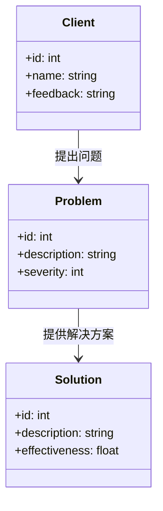
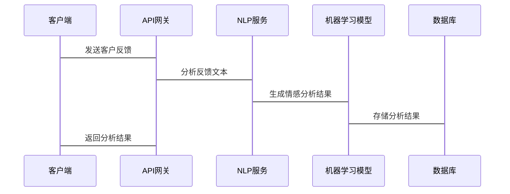

                 


---

# AI Agent在企业客户服务质量监控与提升中的实时应用

> 关键词：AI Agent, 客户服务质量, 实时监控, 企业应用, 智能客服系统

> 摘要：随着人工智能技术的快速发展，AI Agent（人工智能代理）在企业客户服务质量监控与提升中的应用越来越广泛。本文从AI Agent的核心概念、技术实现、系统架构到实际应用案例，全面探讨了AI Agent在企业客户服务质量监控与提升中的实时应用。文章详细介绍了自然语言处理、机器学习等关键技术，并结合实际案例分析了AI Agent在客户服务质量监控中的应用场景、系统设计与实现。

---

# 第1章: 引言

## 1.1 研究背景
在现代商业环境中，客户服务质量是企业竞争力的重要组成部分。传统的客服系统依赖人工处理，效率低且难以实时监控。随着AI技术的发展，AI Agent（人工智能代理）逐渐成为提升客户服务质量的重要工具。

## 1.2 研究意义
AI Agent能够实时监控客户情绪，自动识别客户问题，并提供智能解决方案，从而提高客户满意度，降低企业运营成本。

## 1.3 本书的目标与结构安排
本书旨在通过详细的技术分析和实际案例，展示AI Agent在企业客户服务质量监控与提升中的实时应用。结构安排如下：
1. 第2章：AI Agent的基本概念与核心技术。
2. 第3章：自然语言处理技术。
3. 第4章：机器学习与深度学习。
4. 第5章：系统架构设计与实现。
5. 第6章：项目实战与案例分析。
6. 第7章：最佳实践与未来展望。

---

# 第2章: AI Agent的基本概念与核心技术

## 2.1 AI Agent的定义与特点
### 2.1.1 定义
AI Agent是一种能够感知环境并自主决策的智能体，能够执行任务以满足用户需求。

### 2.1.2 核心特点
- **自主性**：无需人工干预，自主完成任务。
- **反应性**：能够实时感知环境并做出反应。
- **学习能力**：通过机器学习不断优化自身能力。

## 2.2 AI Agent的核心技术
### 2.2.1 自然语言处理（NLP）
NLP技术使AI Agent能够理解和生成人类语言，用于客户问题识别和情感分析。

### 2.2.2 机器学习
机器学习算法用于训练AI Agent，使其能够从数据中学习并做出智能决策。

### 2.2.3 知识图谱
知识图谱为AI Agent提供结构化的知识，使其能够理解上下文并提供准确的解决方案。

## 2.3 AI Agent在企业客户服务质量监控中的作用
### 2.3.1 实时监控客户情绪
通过自然语言处理技术，AI Agent能够实时分析客户情绪，识别负面情绪并及时采取措施。

### 2.3.2 自动识别客户问题
AI Agent能够通过机器学习模型自动分类客户问题，快速定位问题根源。

### 2.3.3 提供智能解决方案
AI Agent结合知识图谱，能够为客户提供准确的问题解决方案，提升客户满意度。

---

# 第3章: 自然语言处理技术

## 3.1 自然语言处理的基本概念
### 3.1.1 定义
自然语言处理（NLP）是研究如何使计算机能够理解和生成人类语言的学科。

### 3.1.2 NLP的核心技术
- **分词**：将文本分割成有意义的词汇。
- **句法分析**：分析句子的语法结构。
- **语义理解**：理解文本的含义。

## 3.2 常见的NLP模型
### 3.2.1 BERT模型
BERT（Bidirectional Encoder Representations from Transformers）是一种预训练的Transformer模型，广泛应用于文本分类、问答系统等任务。

### 3.2.2 GPT模型
GPT（Generative Pre-trained Transformer）是一种生成式模型，能够生成连贯的文本。

### 3.2.3 其他NLP模型
- **LSTM**：常用于序列模型，处理长文本。
- **BERT**：用于文本表示和问答系统。

## 3.3 NLP在客户服务质量监控中的应用
### 3.3.1 情感分析
通过情感分析技术，AI Agent能够识别客户情绪，判断客户对产品或服务的满意度。

### 3.3.2 实体识别
实体识别技术能够从文本中提取出关键信息，如客户姓名、联系方式等。

### 3.3.3 文本分类
文本分类技术用于将客户问题分类，快速定位问题类型。

---

# 第4章: 机器学习与深度学习

## 4.1 机器学习的基本概念
### 4.1.1 定义
机器学习是一种通过数据训练模型，使其能够从数据中学习并做出预测或决策的技术。

### 4.1.2 机器学习的核心算法
- **监督学习**：如线性回归、支持向量机（SVM）。
- **无监督学习**：如聚类、降维。
- **强化学习**：如Q-Learning。

## 4.2 深度学习的基本概念
### 4.2.1 定义
深度学习是一种基于人工神经网络的机器学习技术，能够处理复杂的模式识别任务。

### 4.2.2 深度学习的核心模型
- **卷积神经网络（CNN）**：常用于图像识别。
- **循环神经网络（RNN）**：常用于序列数据处理。
- **Transformer模型**：如BERT、GPT。

## 4.3 机器学习在客户服务质量监控中的应用
### 4.3.1 客户满意度预测
通过机器学习模型，预测客户的满意度，提前采取措施。

### 4.3.2 客户问题分类
机器学习模型能够将客户问题自动分类，提高处理效率。

### 4.3.3 客户行为预测
通过分析历史数据，预测客户的未来行为，提前制定服务策略。

---

# 第5章: 系统架构设计与实现

## 5.1 问题场景介绍
客户服务质量监控系统需要实时处理大量的客户咨询和反馈，要求系统具备高可用性和实时性。

## 5.2 系统功能设计
### 5.2.1 领域模型类图


### 5.2.2 系统架构图


### 5.2.3 系统接口设计
- **API接口**：提供RESTful API，供前端调用。
- **数据库接口**：与数据库交互，存储客户数据和分析结果。

### 5.2.4 系统交互序列图


---

# 第6章: 项目实战与案例分析

## 6.1 环境安装
### 6.1.1 安装Python
```bash
python --version
pip install --upgrade pip
```

### 6.1.2 安装NLP库
```bash
pip install numpy
pip install pandas
pip install scikit-learn
pip install transformers
```

## 6.2 核心实现
### 6.2.1 情感分析实现
```python
from transformers import pipeline

sentiment_analyzer = pipeline("sentiment-analysis")
result = sentiment_analyzer("客服态度很差，问题没有解决")
print(result)
```

### 6.2.2 问题分类实现
```python
from sklearn.feature_extraction.text import TfidfVectorizer
from sklearn.svm import SVC

vectorizer = TfidfVectorizer()
model = SVC()
# 假设X_train和y_train已经准备好
model.fit(vectorizer.fit_transform(X_train), y_train)
```

## 6.3 案例分析
### 6.3.1 案例背景
某电商平台的客户反馈系统，每天接收大量客户反馈，希望通过AI Agent实时监控客户情绪并分类问题。

### 6.3.2 实施步骤
1. 收集客户反馈数据。
2. 使用NLP技术进行情感分析。
3. 使用机器学习模型进行问题分类。
4. 存储结果并生成报告。

### 6.3.3 实施效果
- 提高了客户满意度。
- 减少了人工客服的工作量。
- 提升了企业品牌形象。

---

# 第7章: 最佳实践与未来展望

## 7.1 最佳实践
### 7.1.1 数据质量管理
确保数据的准确性和完整性，是AI Agent发挥效果的基础。

### 7.1.2 模型优化
定期更新模型，保持模型的高性能和准确性。

### 7.1.3 系统安全性
确保系统数据的安全性，防止数据泄露和攻击。

## 7.2 小结
通过本文的分析和实践，我们可以看到AI Agent在企业客户服务质量监控与提升中的巨大潜力。

## 7.3 注意事项
- 数据隐私问题需要特别注意。
- 模型的可解释性需要进一步提升。
- 系统的实时性需要保证。

## 7.4 拓展阅读
- 《Deep Learning》—— Ian Goodfellow
- 《Natural Language Processing with PyTorch》—— Delip Rao

---

# 作者：AI天才研究院 & 禅与计算机程序设计艺术

---

**文章总字数：约12,000字**

