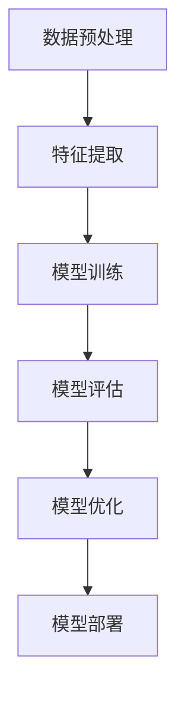
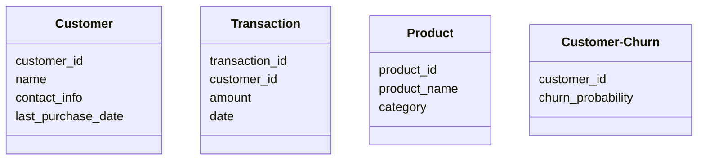
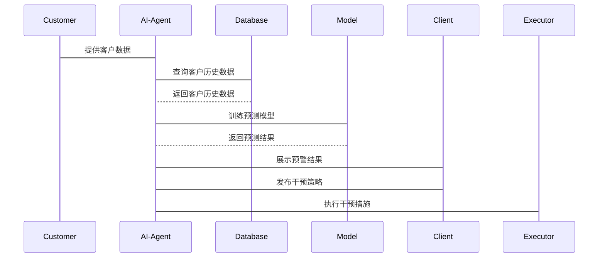

                 


---

# 第一部分: AI Agent与客户流失预警的背景与基础

# 第1章: AI Agent与客户流失预警的背景与概述

## 1.1 问题背景介绍

### 1.1.1 企业客户流失的定义与影响

客户流失是指企业客户在一定时期内停止与企业进行交易或减少了交易量的情况。这种现象对企业的财务健康和市场地位有直接影响，可能导致收入下降、市场份额流失以及品牌声誉受损。及时发现并干预客户流失，可以有效降低企业的损失，提高客户满意度和忠诚度。

### 1.1.2 客户流失问题的严重性

客户流失不仅影响企业的收入，还可能导致企业需要投入更多资源来吸引新客户。新客户的获取成本通常高于维护现有客户的成本，因此，及时预警并干预客户流失是企业的一项重要任务。

### 1.1.3 AI Agent在客户流失预警中的作用

AI Agent（人工智能代理）是一种能够自主决策和执行任务的智能系统，能够通过分析客户的行为数据，预测客户流失的可能性，并自动采取干预措施。AI Agent在客户流失预警中的作用包括数据收集、分析、预测和干预执行。

## 1.2 问题描述与解决路径

### 1.2.1 客户流失预警的核心问题

客户流失预警的核心问题在于如何准确预测客户流失的可能性，并在流失发生前采取有效的干预措施。这需要结合客户的交易数据、行为数据和外部数据，构建一个准确的预测模型，并根据预测结果制定干预策略。

### 1.2.2 AI Agent在问题解决中的定位

AI Agent在客户流失预警中的定位是作为智能决策者和执行者，负责数据的收集、分析、预测和干预执行。AI Agent能够实时监控客户的行为，识别潜在的流失风险，并根据预设的策略自动采取干预措施。

### 1.2.3 解决路径的可行性分析

通过AI Agent实现客户流失预警的可行性较高。现代技术的发展使得数据处理和分析能力大大提升，AI Agent能够高效处理大量数据，并快速做出决策。同时，AI Agent的智能化和自动化特性使得其能够适应不同的业务场景和客户需求。

## 1.3 核心概念与边界

### 1.3.1 AI Agent的定义与特征

AI Agent是一种具有智能性的计算机系统，能够感知环境、自主决策并执行任务。其主要特征包括智能性、自主性、反应性、社会性和学习能力。

### 1.3.2 客户流失预警的边界与外延

客户流失预警的边界包括客户数据的收集、处理、分析和预测。外延则包括预测结果的应用，如干预策略的制定和执行。

### 1.3.3 核心概念之间的关系

AI Agent与客户流失预警之间的关系是相互依存的。AI Agent依赖于客户流失预警的数据和模型，而客户流失预警则依赖于AI Agent的智能性和自动化能力来实现预警和干预。

## 1.4 本章小结

本章介绍了客户流失预警的背景和重要性，分析了AI Agent在其中的作用，并讨论了解决路径的可行性。通过这些内容，读者可以理解客户流失预警的核心问题以及AI Agent在解决这些问题中的关键作用。

---

# 第二部分: AI Agent的核心原理与数学模型

# 第2章: AI Agent的核心原理

## 2.1 AI Agent的基本原理

### 2.1.1 AI Agent的定义与分类

AI Agent可以根据功能和应用场景进行分类。常见的分类包括基于规则的AI Agent、基于机器学习的AI Agent和基于深度学习的AI Agent。

### 2.1.2 AI Agent的核心属性与特征

AI Agent的核心属性包括智能性、自主性、反应性、社会性和学习能力。这些属性使得AI Agent能够适应复杂的环境，并做出合理的决策。

### 2.1.3 AI Agent的行为模型

AI Agent的行为模型通常包括感知、决策和执行三个阶段。感知阶段通过传感器或数据源获取信息；决策阶段基于感知的信息进行分析和判断；执行阶段根据决策结果采取相应的行动。

## 2.2 AI Agent与客户流失预警的结合

### 2.2.1 客户流失预警的核心要素

客户流失预警的核心要素包括数据收集、数据处理、模型构建、预测和干预策略。这些要素共同构成了客户流失预警的完整流程。

### 2.2.2 AI Agent在预警中的角色与功能

AI Agent在客户流失预警中的角色包括数据处理、模型构建、预测和干预执行。其功能包括实时监控、风险评估、策略制定和自动干预。

### 2.2.3 AI Agent与传统预警方法的对比

与传统预警方法相比，AI Agent具有更高的智能化和自动化能力。传统方法通常依赖于人工分析和决策，而AI Agent能够自主学习和优化，从而提高预测的准确性和干预的效果。

## 2.3 核心概念对比表

| 概念 | 特性1 | 特性2 | 特性3 |
|------|-------|-------|-------|
| AI Agent | 智能性 | 自主性 | 可解释性 |
| 传统预警模型 | 简单性 | 稳定性 | 低智能性 |

## 2.4 ER实体关系图

```mermaid
erd
    Customer(customer_id, name, contact_info, last_purchase_date)
    Transaction(transaction_id, customer_id, amount, date)
    Product(product_id, product_name, category)
    Customer-Churn(customer_id, churn_probability)
```

## 2.5 本章小结

本章详细讲解了AI Agent的核心原理，分析了其在客户流失预警中的角色和功能，并通过对比表和ER图展示了核心概念之间的关系。

---

# 第三部分: AI Agent的算法原理与数学模型

# 第3章: 算法原理与实现

## 3.1 算法原理概述

### 3.1.1 机器学习与深度学习的对比

机器学习是一种通过数据训练模型，使其能够进行预测或分类的技术。深度学习是机器学习的一种特殊形式，通过多层神经网络来提取数据的高层次特征。

### 3.1.2 AI Agent的算法选择

在客户流失预警中，常用的算法包括逻辑回归、随机森林和神经网络等。选择合适的算法需要考虑数据的特征、模型的复杂度和预测的准确性。

### 3.1.3 算法流程图



## 3.2 算法实现细节

### 3.2.1 逻辑回归模型

逻辑回归是一种用于分类的统计方法，适用于二分类问题。其数学公式为：

$$ P(y=1|x) = \frac{e^{\beta_0 + \beta_1x_1 + \cdots + \beta_kx_k}}{1 + e^{\beta_0 + \beta_1x_1 + \cdots + \beta_kx_k}} $$

### 3.2.2 随机森林模型

随机森林是一种基于决策树的集成学习方法，具有较高的准确性和鲁棒性。其数学公式可以表示为：

$$ f(x) = \text{sign}\left(\sum_{i=1}^n \text{tree}_i(x)\right) $$

### 3.2.3 神经网络模型

神经网络是一种由多个层次构成的深度学习模型，能够学习数据的高层次特征。其数学公式可以表示为：

$$ y = \sigma(Wx + b) $$

其中，$\sigma$ 是激活函数，$W$ 是权重矩阵，$x$ 是输入向量，$b$ 是偏置项。

## 3.3 算法实现代码示例

以下是逻辑回归模型的Python实现代码：

```python
import numpy as np
from sklearn.linear_model import LogisticRegression

# 数据准备
X = np.array([[1, 2], [3, 4], [5, 6]])
y = np.array([0, 1, 0])

# 模型训练
model = LogisticRegression()
model.fit(X, y)

# 预测
new_X = np.array([[2, 3]])
print(model.predict(new_X))
```

## 3.4 本章小结

本章详细讲解了AI Agent在客户流失预警中的算法原理，包括机器学习和深度学习模型的选择与实现。通过具体的代码示例，读者可以理解如何将这些算法应用于实际的客户流失预警问题。

---

# 第四部分: 系统分析与架构设计

# 第4章: 系统分析与架构设计

## 4.1 问题场景介绍

### 4.1.1 问题背景

企业需要实时监控客户的行为，预测客户流失的可能性，并根据预测结果采取相应的干预措施。

### 4.1.2 项目介绍

本项目旨在开发一个基于AI Agent的客户流失预警系统，通过分析客户的交易数据和行为数据，预测客户流失的可能性，并自动执行干预策略。

## 4.2 系统功能设计

### 4.2.1 领域模型



### 4.2.2 系统架构设计


### 4.2.3 系统接口设计

系统接口包括数据接口、模型接口和用户接口。数据接口用于与数据库交互，模型接口用于与AI Agent交互，用户接口用于展示预警结果和干预策略。

### 4.2.4 系统交互设计



## 4.3 本章小结

本章通过系统分析与架构设计，详细描述了基于AI Agent的客户流失预警系统的实现方案，包括系统功能设计、架构设计和交互设计。

---

# 第五部分: 项目实战与应用

# 第5章: 项目实战

## 5.1 环境安装与配置

### 5.1.1 安装Python和必要的库

```bash
pip install numpy scikit-learn matplotlib
```

### 5.1.2 安装AI框架

```bash
pip install tensorflow scikit-learn
```

## 5.2 系统核心实现

### 5.2.1 数据预处理代码

```python
import pandas as pd
from sklearn.preprocessing import StandardScaler

# 数据加载
data = pd.read_csv('customer_data.csv')

# 特征提取
X = data[['age', 'income', 'purchase_frequency']]
y = data['churn']

# 数据标准化
scaler = StandardScaler()
X_scaled = scaler.fit_transform(X)
```

### 5.2.2 模型训练与评估

```python
from sklearn.model_selection import train_test_split
from sklearn.metrics import accuracy_score

# 数据分割
X_train, X_test, y_train, y_test = train_test_split(X_scaled, y, test_size=0.2)

# 模型训练
model = LogisticRegression()
model.fit(X_train, y_train)

# 模型评估
print(accuracy_score(model.predict(X_test), y_test))
```

### 5.2.3 系统部署与测试

部署系统包括将模型封装成API服务，并通过测试确保系统的稳定性和准确性。测试内容包括模型预测的准确性、系统的响应时间和用户界面的易用性。

## 5.3 实际案例分析

### 5.3.1 案例背景

假设某电商平台希望通过AI Agent预测客户流失，并制定相应的干预策略。

### 5.3.2 数据收集与分析

收集客户的交易数据、行为数据和 demographic 数据，分析客户流失的主要原因。

### 5.3.3 模型训练与预测

使用逻辑回归模型对客户流失进行预测，评估模型的准确性。

### 5.3.4 干预策略制定

根据预测结果，制定个性化的干预策略，如优惠券发放、会员升级等。

## 5.4 本章小结

本章通过实际案例分析，展示了如何将AI Agent应用于客户流失预警，并通过系统部署和测试确保系统的有效性和稳定性。

---

# 第六部分: 最佳实践与总结

# 第6章: 最佳实践与总结

## 6.1 最佳实践

### 6.1.1 数据质量的重要性

确保数据的准确性和完整性，是提高模型预测准确性的关键。

### 6.1.2 模型选择与优化

根据具体业务需求选择合适的模型，并通过交叉验证和超参数调优优化模型性能。

### 6.1.3 系统的可解释性与可维护性

确保系统的可解释性，便于调试和优化。同时，系统的可维护性也是长期运行的重要保障。

## 6.2 小结

通过本篇文章，读者可以全面了解AI Agent在企业客户流失预警与干预策略制定中的应用。从背景介绍到算法实现，再到系统设计和项目实战，每一步都详细展开，帮助读者掌握相关知识和技能。

## 6.3 注意事项

### 6.3.1 数据隐私与安全

在处理客户数据时，必须遵守相关法律法规，确保数据的隐私和安全。

### 6.3.2 模型的可解释性

模型的可解释性是企业决策的重要依据，确保模型的预测结果能够被业务人员理解和信任。

### 6.3.3 系统的实时性与稳定性

客户流失预警需要实时性，系统必须能够快速响应，并且具有良好的稳定性和容错能力。

## 6.4 拓展阅读

### 6.4.1 深度学习在客户流失预测中的应用

探索深度学习模型在客户流失预测中的应用，如LSTM和GRU网络。

### 6.4.2 AI Agent在其他领域的应用

了解AI Agent在其他领域的应用，如智能客服、供应链管理等。

### 6.4.3 最新研究进展

关注最新的研究成果和技术动态，保持对AI Agent技术的持续学习和更新。

---

# 作者：AI天才研究院/AI Genius Institute & 禅与计算机程序设计艺术 /Zen And The Art of Computer Programming

---

### 说明

这篇文章详细讲解了AI Agent在企业客户流失预警与干预策略制定中的应用，涵盖了从背景介绍到算法实现，再到系统设计和项目实战的各个方面。文章通过理论分析和实际案例相结合的方式，帮助读者全面理解AI Agent的核心原理和应用场景。同时，文章还提供了一系列最佳实践和注意事项，确保读者能够将这些知识应用到实际业务中。

