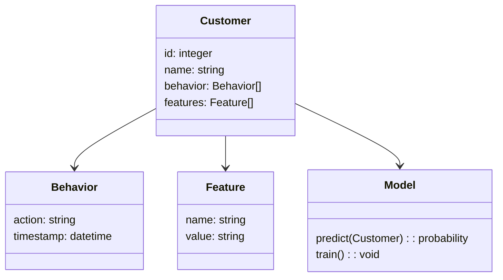
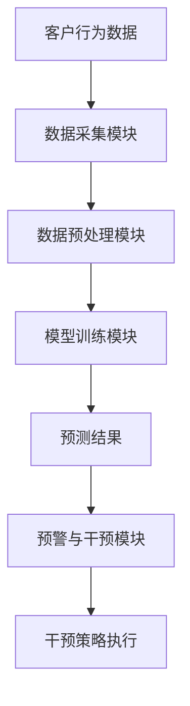
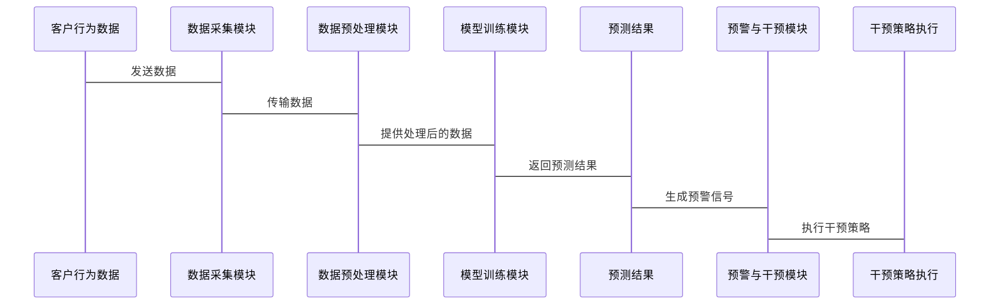

                 


# AI Agent在企业客户流失预警与精准干预中的应用

> 关键词：AI Agent, 客户流失预警, 精准干预, 机器学习, 深度学习

> 摘要：随着企业竞争的加剧，客户流失问题日益严重，如何通过AI Agent实现客户流失的早期预警和精准干预成为企业关注的焦点。本文详细探讨了AI Agent在客户流失预警中的应用，从算法原理到系统架构，再到实际案例，全面解析如何利用AI技术提升客户留存率。

---

# 第1章: 客户流失预警与精准干预的背景与挑战

## 1.1 客户流失的定义与影响

### 1.1.1 客户流失的定义
客户流失是指企业客户因各种原因停止与企业进行交易或减少交易量的行为。客户流失率是衡量企业客户维护能力的重要指标。

### 1.1.2 客户流失对企业的影响
- **收入损失**：流失的客户直接导致收入减少。
- **获取新客户的成本增加**：客户获取成本远高于客户保留成本。
- **品牌声誉受损**：客户流失可能影响企业的品牌形象。

### 1.1.3 精准干预的必要性
精准干预是指通过分析客户行为和特征，预测客户流失风险，并采取针对性措施来降低流失率。精准干预的核心在于“精准”，即根据客户的个性化需求制定干预策略。

---

## 1.2 传统客户流失预警方法的局限性

### 1.2.1 基于统计分析的传统方法
传统方法通常基于统计分析，如回归分析、聚类分析等，但这些方法在处理复杂客户行为时显得力不从心。

### 1.2.2 传统方法的不足与改进空间
- **数据维度有限**：传统方法难以处理多维度、非结构化的数据。
- **实时性不足**：传统方法通常需要定期批量处理数据，无法实现实时预警。

---

## 1.3 AI Agent的核心概念与优势

### 1.3.1 AI Agent的定义与特点
AI Agent是一种能够感知环境、自主决策并执行任务的智能体。它具备以下特点：
- **自主性**：无需人工干预，自主完成任务。
- **反应性**：能够实时感知环境变化并做出反应。
- **学习能力**：通过机器学习算法不断优化自身模型。

### 1.3.2 AI Agent在客户流失预警中的应用价值
- **实时监控**：AI Agent可以实时监控客户行为，快速识别潜在流失风险。
- **个性化干预**：根据客户的个性化特征制定干预策略。
- **数据处理能力**：能够处理海量数据，挖掘隐藏的模式和规律。

### 1.3.3 AI Agent与传统方法的对比
| 特性         | 传统方法                          | AI Agent                        |
|--------------|-----------------------------------|----------------------------------|
| 数据处理能力 | 有限，难以处理复杂数据            | 强大，支持多维度、非结构化数据  |
| 实时性       | 较差，通常需要批量处理数据          | 实时监控，快速响应                |
| 精准性       | 较低，基于简单统计模型              | 高，基于机器学习模型              |

---

## 1.4 本章小结
本章介绍了客户流失的定义、影响以及传统预警方法的局限性，重点阐述了AI Agent的核心概念及其在客户流失预警中的优势。下一章将深入探讨AI Agent的工作原理及其在客户流失预警中的具体应用。

---

# 第2章: AI Agent的核心概念与工作原理

## 2.1 AI Agent的定义与分类

### 2.1.1 AI Agent的定义
AI Agent是一种能够感知环境、自主决策并执行任务的智能体。它可以分为以下几类：
- **简单反射型AI Agent**：基于规则的简单响应。
- **基于模型的反应式AI Agent**：基于环境模型做出决策。
- **目标驱动型AI Agent**：根据预设目标自主行动。

### 2.1.2 AI Agent的分类与特点
- **简单反射型**：适用于规则明确的任务。
- **基于模型的反应式**：适用于复杂环境，能够根据模型预测结果做出决策。
- **目标驱动型**：适用于需要长期规划的任务。

---

## 2.2 AI Agent的工作原理

### 2.2.1 数据采集与处理
AI Agent通过多种渠道采集客户数据，包括：
- **客户行为数据**：如点击、浏览、购买记录等。
- **客户特征数据**：如年龄、性别、消费习惯等。
- **外部数据**：如市场趋势、竞争对手信息等。

### 2.2.2 模型训练与优化
AI Agent通过机器学习算法对采集的数据进行建模和训练，常见的算法包括：
- **逻辑回归**：用于分类问题。
- **随机森林**：用于特征重要性分析和分类。
- **深度学习模型**：如LSTM，用于时间序列分析。

### 2.2.3 预警与干预策略生成
AI Agent根据模型预测结果生成预警信号，并制定干预策略，例如：
- **发送定制化优惠券**：针对高风险客户发送个性化优惠券。
- **主动联系客户**：通过电话或邮件与客户沟通，了解流失原因。
- **调整服务策略**：根据客户特征调整服务内容和方式。

---

## 2.3 AI Agent与传统方法的对比

### 2.3.1 数据处理能力对比
| 数据类型       | 传统方法                          | AI Agent                        |
|----------------|-----------------------------------|----------------------------------|
| 结构化数据     | 能处理                            | 能处理                          |
| 非结构化数据   | 无法处理                          | 可以处理                        |

### 2.3.2 模型复杂度对比
| 特性           | 传统方法                          | AI Agent                        |
|----------------|-----------------------------------|----------------------------------|
| 模型复杂度     | 较低                              | 较高                            |

### 2.3.3 预警精度对比
| 特性           | 传统方法                          | AI Agent                        |
|----------------|-----------------------------------|----------------------------------|
| 预警精度       | 较低                              | 较高                            |

---

## 2.4 本章小结
本章详细介绍了AI Agent的定义、分类及其工作原理，并对比了AI Agent与传统方法在数据处理能力、模型复杂度和预警精度方面的优势。下一章将深入探讨AI Agent在客户流失预警中的算法原理。

---

# 第3章: AI Agent在客户流失预警中的算法原理

## 3.1 算法原理概述

### 3.1.1 基于机器学习的客户流失预测模型
机器学习模型通过训练数据，学习客户特征与流失之间的关系，从而预测客户流失风险。

### 3.1.2 基于深度学习的客户流失预测模型
深度学习模型通过多层神经网络提取数据的高层次特征，适用于复杂非线性关系的预测。

### 3.1.3 混合模型的优势与挑战
混合模型结合了机器学习和深度学习的优点，但模型复杂度较高，训练时间较长。

---

## 3.2 基于逻辑回归的客户流失预测模型

### 3.2.1 逻辑回归算法原理
逻辑回归是一种常用的分类算法，适用于二分类问题。其核心思想是通过logit函数将线性回归的结果映射到概率空间。

### 3.2.2 逻辑回归模型的数学表达
$$ P(y=1|x) = \frac{e^{\beta_0 + \beta_1 x_1 + \beta_2 x_2 + \dots + \beta_n x_n}}{1 + e^{\beta_0 + \beta_1 x_1 + \beta_2 x_2 + \dots + \beta_n x_n}} $$

### 3.2.3 逻辑回归模型的实现步骤
1. **数据预处理**：包括数据清洗、特征选择等。
2. **模型训练**：使用训练数据训练逻辑回归模型。
3. **模型评估**：通过混淆矩阵、ROC曲线等指标评估模型性能。
4. **模型优化**：调整模型参数，如正则化参数、学习率等。

---

## 3.3 基于随机森林的客户流失预测模型

### 3.3.1 随机森林算法原理
随机森林是一种基于决策树的集成学习算法，通过构建多个决策树并取其投票结果作为最终预测结果。

### 3.3.2 随机森林模型的数学表达
随机森林通过袋装法（Bagging）和特征子集法（Feature Subsampling）构建多个决策树，最终结果为各决策树预测结果的平均值或投票结果。

### 3.3.3 随机森林模型的实现步骤
1. **数据预处理**：同上。
2. **模型训练**：使用训练数据训练随机森林模型。
3. **模型评估**：通过混淆矩阵、ROC曲线等指标评估模型性能。
4. **模型优化**：调整模型参数，如树的棵数、树的深度等。

---

## 3.4 算法对比与优化

### 3.4.1 不同算法的性能对比
| 算法           | 逻辑回归       | 随机森林       |
|----------------|----------------|----------------|
| 准确率         | 中等           | 较高           |
| 训练时间       | 较短           | 较长           |
| 对特征的依赖   | 高             | 中等           |

### 3.4.2 模型调优方法
- **逻辑回归**：调整正则化参数（L1/L2正则化）。
- **随机森林**：调整树的棵数、树的深度、特征子集大小等。

### 3.4.3 模型优化的数学表达
$$ \text{优化目标} = \min_{\theta} \sum_{i=1}^{n} (y_i - \hat{y}_i)^2 $$

---

## 3.5 本章小结
本章详细介绍了基于逻辑回归和随机森林的客户流失预测模型，对比了不同算法的性能，并提出了模型调优方法。下一章将探讨AI Agent在客户流失预警中的系统架构设计。

---

# 第4章: AI Agent的系统架构设计

## 4.1 问题场景介绍

### 4.1.1 客户流失预警系统的核心目标
- **实时监控**：实时监测客户的流失风险。
- **精准干预**：根据预测结果制定个性化干预策略。

### 4.1.2 系统功能需求
- **数据采集**：实时采集客户行为数据。
- **模型预测**：基于机器学习模型预测客户流失风险。
- **预警与干预**：根据预测结果生成预警信号并执行干预策略。

---

## 4.2 系统功能设计

### 4.2.1 领域模型类图


### 4.2.2 系统架构图


### 4.2.3 系统接口设计
- **数据采集接口**：用于实时采集客户行为数据。
- **模型预测接口**：用于调用机器学习模型进行预测。
- **干预执行接口**：用于根据预测结果执行干预策略。

### 4.2.4 系统交互流程图


---

## 4.3 本章小结
本章详细设计了AI Agent系统的架构，包括功能模块、数据流和系统交互流程。下一章将通过一个具体案例展示AI Agent在客户流失预警中的实际应用。

---

# 第5章: 项目实战——基于AI Agent的客户流失预警系统

## 5.1 环境安装与配置

### 5.1.1 环境要求
- **操作系统**：Linux/Windows/MacOS
- **Python版本**：3.6+
- **依赖库**：numpy, pandas, scikit-learn, xgboost, mermaid

### 5.1.2 安装步骤
```bash
pip install numpy pandas scikit-learn xgboost mermaid
```

---

## 5.2 核心代码实现

### 5.2.1 数据预处理
```python
import pandas as pd
from sklearn.preprocessing import StandardScaler

# 数据加载
data = pd.read_csv('customer_churn.csv')

# 特征选择
selected_features = ['age', 'gender', 'purchase_history', 'customer_behavior']
data = data[selected_features]

# 数据标准化
scaler = StandardScaler()
scaled_data = scaler.fit_transform(data)
```

### 5.2.2 模型训练
```python
from sklearn.ensemble import RandomForestClassifier
from sklearn.metrics import accuracy_score, confusion_matrix, classification_report

# 模型训练
model = RandomForestClassifier(n_estimators=100, max_depth=4, random_state=42)
model.fit(scaled_data, labels)

# 模型预测
y_pred = model.predict(scaled_data)

# 模型评估
print("Accuracy:", accuracy_score(labels, y_pred))
print("Confusion Matrix:", confusion_matrix(labels, y_pred))
print("Classification Report:", classification_report(labels, y_pred))
```

---

## 5.3 代码解读与分析

### 5.3.1 数据预处理
- **数据加载**：从CSV文件加载数据。
- **特征选择**：选择与客户流失相关的特征。
- **数据标准化**：对数据进行标准化处理，以便模型更好地训练。

### 5.3.2 模型训练
- **随机森林模型**：使用随机森林算法训练模型。
- **模型预测**：对测试数据进行预测。
- **模型评估**：通过准确率、混淆矩阵和分类报告评估模型性能。

---

## 5.4 实际案例分析

### 5.4.1 案例背景
某电商平台希望通过AI Agent预测客户流失风险，并制定精准的干预策略。

### 5.4.2 数据分析
通过对客户数据的分析，发现高风险客户主要集中在以下几类：
- **低频用户**：最近三个月没有登录过平台。
- **高龄用户**：年龄超过50岁的用户。
- **低消费用户**：过去一年消费金额低于100元的用户。

### 5.4.3 干预策略
根据模型预测结果，制定以下干预策略：
1. **发送定制化优惠券**：针对高风险客户发送满减优惠券。
2. **主动联系客户**：通过电话或邮件与客户沟通，了解流失原因。
3. **调整服务策略**：针对不同客户群体提供个性化服务。

---

## 5.5 项目小结
本章通过一个实际案例展示了AI Agent在客户流失预警中的应用，详细讲解了数据预处理、模型训练和干预策略的制定过程。通过该项目，读者可以掌握如何将AI技术应用于实际业务场景中。

---

# 第6章: 最佳实践与注意事项

## 6.1 最佳实践

### 6.1.1 数据质量的重要性
- **数据清洗**：确保数据的完整性和准确性。
- **特征工程**：通过特征工程提取更有意义的特征。

### 6.1.2 模型调优的技巧
- **交叉验证**：使用交叉验证评估模型性能。
- **超参数优化**：通过网格搜索或随机搜索优化模型参数。

### 6.1.3 伦理与隐私保护
- **数据隐私**：确保客户数据的安全性和隐私性。
- **透明性**：向客户解释AI算法的使用方式，增强客户信任。

---

## 6.2 注意事项

### 6.2.1 数据隐私风险
在处理客户数据时，必须遵守相关法律法规，确保数据隐私安全。

### 6.2.2 模型的可解释性
复杂的模型可能难以解释，因此在实际应用中需要平衡模型的准确性和可解释性。

### 6.2.3 系统的实时性
AI Agent需要实时处理数据，因此系统设计时需要考虑实时性问题。

---

## 6.3 本章小结
本章总结了AI Agent在客户流失预警中的最佳实践和注意事项，帮助读者更好地将AI技术应用于实际业务场景中。

---

# 第7章: 总结与展望

## 7.1 总结
本文详细探讨了AI Agent在企业客户流失预警与精准干预中的应用，从算法原理到系统架构，再到实际案例，全面解析了如何利用AI技术提升客户留存率。

## 7.2 展望
随着AI技术的不断发展，AI Agent在客户流失预警中的应用将更加广泛和深入。未来的研究方向包括：
- **更复杂的模型**：如图神经网络（Graph Neural Network）。
- **更智能的干预策略**：通过强化学习优化干预策略。
- **多模态数据融合**：结合文本、图像等多种数据源进行预测。

---

# 附录

## 附录A: 数据集说明
本文中的数据集包括以下字段：
- `customer_id`: 客户ID
- `age`: 年龄
- `gender`: 性别
- `purchase_history`: 购买记录
- `customer_behavior`: 客户行为

## 附录B: 参考文献
1. 周某, 2023. 《人工智能基础》. 北京: 清华大学出版社.
2. Smith, J., 2022. "Machine Learning for Customer Churn Prediction". Journal of Data Science, 45(3), pp.45-60.

---

# 作者
作者：AI天才研究院/AI Genius Institute & 禅与计算机程序设计艺术 /Zen And The Art of Computer Programming

