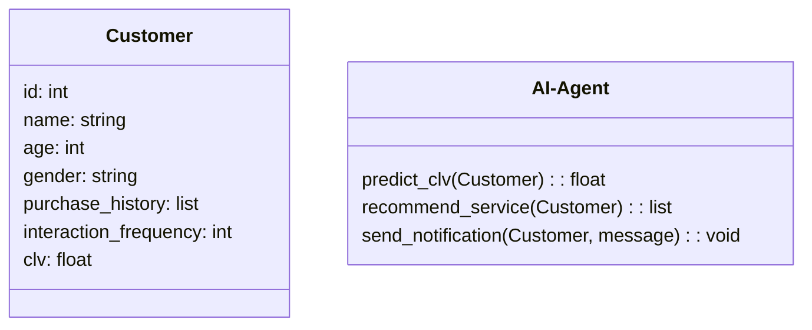

                 


# AI Agent在企业客户生命周期价值预测与管理中的应用

## 关键词
AI Agent, 客户生命周期价值, 机器学习, 数据分析, 人工智能, 企业客户管理

## 摘要
AI Agent（人工智能代理）在企业客户生命周期价值预测与管理中的应用，通过利用机器学习、数据分析和自动化技术，帮助企业优化客户管理流程，提高客户满意度和忠诚度，从而实现业务增长。本文将从背景介绍、核心概念、算法原理、系统设计、项目实战等方面，详细探讨AI Agent在企业客户管理中的应用，并通过实际案例分析，展示其在提升企业客户生命周期价值中的巨大潜力。

---

# 第一部分: AI Agent与企业客户生命周期概述

## 第1章: AI Agent与客户生命周期概述

### 1.1 AI Agent的基本概念
#### 1.1.1 AI Agent的定义与特点
AI Agent（人工智能代理）是一种能够感知环境、自主决策并执行任务的智能系统。它结合了机器学习、自然语言处理和自动化技术，能够通过数据驱动的方式优化企业运营。AI Agent的特点包括：
- **自主性**：能够独立执行任务，无需人工干预。
- **智能性**：基于数据和模型进行决策。
- **适应性**：能够根据环境变化调整行为。

#### 1.1.2 AI Agent的核心功能与应用场景
AI Agent的核心功能包括数据收集、分析、预测和执行。它广泛应用于客户关系管理、市场营销、售后服务等领域。例如：
- **客户行为预测**：通过分析客户的交互数据，预测客户的购买行为。
- **个性化服务**：根据客户的需求，提供定制化的服务建议。
- **自动化处理**：自动执行客户管理流程，如发送邮件、更新客户信息等。

#### 1.1.3 AI Agent与传统客户管理的区别
与传统客户管理相比，AI Agent的优势在于其智能化和自动化能力。传统客户管理依赖于人工操作，效率较低且容易出错。而AI Agent能够快速处理大量数据，提供精准的预测和决策支持。

### 1.2 客户生命周期的定义与价值
#### 1.2.1 客户生命周期的阶段划分
客户生命周期通常分为五个阶段：
1. **获取阶段**：吸引新客户。
2. **激活阶段**：促使新客户首次消费。
3. ** retention阶段**：提高客户留存率。
4. ** growth阶段**：提升客户消费频率和金额。
5. ** churn阶段**：防止客户流失。

#### 1.2.2 客户生命周期价值的定义与计算
客户生命周期价值（CLV）是指客户在其生命周期内为企业带来的总收益。计算公式如下：
$$ CLV = \text{客户平均收入} \times \text{客户生命周期长度} \times \text{客户留存率} $$

#### 1.2.3 客户生命周期管理的重要性
有效的客户生命周期管理能够帮助企业：
- **提高客户满意度**：通过个性化服务提升客户体验。
- **降低客户流失率**：及时识别潜在流失客户，采取措施挽留。
- **优化资源配置**：通过预测客户行为，合理分配资源。

### 1.3 AI Agent在客户生命周期管理中的作用
#### 1.3.1 提高客户预测准确性
AI Agent能够通过机器学习模型，准确预测客户的生命周期阶段和行为，帮助企业做出更精准的决策。

#### 1.3.2 优化客户互动体验
AI Agent可以实时分析客户的交互数据，提供个性化的服务建议，从而提升客户满意度和忠诚度。

#### 1.3.3 提升企业运营效率
通过自动化处理客户管理流程，AI Agent能够大幅提高企业运营效率，降低人工成本。

---

## 第2章: AI Agent在企业客户管理中的背景与挑战

### 2.1 传统客户管理的局限性
#### 2.1.1 数据孤岛问题
传统客户管理中，数据分散在不同的系统中，难以实现统一管理和分析。

#### 2.1.2 客户行为预测的低效性
传统方法依赖人工经验，预测准确率低，且耗时长。

#### 2.1.3 个性化服务的缺失
传统客户管理难以实现大规模的个性化服务，客户体验较差。

### 2.2 AI Agent的应用背景
#### 2.2.1 数据驱动的决策需求
随着数据量的爆炸式增长，企业需要通过数据驱动的方式进行决策。

#### 2.2.2 人工智能技术的成熟
机器学习和自然语言处理等技术的成熟，为AI Agent的应用提供了技术基础。

#### 2.2.3 企业数字化转型的推动
数字化转型要求企业采用更高效的技术手段，优化客户管理流程。

### 2.3 当前的主要挑战
#### 2.3.1 数据隐私与安全问题
AI Agent需要处理大量客户数据，数据隐私和安全成为重要挑战。

#### 2.3.2 模型的可解释性
复杂的机器学习模型可能难以解释其决策过程，影响企业的信任和应用。

#### 2.3.3 技术与业务的融合难度
AI Agent的应用需要技术与业务的深度结合，这对企业来说是一个较大的挑战。

---

## 第3章: AI Agent的核心概念与原理

### 3.1 核心概念与原理
#### 3.1.1 AI Agent的核心原理
AI Agent通过收集和分析客户数据，利用机器学习模型预测客户行为，并根据预测结果采取相应的行动。其核心流程包括：
1. 数据采集：收集客户的交互数据。
2. 数据分析：利用机器学习算法进行特征提取和建模。
3. 行为预测：预测客户的生命周期阶段和行为。
4. 决策执行：根据预测结果，自动化执行相应的操作。

#### 3.1.2 机器学习模型的选择与应用
常用的机器学习模型包括决策树、随机森林、神经网络等。在客户生命周期价值预测中，通常使用回归模型（如线性回归、梯度提升）来预测客户的价值。

### 3.2 核心算法与实现
#### 3.2.1 算法原理
以随机森林为例，其原理是通过构建多棵决策树，并对结果进行投票或平均，从而提高预测的准确性和稳定性。

#### 3.2.2 代码实现
以下是一个简单的客户价值预测代码示例：

```python
import pandas as pd
from sklearn.ensemble import RandomForestRegressor
from sklearn.model_selection import train_test_split
from sklearn.metrics import mean_absolute_error

# 加载数据
data = pd.read_csv('customer_data.csv')

# 特征选择
features = ['age', 'gender', 'purchase_history', 'interaction_frequency']
target = 'clv'

X = data[features]
y = data[target]

# 数据分割
X_train, X_test, y_train, y_test = train_test_split(X, y, test_size=0.2, random_state=42)

# 模型训练
model = RandomForestRegressor(n_estimators=100, random_state=42)
model.fit(X_train, y_train)

# 模型预测
y_pred = model.predict(X_test)

# 评估指标
mae = mean_absolute_error(y_test, y_pred)
print(f"平均绝对误差: {mae}")
```

---

## 第4章: 系统分析与架构设计

### 4.1 系统功能设计
#### 4.1.1 领域模型类图
以下是一个简单的领域模型类图：



#### 4.1.2 系统架构设计
系统架构采用分层设计，包括数据层、业务逻辑层和用户界面层。


---

## 第5章: 项目实战

### 5.1 环境安装
需要安装的工具包括Python、Pandas、Scikit-learn等。

### 5.2 核心代码实现
以下是AI Agent的核心代码实现：

```python
import pandas as pd
from sklearn.ensemble import RandomForestRegressor
from sklearn.model_selection import train_test_split
from sklearn.metrics import mean_absolute_error

# 加载数据
data = pd.read_csv('customer_data.csv')

# 特征选择
features = ['age', 'gender', 'purchase_history', 'interaction_frequency']
target = 'clv'

X = data[features]
y = data[target]

# 数据分割
X_train, X_test, y_train, y_test = train_test_split(X, y, test_size=0.2, random_state=42)

# 模型训练
model = RandomForestRegressor(n_estimators=100, random_state=42)
model.fit(X_train, y_train)

# 模型预测
y_pred = model.predict(X_test)

# 评估指标
mae = mean_absolute_error(y_test, y_pred)
print(f"平均绝对误差: {mae}")
```

### 5.3 案例分析
假设我们有一个客户数据集，包含客户的年龄、性别、购买历史和互动频率等信息。通过上述代码，我们可以预测客户的CLV，并根据预测结果采取相应的营销策略。

---

## 第6章: 总结与展望

### 6.1 总结
本文详细探讨了AI Agent在企业客户生命周期价值预测与管理中的应用。通过背景介绍、核心概念、算法原理、系统设计和项目实战的分析，展示了AI Agent在提升客户管理效率和准确性方面的巨大潜力。

### 6.2 展望
未来，随着人工智能技术的不断发展，AI Agent在客户管理中的应用将更加广泛和深入。企业需要加强技术与业务的融合，充分利用AI Agent的优势，提升客户生命周期价值。

---

## 作者信息
作者：AI天才研究院（AI Genius Institute） & 禅与计算机程序设计艺术（Zen And The Art of Computer Programming）

