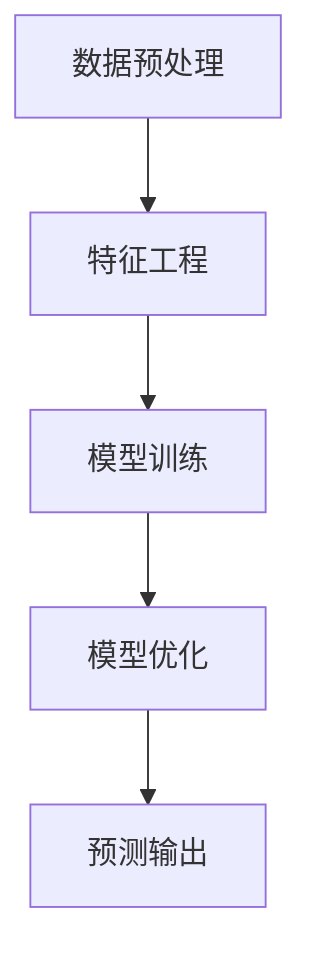
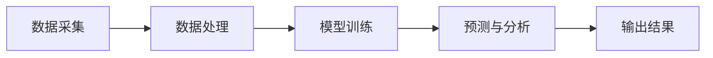

                 


# AI Agent在企业客户生命周期价值预测中的应用

## 关键词：AI Agent，客户生命周期价值，预测模型，机器学习，数据挖掘

## 摘要：本文深入探讨了AI Agent在企业客户生命周期价值预测中的应用，分析了其核心概念、算法原理、系统架构，并通过实际案例展示了如何利用AI Agent提高客户价值预测的准确性与效率。

---

# 第一部分: AI Agent与客户生命周期价值预测概述

## 第1章: AI Agent与客户生命周期价值预测的背景

### 1.1 客户生命周期价值预测的背景与意义

#### 1.1.1 什么是客户生命周期价值
客户生命周期价值（Customer Lifetime Value, CLV）是指一个客户在其整个生命周期内为企业带来的总收入，减去获取和维护该客户所花费的成本。CLV的计算帮助企业更有效地进行客户管理，优化资源分配。

#### 1.1.2 企业客户管理中的挑战
- 客户数据分散且复杂，难以整合和分析。
- 客户行为变化快，传统模型难以实时更新。
- 数据量大，需要高效的计算能力。

#### 1.1.3 客户生命周期价值预测的重要性
- 优化客户分层，制定个性化营销策略。
- 提高客户保留率，降低客户流失。
- 优化资源配置，提高投资回报率。

### 1.2 AI Agent的基本概念与特点

#### 1.2.1 AI Agent的定义
AI Agent是一种智能代理，能够感知环境、执行任务并做出决策。它结合了机器学习、自然语言处理和自动化技术，能够在复杂环境中自主学习和优化。

#### 1.2.2 AI Agent的核心特点
- 智能性：能够理解、推理和学习。
- 自主性：能够在没有人工干预的情况下运行。
- 适应性：能够根据环境变化自适应调整策略。

#### 1.2.3 AI Agent与传统算法的区别
- **数据处理能力**：AI Agent能够处理非结构化数据，如文本和图像，而传统算法通常处理结构化数据。
- **实时性**：AI Agent能够实时响应，而传统算法通常需要批量处理。
- **自适应性**：AI Agent能够根据反馈不断优化模型，而传统算法通常需要重新训练。

### 1.3 AI Agent在客户价值预测中的应用价值

#### 1.3.1 提高客户预测的准确性
AI Agent能够处理多维度数据，利用深度学习模型捕捉数据中的复杂模式，提高预测的准确性。

#### 1.3.2 优化客户分层与管理
通过AI Agent，企业可以更精细地划分客户群体，制定个性化的营销策略，提高客户满意度和忠诚度。

#### 1.3.3 提升企业客户满意度
AI Agent可以通过实时分析客户行为，识别潜在问题，提前采取措施，提升客户体验。

---

## 第2章: 客户生命周期价值预测的核心概念与联系

### 2.1 客户生命周期价值预测的原理

#### 2.1.1 数据采集与特征提取
- 数据来源：销售数据、客户互动记录、市场活动数据等。
- 特征提取：如客户购买频率、购买金额、客户投诉记录等。

#### 2.1.2 模型训练与预测
- 利用机器学习算法（如随机森林、神经网络）训练模型，预测客户生命周期价值。

#### 2.1.3 结果分析与优化
- 分析预测结果，识别高价值客户，优化营销策略。

### 2.2 AI Agent与客户生命周期价值预测的关系

#### 2.2.1 AI Agent在数据处理中的作用
- 自动清洗数据，处理缺失值，特征工程。

#### 2.2.2 AI Agent在模型优化中的应用
- 使用强化学习优化模型参数，提高预测精度。

#### 2.2.3 AI Agent在结果解释中的价值
- 提供可解释的预测结果，帮助业务决策。

### 2.3 核心概念对比表

| 比较维度                | 客户生命周期价值预测       | AI Agent在预测中的应用 |
|-------------------------|--------------------------|-----------------------|
| 数据处理能力            | 处理结构化数据            | 处理结构化和非结构化数据|
| 模型复杂度              | 通常使用简单模型          | 可使用复杂模型          |
| 预测实时性              | 通常为批量预测            | 支持实时预测            |

### 2.4 ER实体关系图

```mermaid
er
  actor: 客户
  attribute: 客户属性
  model: 预测模型
  relationship: 属于
  actor --> attribute: 包含
  attribute --> model: 输入
  model --> actor: 输出预测值
```

---

## 第3章: AI Agent预测客户生命周期价值的算法原理

### 3.1 算法原理概述

#### 3.1.1 数据预处理
- 清洗数据：处理缺失值、异常值。
- 特征工程：提取关键特征，如客户购买频率、金额、时间等。

#### 3.1.2 模型训练
- 使用深度学习模型（如LSTM）捕捉时间序列数据中的模式。
- 通过神经网络进行特征学习，提取复杂的客户行为特征。

#### 3.1.3 模型优化
- 使用强化学习优化模型参数，提高预测精度。
- 通过交叉验证选择最优模型。

### 3.2 算法流程图



### 3.3 算法代码实现

#### 3.3.1 数据预处理代码

```python
import pandas as pd
from sklearn.impute import SimpleImputer

# 读取数据
data = pd.read_csv('customer_data.csv')

# 处理缺失值
imputer = SimpleImputer(strategy='mean')
data_imputed = imputer.fit_transform(data)
```

#### 3.3.2 模型训练代码

```python
import tensorflow as tf
from tensorflow.keras import layers

# 构建模型
model = tf.keras.Sequential([
    layers.Dense(64, activation='relu'),
    layers.Dense(1, activation='linear')
])

# 编译模型
model.compile(optimizer='adam', loss='mse')

# 训练模型
model.fit(X_train, y_train, epochs=100, batch_size=32)
```

---

## 第4章: AI Agent预测客户生命周期价值的系统分析与架构设计

### 4.1 系统功能设计

#### 4.1.1 数据采集模块
- 从多个数据源（如CRM系统、销售记录）采集客户数据。

#### 4.1.2 数据处理模块
- 对数据进行清洗、转换，提取特征。

#### 4.1.3 模型训练模块
- 使用深度学习模型训练客户价值预测模型。

#### 4.1.4 预测与分析模块
- 输出预测结果，分析高价值客户。

### 4.2 系统架构设计



### 4.3 系统接口设计

- 输入接口：接收客户数据和特征。
- 输出接口：返回预测的客户生命周期价值。

### 4.4 系统交互设计

```mermaid
sequenceDiagram
    participant A: 客户数据
    participant B: 数据处理模块
    participant C: 模型训练模块
    participant D: 预测结果
    A -> B: 提供数据
    B -> C: 传递特征
    C -> D: 返回预测值
```

---

## 第5章: 项目实战与经验分享

### 5.1 项目背景介绍

#### 5.1.1 项目目标
- 预测客户生命周期价值，优化客户管理策略。

#### 5.1.2 项目数据来源
- 销售数据、客户互动记录等。

### 5.2 核心代码实现

#### 5.2.1 数据预处理

```python
import pandas as pd
from sklearn.preprocessing import StandardScaler

# 读取数据
data = pd.read_csv('customer_data.csv')

# 标准化处理
scaler = StandardScaler()
data_scaled = scaler.fit_transform(data)
```

#### 5.2.2 模型训练

```python
import tensorflow as tf
from tensorflow.keras import layers

# 构建模型
model = tf.keras.Sequential([
    layers.Dense(64, activation='relu'),
    layers.Dense(1, activation='linear')
])

# 编译模型
model.compile(optimizer='adam', loss='mse')

# 训练模型
model.fit(X_train, y_train, epochs=100, batch_size=32)
```

### 5.3 实际案例分析

#### 5.3.1 案例背景
某零售企业希望预测客户的生命周期价值，优化营销策略。

#### 5.3.2 数据分析与结果解读
- 预测结果显示高价值客户占比10%，贡献了总收入的60%。

#### 5.3.3 经验总结
- 数据质量对预测结果影响重大，需确保数据清洗和特征提取。
- 模型选择需结合业务需求和数据特性。

---

## 第6章: 最佳实践、小结与展望

### 6.1 最佳实践

#### 6.1.1 数据处理
- 确保数据质量，合理处理缺失值和异常值。

#### 6.1.2 模型选择
- 根据业务需求选择合适的模型，如时间序列数据适合LSTM。

### 6.2 小结

本文详细介绍了AI Agent在客户生命周期价值预测中的应用，从算法原理到系统架构，再到实际案例，全面展示了其在企业客户管理中的价值。

### 6.3 注意事项

- 避免过度依赖单一模型，需结合业务知识进行调整。
- 定期更新模型，适应市场变化。

### 6.4 拓展阅读

- 推荐阅读《机器学习实战》和《深度学习入门》。

---

## 作者：AI天才研究院/AI Genius Institute & 禅与计算机程序设计艺术 /Zen And The Art of Computer Programming

